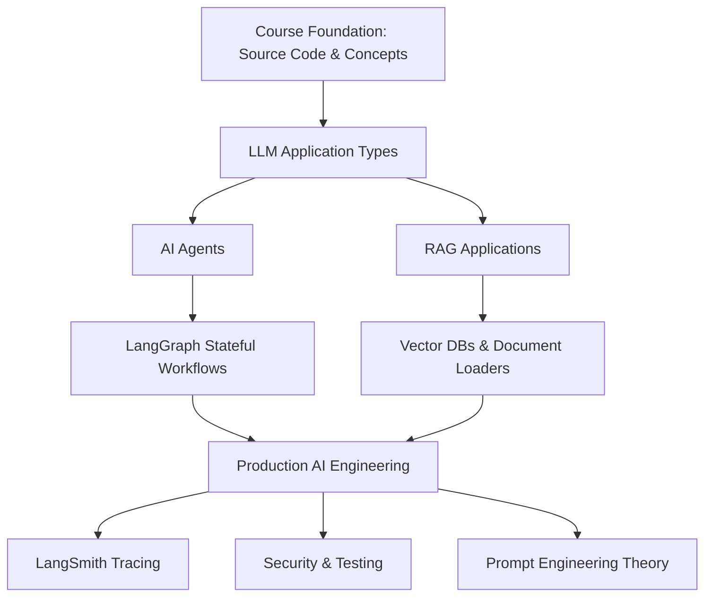
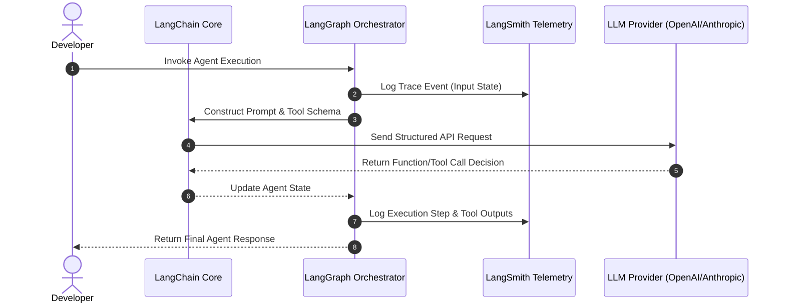

## Metadata

- **Topic:** Developing LLM Applications & Agents with LangChain & LangGraph
    
- **Difficulty:** Intermediate
    
- **Tags:** #LangChain #LangGraph #RAG #AIAgents #Python #PromptEngineering #LangSmith #SoftwareEngineering
    
- **Source:** Course Introduction — Eden Marco (LangChain Official Ambassador)
    
- **Date:** 2026-08-05
    

# Executive Summary

- **Course Evolution:** This is the 3rd iteration/refilmed edition of Eden Marco's flagship LangChain course, completely updated for LangChain 1.0+ and LangGraph.
    
- **Instructor Credentials:** Eden Marco is a software engineer with a background in backend cybersecurity, a public speaker, and an official LangChain Ambassador.
    
- **Core Objectives:** Gain production-grade competence in building the two main types of LLM applications: **AI Agents** and **Retrieval-Augmented Generation (RAG)** systems.
    
- **Under-the-Hood Mastery:** Dives deep into LangChain source code to eliminate "magic" and build foundational understanding.
    
- **Ecosystem Coverage:** Teaches end-to-end tooling, including **LangSmith** (tracing, monitoring, evaluation) and **LangGraph** (workflow engineering for complex stateful agents).
    
- **Enterprise Focus:** Covers real-world production topics—testing, security, logging, monitoring, alerting, and prompt engineering history/theory.
    
- **Prerequisites:** Requires comfortable Python programming knowledge, basic Git usage, and virtual environment setup. **No prior Machine Learning (ML) or PhD background is required.**
    
- **Target Audience:** Software engineers, data scientists, and non-ML professionals transitioning into AI engineering.
    

# Main Notes

## Instructor Profile & AI Commodity Philosophy

Eden Marco transitioned from enterprise backend development and cybersecurity into AI Engineering in 2023 without prior formal machine learning training.

> [!note]
> 
> **The Commodity of AI:** Machine Learning has shifted from academic research requiring a PhD to an engineering commodity. High-level frameworks like LangChain allow standard software engineers to build sophisticated AI applications.

## Key Learning Paths & Objectives

Code snippet



1. **Agentic Workflows:** Designing autonomous systems that reason, choose tools, and act iteratively (e.g., using ReAct patterns).
    
2. **RAG Systems:** Connecting LLMs to custom knowledge bases for domain-specific context retrieval.
    
3. **Ecosystem Mastery:** Implementing LangSmith for execution tracing, debugging, and production observability.
    
4. **Production Readiness:** Addressing enterprise concerns—security, unit/integration testing, performance monitoring, and rate limiting.
    

# Important Definitions

|**Term**|**Definition**|**Why It Matters**|
|---|---|---|
|**LangChain**|An open-source orchestration framework for building applications powered by Large Language Models (LLMs).|Standardizes prompts, memory, tools, and chains across various model providers.|
|**LangGraph**|An extension of LangChain designed for building stateful, multi-actor agent workflows using graph structures (nodes & edges).|Enables complex agent control flow, cyclical logic, reflection, and human-in-the-loop patterns.|
|**RAG**|Retrieval-Augmented Generation; enriching LLM prompts with data retrieved from external sources.|Prevents hallucinations and enables models to access private or up-to-date information.|
|**AI Agent**|An LLM configured to autonomously perceive its environment, make decisions, and execute tool calls in a loop to achieve goals.|Shifts AI from passive text generators to proactive task executors.|
|**LangSmith**|A platform for tracing, debugging, testing, and evaluating LLM applications and agentic workflows.|Provides essential observability to diagnose why a chain or agent failed in production.|

# Mental Models

- **LangChain Framework** → **Electrical Plumbing**: Connects raw power sources (LLMs) safely and predictably to appliances (your business logic and UI).
    
- **LangGraph** → **Circuit Board**: Defines strict nodes (actions) and wire paths (edges/conditionals) to direct logic flow, ensuring complex agent loops don't melt down into infinite execution.
    
- **AI Agent** → **Software Consultant**: Given a complex objective, it independently analyzes requirements, looks up documentation (RAG), runs terminal commands/APIs (Tools), and presents the final solution.
    

# Visual Diagrams

Code snippet



# Code Examples

### Project Initialization Pattern (LangChain v1.0+)

Python

```python
import os
from langchain_openai import ChatOpenAI
from langchain_core.prompts import ChatPromptTemplate
from langchain_core.output_parsers import StrOutputParser

# 1. Initialize the Chat Model with explicit temperature control
llm = ChatOpenAI(
    model="gpt-4o",
    temperature=0.0
)

# 2. Define a composable Prompt Template using standard message roles
prompt = ChatPromptTemplate.from_messages([
    ("system", "You are an expert AI software engineer. Answer concisely."),
    ("user", "{input_query}")
])

# 3. Create a runnable LCEL (LangChain Expression Language) chain
# Pipe operator (|) links Prompt -> Model -> Output Parser
chain = prompt | llm | StrOutputParser()

# 4. Execute the chain synchronously
if __name__ == "__main__":
    response = chain.invoke({"input_query": "Explain LCEL in one sentence."})
    print(f"Response: {response}")
```

- **Line 5–8**: Initializes model parameters adhering to the standard provider package (`langchain_openai`).
    
- **Line 11–14**: Builds a structured prompt template separating system instructions from runtime variables.
    
- **Line 18**: Uses LCEL syntax (`|`) to create a declarative, composable execution pipeline.
    
- **Line 21**: Executes the compiled runnable using a structured key-value payload.
    

# Step-by-Step Flow

## Getting Started with the Course Workflow

1. **Verify Prerequisites**:
    
    - Confirm Python (≥ 3.10) installation.
        
    - Verify basic Git competence (`git clone`, `git commit`).
        
2. **Environment Setup**:
    
    - Create a virtual environment (`python -m venv .venv`).
        
    - Activate the environment and install updated core dependencies (`pip install langchain langchain-openai langgraph`).
        
3. **API Key Management**:
    
    - Set environment variables for API authentication (`OPENAI_API_KEY`, `LANGCHAIN_API_KEY`).
        
    - Enable tracing (`LANGCHAIN_TRACING_V2=true`).
        
4. **Iterative Development**:
    
    - Build foundational chains using LangChain core components.
        
    - Transition complex conditional logic into stateful graphs with LangGraph.
        
    - Trace execution steps in the LangSmith dashboard to debug state transitions.
        

# Examples

### Course Prerequisite Self-Check

> [!tip]
> 
> **Sufficient Preparation**: You know how to define a Python class, create a function with type hints, run `python main.py`, and clone a GitHub repository. You are fully ready for this course.
> 
> **Insufficient Preparation**: You do not know what a terminal environment variable is or how an `import` statement works in Python. Recommended action: Review basic Python crash courses first.

# Real World Applications

LangChain and LangGraph architectures are applied in enterprise domains such as:

- **Customer Support Automation**: Multi-agent routing networks that pull account data via RAG and perform actions like issuing refunds via API tool calling.
    
- **Automated Code Refactoring**: LangGraph reflection loops where one node writes code and another node runs unit tests and passes failure traces back to the writer until green.
    
- **Enterprise Search & Intelligence**: Ingesting thousands of PDF documents, policy manuals, and SQL databases into vector indexes for accurate semantic querying.
    

# Interview Questions

### Beginner

**Q: What is the difference between LangChain and LangGraph?**

> **A:** LangChain provides the fundamental abstractions, integrations, and primitive chains for combining LLMs with prompts and tools. LangGraph extends LangChain to construct complex, stateful, multi-agent workflows using graph structures (nodes, edges, and state), enabling cyclic loops and human-in-the-loop interventions.

### Intermediate

**Q: Why is LCEL (LangChain Expression Language) preferred over legacy chain objects?**

> **A:** LCEL offers unified interface implementations for sync, async, streaming, and batching automatically. It simplifies streaming intermediate steps, enables parallel execution out of the box, and seamlessly integrates with LangSmith for automated tracing.

### Advanced

**Q: How does LangGraph handle state management across cyclic agent interactions?**

> **A:** LangGraph maintains a centralized `TypedDict` or Pydantic `BaseModel` state object passed through nodes. Nodes receive the state, perform side effects or tool calls, and return state updates. Edge functions read the current state to conditionally route execution to the next node or terminate the cycle.

# Common Mistakes

- **Over-complicating Simple Tasks with Agents**:
    
    - _Mistake_: Using an autonomous agent loop with web-search tools when a simple, single-shot LCEL prompt with structured JSON output is sufficient.
        
    - _Fix_: Start with deterministic LCEL chains; only upgrade to LangGraph agents when dynamic decision-making or looping is explicitly required.
        
- **Hardcoding API Keys in Repositories**:
    
    - _Mistake_: Committing raw OpenAI or LangSmith API keys directly inside Python files.
        
    - _Fix_: Always load keys via environment variables using `python-dotenv` or local shell configurations.
        

# Memory Tricks

### The **R.A.G.** Mnemonic for LLM Applications

- **R** – **Retrieve**: Fetch context relevant to the user query from external databases or documents.
    
- **A** – **Augment**: Attach the retrieved context directly into the LLM system prompt.
    
- **G** – **Generate**: Let the LLM synthesize an accurate response bounded by the provided context.
    

# Comparison Tables

|**Feature / Architectural Choice**|**Simple LCEL Chains**|**LangGraph Agent Workflows**|
|---|---|---|
|**Control Flow**|Directed Acyclic Graph (DAG) / Linear|Cyclic Graphs with Conditional Edges|
|**State Tracking**|Stateless per execution|Stateful across multiple iterations/nodes|
|**Tool Calling**|Single-step execution|Multi-step dynamic decision loops|
|**Best Used For**|Standard RAG, Summarization, Extraction|Complex problem solving, Code execution, Multi-agent systems|

# Revision Sheet (One Page)

- **Course Target**: Building production-grade AI applications using Python, LangChain (v1.0+), and LangGraph.
    
- **Core Application Types**:
    
    1. **RAG**: Document loaders → Text splitters → Embeddings → Vector Stores → Retrievers.
        
    2. **Agents**: LLM + Tools + Memory + State Graph Loops.
        
- **LangChain Stack**:
    
    - `LangChain Core`: Standard interfaces (LCEL, Prompts, Runnables).
        
    - `LangGraph`: Orchestration of stateful, multi-actor, cyclic agent workflows.
        
    - `LangSmith`: Observability, logging, evaluation, and tracing.
        
- **Prerequisites**: Intermediate Python (functions, classes, virtual environments) & basic Git commands.
    

# Flashcards

Q: Do you need a PhD or prior Machine Learning experience to build applications with LangChain?

A: No. Software engineering skills and Python proficiency are sufficient, as LangChain abstracts model-level complexities.

Q: What are the two primary categories of LLM applications focused on in this course?

A: AI Agents and Retrieval-Augmented Generation (RAG) applications.

Q: What tool in the LangChain ecosystem is explicitly used for execution tracing and monitoring?

A: LangSmith.

Q: What framework should be used when an agent needs cyclical execution loops and state management?

A: LangGraph.

Q: What operator is used in LCEL to chain prompt templates, models, and parsers together?

A: The pipe operator (`|`).

# Practice Questions

### Easy

1. Write a Python snippet that instantiates a `ChatOpenAI` model and sets `temperature=0`.
    
    > **Answer**: `from langchain_openai import ChatOpenAI; llm = ChatOpenAI(model="gpt-4o", temperature=0)`
    

### Medium

2. Describe the purpose of the `Resource` and `Troubleshooting` sections mentioned in the course lectures.
    
    > **Answer**: The Resource section contains external links, Discord invites, and source code snippets; the Troubleshooting section provides fixes for common framework errors.
    

### Hard

3. Explain how you would convert a linear LangChain script into a fault-tolerant system capable of retrying failed tool calls automatically.
    
    > **Answer**: Convert the chain into a LangGraph workflow with a tool execution node. If a tool returns an error state, route the execution back to the reasoning LLM node with the error message attached to the prompt state for self-correction.
    

# Key Takeaways

1. The course provides an updated, production-ready curriculum built specifically for **LangChain v1.0+** and **LangGraph**.
    
2. **No Machine Learning background is required**—the course targets software engineers and data scientists looking to build practical applications.
    
3. You will learn to construct both **RAG pipelines** and autonomous **AI Agents**.
    
4. Source code deep-dives are emphasized throughout to eliminate "black-box" abstractions.
    
5. Observability and tracing are integrated using **LangSmith**.
    
6. Real-world enterprise concepts covered include testing, logging, monitoring, alerting, and prompt security.
    
7. Prerequisites include Python fluency, `git` fundamentals, and virtual environment setup.
    
8. Learning resources include a dedicated Discord community, GitHub code repositories, and structured theory lectures.