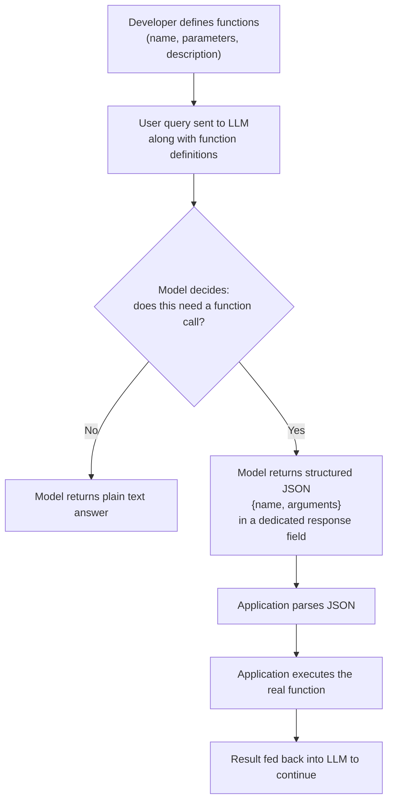
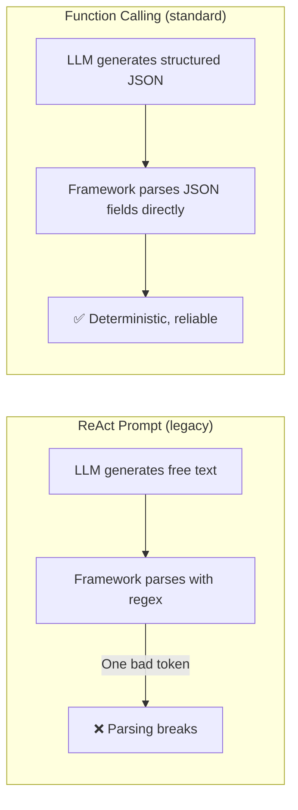

# Function Calling (Tool Calling): Theory & Motivation

## Metadata

- Topic: Introduction to function calling / tool calling as a model capability — how it works, why it was created, and how it compares to the ReAct prompt
- Difficulty: Beginner–Intermediate
- Tags: #llm #function-calling #tool-calling #react-prompt #agents
- Source: LangChain – Agentic AI Engineering course, Lesson 40 (section intro to function calling) and Lesson 41 (function calling deep dive, theoretical)
- Date: 2026-08-08

## Executive Summary

- **Function calling (aka tool calling)** is a model capability: instead of generating plain text, the LLM produces a **structured, machine-parsable function call** (JSON with function name + arguments) in a special field of its response.
- It emerged as the **natural evolution of the ReAct prompt** — the ReAct pattern is powerful but unreliable, since it depends on the LLM generating perfectly-formatted text that gets parsed with regular expressions; one bad token can break parsing.
- Function calling shifts the reliability burden from your parsing code to the **model vendor** (OpenAI, Anthropic, Google) — these providers fine-tune their models specifically to emit valid JSON matching a given function schema.
- Introduced by **OpenAI in 2023**; developers supply function definitions (name, parameters, description), and the model decides whether/which function to call and with what arguments.
- Function calling gives two main capabilities: (1) connecting the LLM to **external tools**, and (2) producing **structured output** (e.g. convertible into a Pydantic object) — even without invoking any external tool.
- **Advantages**: structured/reliable output (easy to parse, less error-prone than ReAct), and token efficiency (no verbose chain-of-thought needed — the model just returns the function call).
- **Drawback**: reasoning is opaque/internal — you get the function name and arguments but not the model's justification, making debugging/auditing harder ("black box" decision).
- Despite that drawback, function calling is now the **de facto industry standard**; virtually nobody builds production agents on raw ReAct prompting anymore.

## Main Concepts & Theory

### What Function Calling Is

- A capability where the model, instead of only generating free-form text, can produce a **structured function call**: a JSON object identifying which function to invoke and with what arguments.
- This structured output appears in a **special field of the LLM response** — separate from the normal generated text/content field — making it trivial to detect and parse.
- Not all LLMs support this; it's not a universal LLM property. However, it is now standard among state-of-the-art models from major vendors (OpenAI, Anthropic, Google).

### How It Works Under the Hood

1. The developer provides the model with a **list of function definitions** — name, parameters, and description for each.
2. The model has been **fine-tuned** to detect when a function should be invoked based on the user's request.
3. When appropriate, the model formats its response as valid **JSON matching the function's schema**, rather than plain text.
4. The application parses this JSON and executes the corresponding function in the real application.
5. The function's result can then be passed back into the LLM to continue reasoning/conversation.

**Example flow:**

- User asks: _"What's the weather in Paris?"_
- Model (with a `get_current_weather` function bound) responds with a JSON specifying:
    - `name`: `get_current_weather`
    - `arguments`: `{ "location": "Paris", "unit": "Celsius" | "Fahrenheit" }`
- The application parses this JSON, executes the real `get_current_weather` function, and can feed the result back to the model.

### Why Function Calling Was Created: The ReAct Prompt's Reliability Problem

- The ReAct prompt (reasoning + acting loop, covered earlier in the course) is the conceptual basis for agentic behavior, but it's **not reliable in practice**.
- Because it relies on the LLM generating precisely-formatted text output, and that output is typically parsed using **regular expressions**, a single malformed token from the model can break the entire parsing step and cause the application to fail.
- Function calling was LLM vendors' response to this reliability gap: **move structure enforcement into the model itself** (via fine-tuning), rather than relying on prompt-engineered text parsed downstream with regex.

> [!tip] Mental model ReAct prompting asks the model to _describe_ its action in free text and hopes your regex can extract it correctly. Function calling asks the model to _emit_ the action directly as structured data the vendor guarantees is valid — shifting reliability from your parsing code to the model provider's fine-tuning.

### Two Core Capabilities Function Calling Provides

1. **Connecting the LLM to external tools** — the classic "agent calls a function" use case.
2. **Structured output extraction** — leveraging the LLM's reasoning to extract information into defined fields and return it as organized JSON (e.g. convertible directly into a Pydantic object) for downstream use in an application — this doesn't require calling an external tool at all, just structuring the model's own output.

## Important Definitions

|Term|Definition|Why It Matters|
|---|---|---|
|Function calling / tool calling|A model capability to produce a structured function call (JSON: name + arguments) instead of plain text, in a dedicated response field|The reliable, production-grade replacement for parsing free-text ReAct output|
|ReAct prompt|A reasoning + acting prompting pattern where the LLM's action decisions are expressed in free text and parsed (often via regex)|The precursor/basis for agentic behavior; unreliable because one malformed token can break parsing|
|Structured output|Model output constrained to a defined schema (e.g. JSON matching function parameters), extractable into typed objects like Pydantic models|Enables both tool invocation and reliable structured data extraction from LLM responses|
|Opaque reasoning (black box decision)|The lack of visibility into _why_ a model chose a given function/arguments when using function calling|Main drawback of function calling — makes debugging and auditing model decisions harder|

## System Architecture & Trade-offs

**Architecture Flow:** `Developer defines function schemas (name, params, description) → bound to model → user request → model decides (invoke a function? which one? what args?) → model emits structured JSON in a dedicated response field → application parses JSON → executes real function → (optional) result fed back to model to continue`

**Trade-offs:**

- **Pros:**
    - Structured, reliable, machine-parsable output — no regex parsing, less prone to misinterpretation.
    - Model is fine-tuned to strictly adhere to the function schema, reducing random formatting errors seen with ReAct.
    - Token-efficient — skips verbose chain-of-thought explanations; only the function call is returned.
- **Cons:**
    - Opaque reasoning: no visibility into the model's justification for choosing a given function/arguments — reasoning stays internal to the LLM.
    - This opacity makes debugging and auditing agent decisions harder compared to prompts that expose intermediate reasoning.
- **Net assessment (per the video)**: the reliability and efficiency gains are considered well worth the opacity trade-off — function calling is now the de facto standard for building AI agents.

## Common Pitfalls & Best Practices

> [!warning] Mistakes to Avoid Relying on ReAct-style free-text prompting parsed via regex for production agent systems — a single malformed token from the model can break parsing and cause the application to fail. This approach is considered unreliable for production use.

> [!tip] Best Practices
> 
> - Prefer function calling over raw ReAct prompting for production-grade, reliable AI agents — it is now the industry-standard approach used by essentially all major frameworks and vendors.
> - Use function calling's structured-output capability not just for tool invocation but also for extracting reliable, typed data (e.g. into Pydantic objects) from LLM responses.
> - Be aware of the opacity trade-off: if debuggability/auditability of the model's reasoning is critical, account for the fact that function calling won't expose the "why" behind a decision — only the final function name and arguments.

## Active Recall & Interview Prep

### Key Q&A Flashcards

Q: What is function calling (tool calling), in one sentence? A: A model capability to produce a structured, machine-parsable function call (JSON with function name and arguments) instead of plain text, in a dedicated part of the response.

Q: Which company introduced function calling, and when? A: OpenAI, in 2023.

Q: What problem with the ReAct prompt motivated the creation of function calling? A: ReAct relies on free-text output parsed with regular expressions; a single malformed token from the LLM can break parsing and cause the application to fail — making it unreliable for production use.

Q: Where does the "heavy lifting" of ensuring reliable, structured output happen with function calling? A: On the model vendor's side — the model is fine-tuned to strictly adhere to a given function schema, rather than the developer relying on prompt engineering and downstream regex parsing.

Q: What two main capabilities does function calling provide? A: (1) Connecting the LLM to external tools, and (2) producing structured output that can be extracted into typed objects (e.g. Pydantic models) for downstream use.

Q: What is the primary drawback of function calling compared to ReAct-style prompting? A: Opaque reasoning — the model's internal justification for choosing a function/arguments isn't exposed; you only see the final function name and arguments, making debugging and auditing harder.

Q: Why is function calling more token-efficient than the ReAct prompt? A: It skips verbose chain-of-thought explanations — the model returns only the structured function call rather than reasoning text.

Q: Is function calling considered the current industry standard for building AI agents? A: Yes — it's described as the de facto standard; ReAct prompting is rarely used directly in production agent systems anymore.

Q: Does every LLM support function calling? A: No — it's a specific model capability, not universal, though it is now standard among state-of-the-art models from major vendors (OpenAI, Anthropic, Google).

Q: In the weather example, what two fields appear in the model's structured function-call response? A: The function `name` (e.g. `get_current_weather`) and its `arguments` (e.g. `location: Paris`, `unit: Celsius/Fahrenheit`).

### Practical Practice Scenario

Scenario/Question: A teammate argues that since function calling hides the model's reasoning, your team should stick with ReAct-style prompting for a production customer-support agent so you can audit its decisions. How would you respond using the concepts from this lesson?

Solution/Approach: Acknowledge the real trade-off — function calling does sacrifice visibility into the model's step-by-step justification, making debugging/auditing harder than ReAct's exposed reasoning. However, explain that ReAct's reliance on free-text parsing (typically via regex) makes it fragile in production: a single malformed token can break parsing and fail the request outright. Function calling shifts structure enforcement to the model vendor's fine-tuning, yielding far more reliable, consistently parsable output at lower token cost. For auditing needs, propose supplementing function calling with your own tracing/logging (e.g. capturing inputs, chosen function, and arguments per call) rather than reverting to a less reliable reasoning-exposed prompting strategy.

## One-Page Cheat Sheet

- Function calling = tool calling: structured JSON function call in a dedicated response field, not plain text
- Introduced by OpenAI, 2023
- Developer provides function name + params + description; model decides which to call + args
- Evolution of the ReAct prompt — fixes ReAct's regex-parsing fragility
- Reliability shifted to model vendor via fine-tuning, not your parsing code
- Two capabilities: (1) external tool connection, (2) structured output extraction (e.g. → Pydantic)
- Pros: reliable/structured, less error-prone, token-efficient (no verbose CoT)
- Con: opaque reasoning — black-box decision, harder to debug/audit
- Not all LLMs support it, but standard among SOTA models (OpenAI, Anthropic, Google)
- De facto industry standard — ReAct prompting rarely used directly in production now


# Function Calling (Tool Calling): The Reliable Evolution of ReAct

## Metadata

- **Topic:** Function Calling / Tool Calling — Theory & Motivation
- **Difficulty:** Intermediate
- **Tags:** #ai-agents #function-calling #tool-calling #llm-theory #react-prompt #langchain
- **Source:** LangChain — Agentic AI Engineering with LangChain & LangGraph (Udemy, Eden Marco) — Lessons 40–41 ("Diving Deep into Function Calling" section intro + theory)
- **Date:** 2026-08-08

---

## Executive Summary

- **Function calling** (aka **tool calling**) is an LLM capability to output a **structured, machine-readable function call** (JSON with function name + arguments) instead of free-form text.
- It is the **natural evolution of the ReAct prompt**: ReAct is powerful but fragile (one bad token breaks regex parsing); function calling shifts that reliability burden onto the model vendor.
- Introduced by **OpenAI in 2023**; now a de-facto standard supported by all major state-of-the-art models (OpenAI, Anthropic, Google).
- Mechanics: developer provides **function definitions** (name, parameters, description) → the model, when appropriate, responds with a structured JSON object specifying which function to call and with what arguments, in a dedicated part of the response (not mixed into the plain-text generation).
- Two core capabilities unlocked: (1) connecting the LLM to **external tools**, and (2) getting **structured output** (e.g., parsing into a Pydantic object).
- Key advantage over ReAct: **structured, reliable, easily parsable output** — no regex, far fewer formatting errors, and more token-efficient (skips verbose chain-of-thought).
- Key trade-off: **opaque reasoning** — the model's internal justification for the chosen function/arguments isn't exposed, making debugging/auditing harder ("black box" decision).
- Despite that trade-off, function calling is now considered **totally worth it** — it's the de-facto standard; virtually nobody builds production agents on raw ReAct prompting anymore.

---

## Main Concepts & Theory

### 1. Why Function Calling Exists: The ReAct Reliability Problem

- The ReAct prompt (reasoning + acting loop, covered earlier in the course) is the conceptual basis for agentic behavior — but it has a critical weakness:
    - The LLM's output is **free-form text** that frameworks like LangChain must parse with **regular expressions**.
    - A single wrong/malformed token from the LLM can **break the regex parsing** and corrupt the entire response.
- This unreliability was the direct **motivation for LLM vendors to build native function calling** into their models — it's described as the "natural evolution" of ReAct into a **production-grade, reliable solution**.

> [!important] Core Reframe Function calling doesn't replace the _concept_ of an agent reasoning about which tool to call — it replaces _how reliably_ that decision gets communicated back to your application. ReAct = fragile text parsing. Function calling = guaranteed-schema JSON parsing.

### 2. What Function Calling Actually Is

- Definition: the model's ability to produce a **structured function call** to an external function, complete with arguments, instead of plain text.
- This structured call appears in a **special, dedicated field** of the model's response — separate from normal generated text content — making it trivial to detect and parse.
- Not universal: function calling is a capability of _certain_ LLMs, not all. However, it is now considered **standard for state-of-the-art models** from major vendors (OpenAI, Anthropic, Google).
- History: introduced by **OpenAI in 2023**.

### 3. How It Works (Developer's Perspective)

1. Developer provides the model with a **list of function definitions**, each containing:
    - **Name**
    - **Parameters**
    - **Description**
2. The model (fine-tuned specifically to detect when a function should be invoked based on user intent) decides, based on the user's request, whether a function call is warranted.
3. If so, it responds with a **JSON object** conforming to the function's schema — specifying which function to call and with which arguments.
4. The **application** parses this JSON and actually executes the corresponding function in its own codebase.
5. The result can then be **fed back into the LLM** to continue the conversation/loop.

#### Worked Example

> User asks: _"What's the weather in Paris?"_ — with a `get_weather` function bound to the model.

The model responds with a structured call:

```json
{
  "name": "get_current_weather",
  "arguments": {
    "location": "Paris",
    "unit": "celsius"
  }
}
```

- The application parses this JSON, executes the real `get_current_weather` function, and can plug the result back into the LLM to continue the interaction.

### 4. The Two Core Capabilities Function Calling Unlocks

|Capability|What It Means|
|---|---|
|**Connect LLM to external tools**|The model can trigger real-world actions/lookups (APIs, databases, calculators) via a reliable, parsable interface|
|**Structured output extraction**|The LLM's reasoning can be used purely to extract/organize information into specific fields (e.g., convertible directly into a **Pydantic object**) for downstream application use — not just for tool invocation|

### 5. ReAct Prompt vs. Function Calling

|Aspect|ReAct Prompt|Function Calling|
|---|---|---|
|Output format|Free-form text|Structured JSON in a dedicated response field|
|Parsing method|Regular expressions|Native JSON parsing (access fields directly)|
|Reliability|Fragile — one bad token can break parsing|Deterministic, vendor-guaranteed to adhere to schema|
|Token usage|Verbose — includes visible chain-of-thought/reasoning|Efficient — skips verbose reasoning, returns only the call|
|Transparency|Reasoning is visible in the prompt/output|Reasoning is internal/opaque — only name + args are exposed|
|Who owns reliability|Your parsing code (via LangChain regex etc.)|The model vendor (fine-tuned to strictly follow schema)|
|Current production status|Largely legacy / rarely used directly|De-facto industry standard|

### 6. Advantages of Function Calling

- **Structured & reliable integration**: machine-readable JSON output with a specific function name + arguments is far less prone to misinterpretation than parsed free text.
- **Strict schema adherence**: the underlying model has been fine-tuned specifically to follow the function schema, reducing random formatting errors common with ReAct-style prompting.
- **Token efficiency**: no lengthy chain-of-thought is emitted — the model skips verbose explanations and returns only the function call itself.

### 7. The Trade-off: Opaque Reasoning

> [!warning] Black-Box Decision Making When a model decides to call a function, it typically does **not** expose its chain-of-thought reasoning. Developers only see the **final output** — function name and arguments — not the justification behind that choice. This makes debugging and auditing model decisions harder, since there's no intermediate rationale to inspect.

- Despite this drawback, it's framed as **"totally worth it"** given the massive reliability gains over ReAct.

### 8. Current State of the Industry

- Function calling is now the **de-facto standard** for building AI agents.
- Major vendors (OpenAI, Google, Anthropic) have "really perfected" function calling.
- Practically **nobody uses the raw ReAct prompt directly anymore** in production — it has been superseded by native function calling as the standard mechanism for agentic behavior.

---

## Important Definitions

|Term|Definition|Why It Matters|
|---|---|---|
|**Function Calling / Tool Calling**|An LLM's ability to output a structured, schema-conformant function call (name + arguments) instead of plain text|The reliable mechanism underlying modern production AI agents|
|**Function Definition**|Developer-provided spec of a callable function: name, parameters, description|What the model uses to know which "tools" it can call and how|
|**Function Schema**|The structural contract (expected fields/types) a function call's JSON output must conform to|Guarantees parsable, predictable output from the model|
|**ReAct Prompt**|Free-text reasoning-and-acting prompt style parsed via regex|The fragile predecessor that motivated the creation of function calling|
|**Opaque Reasoning**|The model's hidden internal justification for a function-call decision|Explains why function calling is harder to debug/audit than ReAct|
|**Pydantic Object**|A Python data-validation class that structured LLM output can be converted into|Shows how function calling doubles as a structured-data-extraction mechanism, not just tool invocation|

---

## Visual Diagrams

### Function Calling Flow



### ReAct vs. Function Calling — Reliability Path



---

## Common Pitfalls & Best Practices

> [!warning] Mistakes to Avoid
> 
> - Assuming all LLMs support function calling — it's common among state-of-the-art models but is **not universal**; always verify vendor/model support.
> - Relying on raw ReAct-style text parsing for production agents when function calling is available — this reintroduces the exact fragility function calling was built to solve.
> - Expecting visibility into the model's reasoning when using function calling — treat the decision process as a black box; don't design systems that depend on inspecting _why_ a function was chosen.

> [!tip] Best Practices
> 
> - Default to **function calling** over ReAct-style prompting for any production-grade agent — it's the current industry standard.
> - Use function calling's structured-output capability not just for tool invocation, but also for **general structured data extraction** (e.g., parsing into Pydantic models) downstream in your application.
> - Provide clear, well-described function **names, parameters, and descriptions** — this is the primary lever developers have to influence the model's function-selection accuracy.

---

## Active Recall & Interview Prep

### Key Q&A Flashcards

**Q: What is function calling (aka tool calling)?** A: An LLM capability to produce a structured, schema-conformant function call (name + arguments as JSON) instead of plain text, in a dedicated part of the response.

**Q: Which company introduced function calling, and when?** A: OpenAI, in 2023.

**Q: What problem with the ReAct prompt directly motivated the creation of function calling?** A: ReAct's free-text output is parsed via regular expressions, so a single malformed token from the LLM can break parsing and corrupt the entire response — function calling replaces this with guaranteed-schema JSON.

**Q: What three things does a function definition provided to the model typically include?** A: Name, parameters, and description.

**Q: In the weather example, what would the model return for "What's the weather in Paris?"** A: A JSON object like `{"name": "get_current_weather", "arguments": {"location": "Paris", "unit": "celsius"}}`.

**Q: What are the two main capabilities function calling provides?** A: (1) Connecting the LLM to external tools, and (2) getting structured output from the LLM (e.g., convertible to a Pydantic object).

**Q: Name two advantages of function calling over the ReAct prompt.** A: Structured/reliable machine-readable output (less prone to misinterpretation, fewer formatting errors); and token efficiency (no verbose chain-of-thought, just the function call).

**Q: What is the main drawback of function calling?** A: Opaque reasoning — the model doesn't expose its chain-of-thought when deciding to call a function, so developers only see the final name/arguments, not the justification, making debugging/auditing harder.

**Q: Is the reliability trade-off of function calling considered worth it?** A: Yes — despite the opaque reasoning drawback, it's described as "totally worth it" given the massive reliability gains over ReAct.

**Q: Do all LLMs support function calling?** A: No — it's a capability of certain models, not universal, though it is now standard among state-of-the-art models from major vendors (OpenAI, Anthropic, Google).

**Q: Is ReAct prompting still commonly used in production agent systems today?** A: No — function calling is now the de-facto standard; ReAct prompting is largely legacy/foundational, not used directly in production.

**Q: Where does the "heavy lifting" of reliability shift to when using function calling vs. ReAct?** A: To the model vendor — the model itself is fine-tuned to strictly adhere to the function schema, rather than relying on the developer's regex-based parsing.

### Practical Practice Scenario

**Scenario:** An interviewer asks: "Why would you choose function calling over a ReAct-style prompt when building a production AI agent, and what's the cost of that choice?"

**Solution/Approach:**

1. Explain that ReAct relies on free-text generation parsed via regex — a single malformed token can break the entire pipeline, making it unreliable for production.
2. Explain that function calling shifts reliability to the model vendor: the model is fine-tuned to emit schema-conformant JSON in a dedicated response field, which the application parses directly without regex.
3. Note the efficiency gain: function calling skips verbose chain-of-thought, reducing token usage.
4. Acknowledge the cost: opaque reasoning — you lose visibility into _why_ the model chose a given function/arguments, which complicates debugging and auditing.
5. Conclude that despite this trade-off, function calling is the current industry standard because reliability and structured integration outweigh the loss of visible reasoning.

---

## One-Page Cheat Sheet

- Function calling = tool calling (same thing, used interchangeably)
- Introduced by OpenAI, 2023; now standard across OpenAI/Anthropic/Google SOTA models
- Motivation: ReAct = free text + regex parsing = fragile (one bad token breaks it)
- Function calling = structured JSON in dedicated response field = reliable, deterministic
- Developer provides: function name + parameters + description
- Model outputs: JSON {name, arguments} when it decides a call is needed
- App parses JSON → executes real function → feeds result back to LLM
- 2 capabilities unlocked: (1) external tool connection, (2) structured output extraction (→ Pydantic)
- Pros: reliable/parsable, schema-strict (fewer format errors), token-efficient (no chain-of-thought)
- Con: opaque reasoning — no visible justification, harder to debug/audit ("black box")
- Not all LLMs support it — but it's standard for SOTA models
- De-facto industry standard today; raw ReAct prompting rarely used directly in production