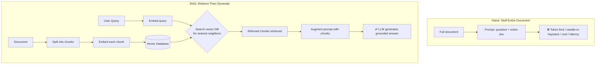
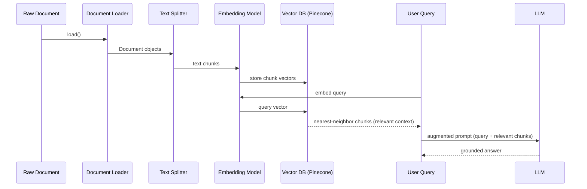
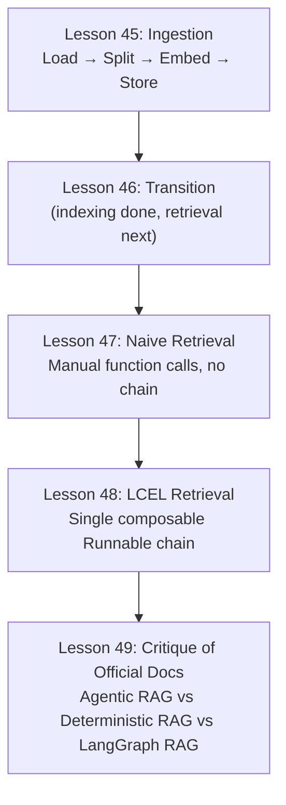
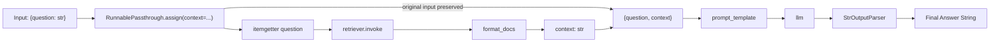
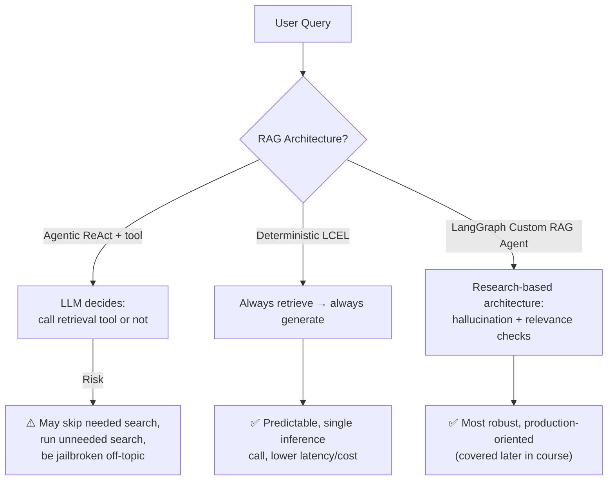

# Retrieval-Augmented Generation (RAG): Motivation, Vector Stores & LangChain Ingestion Setup

## Metadata

- **Topic:** RAG Fundamentals — Motivation, Embeddings, Vector Databases, and LangChain Document Ingestion Pipeline
- **Difficulty:** Intermediate
- **Tags:** #rag #vector-database #embeddings #langchain #pinecone #document-loaders #text-splitters
- **Source:** LangChain — Agentic AI Engineering with LangChain & LangGraph (Udemy, Eden Marco) — Lessons 42–44 ("Retrieval Augmented Generation" section: motivation → vector DB theory → LangChain ingestion imports)
- **Date:** 2026-08-08

---

## Executive Summary

- **RAG (Retrieval-Augmented Generation)** solves the problem of asking an LLM questions over large/private documents it either can't fit in context or was never trained on.
- **Naive solution** (stuffing the entire document into the prompt) fails for four reasons: **hard token limits**, the **"needle in the haystack" effect** (LLMs get less accurate over very long contexts even within their limit), **cost**, and **latency**.
- **RAG's core idea**: split the document into **chunks**, **embed** each chunk into a vector, store vectors in a **vector database**, then at query time embed the user's question and **retrieve only the most semantically relevant chunks** to inject into the prompt.
- **Embeddings** turn text into numeric vectors such that semantically similar text ends up **close together** in vector space — this works even across languages/phrasing differences.
- RAG = **R**etrieval (find relevant chunks) + **A**ugmentation (add them to the prompt) + **G**eneration (send the augmented prompt to the LLM).
- LangChain's **document loaders** provide a uniform abstraction (`Document` objects) for ingesting any data source (text files, WhatsApp exports, PDFs, Notion, Google Drive, etc.) regardless of underlying format.
- **Text splitters** (e.g. `CharacterTextSplitter`) break long documents into chunks with a defined `chunk_size` and `chunk_overlap` to stay under token limits while preserving context continuity.
- **Embedding models** (e.g. OpenAI's `text-embedding-ada-002`) expose a uniform interface across vendors (OpenAI, Cohere, HuggingFace) — swapping providers is a one-parameter change.
- **Pinecone** is used as the vector database in this course — it persists embeddings and enables fast nearest-neighbor search.
- **Important 2026 update:** `langchain-community` (the old catch-all loaders package) has been **deprecated/sunset**; loaders now live in dedicated **partner packages** (e.g. `langchain-unstructured`'s `UnstructuredLoader`) for better versioning, stability, and security.

---

## Main Concepts & Theory

### 1. The Problem RAG Solves

- Use case: a large document (example used: the _Harry Potter and the Sorcerer's Stone_ book) or a large private financial document, where the answer to a user's question lives in one specific paragraph or section.
- This is especially critical for **private data** — LLMs were never trained on it, so they have zero built-in knowledge of it.
- Goal: enable effective question-answering **over** a document the model doesn't inherently know.

### 2. Naive Solution: Stuff the Entire Document into the Prompt

- Approach: concatenate the user's question + the entire document text into one prompt sent to the LLM.

| #   | Problem                             | Explanation                                                                                                                                                              |
| --- | ----------------------------------- | ------------------------------------------------------------------------------------------------------------------------------------------------------------------------ |
| 1   | **Hard token limit**                | Every LLM has a maximum context size; very long documents simply won't fit, regardless of how large the limit is                                                         |
| 2   | **"Needle in the haystack" effect** | Research shows LLMs become **less effective/accurate** as prompt length grows — even models with 1–2 million token limits suffer degraded recall over very long contexts |
| 3   | **Cost**                            | Larger prompts consume more tokens → higher API cost                                                                                                                     |
| 4   | **Latency**                         | Larger prompts take longer for the LLM to process → slower responses                                                                                                     |

> [!warning] Why "More Context" Isn't a Silver Bullet Even with today's huge context windows, dumping an entire document into the prompt is inefficient and less accurate than retrieving only the relevant pieces — bigger context ≠ better answers.

### 3. The RAG Solution

- Add a **pre-processing step**: split the document into smaller **chunks** (chunking strategy can be simple or sophisticated, and varies by document type — plain text vs. a code repository, for example, need different strategies).
- At query time, instead of sending the whole document, **find only the most relevant chunk(s)** for the user's specific query and send just those to the LLM.

**How RAG fixes each naive-solution problem:**

|Problem (Naive)|How RAG Solves It|
|---|---|
|Hard token limit|Only a small, relevant subset of text is sent — document size becomes irrelevant|
|Needle in the haystack|The LLM only sees focused, relevant content, so it isn't distracted/diluted by irrelevant text|
|Cost|Far fewer tokens sent per query|
|Latency|Less text to process → faster responses|

- **Trade-offs of RAG** (introduced honestly, not just benefits):
    - Requires a **pre-processing/chunking step** — deciding how to split documents is non-trivial and content-type dependent.
    - Requires a **search/retrieval mechanism** to find the relevant chunks.
    - Retrieved chunks might not always be fully relevant, sometimes requiring additional context strategies.
- Can scale to **very large documents** and even **multiple documents** at once — something the naive approach cannot do.

### 4. What RAG Stands For

|Letter|Step|Meaning|
|---|---|---|
|**R**|Retrieval|Find the chunks most relevant to the user's query|
|**A**|Augmentation|Add (inject) those relevant chunks into the prompt as context|
|**G**|Generation|Send the augmented prompt to the LLM to generate the final answer|

### 5. Embeddings — The Mechanism Behind Retrieval

- **Embedding**: a technique (well-established in NLP) that converts text (or other objects — images, audio) into a **vector** — a sequence of numbers — placed in a high-dimensional **vector space**, such that **distance between vectors reflects semantic similarity**.
- Mental model: treat an embedding model as a **black box** — text goes in, a vector comes out. The internal math of _how_ it computes similarity is not something you need to understand to use it effectively.
- **Key property**: text with similar _meaning_ ends up with vectors that are **close together** in the embedding space — even across different languages or phrasings.

> [!tip] Cross-Lingual Example "I want to order an extra large coffee," "I'll have a tall coffee," and the Spanish "quiero pedir café extra grande" would all embed to vectors that are close together — the semantic meaning is what matters, not the surface text or language.

- **Worked mini-example**: embedding the query _"How tall is the Burj Khalifa?"_ against an embedded Wikipedia paragraph about the Burj Khalifa produces vectors that are close together — enabling retrieval of that paragraph as relevant context, even if the LLM itself was never trained on that fact.

### 6. The Full RAG Pipeline (End-to-End)

1. Take a large document (e.g., a multi-gigabyte book).
2. **Split** it into thousands/millions of chunks using LangChain's text splitting tools.
3. **Embed** each chunk into a vector using an embedding model.
4. **Store** all chunk vectors in a **vector database** (e.g. Pinecone).
5. When a user asks a question, **embed the question itself** into a vector, placed in the same vector space.
6. **Search** the vector database for the chunk vectors **closest** (most similar) to the query vector — these are the "relevant chunks."
7. **Augment** the original prompt with these relevant chunks as context.
8. **Send** the augmented prompt to the LLM, which can now answer accurately using the grounded context.

> [!important] Vector Database's Job A vector database (e.g. Pinecone) exists to (a) **persist** embeddings, (b) support **fast nearest-neighbor search** to find the closest vectors to a query, and (c) allow **adding new vectors** to the space over time.

### 7. LangChain's Document Abstraction

- In LangChain, all ingested content — whatsoever the source (PowerPoint, text file, image, PDF, WhatsApp chat export, Notion notebook, Google Drive file) — is normalized into a **`Document`** object, since ultimately everything reduces to text.
- **Document Loaders** are the classes responsible for reading a given source format and converting it into `Document` object(s), each carrying:
    - The extracted **text content**.
    - **Metadata** (e.g., `source` = original file path).
- This uniform interface means downstream code (splitting, embedding, retrieval) doesn't need to care what the original data source was.

#### Examples inspected in the LangChain source code

|Loader|Behavior|
|---|---|
|**Text Loader** (`text.py`)|Opens a file path like a normal Python file read, attaches `source` metadata = file path, wraps result in a list of `Document` objects|
|**WhatsApp Chat Loader**|Opens the WhatsApp chat export text file, uses **regular expressions** to extract sender, receiver, message text, and date, then concatenates formatted rows — making the raw export more LLM-digestible|

> [!tip] Why Look at the Source Code? Both loaders shown are conceptually simple: read a file, do some format-specific extraction/cleanup, return `Document` objects. Understanding this demystifies what "LangChain magic" actually is — mostly well-organized wrapper code around ordinary file parsing.

### 8. The `langchain-community` Deprecation (2026) — A Case Study in OSS Evolution

- **What happened**: as of 2026, the `langchain-community` package — formerly a catch-all package where anyone could contribute integrations — has been **officially sunset/deprecated**.
- **Why it happened** — three core motives:

|Motive|Explanation|
|---|---|
|**Stability & Versioning**|Each integration now lives in its own **partner package** (e.g. `langchain-openai`, `langchain-chromadb`, `langchain-anthropic`, `langchain-unstructured`) with **independent semantic versioning** and release cadence — one integration breaking no longer risks breaking unrelated ones (a real recurring problem in the old monolithic community package)|
|**Maintainability**|Each partner package can be owned by a focused LangChain team member/vendor relationship, making dependency management, bug fixes, and new features easier and more accountable|
|**Security**|Popular partner packages are maintained **directly by the LangChain team**, subject to higher testing/security oversight — versus community-driven code, which is less suitable for critical production use|
|**(Bonus) Reduced footprint**|Users install only the specific integration packages they actually need, instead of the entire community package|

> [!important] Practical Takeaway Don't import loaders from `langchain_community` anymore. Use the appropriate **dedicated partner package** instead (e.g. `langchain-unstructured` for the `UnstructuredLoader`).

---

## Important Definitions

|Term|Definition|Why It Matters|
|---|---|---|
|**RAG (Retrieval-Augmented Generation)**|Technique of retrieving relevant text chunks and injecting them into a prompt before generation|Lets LLMs answer accurately about large or private documents they weren't trained on|
|**Needle in the Haystack Problem**|The phenomenon where LLM answer quality degrades as prompt/context length grows, even within the token limit|Explains why "just use a bigger context window" isn't a full substitute for retrieval|
|**Chunk**|A smaller segment of a larger document, produced by a text splitter|The unit that gets embedded and retrieved; chunk size/overlap directly affects retrieval quality|
|**Embedding**|A numeric vector representation of text (or other data) placed in a high-dimensional space where distance reflects semantic similarity|The mechanism that makes "search by meaning" possible|
|**Vector Database**|A database specialized in storing embeddings and performing fast nearest-neighbor similarity search|Powers the "retrieval" step of RAG at scale|
|**Document (LangChain)**|A normalized object holding text content + metadata, produced by a document loader|Provides one uniform interface regardless of original data source format|
|**Document Loader**|A class that reads a specific source format and converts it into `Document` object(s)|Abstracts away the messy specifics of every possible file/data source|
|**Text Splitter**|A LangChain utility that breaks long text into smaller chunks|Necessary to stay within LLM token limits while preserving context|
|**Chunk Overlap**|The amount of shared text between consecutive chunks during splitting|Prevents meaning/context from being awkwardly cut off at chunk boundaries|
|**Partner Package**|A dedicated, vendor/integration-specific LangChain package (replacing `langchain-community`)|Improves stability, security, and maintainability over the old monolithic community package|

---

## Code & Implementations

### Old (Deprecated) vs. New Import Pattern

```python
# ❌ Deprecated as of 2026 — do not use
from langchain_community.document_loaders import TextLoader

# ✅ Use the dedicated partner package instead
from langchain_unstructured import UnstructuredLoader
```

### Text Splitting

```python
# Requires: pip install langchain-text-splitters
from langchain_text_splitters import CharacterTextSplitter

text_splitter = CharacterTextSplitter(
    separator="\n",
    chunk_size=1000,      # e.g. 1000 tokens per chunk
    chunk_overlap=0,      # amount of overlap between consecutive chunks
    length_function=len,  # how chunk size is measured (can be swapped for a token-counting function)
)
```

- `chunk_size`: target size per chunk (here, ~1000 tokens) — not a trivial choice; it depends on the LLM and embedding model being used.
- `chunk_overlap`: overlapping text between chunks, to avoid severing context/meaning at a chunk boundary.
- `length_function`: typically `len` (character count), but can be swapped for a custom token-counting function when token-precise chunking is required.

### Embeddings

```python
from langchain_openai import OpenAIEmbeddings

embeddings = OpenAIEmbeddings(
    model="text-embedding-ada-002"  # ~98% cheaper than OpenAI's earlier embedding models
)
```

- LangChain provides a **uniform interface** across embedding providers (OpenAI, Cohere, HuggingFace, etc.) — switching vendors is typically a one-parameter change.
- Embedding model choice matters for **cost** especially — you may be embedding an entire database's worth of text, so cheaper-but-good models like `text-embedding-ada-002` are attractive.

### Vector Store (Pinecone)

```python
# Pinecone: persistent vector database with a free tier
# Used to store chunk embeddings and perform similarity search at query time
from langchain_pinecone import PineconeVectorStore  # (package name illustrative — see course resources for exact import)
```

- Pinecone was highlighted as a popular, easy-to-start-with vector database (free tier available) for this course's implementation.

### Full Ingestion Pipeline (Conceptual Order)

```python
# 1. Load
loader = UnstructuredLoader(file_path="medium_blog.txt")
documents = loader.load()

# 2. Split
text_splitter = CharacterTextSplitter(chunk_size=1000, chunk_overlap=0)
chunks = text_splitter.split_documents(documents)

# 3. Embed + 4. Store
embeddings = OpenAIEmbeddings(model="text-embedding-ada-002")
# vector_store.from_documents(chunks, embeddings, index_name="...")  # implemented in the following lesson
```

> [!tip] Note The actual ingestion call (embedding chunks and pushing them into Pinecone) is implemented in the _following_ lesson — this lesson covers only the imports and conceptual building blocks.

---

## Visual Diagrams

### Naive Solution vs. RAG



### End-to-End RAG Ingestion + Query Flow



---

## System Architecture & Trade-offs

### Architecture Flow

```
Raw Source (text/PDF/WhatsApp/Notion/Drive)
        ↓ Document Loader
LangChain Document objects (text + metadata)
        ↓ Text Splitter (chunk_size, chunk_overlap)
Chunks
        ↓ Embedding Model (e.g. text-embedding-ada-002)
Vectors
        ↓ Vector Database (e.g. Pinecone)
Persisted, searchable embedding space
        ↓ (at query time) Query embedding + nearest-neighbor search
Relevant chunks → Prompt augmentation → LLM generation
```

### Trade-offs

|Aspect|Naive (Stuff Everything)|RAG|
|---|---|---|
|Token limit risk|High — fails on large documents|Low — only relevant chunks sent|
|Accuracy on long content|Degrades (needle in haystack)|Stays focused/high|
|Cost per query|High (all tokens sent every time)|Low (only relevant chunks sent)|
|Latency|High|Low|
|Implementation complexity|Trivial|Requires chunking + embedding + vector DB + retrieval logic|
|Scales to multiple/huge documents|No|Yes|

---

## Common Pitfalls & Best Practices

> [!warning] Mistakes to Avoid
> 
> - Importing document loaders from `langchain_community` — this package is **deprecated as of 2026**; use the relevant partner package instead (e.g. `langchain-unstructured`).
> - Assuming a bigger LLM context window eliminates the need for RAG — the **needle in the haystack** effect means accuracy still degrades with very long prompts even when they technically fit.
> - Treating chunking as a trivial, one-size-fits-all step — chunk strategy should vary by content type (plain text vs. code repository vs. dynamically-sourced content) and by the downstream LLM/embedding model being used.
> - Ignoring `chunk_overlap` — chunking with zero overlap risks severing context/meaning right at a chunk boundary.

> [!tip] Best Practices
> 
> - Choose embedding models with cost in mind, especially when embedding large corpora — cheaper-but-good models (e.g. `text-embedding-ada-002`, noted as ~98% cheaper than OpenAI's earlier embedding model) can matter a lot at scale.
> - Take advantage of LangChain's uniform `Document`/embeddings interfaces to keep your ingestion pipeline provider-agnostic — switching vendors should be a small parameter change, not a rewrite.
> - Inspect the actual LangChain source code for loaders when in doubt — it demystifies the abstraction and is often surprisingly simple (open file → light processing → wrap in `Document`).
> - Use a real vector database (e.g. Pinecone) rather than ad hoc storage once you're past toy examples — you need persistence and efficient nearest-neighbor search at scale.

---

## Active Recall & Interview Prep

### Key Q&A Flashcards

**Q: What are the four core problems with "stuffing" an entire large document into an LLM prompt?** A: Hard token limits, the needle-in-the-haystack effect (accuracy degrades with very long prompts), higher cost, and higher latency.

**Q: What does RAG stand for, and what does each part do?** A: Retrieval-Augmented Generation — Retrieval finds relevant chunks, Augmentation adds them to the prompt, Generation sends the augmented prompt to the LLM.

**Q: What is the "needle in the haystack" problem?** A: The phenomenon where LLMs become less accurate/effective as prompt length grows, even for models with very large (1–2 million) token limits.

**Q: What is an embedding, in plain terms?** A: A numeric vector representation of text (or other data) placed in a high-dimensional space such that semantically similar content has vectors that are close together.

**Q: Why can two sentences in different languages have embedding vectors close together?** A: Because embeddings capture semantic meaning, not surface text/language — similar meaning produces similar vectors regardless of language.

**Q: What is the role of a vector database like Pinecone in RAG?** A: It persists chunk embeddings and enables fast nearest-neighbor search, so the closest (most relevant) chunks to a query vector can be retrieved quickly, and it supports adding new vectors over time.

**Q: What is a LangChain `Document`, and why does it matter?** A: A normalized object holding text content plus metadata (e.g. source path), produced by a document loader — it gives a uniform interface regardless of the original data source's format.

**Q: What does a document loader like the Text Loader or WhatsApp Loader actually do internally?** A: Opens/reads the source file, does light source-specific formatting/extraction (e.g. regex parsing of sender/date for WhatsApp), attaches metadata, and returns the result wrapped as `Document` object(s).

**Q: What happened to the `langchain_community` package as of 2026?** A: It was officially deprecated/sunset in favor of dedicated, vendor-specific partner packages (e.g. `langchain-openai`, `langchain-unstructured`).

**Q: Name three motivations behind deprecating `langchain-community`.** A: Better stability/independent versioning per integration, easier maintainability/ownership by focused teams, and higher security standards for critical production use (plus reduced install footprint as a bonus).

**Q: What replaces the old community `TextLoader` for unstructured text in the new package structure?** A: `UnstructuredLoader` from the `langchain-unstructured` partner package.

**Q: What do `chunk_size` and `chunk_overlap` control in a text splitter?** A: `chunk_size` sets the target size of each chunk; `chunk_overlap` sets how much text is shared between consecutive chunks, to avoid cutting off context/meaning at chunk boundaries.

**Q: Why might `text-embedding-ada-002` be preferred over other OpenAI embedding models?** A: It's noted as being about 98% cheaper than OpenAI's earlier embedding models, which matters significantly when embedding large amounts of data.

**Q: At query time, what gets embedded, and what is it compared against?** A: The user's query is embedded into a vector, which is then compared (via nearest-neighbor search) against the pre-embedded document chunk vectors stored in the vector database.

### Practical Practice Scenario

**Scenario:** An interviewer asks: "We have a 500-page internal policy PDF and want a chatbot to answer employee questions about it accurately and cheaply. Walk me through how you'd design this with RAG."

**Solution/Approach:**

1. **Load**: use an appropriate document loader (e.g. `UnstructuredLoader`) to convert the PDF into LangChain `Document` object(s) with text + metadata.
2. **Split**: use a text splitter (e.g. `CharacterTextSplitter`) with a sensible `chunk_size` and non-zero `chunk_overlap`, chosen relative to the target embedding/LLM model's token limits.
3. **Embed**: pass each chunk through an embedding model (e.g. `OpenAIEmbeddings` with `text-embedding-ada-002` for cost efficiency) to produce vectors.
4. **Store**: persist all chunk vectors in a vector database (e.g. Pinecone) for fast nearest-neighbor retrieval.
5. **Query time**: embed the employee's question into a vector using the same embedding model, then perform a similarity search against the vector DB to retrieve the top-k relevant chunks.
6. **Augment & Generate**: inject the retrieved chunks into the prompt as context alongside the original question, and send this augmented prompt to the LLM to produce a grounded, accurate answer.
7. Call out the trade-offs: this avoids blowing the token limit, sidesteps the needle-in-the-haystack accuracy drop, and keeps cost/latency low versus stuffing the entire 500-page document into every prompt.

---

## One-Page Cheat Sheet

- RAG = Retrieval + Augmentation + Generation
- Naive "stuff everything" solution fails: token limit, needle-in-haystack, cost, latency
- RAG fix: chunk → embed → store in vector DB → retrieve top-relevant chunks → augment prompt → generate
- Embedding = text → numeric vector; similar meaning = close vectors (works cross-language)
- Vector DB (e.g. Pinecone) = persists vectors + fast nearest-neighbor search + supports adding new vectors
- LangChain `Document` = uniform text+metadata object regardless of source (PDF, WhatsApp, Notion, Drive, etc.)
- Document Loader = reads source format → returns `Document` object(s)
- Text Splitter (`CharacterTextSplitter`) = breaks text into chunks; params: `chunk_size`, `chunk_overlap`, `length_function`
- `chunk_overlap` prevents context from being cut off at chunk boundaries
- Embeddings interface is vendor-uniform (OpenAI/Cohere/HuggingFace) — swap via parameter
- `text-embedding-ada-002` ≈ 98% cheaper than OpenAI's earlier embedding model — cost matters at scale
- 2026: `langchain_community` deprecated → use partner packages (e.g. `langchain-unstructured` → `UnstructuredLoader`)
- Deprecation motives: stability/versioning, maintainability, security, smaller install footprint
- RAG scales to huge/multiple documents; naive stuffing does not


# RAG Implementation: Ingestion, Retrieval Chains (Naive & LCEL), and Critiquing LangChain's Official Docs

## Metadata

- **Topic:** RAG Implementation — Document Ingestion, Manual vs. LCEL Retrieval Chains, and a Critical Review of LangChain's RAG Tutorials
- **Difficulty:** Intermediate / Advanced
- **Tags:** #rag #langchain #lcel #pinecone #vector-store #retrieval #prompt-engineering #langsmith
- **Source:** LangChain — Agentic AI Engineering with LangChain & LangGraph (Udemy, Eden Marco) — Lessons 45 (Ingestion Implementation), 46 (Transition to Retrieval), 47 (Naive Retrieval Chain), 48 (LCEL Retrieval Chain), 49 (Critique of LangChain's Official RAG Documentation)
- **Date:** 2026-08-08

---

## Executive Summary

- **Lesson 45** implements the actual ingestion pipeline: load a file with `TextLoader` → split with `CharacterTextSplitter` (chunk_size=1000, chunk_overlap=0) → embed with `OpenAIEmbeddings` (`ada-002` default) → store via `PineconeVectorStore.from_documents(...)`, resulting in 20 vectors ingested into Pinecone.
- **Lesson 46** is a short transition/housekeeping note: ingestion is done, retrieval is next; the course was partially re-recorded using **Cursor** + **uv** instead of PyCharm + Pipenv (ingestion code itself is unchanged/still best practice).
- **Lesson 47** implements retrieval **the naive/manual way** — no chains, just direct function calls: `retriever.invoke(query)` → `format_docs()` → `prompt.format_messages()` → `llm.invoke()`. This demonstrates _exactly_ what's happening under the hood but has real limitations (no streaming/async, poor composability, fragmented LangSmith traces).
- **Lesson 48** reimplements the same retrieval logic using **LangChain Expression Language (LCEL)** — piping components together with `|`, using `RunnablePassthrough.assign()` and `itemgetter` to build a single composable `Runnable` chain, unlocking streaming, async, batching, and — critically — a **single unified LangSmith trace**.
- **Lesson 49** is a critical walkthrough of LangChain's **official RAG documentation/tutorials**, where the instructor argues that LangChain's own recommended pattern (an autonomous ReAct agent deciding _whether_ to call a retrieval tool) is often **wrong for production** use cases like customer support, due to reduced control, added latency/cost, and jailbreak/manipulation risk — advocating instead for **deterministic retrieval** (always retrieve, then generate) in most business applications.
- A concrete example (GPT-3.5 vs. a newer model answering "What is Pinecone in machine learning?") shows both the value of RAG (grounding a model that hallucinates or lacks knowledge) and how newer/better-trained models can reduce — but not eliminate — the need for retrieval on well-known topics.
- Key architectural theme across all five lessons: there's a spectrum from **fully manual** (max transparency, more code) → **LCEL chains** (composable, traceable, deterministic) → **autonomous agent with tools** (flexible, but less controllable) → **LangGraph-based custom RAG agents** (most robust, closest to production-grade, covered later in the course).

---

## Main Concepts & Theory

### 1. Ingestion Implementation (Lesson 45)

#### Pipeline Steps

1. **Load**: `TextLoader(file_path)` → `loader.load()` returns a list of LangChain `Document` objects (one document here, holding the entire file as `page_content`, plus `metadata.source` = the file path).
2. **Split**: `CharacterTextSplitter(chunk_size=1000, chunk_overlap=0)` → `text_splitter.split_documents(document)` produces smaller `Document` chunks (still `Document` objects, just shorter).
3. **Embed + Store**: `OpenAIEmbeddings()` (default model `text-embedding-ada-002`) + `PineconeVectorStore.from_documents(texts, embeddings, index_name=...)` — LangChain iterates all chunks, embeds each, and upserts into the vector store.
4. Result: **20 chunks** created from the source blog post, all successfully embedded and stored — verified directly in the Pinecone UI (index went from empty to 20 vectors).

#### Key Design Notes

- **Chunk size rule of thumb**: big enough that a human reading the chunk would understand its meaning (semantic coherence), small enough to comfortably fit in the LLM's context window alongside several other retrieved chunks.
- **"Garbage in, garbage out"**: even with huge modern context windows (Gemini-scale million-token models), sending irrelevant chunks still costs more money and tends to produce **worse** answers — relevance still matters more than raw capacity.
- **Chunk overlap = 0** in this example means no shared text between consecutive chunks; overlap becomes useful when you want to preserve continuity of context across a chunk boundary.
- **Unicode/encoding gotcha**: depending on OS/locale, `TextLoader` may throw a `UnicodeDecodeError`. Fix: pass `encoding="utf-8"` or `autodetect_encoding=True` to the loader.
- **Metadata is a first-class citizen**: `Document.metadata` (e.g. `source`) is what allows RAG systems to show _where_ a grounded answer came from, and can hold arbitrary custom keys for filtering/segregation in production systems.
- **Why use LangChain's `from_documents` instead of writing the embed-and-upsert loop yourself?**
    - It's not complicated logic to write manually, but LangChain gives you a **single interface** across different embedding models and vector stores — swapping either later requires minimal code change.
    - It also includes built-in **threading/async support** and **rate-limit handling** for production-scale ingestion — boilerplate you'd otherwise have to build yourself.
- The **document loader ecosystem** is large: generic loaders (CSV, HTML, JSON, PDF) live in LangChain core; many more (YouTube transcripts, Slack messages, etc.) are community-contributed integrations, all sharing the same `.load()` interface.

### 2. Transition Note (Lesson 46)

- Marks the boundary between the **ingestion** phase (done) and the **retrieval** phase (next).
- Retrieval = take the user's query → embed it → ask the vector database for the **top-k** most similar chunks → combine those chunks with the original query → send to the LLM to generate a grounded answer.
- Course housekeeping: later retrieval videos were **re-recorded** using **Cursor** (IDE) and **uv** (package manager) instead of the original PyCharm + Pipenv setup, because LangChain's retrieval APIs changed significantly since the original recording — but the **ingestion code remains current best practice** and was not changed.

### 3. Naive / Manual Retrieval Chain (Lesson 47)

#### Why Build It Manually First?

- Purpose is purely educational: to show **exactly what's happening under the hood** before introducing LCEL's more abstracted, composable syntax.

#### Components Initialized

- `OpenAIEmbeddings()` — same embeddings object as ingestion (must match, so query and document vectors live in the same space).
- `ChatOpenAI` — the LLM (initially GPT-3.5-turbo, later swapped to compare against a newer model).
- `PineconeVectorStore(index_name=..., embedding=embeddings)` — reconnects to the already-populated vector store.
- `vector_store.as_retriever(search_kwargs={"k": 3})` — wraps the vector store with a standardized **retriever** interface, configured to return only the **top 3** most relevant chunks per query.
- A `ChatPromptTemplate` with the instruction: _"Answer the question based only on the following context: {context} ... Question: {question} ... provide a detailed answer."_ — `{context}` is the **Augmentation** part of RAG; `{question}` is the original user query.
- `format_docs(docs)` — a small helper function that concatenates each retrieved `Document.page_content` (joined with newlines) into a single context string.

#### Manual Retrieval Flow

```
query → retriever.invoke(query) → [Document, Document, Document]
      → format_docs(docs) → context: str
      → prompt.format_messages(context=context, question=query) → [HumanMessage]
      → llm.invoke(messages) → AIMessage
      → return message.content
```

#### Key Insight: The Retriever _Is_ a Runnable

- `vector_store.as_retriever()` returns a `VectorStoreRetriever`, which inherits from `BaseRetriever` — and `BaseRetriever` **is itself a LangChain Runnable**, meaning it exposes `.invoke()` (and an async equivalent).
- Calling `.invoke(query)` internally calls a vendor-specific `get_relevant_documents()` implementation — Pinecone has its own implementation via the Pinecone SDK; Chroma or other vector stores implement it differently, but the **interface stays uniform**.

#### Illustrative Example: Why RAG Matters

|Setup|Query: "What is Pinecone in machine learning?"|Result|
|---|---|---|
|Raw LLM call, GPT-3.5-turbo, **no RAG**|Model has no/outdated knowledge of Pinecone (the vector DB)|**Hallucinates**: describes "a pinecone algorithm" for hyperparameter search — wrong|
|Raw LLM call, a newer/better-trained model, **no RAG**|Model was trained after Pinecone (the company) became well established|Answers correctly, describing Pinecone as a managed vector database|
|**With RAG** (any model)|Model is grounded in the 3 retrieved chunks about Pinecone|Correctly describes Pinecone as "a fully managed cloud-based vector database... for large scale machine learning applications"|

> [!important] Why This Matters Even as base models improve and reduce some hallucination on well-known topics, RAG remains essential for **private, niche, or rapidly-changing information** the model was never trained on (or was trained on outdated versions of).

#### Limitations of the Naive/Manual Implementation

- No streaming support.
- No async support.
- Hard to compose with other chains/components.
- More error-prone and harder to maintain (functions invoked manually, not a single pipeline object).
- **Fragmented LangSmith traces**: because no LangChain `Runnable`/chain wraps these steps together, each step (retrieval, formatting, prompt population, LLM call) shows up as a **separate, disconnected trace** rather than one unified run — making debugging/analysis harder.

### 4. LCEL (LangChain Expression Language) Retrieval Chain (Lesson 48)

#### Motivation

- Solve every limitation of the naive implementation above by expressing the pipeline as a single composable **chain** (a LangChain `Runnable`), built by piping components together with the `|` operator.

#### New Imports & Utilities

|Import|Purpose|
|---|---|
|`StrOutputParser`|Extracts just the `.content` string from the LLM's response object|
|`RunnablePassthrough`|A `Runnable` that behaves like an identity function — passes its input through unchanged, but can be configured (via `.assign()`) to **add new keys** to a dict input|
|`itemgetter` (from Python's `operator` module)|Creates a callable that extracts a specific key/item from an object — used here instead of writing small lambda functions, purely for convenience|

#### Structure of the Function

```python
def create_retrieval_chain_with_lcel():
    # returns a LangChain Runnable — the chain itself, not a result
    ...
    return retrieval_chain
```

- The function takes **no arguments** because it returns a `Runnable` chain object; the actual input (the user's question) is supplied later via `.invoke({...})` on the returned chain.

#### Chain Composition (Conceptual Breakdown)

```
retrieval_chain =
    RunnablePassthrough.assign(
        context = itemgetter("question") | retriever | format_docs
    )
    | prompt_template
    | llm
    | StrOutputParser()
```

- **Piece 1 — `RunnablePassthrough.assign(context=...)`**:
    - Input: `{"question": "what is pinecone"}`.
    - `RunnablePassthrough` means the _original_ input dict is preserved unchanged.
    - `.assign(context=<sub-chain>)` **adds a new key**, `context`, to the output dict — computed by running the sub-chain on the original input.
    - The sub-chain: `itemgetter("question")` pulls just the question string out → pipes into `retriever` (returns relevant `Document`s) → pipes into `format_docs` (returns a formatted context string).
    - **Output of this whole step**: `{"question": "...", "context": "<formatted relevant chunks>"}`.
- **Piece 2 — `prompt_template`**: consumes the `{question, context}` dict to populate the RAG prompt.
- **Piece 3 — `llm`**: sends the populated prompt to the model.
- **Piece 4 — `StrOutputParser()`**: extracts just the `.content` string from the LLM's response.

#### Why Does `format_docs` (a Plain Python Function) Work Inside a Chain?

> [!tip] Automatic Runnable Lambda Conversion `format_docs` is a regular Python function — it has no `.invoke()` method and can't normally be piped with `|`. LangChain **automatically wraps plain Python functions used inside an LCEL chain into `RunnableLambda` objects**, which _do_ implement the full `Runnable` interface (invoke, stream, batch). This is why `retriever | format_docs | prompt_template` works even though `format_docs` was never explicitly converted.

#### Running the Chain

```python
chain_with_lcel = create_retrieval_chain_with_lcel()
result = chain_with_lcel.invoke({"question": "what is pinecone"})
print(result)
```

- Produces the **same final answer** as the naive implementation — the difference is purely in _how_ the pipeline is structured, not the result.

#### Advantages of LCEL (as emphasized in the lesson)

|Advantage|Explanation|
|---|---|
|**Declarative & composable**|Chains can be reused as building blocks inside other, larger chains|
|**Streaming support**|Because every piece implements the `Runnable` interface|
|**Async support**|Native async execution across the whole chain|
|**Batch processing support**|Can process multiple inputs efficiently|
|**Type safety**|Runnable interface enforces more consistent typing|
|**Better observability (LangSmith)**|_The instructor calls this out as the most important advantage_ — the entire chain shows up as **one unified `RunnableSequence` trace** in LangSmith, making it far easier to see the original input, the final output, total latency, and exactly which step was the bottleneck|

---

### 5. Critiquing LangChain's Official RAG Documentation (Lesson 49)

> [!warning] Instructor's Stated Bias The instructor is explicit that this is **personal critique**, not a claim that LangChain's docs are objectively "wrong" — but he argues some documented patterns are poor **production practice**, based on experience "working with hundreds of customers."

#### Context of the Critique

- Since LangChain v1.0, significant documentation has been **removed** — including content the instructor considers important and that still exists (and isn't deprecated) in the source code.
- The specific critique here targets LangChain's **"Build a RAG Agent"** tutorial.

#### Pattern 1: Agentic RAG (ReAct Agent + Retrieval Tool)

- LangChain's tutorial wraps a retrieval function (`retrieve_context(query) -> docs`) as a **tool**, and builds a **ReAct agent** with that single tool, instructing it via system prompt: _"You have access to a tool that retrieves context from a blog post. Use this tool to help answer user queries."_
- **Core problem cited**: this design leaves the decision of **whether to call the retrieval tool at all** up to the LLM's discretion.

> [!warning] Why This Is Risky in Production
> 
> - For a narrowly-scoped application (e.g. customer support bound to specific business logic), you typically do **not** want to leave "should I search the knowledge base?" up to the model's judgment.
> - An autonomous ReAct agent has broad freedom, creating "a lot of room to fail" and making it **easier to manipulate/jailbreak** into answering off-topic or unintended queries.
> - Using tool calling here adds **redundant latency and token cost**: when the LLM decides to search, it requires **two inference calls** — one to generate the search query, another to produce the final response — versus a single deterministic call when retrieval always happens.

#### LangChain's Own Documented Trade-offs for Agentic RAG (acknowledged, then critiqued)

|Cited Benefit|Instructor's Response|
|---|---|
|**Reduced control** — flagged even by LangChain itself: "the LLM may skip searches when needed or issue extra searches when unnecessary"|Confirmed as a real, significant problem in production|
|**"Search only when needed"** — LLM can handle greetings/simple queries without unnecessary searches|True, but the same flexibility lets it also answer **irrelevant or manipulated** queries it shouldn't|
|**Contextual search** — treating search as a tool with a query input lets the LLM craft queries incorporating conversational context|Acknowledged as a genuine advantage (leverages function calling to dynamically shape the similarity-search query based on user input + history) — but the instructor notes this can **also be implemented deterministically** via LCEL|
|**Multiple searches allowed** — the LLM can run several searches for one user query|Noted as valid, but the instructor points to a more deterministic, better alternative covered later in the course: **LangGraph-based Agentic RAG** grounded in published research|

#### Pattern 2: Two-Step RAG Chain (LangChain's version — via `create_agent` with no tools)

- LangChain's alternative: **always** run retrieval (using the raw user query), then feed results as context for a single LLM call — i.e., exactly the deterministic approach this course already built with LCEL.
- **Trade-off (as LangChain itself notes)**: single inference call per query → reduced latency, at the cost of reduced flexibility (retrieval always happens, even when not strictly necessary).
- **Implementation critique**: LangChain's own version of this still uses `create_agent` under the hood (with the tools removed, and retrieval logic injected via **middleware**) — meaning it's _still running an agentic loop internally_, just configured to behave deterministically.

> [!important] Instructor's Core Objection to `create_agent` Here Using `create_agent` — even in this "no tools" configuration — means you don't have full visibility into what's actually happening under the hood _unless_ you dive into the source code, and that behavior **can silently change** on a package update, potentially breaking your application without warning. For anything meant to be robust and production-ready, the instructor argues you need **explicit control over every step** — which is exactly what the LCEL implementation in Lesson 48 provides.

#### Pattern 3: Custom RAG Agent via LangGraph (endorsed)

- LangChain also documents a **"Custom RAG Agent"** tutorial built on **LangGraph**.
- The instructor explicitly **endorses this one**: it's based on published research, and includes more advanced safeguards such as **hallucination checking** and **answer-relevance checking**.
- This architecture is deferred to a later part of the course (the LangGraph section), where it's covered in depth.

---

## Important Definitions

|Term|Definition|Why It Matters|
|---|---|---|
|**Retriever**|A LangChain `Runnable` wrapping a vector store's search capability (e.g. `vector_store.as_retriever(search_kwargs={"k": 3})`)|Standardizes similarity search behind a uniform `.invoke()` interface across vector store vendors|
|**`format_docs`**|Helper function that joins retrieved `Document.page_content` strings into one context string|Converts a list of chunks into the single string a prompt template expects|
|**LCEL (LangChain Expression Language)**|A syntax for composing LangChain components into a single `Runnable` chain via the `\|` (pipe) operator|Enables streaming, async, batching, composability, and unified tracing — vs. manual step-by-step invocation|
|**`RunnablePassthrough`**|A `Runnable` that returns its input unchanged, optionally extended via `.assign()`|Lets you preserve original input fields while adding newly computed fields (e.g. retrieved `context`) in one step|
|**`RunnablePassthrough.assign()`**|Creates a new dict combining the original input with new computed key(s)|The mechanism used to attach a `context` key (from a retrieval sub-chain) alongside the original `question` key|
|**`itemgetter`**|Python `operator` module utility that extracts a specific key/item from an object|Used in LCEL chains as a lightweight alternative to writing a small lambda to pull one field out of a dict|
|**`RunnableLambda`**|The `Runnable` wrapper LangChain automatically applies to plain Python functions used inside an LCEL chain|Explains how non-Runnable functions like `format_docs` can still be piped with `\|`|
|**Agentic RAG**|RAG implemented via an autonomous agent (e.g. ReAct) that decides for itself whether/when to call a retrieval tool|The pattern the instructor critiques as often inappropriate for tightly-scoped production applications|
|**Deterministic / Two-Step RAG**|RAG implemented as a fixed pipeline that **always** retrieves before generating, with no LLM discretion over whether to search|The pattern the instructor recommends for most business/production use cases|
|**Middleware (in `create_agent`)**|A mechanism for injecting custom logic (e.g. retrieval) into an agent's run loop without exposing it as an explicit tool|Used by LangChain's own "two-step chain" doc example — critiqued here for still being an opaque agentic loop underneath|

---

## Code & Implementations

### Ingestion (Lesson 45)

```python
from langchain_community.document_loaders import TextLoader  # (superseded by partner packages — see prior note)
from langchain_text_splitters import CharacterTextSplitter
from langchain_openai import OpenAIEmbeddings
from langchain_pinecone import PineconeVectorStore

loader = TextLoader(
    "path/to/mediumblog.txt",
    encoding="utf-8",           # fixes UnicodeDecodeError on some systems
    # autodetect_encoding=True  # alternative fix if utf-8 doesn't resolve it
)
document = loader.load()

text_splitter = CharacterTextSplitter(chunk_size=1000, chunk_overlap=0)
texts = text_splitter.split_documents(document)
print(f"created {len(texts)} chunks")  # -> 20 chunks

embeddings = OpenAIEmbeddings()  # default model: text-embedding-ada-002

print("ingesting...")
PineconeVectorStore.from_documents(
    texts,
    embeddings,
    index_name="medium-blogs-embeddings-index",
)
print("finished ingesting")
```

### Naive / Manual Retrieval Chain (Lesson 47)

```python
import os
from dotenv import load_dotenv
from langchain_core.prompts import ChatPromptTemplate
from langchain_core.messages import HumanMessage
from langchain_openai import ChatOpenAI, OpenAIEmbeddings
from langchain_pinecone import PineconeVectorStore

load_dotenv()

embeddings = OpenAIEmbeddings()
llm = ChatOpenAI(model="gpt-3.5-turbo")  # swap model string to compare answers
vector_store = PineconeVectorStore(
    index_name=os.environ["INDEX_NAME"],
    embedding=embeddings,
)
retriever = vector_store.as_retriever(search_kwargs={"k": 3})

prompt_template = ChatPromptTemplate.from_template(
    "Answer the question based only on the following context:\n{context}\n\n"
    "Question: {question}\n\nProvide a detailed answer."
)

def format_docs(docs):
    return "\n\n".join(doc.page_content for doc in docs)

def retrieval_chain_without_lcel(query: str) -> str:
    documents = retriever.invoke(query)
    context = format_docs(documents)
    messages = prompt_template.format_messages(context=context, question=query)
    response = llm.invoke(messages)
    return response.content

if __name__ == "__main__":
    query = "what is pinecone in machine learning"

    # Raw invocation — no RAG, for comparison
    raw_response = llm.invoke([HumanMessage(content=query)])
    print("Without RAG:", raw_response.content)

    # With RAG
    print("With RAG:", retrieval_chain_without_lcel(query))
```

### LCEL Retrieval Chain (Lesson 48)

```python
from operator import itemgetter
from langchain_core.output_parsers import StrOutputParser
from langchain_core.runnables import RunnablePassthrough

def create_retrieval_chain_with_lcel():
    retrieval_chain = (
        RunnablePassthrough.assign(
            context=(itemgetter("question") | retriever | format_docs)
        )
        | prompt_template
        | llm
        | StrOutputParser()
    )
    return retrieval_chain

if __name__ == "__main__":
    chain_with_lcel = create_retrieval_chain_with_lcel()
    result = chain_with_lcel.invoke({"question": "what is pinecone"})
    print(result)
```

---

## Visual Diagrams

### Full RAG Implementation Path Across These Lessons



### LCEL Chain Data Flow



### Agentic vs. Deterministic RAG Decision Path



---

## System Architecture & Trade-offs

### Comparing RAG Implementation Strategies

|Approach|Control|Latency/Cost|Observability|Best For|
|---|---|---|---|---|
|**Naive/manual (Lesson 47)**|Full (explicit code)|Single retrieval + single LLM call|Poor — fragmented LangSmith traces|Learning/debugging internals only|
|**LCEL chain (Lesson 48)**|Full, but composable|Single retrieval + single LLM call|Excellent — one unified trace|Production deterministic RAG|
|**Agentic RAG (ReAct + tool)**|Low — LLM decides|Up to 2 inference calls when searching (query gen + final answer)|Good, but agent's reasoning is a black box|General-purpose assistants where flexibility matters more than strict control|
|**Two-step chain via `create_agent` + middleware**|Medium — deterministic behavior, but implementation is opaque/agentic under the hood|Single inference call|Depends on internal agent tracing|Only if you accept some hidden implementation risk|
|**LangGraph Custom RAG Agent**|High, research-grounded|Higher (includes hallucination/relevance checks)|Strong (LangGraph is designed for this)|Production-grade robustness (covered later in course)|

---

## Common Pitfalls & Best Practices

> [!warning] Mistakes to Avoid
> 
> - Forgetting `encoding="utf-8"` (or `autodetect_encoding=True`) on `TextLoader` — can cause `UnicodeDecodeError` depending on OS/locale.
> - Setting `chunk_size` too small — chunks lose semantic meaning and stop being useful context for the LLM.
> - Assuming a huge context window (million-token models) removes the need for chunk relevance — irrelevant tokens still cost money and **degrade** answer quality ("garbage in, garbage out").
> - Leaving the decision to retrieve up to an autonomous agent in narrowly-scoped, business-critical applications (e.g. customer support) — this reduces control and increases jailbreak/off-topic risk.
> - Relying on `create_agent` with retrieval injected via middleware for "deterministic" RAG — it's still an opaque agentic loop internally, and behavior can silently change across package updates.
> - Building RAG pipelines with disconnected manual function calls in production — this fragments LangSmith traces and makes debugging much harder than necessary.

> [!tip] Best Practices
> 
> - Use the **same embeddings model** for both ingestion and query-time retrieval — they must share the same vector space.
> - Prefer **LCEL chains** over manual step-by-step invocation once you understand the underlying mechanics — you get streaming, async, batch, and unified tracing essentially for free.
> - For tightly-scoped production applications (e.g. customer support bound to specific business logic), prefer **deterministic retrieval** (always search, then generate) over leaving that decision to an autonomous agent.
> - Reserve **agentic RAG** (LLM decides whether to search) for general-purpose assistants where handling greetings/simple queries without unnecessary search is genuinely valuable — and pair it with proper guardrails.
> - For the most production-robust RAG architecture, look toward **LangGraph-based custom RAG agents** grounded in research (hallucination checking, relevance checking) rather than either the naive manual approach or a bare ReAct-tool agent.
> - Use `Document.metadata` deliberately (not just the default `source`) — add custom keys to support filtering/segregation in more advanced production RAG systems.

---

## Active Recall & Interview Prep

### Key Q&A Flashcards

**Q: In the ingestion pipeline, what are the four sequential steps and their LangChain building blocks?** A: Load (`TextLoader`) → Split (`CharacterTextSplitter`) → Embed (`OpenAIEmbeddings`) → Store (`PineconeVectorStore.from_documents`).

**Q: How many chunks were produced from the example medium blog post, and what were the chunk settings?** A: 20 chunks, using `chunk_size=1000` and `chunk_overlap=0`.

**Q: What LangChain object does `vector_store.as_retriever()` return, and why does it have an `.invoke()` method?** A: A `VectorStoreRetriever`, which inherits from `BaseRetriever` — and `BaseRetriever` is itself a LangChain `Runnable`, so it implements the standard `.invoke()` interface.

**Q: What are the main limitations of the naive/manual retrieval implementation?** A: No streaming support, no async support, poor composability with other chains, more error-prone/harder to maintain, and fragmented (non-unified) LangSmith traces.

**Q: What does `RunnablePassthrough.assign(context=...)` do?** A: It preserves the original input dict unchanged while adding a new key (`context`) computed by running a sub-chain on that same input.

**Q: Why does `retriever | format_docs | prompt_template` work even though `format_docs` is a plain Python function?** A: LangChain automatically wraps plain Python functions used in LCEL chains into `RunnableLambda` objects, which implement the full `Runnable` interface (invoke, stream, batch).

**Q: What is the single most emphasized advantage of LCEL according to the instructor?** A: Better observability via LangSmith — the entire chain appears as one unified `RunnableSequence` trace, making debugging and latency analysis far easier.

**Q: In the Pinecone example, why did GPT-3.5-turbo give a wrong (hallucinated) answer without RAG, while a newer model answered correctly without RAG?** A: GPT-3.5's training data predates Pinecone (the vector database) becoming well-established, so it had little/no relevant training data; the newer model was trained after Pinecone was well documented online.

**Q: What is the instructor's core objection to LangChain's documented "Agentic RAG" pattern (ReAct agent + retrieval tool)?** A: It leaves the decision of whether to retrieve up to the LLM's discretion, which reduces control, can add redundant inference calls (latency/cost), and increases the risk of the agent being manipulated into off-topic or unintended behavior — problematic for tightly-scoped production apps.

**Q: According to LangChain's own documentation (as cited in the critique), what's the latency/reliability trade-off of agentic RAG vs. the two-step chain?** A: Agentic RAG can require two inference calls when a search is performed (one to generate the query, one for the final answer) but flexibly skips unnecessary searches; the two-step chain uses a single inference call per query (lower latency) at the cost of always retrieving, even when unnecessary.

**Q: What is the instructor's objection to LangChain's "two-step chain" implementation specifically?** A: Even with tools removed, it still uses `create_agent` internally (with retrieval injected via middleware) — meaning it's still an opaque agentic loop under the hood, and its behavior isn't fully visible or guaranteed stable across package updates.

**Q: Which RAG documentation pattern does the instructor actually endorse, and why?** A: The LangGraph-based "Custom RAG Agent" — because it's grounded in published research and includes safeguards like hallucination checking and answer-relevance checking.

**Q: What does the `k` parameter control when creating a retriever (e.g. `as_retriever(search_kwargs={"k": 3})`)?** A: The number of top most-relevant chunks returned per similarity search — here, limited to the top 3.

### Practical Practice Scenario

**Scenario:** An interviewer asks: "You're building a RAG-based customer support bot for a company. Would you use LangChain's documented 'Agentic RAG' pattern (ReAct agent with a retrieval tool)? Why or why not?"

**Solution/Approach:**

1. Explain what agentic RAG is: a ReAct-style agent given a retrieval tool, deciding autonomously whether to call it based on the user's query.
2. State the core risk for this use case: leaving that decision to the LLM's discretion reduces control — the agent might skip a needed search, perform unnecessary ones, or be manipulated (jailbroken) into answering outside the intended business scope.
3. Contrast with a deterministic two-step approach (always retrieve, then generate) — implemented as a single LCEL chain — which guarantees the bot always grounds its answer in the company's knowledge base, uses a single inference call (lower latency/cost), and is fully observable/traceable as one unit in LangSmith.
4. Note the trade-off you're accepting: less flexibility (e.g., can't skip retrieval for a simple "hello" without extra logic), but for a narrowly-scoped support bot, predictability and safety outweigh that flexibility.
5. Mention that for maximum production robustness, a LangGraph-based custom RAG agent (with hallucination/relevance checking) would be the more advanced next step beyond a simple deterministic LCEL chain.

---

## One-Page Cheat Sheet

- Ingestion: Load (`TextLoader`) → Split (`CharacterTextSplitter`, chunk_size/chunk_overlap) → Embed (`OpenAIEmbeddings`) → Store (`PineconeVectorStore.from_documents`)
- Chunk size rule of thumb: big enough to be semantically meaningful, small enough to fit context window comfortably
- `encoding="utf-8"` / `autodetect_encoding=True` fixes TextLoader Unicode errors
- Retriever = `vector_store.as_retriever(search_kwargs={"k": N})` — is itself a Runnable (`.invoke()`)
- Naive retrieval = manual: `retriever.invoke()` → `format_docs()` → `prompt.format_messages()` → `llm.invoke()`
- Naive limitations: no streaming/async, poor composability, fragmented LangSmith traces
- LCEL = compose components with `|`; `RunnablePassthrough.assign(context=...)` adds computed fields while preserving input
- `itemgetter("key")` = convenience alternative to a lambda for pulling one dict field
- Plain Python functions in an LCEL chain auto-wrap into `RunnableLambda`
- LCEL's #1 advantage (per instructor): unified LangSmith trace for the whole chain
- RAG matters even for capable models — grounds private/niche/recent info the model wasn't trained on
- Agentic RAG (ReAct + tool) = LLM decides whether to search → flexible but less controllable, riskier for production/business-scoped bots
- Deterministic RAG (always retrieve then generate) = single inference call, predictable, safer for scoped apps
- LangChain's "two-step chain" doc example still uses `create_agent` + middleware internally — opaque, version-fragile
- LangGraph Custom RAG Agent (research-based, hallucination/relevance checks) = instructor's recommended production-grade pattern (covered later in course)