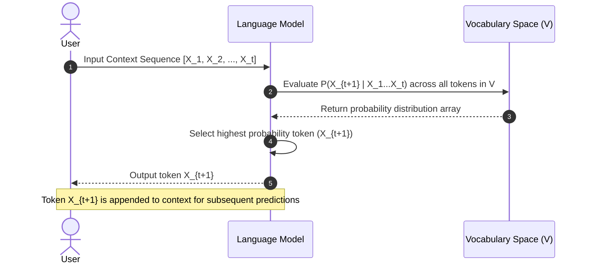
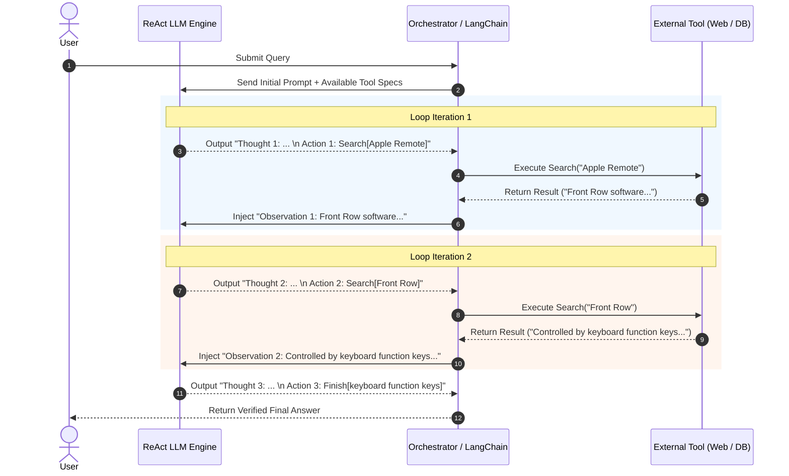
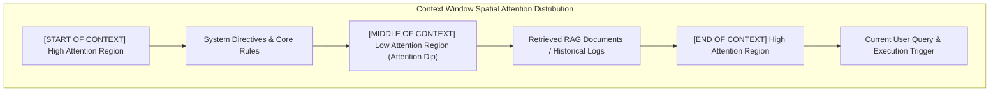

# Formal Definition and Foundations of Language Models (LMs & LLMs)

## Metadata

* **Topic:** Natural Language Processing (NLP), Probability Distribution, Language Modeling, Large Language Models (LLMs)
* **Difficulty:** Beginner
* **Tags:** #LanguageModels #LLM #ProbabilityDistribution #MachineLearning #NLP #ArtificialIntelligence
* **Source:** DeepLearning.AI / Expert Technical Educator Series
* **Date:** 2026-08-08

---

## Executive Summary

* **Core Definition:** A language model is a probabilistic system that estimates the probability distribution of words over a sequence, fundamentally operating as a highly accurate next-token/next-word prediction engine ("smart autocomplete").
* **Mathematical Primitive:** Predicts the probability of the next word $X_{t+1}$ given the prior context sequence $X_1, X_2, \dots, X_t$ across a predefined vocabulary space $V$.
* **Evolution to LLMs:** A Large Language Model (LLM) is structurally a language model trained on massive corpus datasets, optimizing its internal conditional probability estimations across vast contextual windows.
* **Mechanism of Hallucination:** LLMs generate text token-by-token based on statistical likelihood rather than deterministic truth lookup, explaining why outputs can sound fluent yet remain factually incorrect.

---

## Main Concepts & Theory

### 1. Conceptual Framework of Language Modeling

At its core, language modeling simplifies natural language understanding into a continuous sequence prediction task. Given an incomplete context prompt, the language model evaluates its vocabulary repository and assigns a probability score to every candidate word.

```
Input Context: "The dog wagged its" ──> [ Language Model ] ──> Probabilities:
                                                                ├─ "tail"  (P = 0.88)
                                                                ├─ "head"  (P = 0.05)
                                                                └─ "food"  (P = 0.01)

```

### 2. Large Language Models (LLMs) vs. Standard Language Models

An LLM does not fundamentally alter the underlying statistical objective of a traditional language model; rather, it scales the volume of training data, context size, and parameter count.

| Dimension | Standard Language Model | Large Language Model (LLM) |
| --- | --- | --- |
| **Primary Objective** | Compute next-word probability distribution | Compute next-word probability distribution |
| **Training Scale** | Domain-specific or localized corpora | Web-scale, multi-terabyte dataset collections |
| **Inference Behavior** | Localized phrase completion (e.g., SMS keyboard autocomplete) | Long-form context synthesis, reasoning emulation, and chat |
| **Factuality Mechanism** | Statistical co-occurrence | Statistical co-occurrence (prone to hallucinations) |

---

## Important Definitions

| Term | Definition | Why It Matters |
| --- | --- | --- |
| **Language Model (LM)** | A probability distribution over sequences of words estimating the likelihood of subsequent words given past context. | Forms the foundational objective function for modern Natural Language Processing and Generative AI. |
| **Vocabulary ($V$)** | The fixed finite set of distinct tokens or words that a language model is capable of recognizing and predicting. | Defines the output probability space dimension for the model's final prediction layer. |
| **Conditional Probability $P(X_{t+1} \mid X_1, \dots, X_t)$** | The mathematical likelihood of token $X_{t+1}$ occurring given the specific prior sequence of tokens $X_1$ through $X_t$. | Formulates the core mathematical equation executed during autoregressive text generation. |
| **Hallucination** | A phenomenon where an LLM generates syntactically fluent but factually incorrect or ungrounded statements. | Direct byproduct of statistical probability-based decoding rather than factual knowledge retrieval. |

---

## Code & Implementations

### Mathematical Formulation & Algorithmic Representation

#### Conditional Probability Equation

Given a sequence of words $X_1, X_2, \dots, X_t$, the goal is to calculate:

$$P(X_{t+1} \mid X_1, X_2, \dots, X_t) \quad \text{where } X_{t+1} \in V$$

#### Autoregressive Token Selection (Python Conceptual Simulation)

```python
import numpy as np

def predict_next_word(context_sequence: list, vocabulary: list, transition_probs: dict) -> str:
    """
    Simulates a language model predicting the next word Xt+1 given prior context X1...Xt.
    
    :param context_sequence: List of strings representing tokens X1 to Xt.
    :param vocabulary: Set V of all known tokens.
    :param transition_probs: Dictionary mapping context to vocabulary probability arrays.
    :return: The token Xt+1 with the highest probability.
    """
    context_key = " ".join(context_sequence)
    
    # Retrieve probability distribution over Vocabulary V given Context
    if context_key in transition_probs:
        probs = transition_probs[context_key]
    else:
        # Uniform fallback distribution over Vocabulary V
        probs = [1.0 / len(vocabulary)] * len(vocabulary)
        
    # Select word with maximum probability: argmax P(Xt+1 | X1...Xt)
    best_word_idx = np.argmax(probs)
    predicted_word = vocabulary[best_word_idx]
    
    return predicted_word

# Demonstration Setup
V = ["tail", "tongue", "paws", "food"]
context = ["the", "dog", "wagged", "its"]

# Mock probability distribution P(Xt+1 | "the dog wagged its")
mock_probabilities = {
    "the dog wagged its": [0.85, 0.10, 0.04, 0.01]  # Higher score for 'tail'
}

next_word = predict_next_word(context, V, mock_probabilities)
print(f"Context: '{' '.join(context)}'")
print(f"Predicted Next Word (Xt+1): '{next_word}'")

```

---

## Visual Diagrams

### Sequential Autoregressive Decoding Flow



---

## Common Pitfalls & Best Practices

### Mistakes to Avoid (Anti-Patterns)

> [!warning] Confusing Statistical Likelihood with Truth Retrieval
> Assuming an LLM queries a database of verified facts. LLMs sample high-probability continuation sequences based on patterns in training data, which can result in confident hallucinations.

> [!warning] Treating Language Modeling as Entirely New Technology
> Overlooking that modern chat-based AI models share the same fundamental sequence completion loss function $P(X_{t+1} \mid X_1 \dots X_t)$ as early N-gram autocomplete algorithms.

### Best Practices & Optimizations

> [!tip] Grounding Output with Context (RAG)
> Provide explicit domain facts directly within the input sequence $(X_1 \dots X_t)$ to guide probability estimations toward factually accurate responses.

---

## Active Recall & Interview Prep

### Key Q&A Flashcards

**Q: What is the formal mathematical definition of a language model?**

**A:** A language model is a system that computes the probability distribution $P(X_{t+1} \mid X_1, X_2, \dots, X_t)$ over a sequence of words, where $X_{t+1}$ belongs to a defined vocabulary $V$.

**Q: What fundamentally distinguishes a Large Language Model (LLM) from a traditional language model?**

**A:** The fundamental predictive objective remains identical, but an LLM is trained on exponentially larger datasets and uses significantly larger parameter spaces to better estimate probabilities.

**Q: Why do LLMs hallucinate false information?**

**A:** Because LLMs generate text by repeatedly selecting high-probability word continuations based on learned patterns rather than looking up verified facts from a ground-truth database.

**Q: What does the notation $V$ represent in language modeling equations?**

**A:** $V$ represents the Vocabulary—the complete set of discrete candidate tokens or words available for the model to choose from when predicting $X_{t+1}$.

---

## One-Page Cheat Sheet

* **Core Task:** Predict $X_{t+1}$ given context sequence $[X_1, X_2, \dots, X_t]$.
* **Probability Equation:** $P(X_{t+1} \mid X_1, X_2, \dots, X_t) \quad \text{where } X_{t+1} \in V$.
* **Analogy:** "Super-smart autocomplete."
* **Vocabulary ($V$):** The finite universe of tokens candidate for selection.
* **LLM Definition:** A standard language model scaled up through massive training datasets and parameter counts.
* **Text Generation Process:** Iterative, token-by-token probability calculation and selection.
* **Cause of Hallucination:** Selection based on statistical likelihood rather than factual correctness verification.

# Formal Structure and Components of a Prompt in AI

## Metadata

- **Topic:** Prompt Engineering, Natural Language Processing, AI Communication Standards
    
      
    
- **Difficulty:** Beginner
    
      
    
- **Tags:** #PromptEngineering #LLM #ArtificialIntelligence #GenerativeAI #NLP
    
      
    
- **Source:** DeepLearning.AI / Expert Technical Educator Series
    
      
    
- **Date:** 2026-08-08
    
      
    

## Executive Summary

- **Standardized Definition:** A prompt is the structured input provided to an AI model to guide its understanding, process contextual data, and produce a targeted, relevant output.
    
      
    
- **Terminology Importance:** Establishing formal prompt engineering terminology creates a shared language for technical collaboration and enables systematic optimization of model responses.
    
      
    
- **The Four Prompt Components:** Every comprehensive prompt can be decomposed into four elements: **Instruction**, **Context**, **Input Data**, and **Output Indicator**.
    
      
    
- **Modularity in Engineering:** Deconstructing prompts into explicit components allows engineers to isolate performance bottlenecks and iteratively modify specific prompt elements rather than rewriting prompts blindly.
    
      
    

## Main Concepts & Theory

### 1. What is a Prompt?

A prompt acts as the primary steering mechanism for a Large Language Model (LLM). It frames the task, provides relevant constraints, supplies necessary source materials, and triggers response generation.

  

```
+-----------------------------------------------------------------------+
|                                PROMPT                                 |
|                                                                       |
|  +--------------------+  +--------------------+  +-----------------+  |
|  |    INSTRUCTION     |  |      CONTEXT       |  |   INPUT DATA    |  |
|  |  (Core Task Goal)  |  | (Background Specs) |  | (Target Object) |  |
|  +--------------------+  +--------------------+  +-----------------+  |
|                                                                       |
|                       +----------------------+                        |
|                       |   OUTPUT INDICATOR   |                        |
|                       | (Trigger / Format)   |                        |
|                       +----------------------+                        |
+-----------------------------------------------------------------------+
                                   |
                                   v
                         [ Generative LLM ]
                                   |
                                   v
                          [ Model Response ]
```

### 2. The Four Functional Components of a Prompt

|**Component**|**Role / Purpose**|**Necessity Level**|**Example Fragment**|
|---|---|---|---|
|**Instruction**|Directs the model on the exact operation or task to execute (e.g., summarize, translate, classify).|**Mandatory**|_"Translate the following text into French."_|
|**Context**|Background information, constraints, domain knowledge, or persona guidelines that narrow down possibilities.|Optional (Task-dependent)|_"Target audience: Non-technical executives."_|
|**Input Data**|The payload or raw material that the model must process to fulfill the instruction.|Optional (Task-dependent)|_"[Raw transcript text block...]"_|
|**Output Indicator**|Signals that input processing is complete and specifies the desired output format/trigger.|Optional (Can be implicit)|_"French Translation:"_ or _"JSON Format:"_|

## Important Definitions

|**Term**|**Definition**|**Why It Matters**|
|---|---|---|
|**Prompt**|The input context supplied to a generative AI model that directs its output generation.|Defines the exact operational boundary and instructions for the model.|
|**Instruction**|The explicit task statement telling the AI model what specific action to perform.|Serves as the operational engine of the prompt.|
|**Context**|Auxiliary background details, role definitions, or environmental constraints included in a prompt.|Dramatically increases output precision by reducing ambiguous interpretation.|
|**Input Data**|The explicit content payload (text, table, code, image) on which the instruction operates.|Supplies the specific data needed to perform the task.|
|**Output Indicator**|A formatting anchor or explicit marker that triggers the model's text generation sequence.|Prevents model prefix babble and enforces target output structure (e.g., JSON, YAML, Markdown).|

## Code & Implementations

### Structural Breakdown of a Complete Engineering Prompt

Markdown

```
### 1. INSTRUCTION
Analyze the customer feedback provided below and classify the overall sentiment into one of three categories: POSITIVE, NEUTRAL, or NEGATIVE.

### 2. CONTEXT
You are an expert customer experience analyst at an enterprise software firm. Focus specifically on feedback regarding recent software updates and user interface changes. Ignore mentions of product pricing.

### 3. INPUT DATA
"The new dashboard layout is sleek and responsive, but the recent patch made export times twice as slow. Overall, I appreciate the modern design."

### 4. OUTPUT INDICATOR
Sentiment Classification:
```

## Visual Diagrams

### Anatomy of a Deconstructed Prompt

Code snippet

```
graph TD
    A[Raw Prompt Text] --> B[Instruction: What to do]
    A --> C[Context: How/Where/Background]
    A --> D[Input Data: What to process]
    A --> E[Output Indicator: Where/How to start output]

    B --> F[Model Processing Engine]
    C --> F
    D --> F
    E --> F

    F --> G[Target Generated Output]
```

## Common Pitfalls & Best Practices

### Mistakes to Avoid (Anti-Patterns)

> [!warning] Merging Instruction and Input Data into an Unstructured Block
> 
> Combining raw input text with task instructions without clear markers (e.g., triple quotes `"""` or XML tags `<data>`) causes the model to mix up instructions with the content it is supposed to process.
> 
>   

> [!warning] Omitting Explicit Output Indicators for Structured Outputs
> 
> Omitting an explicit formatting prefix (e.g., `JSON Output: {`) often results in models returning conversational conversational preamble (e.g., _"Sure, here is your JSON output:"_) prior to the payload.
> 
>   

### Best Practices & Optimizations

> [!tip] Use Structural Delimiters
> 
> Wrap **Input Data** inside explicit XML tags or Markdown code blocks to separate user payload from prompt **Instructions**.
> 
>   
> 
> **Example:**
> 
>   
> 
> Plaintext
> 
> ```
> Summarize the text inside the <article> tags.
> <article>
> [Input Data Payload]
> </article>
> Summary:
> ```

## Active Recall & Interview Prep

### Key Q&A Flashcards

**Q: What are the four main components of a structured prompt?**

  

**A:** Instruction, Context, Input Data, and Output Indicator.

  

**Q: Which prompt component is considered the core "heart" of every prompt?**

  

**A:** The **Instruction**, which defines the exact task or action the AI model must perform.

  

**Q: What is the primary difference between Context and Input Data in a prompt?**

  

**A:** **Context** provides background rules, constraints, or guidelines for the task, whereas **Input Data** is the explicit payload or subject material being processed by the instruction.

  

**Q: What function does an explicit Output Indicator serve in prompt design?**

  

**A:** It signals to the model that processing is complete, triggers output generation, and enforces specific output formatting (e.g., starting directly with a JSON bracket).

  

## One-Page Cheat Sheet

- **Prompt Definition:** The input provided to an AI model to guide context processing and response generation.
    
      
    
- **Component 1 (Instruction):** Mandatory task command (_Summarize, Classify, Translate_).
    
      
    
- **Component 2 (Context):** Background info, constraints, or persona definitions (_Target audience, tone, domain rules_).
    
      
    
- **Component 3 (Input Data):** The explicit payload being acted upon (_Article, Code block, Raw log_).
    
      
    
- **Component 4 (Output Indicator):** Formatting trigger or prefix signal (_JSON:, Response:_).
    
      
    
- **Engineering Benefit:** Modular deconstruction allows targeted debugging of weak prompts.
    
      
    
- **Optimization Strategy:** Enclose Input Data in structural tags (`<content>...</content>`) to prevent instruction contamination.

# Zero-Shot Prompting in Large Language Models

## Metadata

- **Topic:** Prompt Engineering, In-Context Learning, Zero-Shot Generalization
    
      
    
- **Difficulty:** Beginner
    
      
    
- **Tags:** #PromptEngineering #LLM #ZeroShot #InContextLearning #GenerativeAI
    
      
    
- **Source:** DeepLearning.AI / Expert Technical Educator Series
    
      
    
- **Date:** 2026-08-08
    
      
    

## Executive Summary

- **Definition:** Zero-shot prompting is a technique where an LLM is asked to perform a task without providing any explicit examples or task-specific guidance in the prompt context.
    
      
    
- **Mechanism:** Relies entirely on the model's pre-trained parametric memory (derived from web-scale pre-training datasets, e.g., GPT-3 trained on over a billion words).
    
      
    
- **Usage Default:** Zero-shot is the most common entry-level prompting style because it mirrors natural human conversation (e.g., direct Q&A).
    
      
    
- **Core Trade-offs:** Offers high convenience and simplicity, but exhibits lower output accuracy, limited domain-specific control, and higher susceptibility to hallucinations or off-target formatting.
    
      
    

## Main Concepts & Theory

### 1. Parametric Knowledge vs. In-Context Guidance

When an LLM executes a zero-shot prompt, it draws exclusively from its internal parameter weights (parametric knowledge). No external context or exemplar patterns are loaded into the attention mechanism.

  

```
[ User Zero-Shot Prompt ] ──> [ LLM Parametric Weights ] ──> [ Generated Output ]
 (No Examples / Data)         (Pre-trained Knowledge)
```

### 2. Zero-Shot Generalization Capabilities

Due to massive pre-training scale, LLMs can perform complex tasks without task-specific training or prompt examples:

  

- **Translation:** Translating text into languages that had low explicit representation in supervised fine-tuning.
    
      
    
- **List Generation:** Generating curated lists based on broad world knowledge.
    
      
    
- **Classification:** Categorizing input text into pre-defined classes without prior examples.
    
      
    

## Important Definitions

|**Term**|**Definition**|**Why It Matters**|
|---|---|---|
|**Zero-Shot Prompting**|Querying an LLM to execute a task without supplying any input-output examples inside the prompt payload.|Serves as the default baseline for evaluating raw LLM intelligence and pre-trained world knowledge.|
|**Parametric Memory**|The static world knowledge embedded directly within an LLM's weights during pre-training.|Determines the upper limit of what a model can answer in a pure zero-shot setting without external context.|
|**In-Context Learning**|The ability of an LLM to recognize patterns and adapt its output style based on examples provided directly inside the prompt context.|Contrast to zero-shot; leveraged in few-shot prompting to improve performance.|

## Code & Implementations

### Zero-Shot Prompt Structure vs. Output Evaluation

#### Prompt Structure (Zero-Shot)

Markdown

```
### INSTRUCTION
Create a list of the 10 must-visit cities in the world in no particular order.

### OUTPUT INDICATOR
Cities:
```

#### Python Implementation via OpenAI API

Python

```
import os
from openai import OpenAI

client = OpenAI(api_key=os.getenv("OPENAI_API_KEY"))

def execute_zero_shot_prompt(task_instruction: str) -> str:
    """
    Executes a zero-shot prompt containing only instructions and no demonstration examples.
    """
    response = client.chat.completions.create(
        model="gpt-3.5-turbo",
        messages=[
            {"role": "user", "content": task_instruction}
        ],
        temperature=0.7
    )
    return response.choices[0].message.content

# Zero-Shot Query Execution
zero_shot_instruction = "Create a list of the 10 must-visit cities in the world in no particular order."
output = execute_zero_shot_prompt(zero_shot_instruction)

print("--- Zero-Shot Output ---")
print(output)
```

## Visual Diagrams

### Zero-Shot vs. Few-Shot Context Flow

Code snippet

```
graph TD
    subgraph Zero-Shot Prompting
        A1[Instruction Only] --> B1[LLM Internal Weights]
        B1 --> C1[Output Response]
    end

    subgraph Few-Shot Prompting
        A2[Instruction + Example 1 + Example 2] --> B2[LLM Internal Weights]
        B2 --> C2[In-Context Pattern Alignment]
        C2 --> D2[Targeted Output Response]
    end
```

## System Architecture & Trade-offs

### Trade-off Analysis: Zero-Shot Prompting

|**Dimension**|**Advantage**|**Disadvantage / Limitation**|
|---|---|---|
|**Token Usage & Cost**|Low prompt token consumption (cheap).|Higher risk of invalid formatting requiring retries.|
|**Setup Overhead**|Zero preparation time; highly intuitive.|Lack of output formatting control.|
|**Accuracy / Precision**|Sufficient for general knowledge tasks.|Prone to hallucinations on niche or domain-specific tasks.|
|**Determinism**|High output variance across executions.|Difficult to enforce strict schema constraints (e.g., exact JSON schema).|

## Common Pitfalls & Best Practices

### Mistakes to Avoid (Anti-Patterns)

> [!warning] Expecting Strict Output Formatting in Zero-Shot Mode
> 
> Expecting complex structured formats (e.g., exact CSV schemas or rigid JSON objects) without providing demonstration examples often leads to parsing errors due to output variations.
> 
>   

> [!warning] Relying on Zero-Shot for Enterprise Niche Data
> 
> Querying an LLM zero-shot for private company policies or hyper-specific domain APIs will result in hallucinations because that data does not exist inside the model's parametric memory.
> 
>   

### Best Practices & Optimizations

> [!tip] Use Clear Structural Role Delimiters
> 
> Even in zero-shot prompts, improve reliability by explicitly declaring role and task boundaries using clear Markdown headings (`### INSTRUCTION`) or system instructions.
> 
>   

## Active Recall & Interview Prep

### Key Q&A Flashcards

**Q: What is a zero-shot prompt?**

  

**A:** A prompt that asks an LLM to complete a task without providing any input-output examples in the prompt context.

  

**Q: Where does an LLM derive the knowledge to answer a zero-shot prompt?**

  

**A:** Entirely from its pre-trained parametric memory (the internal weights learned during pre-training on large datasets).

  

**Q: What are the primary limitations of zero-shot prompting?**

  

**A:** Lower accuracy on complex tasks, reduced control over output formatting, and a higher tendency for hallucinations on niche topics.

  

**Q: Why is zero-shot prompting the most commonly used prompting method for beginners?**

  

**A:** Because it requires no prompt preparation or example formatting, mimicking standard human conversation.

  

## One-Page Cheat Sheet

- **Core Concept:** Direct task command with $0$ demonstration examples.
    
      
    
- **Knowledge Source:** Pre-training parametric memory.
    
      
    
- **Key Advantage:** Fast, intuitive, minimal token cost.
    
      
    
- **Key Limitation:** Lower accuracy and unreliable structural formatting.
    
      
    
- **Best Use Cases:** Broad knowledge Q&A, general summarization, open-ended text generation.
    
      
    
- **When to Avoid:** Complex schema outputs, niche business logic, edge-case classification.
    
      
    
- **Transition Path:** Upgrade to Few-Shot Prompting or RAG when zero-shot accuracy falls below production standards.
# One-Shot and Few-Shot Prompting Mechanics

## Metadata

- **Topic:** Prompt Engineering, In-Context Learning, Few-Shot Alignment, Text-to-Image Prompt Generation
    
      
    
- **Difficulty:** Beginner
    
      
    
- **Tags:** #PromptEngineering #FewShot #OneShot #InContextLearning #GenerativeAI #PromptDesign
    
      
    
- **Source:** DeepLearning.AI / Expert Technical Educator Series
    
      
    
- **Date:** 2026-08-08
    
      
    

## Executive Summary

- **In-Context Adaptation:** Few-shot prompting guides model outputs by supplying a small number ($N \ge 1$) of input-output demonstrations directly in the prompt context, eliminating the need for model parameter updates.
    
      
    
- **Demonstration Subsets:** **One-Shot Prompting** uses exactly one demonstration ($N = 1$), while **Few-Shot Prompting** uses multiple demonstrations ($N > 1$) to establish structural and stylistic patterns.
    
      
    
- **Pattern Alignment:** Demonstrations constrain the model's creative variance, forcing output outputs to follow targeted syntactic patterns (e.g., placing specific adjectives or color descriptors at precise positions).
    
      
    
- **Text-to-Text for Text-to-Image:** Demonstrates using few-shot text generation to construct dense, highly styled prompt payloads optimized for text-to-image engines like BlueWillow or Midjourney.
    
      
    

## Main Concepts & Theory

### 1. In-Context Learning Framework

Few-shot prompting leverages the attention mechanism of Large Language Models to extract conditional patterns directly from the input context window. Rather than relying purely on pre-trained parametric memory (as in zero-shot), the model aligns its output to match the format, tone, and structural constraints of the provided exemplars.

  

```
+-------------------------------------------------------------------------+
|                              PROMPT PAYLOAD                             |
|                                                                         |
|  [Instruction]: Write a compressed image description.                    |
|                                                                         |
|  [Example 1]: Target: Blue Dog | Description: Sweating blue fur...      |
|  [Example 2]: Target: Red Dog  | Description: Crying red fur...         |
|  [Example 3]: Target: Green Dog| Description: Shimmering green fur...   |
|                                                                         |
|  [Target Query]: Yorkshire Dog in Brazilian Winter                      |
|  [Output Indicator]: Description:                                       |
+-------------------------------------------------------------------------+
                                     |
                                     v
                        [ In-Context Alignment ]
                                     |
                                     v
[ Model Output ]: "Vivacious violet Yorkshire dog, fur fluttering in shimmering snow..."
```

### 2. Shot Taxonomy Comparison

|**Prompt Type**|**Number of Shots (N)**|**Primary Function**|**Model Latitude / Freedom**|
|---|---|---|---|
|**Zero-Shot**|$N = 0$|Direct instruction relying solely on parametric weights.|**High** (Unconstrained generation, higher variance)|
|**One-Shot**|$N = 1$|Establishes basic output format, length, or conciseness.|**Moderate** (Follows single template structure)|
|**Few-Shot**|$N > 1$|Enforces strict pattern matching, stylistic cues, and precise syntax.|**Low / Precise** (Strictly constrained to exemplar pattern)|

## Important Definitions

|**Term**|**Definition**|**Why It Matters**|
|---|---|---|
|**Few-Shot Prompting**|A technique providing two or more demonstration examples ($N > 1$) within the prompt to steer model outputs.|Enables rapid domain adaptation and structural formatting without model retraining.|
|**One-Shot Prompting**|A special case of few-shot prompting where exactly one demonstration example ($N = 1$) is supplied.|Provides a minimal contextual anchor for structural output formatting.|
|**In-Context Learning (ICL)**|The capacity of an LLM to learn tasks dynamically from examples provided in the immediate prompt context.|Formulates the foundational capability powering all few-shot prompting strategies.|
|**Pattern Extraction**|The model's ability to infer implicit rules (e.g., "always prefix adjectives with a color") from demonstrations.|Guarantees consistent outputs across automated batch generation pipelines.|

## Code & Implementations

### End-to-End Comparative Demonstration (Zero-Shot vs. One-Shot vs. Few-Shot)

#### 1. Zero-Shot Prompt Example

Plaintext

```
Write an image description with adjectives and nouns of a Yorkshire dog running in the winter landscape of Brazil.
```

- **Output Character:** Long, verbose, narrative paragraph with unconstrained stylistic choices.
    
      
    

#### 2. One-Shot Prompt Example ($N = 1$)

Plaintext

```
### INSTRUCTION
Write a compressed image description with adjectives and nouns of a Yorkshire dog running in the winter landscape of Brazil.

### EXAMPLE
Input: Blue Dog
Output: Blue dog, shimmering snow, frost-covered trees, icy wind, vibrant atmosphere.

### TARGET INPUT
Input: Yorkshire Dog in Brazilian Winter

### OUTPUT
```

- **Output Character:** Concise, comma-separated list of nouns and adjectives following the exemplar density.
    
      
    

#### 3. Few-Shot Prompt Example ($N = 3$)

Plaintext

```
### INSTRUCTION
Write a compressed image description using adjectives and nouns. Follow the color and motion descriptor pattern shown in the examples.

### EXAMPLES
Example 1:
Input: Yorkshire Dog
Output: Sweating blue Yorkshire dog, shimmering snow, frost-covered pine trees.

Example 2:
Input: Yorkshire Dog
Output: Crying red Yorkshire dog, howling icy winds, frozen tundra.

Example 3:
Input: Yorkshire Dog
Output: Panting green Yorkshire dog, glistening ice sheets, winter sunrise.

### TARGET QUERY
Input: Yorkshire Dog running in Brazilian Winter

### OUTPUT INDICATOR
Output:
```

- **Output Character:** Model strictly adopts the implicit pattern: `[Dynamic Alliterative Color + Emotion] Yorkshire dog, [Environment Descriptor 1], [Environment Descriptor 2]`.
    
      
    
- **Sample Result:** _"Vivacious violet Yorkshire dog, fur fluttering in shimmering snow, frozen landscape."_
    
      
    

## Visual Diagrams

### Prompt Shot Density vs. Output Variance

```
Output Variance / Creative Freedom
  ^
  |  * Zero-Shot (High Variance / Artistic Freedom)
  |
  |             * One-Shot (Format Anchored)
  |
  |                           * Few-Shot (Pattern & Syntax Constrained)
  +--------------------------------------------------------------------> Number of Demonstration Shots (N)
```

## System Architecture & Trade-offs

### Trade-off Analysis: Shot Selection Strategy

|**Factor**|**Zero-Shot (N=0)**|**One-Shot (N=1)**|**Few-Shot (N≥3)**|
|---|---|---|---|
|**Token Cost**|Lowest|Moderate|Higher (Demonstrations consume context window tokens)|
|**Latency**|Lowest processing latency|Slightly higher processing latency|Higher prompt processing latency|
|**Format Reliability**|Unpredictable|Moderately reliable|**Extremely high reliability**|
|**Domain Adaptation**|Weak|Fair|**Strong**|

## Common Pitfalls & Best Practices

### Mistakes to Avoid (Anti-Patterns)

> [!warning] Providing Inconsistent Demonstration Formats
> 
> Giving few-shot examples with varying structures (e.g., Example 1 as JSON, Example 2 as bullet points) confuses the model's pattern extraction, leading to degraded outputs.
> 
>   

> [!warning] Overloading Demonstrations in Small Context Windows
> 
> Including too many lengthy demonstrations increases token consumption and cost without providing proportional performance gains after 3–5 shots.
> 
>   

### Best Practices & Optimizations

> [!tip] Maintain Structural Symmetry
> 
> Ensure all demonstration shots follow the exact same delimiter structure:
> 
>   
> 
> `Input: [X] -> Output: [Y]`.
> 
>   

> [!tip] Diversity in Demonstration Examples
> 
> Vary the content across your few-shot examples (e.g., using different colors or action words) so the model learns the _pattern rule_ rather than memorizing a specific constant value.
> 
>   

## Active Recall & Interview Prep

### Key Q&A Flashcards

**Q: What is the defining difference between a zero-shot prompt and a few-shot prompt?**

  

**A:** A zero-shot prompt contains only task instructions without examples, whereas a few-shot prompt includes multiple demonstration input-output pairs ($N > 1$) directly in the context.

  

**Q: Is a one-shot prompt considered a subset of few-shot prompting?**

  

**A:** Yes, one-shot prompting ($N = 1$) is a specific boundary case of few-shot prompting ($N \ge 1$).

  

**Q: How does few-shot prompting act as a light alternative to fine-tuning?**

  

**A:** It adapts model output behavior, formatting, and domain style instantly within the context window without requiring computationally expensive model weight updates.

  

**Q: What is the main trade-off when adding more demonstration shots to a prompt?**

  

**A:** Adding more shots increases output format precision and accuracy, but consumes more context window tokens, increasing API costs and input latency.

  

## One-Page Cheat Sheet

- **One-Shot Definition:** $N = 1$ demonstration provided in prompt context.
    
      
    
- **Few-Shot Definition:** $N > 1$ (typically $3\text{--}5$) demonstrations provided in prompt context.
    
      
    
- **Core Mechanism:** In-Context Learning (ICL) via pattern recognition.
    
      
    
- **Primary Benefit:** Guides output syntax, formatting, and domain style without parameter fine-tuning.
    
      
    
- **Impact on Model Behavior:** Reduces unconstrained creative freedom; forces adherence to exemplar patterns.
    
      
    
- **Key Design Rule:** Ensure strict structural consistency across all provided demonstration pairs.
    
      
    
- **Token Balance:** Balance shot count against context window limits and token latency costs.


# Chain-of-Thought (CoT) Prompting Mechanics

## Metadata

- **Topic:** Prompt Engineering, Complex Reasoning, Chain-of-Thought (CoT), In-Context Learning
    
      
    
- **Difficulty:** Intermediate
    
      
    
- **Tags:** #PromptEngineering #ChainOfThought #CoT #LLM #ComplexReasoning #GoogleResearch
    
      
    
- **Source:** DeepLearning.AI / Expert Technical Educator Series (citing Wei et al., Google Research, 2022)
    
      
    
- **Date:** 2026-08-08
    
      
    

## Executive Summary

- **Reasoning Breakthrough:** Chain-of-Thought (CoT) prompting is a prompting technique introduced by Google researchers (Wei et al., 2022) that enables Large Language Models (LLMs) to decompose complex, multi-step problems into intermediate reasoning steps.
    
      
    
- **Overcoming Standard Limitations:** While 100B+ parameter models excel at single-step generation, standard zero-shot/few-shot prompting fails on arithmetic, symbolic, and commonsense reasoning tasks. CoT resolves this by allocating generation tokens to explicitly write out step-by-step logic.
    
      
    
- **Two Core Paradigms:**
    
      
    1. **Few-Shot CoT:** The user provides $N \ge 1$ demonstration exemplars that explicitly articulate the intermediate reasoning steps leading to the final answer.
        
          
        
    2. **Zero-Shot CoT:** The user appends a triggering phrase—most famously _"Let's think step by step"_ (Kojima et al., 2022)—to force the model to self-generate intermediate reasoning without domain exemplars.
        
          
        
- **Explainability & Efficiency:** Beyond higher task accuracy, CoT provides human-readable audit trails of the model's inner reasoning path, making error debugging straightforward.
    
      
    

## Main Concepts & Theory

### 1. Standard Prompting vs. Chain-of-Thought Prompting

In standard prompting, a model is asked to map a complex input problem directly to an immediate final output answer. Because transformers generate text token-by-token, forcing an immediate final answer requires the network to perform all multi-step math or logic in a single forward pass—a frequent failure point.

  

CoT forcing functions allow the model to generate intermediate "scratchpad" tokens, effectively converting a high-complexity multi-step task into a sequence of smaller, manageable single-step operations.

  

```
[ STANDARD PROMPT ]
Problem ---> [ LLM Single Forward Pass ] ---> Final Answer (High Error Rate)

[ CHAIN-OF-THOUGHT PROMPT ]
Problem ---> [ Step 1 Logic ] ---> [ Step 2 Logic ] ---> [ Step 3 Logic ] ---> Final Answer (High Accuracy)
```

### 2. Comparative Case Study (from Wei et al., 2022)

#### Problem Scenario (Math Word Problem)

> **Question:** John takes care of 10 dogs. Each dog takes 0.5 hours a day to walk and take care of. How many hours a week does John need to take care of his dogs?
> 
>   

- **Standard Zero-Shot Output:** `50` $\rightarrow$ **INCORRECT** (Model hallucinated by multiplying $10 \times 5$ directly without processing weekly conversion or decimals).
    
      
    
- **Chain-of-Thought Output:**
    
      
    
    > _"John takes care of 10 dogs. Each dog takes 0.5 hours a day. So taking care of all dogs per day takes $10 \times 0.5 = 5$ hours. There are 7 days in a week. So 5 hours/day $\times$ 7 days = 35 hours per week. The answer is 35."_ $\rightarrow$ **CORRECT**
    > 
    >   
    

## Important Definitions

|**Term**|**Definition**|**Why It Matters**|
|---|---|---|
|**Chain-of-Thought (CoT)**|A prompting method where the model explicitly generates a sequence of intermediate reasoning steps before arriving at a final answer.|Dramatically improves performance on math, symbolic, and multi-step logic problems in 100B+ parameter LLMs.|
|**Zero-Shot CoT**|Prompting an LLM with a task and appending a step-by-step trigger phrase (e.g., _"Let's think step by step"_) without providing demonstration examples.|Elicits step-by-step reasoning dynamically without needing custom exemplar creation.|
|**Few-Shot CoT**|Supplying the prompt with one or more ($N \ge 1$) target exemplars where the solution explicitly displays the intermediate step-by-step reasoning chain.|Guides the model's precise reasoning style, tone, and step granularities.|
|**Intermediate Steps**|The explicit, token-by-token logical scratchpad generated prior to the final prediction.|Spreads computational load across multiple decoding steps rather than a single forward pass.|

## Code & Implementations

### Structural Breakdown: Standard Few-Shot vs. Few-Shot CoT vs. Zero-Shot CoT

#### 1. Few-Shot Chain-of-Thought Prompt ($N=1$)

Markdown

```
### INSTRUCTION
Solve the math word problem by breaking down the calculations step by step.

### EXEMPLAR DEMONSTRATION
Q: Sean has 5 toys for Christmas. He got 2 toys each from his mom and his dad. How many toys does he have in total?
A: Sean started with 5 toys. He got 2 toys from his mom and 2 toys from his dad. 5 + 2 + 2 = 9. The answer is 9.

### TARGET QUERY
Q: John takes care of 10 dogs. Each dog takes 0.5 hours a day to walk and take care of. How many hours a week does John need to take care of his dogs?
A:
```

#### 2. Zero-Shot Chain-of-Thought Prompt

Markdown

```
### INSTRUCTION
John takes care of 10 dogs. Each dog takes 0.5 hours a day to walk and take care of. How many hours a week does John need to take care of his dogs?

### REASONING TRIGGER
Let's think step by step.
```

#### Python Execution Script via OpenAI API

Python

```
import os
from openai import OpenAI

client = OpenAI(api_key=os.getenv("OPENAI_API_KEY"))

def execute_cot_prompt(prompt_payload: str) -> str:
    """
    Executes a Chain-of-Thought prompt payload and returns the step-by-step response.
    """
    response = client.chat.completions.create(
        model="gpt-3.5-turbo",
        messages=[
            {"role": "system", "content": "You are a logical math tutor that always breaks problems down into clear intermediate steps."},
            {"role": "user", "content": prompt_payload}
        ],
        temperature=0.0  # Zero temperature for deterministic reasoning
    )
    return response.choices[0].message.content

# Zero-Shot CoT Execution
zero_shot_cot = """John takes care of 10 dogs. Each dog takes 0.5 hours a day to walk and take care of. How many hours a week does John need to take care of his dogs?

Let's think step by step."""

print("--- Zero-Shot CoT Output ---")
print(execute_cot_prompt(zero_shot_cot))
```

## Visual Diagrams

### Structural Comparison of Prompting Paradigms

Code snippet

```
graph TD
    subgraph Standard Few-Shot Prompting
        A1[Q: Toy Problem -> A: 9] --> B1[Q: Dog Problem]
        B1 --> C1[LLM Guesses Direct Answer: 50]
    end

    subgraph Few-Shot Chain-of-Thought Prompting
        A2[Q: Toy Problem -> A: 5 + 2 + 2 = 9] --> B2[Q: Dog Problem]
        B2 --> C2[Step 1: 10 dogs * 0.5 hrs = 5 hrs/day]
        C2 --> D2[Step 2: 5 hrs/day * 7 days = 35 hrs/week]
        D2 --> E2[Final Answer: 35]
    end
```

## System Architecture & Trade-offs

### Trade-off Analysis: Standard vs. Zero-Shot CoT vs. Few-Shot CoT

|**Dimension**|**Standard Prompting**|**Zero-Shot CoT**|**Few-Shot CoT**|
|---|---|---|---|
|**Model Size Dependency**|Works on small models ($\le 10\text{B}$).|Performs best on large models ($\ge 100\text{B}$).|Performs best on large models ($\ge 100\text{B}$).|
|**Prompt Engineering Effort**|Minimal|Very low (_"Let's think step by step"_).|Moderate to High (Requires crafting step-by-step exemplars).|
|**Accuracy on Complex Math**|Poor|High|**Very High**|
|**Output Token Consumption**|Minimal (Only returns final answer).|Higher (Generates intermediate text).|Highest (Includes exemplar reasoning + output reasoning).|
|**Auditability / Debugging**|None (Black box answer).|Excellent (Transparent logic).|**Excellent** (Transparent logic following custom structure).|

## Common Pitfalls & Best Practices

### Mistakes to Avoid (Anti-Patterns)

> [!warning] Applying CoT to Simple Single-Step Lookups
> 
> Using Chain-of-Thought for basic factual retrieval (e.g., _"What is the capital of France?"_) needlessly increases token consumption, latency, and API cost without yielding accuracy benefits.
> 
>   

> [!warning] Flawed Intermediate Steps in Few-Shot Exemplars
> 
> If the intermediate reasoning steps inside your few-shot exemplars contain arithmetic errors or logical fallacies, the model will copy those flawed reasoning patterns in its output.
> 
>   

### Best Practices & Optimizations

> [!tip] Leverage Zero-Shot CoT as an Initial Baseline
> 
> Simply appending `"Let's think step by step."` or `"Explain your reasoning step by step before answering."` to your existing prompt is the fastest way to boost reasoning accuracy before investing time in constructing few-shot exemplars.
> 
>   

> [!tip] Enforce Final Answer Formatting
> 
> When using CoT, instruct the model to finish its output with a distinct anchor string (e.g., `Therefore, the final answer is: [X]`) so that parsing scripts can extract the target output cleanly.
> 
>   

## Active Recall & Interview Prep

### Key Q&A Flashcards

**Q: What is Chain-of-Thought (CoT) prompting?**

  

**A:** A prompting technique that guides LLMs to break down complex multi-step problems into intermediate sequential reasoning steps before outputting the final answer.

  

**Q: Who originally introduced Chain-of-Thought prompting?**

  

**A:** Google Researchers (Jason Wei et al., 2022) in the paper _"Chain-of-Thought Prompting Elicits Reasoning in Large Language Models"_.

  

**Q: How does Zero-Shot CoT differ from Few-Shot CoT?**

  

**A:** Zero-Shot CoT appends a trigger phrase like _"Let's think step by step"_ without providing examples, whereas Few-Shot CoT provides explicit step-by-step input-output demonstrations in the context.

  

**Q: Why does CoT significantly improve performance on multi-step reasoning tasks?**

  

**A:** It allows the model to spread computation across multiple output token steps ("scratchpad memory") rather than attempting to solve the entire problem in a single forward pass to output the final token directly.

  

## One-Page Cheat Sheet

- **Core Concept:** Decomposition of multi-step problems into sequential intermediate reasoning steps.
    
      
    
- **Paper Origin:** Wei et al. (Google Research, 2022).
    
      
    
- **Primary Target Use Cases:** Math word problems, commonsense reasoning, symbolic logic operations.
    
      
    
- **Zero-Shot CoT Trigger Phrase:** `"Let's think step by step."`
    
      
    
- **Few-Shot CoT Mechanism:** Include exemplars showing explicit problem decomposition: `Input -> Reasoning Steps -> Final Answer`.
    
      
    
- **Emergent Property:** CoT capabilities emerge primarily in large-scale LLMs ($\approx 100\text{B}+$ parameters).
    
      
    
- **Key Benefits:** Higher complex task accuracy, lower hallucination rates in logic, human-auditable reasoning paths.
    
      
    
- **Key Costs:** Increased token usage, higher latency, and higher API execution cost.

# ReAct Paradigm: Synergizing Reasoning and Acting in LLMs

## Metadata

- **Topic:** Prompt Engineering, ReAct Paradigm, Tool-Augmented LLMs, LangChain Architecture
    
      
    
- **Difficulty:** Advanced
    
      
    
- **Tags:** #ReAct #PromptEngineering #LLM #LangChain #AutonomousAgents #ChainOfThought #AI
    
      
    
- **Source:** Expert Technical Educator Series (citing Yao et al., Princeton & Google Research, 2022)
    
      
    
- **Date:** 2026-08-08
    
      
    

## Executive Summary

- **The ReAct Concept:** ReAct (**Re**asoning + **Act**ing) is an agentic framework introduced by Yao et al. (2022) that synergizes Chain-of-Thought (CoT) reasoning with the capacity to execute external actions (e.g., searching APIs, querying databases, or running code).
    
      
    
- **Resolving Core Vulnerabilities:** Standard zero-shot/CoT reasoning fails when queries require real-time, non-parametric facts (causing hallucinations). Conversely, "Act-only" tools lack high-level planning, getting stuck easily. ReAct bridges this gap by maintaining an interleaved trace of **Thought $\rightarrow$ Action $\rightarrow$ Observation**.
    
      
    
- **Foundation of Agentic Frameworks:** ReAct serves as the foundational architecture for modern autonomous agent frameworks such as **LangChain**, AutoGPT, and LlamaIndex.
    
      
    
- **Human-like Problem Solving:** ReAct mimics human cognition: breaking down complex objectives into a mental plan, executing an action in the physical/digital environment, evaluating the returned feedback (observation), and updating the next plan iteratively.
    
      
    

## Main Concepts & Theory

### 1. The Interleaved ReAct Loop

ReAct structures an interaction loop into three continuous execution primitives:

  

1. **Thought (Reasoning):** The LLM self-generates intermediate reasoning to track progress, decompose goals, or update its plan based on new information.
    
      
    
2. **Action (Acting):** The LLM selects an external tool from a permitted set (e.g., `Search[query]`, `Lookup[term]`) and outputs a structured command.
    
      
    
3. **Observation (Environment Feedback):** An external execution engine (e.g., Python code or API client) runs the tool and injects the raw result back into the prompt context for the LLM's next iteration.
    
      
    

```
       +-------------------------------------------------------------+
       |                        USER QUERY                           |
       +-------------------------------------------------------------+
                                      |
                                      v
+---------------------------------------------------------------------------+
|                              ReAct Loop                                   |
|                                                                           |
|   +-------------------+    +--------------------+    +----------------+   |
|   |   1. THOUGHT      | -> |    2. ACTION       | -> | 3. OBSERVATION | --+
|   | (LLM Reasoning)   |    | (API/Tool Execute) |    | (Env Feedback) |   |
|   +-------------------+    +--------------------+    +----------------+   |
|             ^                                                                 |
|             +-----------------------------------------------------------------+
+---------------------------------------------------------------------------+
                                      |
                                      v
                     +-------------------------------+
                     |         FINAL ANSWER          |
                     +-------------------------------+
```

### 2. Comparative Paradigm Breakdown

#### Scenario Case Study (from Yao et al., 2022)

> **Question:** _"Aside from the Apple Remote, what other device can control the program the Apple Remote was originally intended to interact with?"_
> 
>   

|**Paradigm**|**Process Execution**|**Result**|**Evaluation**|
|---|---|---|---|
|**Standard Zero-Shot**|Direct generation from internal memory weights.|`iPad`|**INCORRECT** (Hallucination)|
|**Chain-of-Thought (CoT)**|Pure internal step-by-step reasoning without external tools.|`iPhone, iPad, or iPod`|**INCORRECT** (Outdated/hallucinated parameters)|
|**Act-Only**|Executes search queries without explicit intermediate reasoning logic.|`Yes` / Irrelevant loop|**INCORRECT** (Lacks high-level planning)|
|**ReAct Paradigm**|Interleaved `Thought` $\rightarrow$ `Search[Apple Remote]` $\rightarrow$ `Obs: Front Row software` $\rightarrow$ `Thought` $\rightarrow$ `Search[Front Row]` $\rightarrow$ `Obs: Controlled by key function keys`|**`Keyboard Function Keys`**|**CORRECT** (Ground-truth validated via live context)|

## Important Definitions

|**Term**|**Definition**|**Why It Matters**|
|---|---|---|
|**ReAct**|A paradigm combining **Re**asoning (thought generation) and **Act**ing (tool invocation) in large language models.|Eliminates reliance on static parametric memory, dramatically reducing hallucinations.|
|**Thought**|An internal reasoning trace generated by the model to track progress, reformulate goals, or parse previous observations.|Acts as the explicit "scratchpad" and steering wheel for agentic planning.|
|**Action**|A structured string command generated by the model to invoke an external software tool or API endpoint.|Bridges the gap between pure language generation and digital real-world execution.|
|**Observation**|The raw environmental output returned by the external tool and injected back into the LLM context window.|Grounds the model's next decision step on factual real-time data.|

## Code & Implementations

### Structural Breakdown: ReAct Prompt Payload & Text-Loop Implementation

#### ReAct Execution Trace (Human-Readable Format)

Plaintext

```
Question: Aside from the Apple Remote, what other device can control the program the Apple Remote was originally intended to interact with?

Thought 1: I need to search for the Apple Remote and find out what program it was originally intended to interact with.
Action 1: Search[Apple Remote]
Observation 1: The Apple Remote is a remote control released by Apple Inc. designed to control the Front Row media center software.

Thought 2: The Apple Remote was designed to control Front Row. Now I need to search for Front Row to see what other devices can control it.
Action 2: Search[Front Row software]
Observation 2: Front Row is a discontinued media center software application. It can be controlled by an Apple Remote or the keyboard function keys.

Thought 3: According to the information, Front Row can be controlled by Apple Remote or keyboard function keys. Thus, the other device is the keyboard function keys.
Action 3: Finish[keyboard function keys]
```

#### Minimal Python Simulation of a ReAct Agent Loop

Python

```
import re

# Mock Tool Environment simulating external API lookups
def mock_search_tool(query: str) -> str:
    kb = {
        "apple remote": "The Apple Remote is designed to operate the Front Row media center program.",
        "front row software": "Front Row is a media software application controlled by the Apple Remote or the keyboard function keys."
    }
    clean_q = query.lower().strip()
    return kb.get(clean_q, "No relevant web page results found.")

def run_react_agent(user_question: str):
    """
    Simulates the programmatic execution loop of a ReAct agent engine.
    """
    context = f"Question: {user_question}\n"
    max_steps = 5
    
    for step in range(1, max_steps + 1):
        print(f"\n--- REACTION STEP {step} ---")
        
        # In a real agent framework, this prompt is sent to the LLM (e.g., via LangChain)
        # Here we simulate the LLM's structured completion output:
        if step == 1:
            llm_output = "Thought 1: I need to search for Apple Remote to find its target program.\nAction 1: Search[Apple Remote]"
        elif step == 2:
            llm_output = "Thought 2: The Apple Remote controls Front Row. I need to search for Front Row software.\nAction 2: Search[Front Row software]"
        else:
            llm_output = "Thought 3: Keyboard function keys can also control Front Row.\nAction 3: Finish[keyboard function keys]"

        print(llm_output)
        context += llm_output + "\n"

        # Parsing Action from LLM completion string
        action_match = re.search(r"Action \d+: (\w+)\[(.*?)\]", llm_output)
        if action_match:
            action_type, action_arg = action_match.groups()
            
            if action_type == "Finish":
                print(f"\nFINAL ANSWER DELIVERED: {action_arg}")
                return action_arg
            
            elif action_type == "Search":
                # Execute Action via external Tool
                obs = mock_search_tool(action_arg)
                obs_string = f"Observation {step}: {obs}"
                print(obs_string)
                
                # Append Observation back to context loop for next LLM turn
                context += obs_string + "\n"

run_react_agent("Aside from the Apple Remote, what other device can control the program the Apple Remote was originally intended to interact with?")
```

## Visual Diagrams

### ReAct vs. Standard Prompting Context Mechanics

Code snippet



## System Architecture & Trade-offs

### Trade-off Analysis: ReAct Paradigm vs. Standard Prompting

|**Dimension**|**Standard / CoT Prompting**|**ReAct Paradigm**|
|---|---|---|
|**Factuality & Recency**|Limited strictly to pre-training cutoff date. Prone to hallucinations.|Highly factual and up-to-date via live external tool calls.|
|**Complexity & Control**|Low orchestration footprint; single API call.|High execution complexity; requires Python loop, regex parsing, or LangChain.|
|**Token Consumption & Cost**|Low token cost (single pass).|Significantly higher token consumption due to cumulative context accumulation over $N$ loops.|
|**Error Recovery**|Cannot self-correct once a hallucination begins.|**Self-Correcting:** If an `Observation` returns empty or irrelevant data, the next `Thought` can adjust the target action.|

## Common Pitfalls & Best Practices

### Mistakes to Avoid (Anti-Patterns)

> [!warning] Parsing Failures in Unstructured Action Outputs
> 
> Relying on loose string outputs for action commands causes execution loops to break. Use rigid JSON schema specifications or Pydantic parsers to enforce valid `Action` syntaxes.
> 
>   

> [!warning] Infinite Loops on Unhelpful Observations
> 
> If an external tool continually returns blank or erroneous responses, a ReAct agent can enter an infinite loop. Always configure an explicit `max_iterations` guardrail (e.g., $N \le 5$).
> 
>   

### Best Practices & Optimizations

> [!tip] Leverage Orchestration Libraries (e.g., LangChain)
> 
> Avoid manually writing ReAct string-parsing engines from scratch. Frameworks like LangChain provide pre-built ReAct agent abstractions, error handling, and tool-binding integration out of the box.
> 
>   

> [!tip] Include Explicit Tool Descriptions
> 
> The accuracy of ReAct tool invocation relies heavily on clear tool descriptions. Provide clear functional documentation inside prompt headers explaining _when_ and _how_ to use each specific tool.
> 
>   

## Active Recall & Interview Prep

### Key Q&A Flashcards

**Q: What does the acronym ReAct stand for?**

  

**A:** **Re**asoning and **Act**ing.

  

**Q: Why does the ReAct framework significantly outperform pure Chain-of-Thought on factual tasks?**

  

**A:** Because CoT relies solely on internal parametric memory (which may be outdated or wrong), whereas ReAct uses reasoning to issue external tool calls (actions) to fetch verified real-time data.

  

**Q: What are the three repeating components of a ReAct execution trace?**

  

**A:** **Thought** (Internal planning), **Action** (Tool execution command), and **Observation** (Feedback returned from the environment/tool).

  

**Q: What popular open-source LLM application framework was heavily pioneered by the ReAct paradigm?**

  

**A:** **LangChain**.

  

## One-Page Cheat Sheet

- **ReAct Core Equation:** $\text{Reasoning (Thought)} + \text{Acting (Action)} + \text{Environment Feedback (Observation)}$.
    
      
    
- **Paper Authors:** Yao et al. (Princeton & Google Research, 2022).
    
      
    
- **Primary Structural Loop:** `Thought N -> Action N -> Observation N -> Repeat until Finish`.
    
      
    
- **Primary Benefit:** Eliminates hallucinations on non-parametric knowledge by executing external tool queries.
    
      
    
- **Key Use Cases:** Enterprise agent systems, live search APIs, database integration, tool-use orchestration.
    
      
    
- **Primary Cost/Constraint:** High token consumption and multi-turn execution latency.
    
      
    
- **Essential Guardrail:** Set a maximum iteration limit (`max_iterations`) to prevent infinite looping.
    
      
    
- **Framework Standard:** Core architectural foundation for **LangChain** and AutoGPT.

# Core Best Practices and Strategy in Prompt Engineering

## Metadata

- **Topic:** Prompt Engineering Best Practices, Clear Communication, Iterative Refinement
    
      
    
- **Difficulty:** Beginner
    
      
    
- **Tags:** #PromptEngineering #LLM #ContextualRelevance #IterativePrompting #AIStrategy
    
      
    
- **Source:** DeepLearning.AI / Expert Technical Educator Series
    
      
    
- **Date:** 2026-08-08
    
      
    

## Executive Summary

- **Foundational Strategy:** High-quality prompt engineering relies on treatable, "low-hanging fruit" techniques: supplying rich contextual relevance, setting clear/unambiguous tasks, maximizing specificity, and following an iterative optimization loop.
    
      
    
- **Context Over Assumptions:** Failing to provide context forces the Large Language Model (LLM) to infer missing parameters, often producing off-topic, inconsistent, or overly generic responses.
    
      
    
- **Human-AI Communication Alignment:** Effective prompt engineering is fundamentally about precise, clear, and unambiguous task delegation—treating LLM communication with the same rigor as professional human instruction.
    
      
    
- **The Iterative Refinement Cycle:** High-performing prompts are rarely authored in a single draft; they are engineered through continuous testing, evaluation, and feedback loops based on model output.
    
      
    

## Main Concepts & Theory

### 1. Contextual Relevance and Disambiguation

Contextual relevance provides the environmental boundary, domain constraints, and background details that frame the model's output generation. Without explicit context, LLMs make baseline probabilistic guesses that may not align with user goals.

  

```
+-------------------------------------------------------------------+
|                           USER PROMPT                             |
|                                                                   |
|  +---------------------------+   +-----------------------------+  |
|  |     CONTEXTUAL BOUNDS     |   |   SPECIFIC/CLEAR TASK       |  |
|  | (Role, Industry, Culture) | + | (Unambiguous Target Metric) |  |
|  +---------------------------+   +-----------------------------+  |
+-------------------------------------------------------------------+
                                 |
                                 v
                 [ Targeted & High-Depth Response ]
```

### 2. Ambiguous vs. Precise Task Definitions

A common failure mode in prompting is issuing high-level, open-ended commands that lack evaluation criteria.

  

|**Feature / Dimension**|**Ambiguous Prompt**|**Precise & Specific Prompt**|
|---|---|---|
|**Example Command**|_"Improve the user experience of this e-commerce website."_|_"Identify and address specific user experience pain points to increase customer satisfaction and sales conversion rates."_|
|**Target Scope**|Undefined (e.g., visual layout? backend load time? checkout flow?)|Explicitly focused on conversion bottlenecks and user satisfaction metrics.|
|**Success Metric**|None|Measurable (conversion rates, satisfaction scores).|
|**Model Output Quality**|Shallow, generic suggestions.|Actionable, deep, domain-tailored steps.|

### 3. The Iterative Refinement Loop

Adopting an iterative mindset—borrowed from agile software development and _The Lean Startup_—ensures prompts evolve systematically based on output feedback.

  

```
+---------------+      +----------------+      +---------------+      +------------------+
| Draft Initial | ---> | Execute Model  | ---> | Evaluate &    | ---> | Refine Context & |
| Prompt        |      | Generation     |      | Analyze Output|      | Specificity      |
+---------------+      +----------------+      +---------------+      +------------------+
        ^                                                                       |
        +-----------------------------------------------------------------------+
```

## Important Definitions

|**Term**|**Definition**|**Why It Matters**|
|---|---|---|
|**Contextual Relevance**|Background metadata, persona parameters, and environmental constraints embedded within a prompt.|Prevents model drift and ensures outputs conform to target domain rules.|
|**Ambiguity**|Task commands open to multiple conflicting interpretations due to missing parameters or metrics.|Leads to inconsistent output quality and missed user expectations.|
|**Specificity**|The level of granular detail and explicit operational parameters supplied within a prompt.|Directly correlates with how targeted, accurate, and actionable the LLM output will be.|
|**Prompt Iteration**|The process of repeatedly testing, evaluating, and adjusting prompt components based on prior output.|Converts initial baseline prompts into production-grade engineering templates.|

## Code & Implementation

### Structural Breakdown: Poor vs. Engineered Prompting

#### Ambiguous / Low-Context Prompt

Markdown

```
Write interview questions for a DevOps engineer.
```

#### Engineered / High-Context Prompt

Markdown

```
### TASK
Generate a list of technical interview questions to evaluate candidates for a job position.

### CONTEXT
- Target Role: Senior DevOps Engineer
- Company Type: Tech Startup
- Culture: Fast-paced, high-growth
- Infrastructure Environment: Cloud-native (AWS / Kubernetes)

### CONSTRAINTS
- Focus heavily on real-world incident response, traffic surge scalability, and operational trade-offs.
- Provide questions that assess deep technical reasoning rather than simple definition lookups.

### OUTPUT INDICATOR
Interview Questions:
```

## Visual Diagrams

### Impact of Context and Specificity on Output Quality

Code snippet

```
graph TD
    A[Raw Input Idea] --> B{Sufficient Context & Specificity?}
    
    B -- No --> C[LLM Infers Missing Parameters]
    C --> D[Shallow / Generic Output]
    
    B -- Yes --> E[LLM Constrained by Explicit Bounds]
    E --> F[Deep / Actionable / Targeted Output]
    
    F --> G[Evaluate Output Quality]
    G --> H{Meets Production Standard?}
    H -- No --> I[Refine Prompt: Add Constraints / Adjust Wording]
    I --> E
    H -- Yes --> J[Final Optimized Prompt Template]
```

## Common Pitfalls & Best Practices

### Mistakes to Avoid (Anti-Patterns)

> [!warning] Rushing the Initial Draft
> 
> Hastily submitting a 5-word prompt and clicking enter often wastes more time overall due to multiple rounds of correcting poor outputs. Investing time upfront in prompt structure saves execution time.
> 
>   

> [!warning] Assuming Implicit Context
> 
> Assuming the model "knows what you mean" regarding industry standards, target audience, or formatting preferences without stating them explicitly in the prompt context.
> 
>   

### Best Practices & Optimizations

> [!tip] Explicitly Label Prompt Components
> 
> Use structural markdown headers (`### TASK`, `### CONTEXT`, `### CONSTRAINTS`) to help the LLM isolate instructions from background data cleanly.
> 
>   

> [!tip] Treat Prompt Engineering as Iterative Software Design
> 
> Version-control prompt templates and treat every output review as a diagnostic step to refine rules, add missing constraints, or clarify language.
> 
>   

## Active Recall & Interview Prep

### Key Q&A Flashcards

**Q: What happens when context is omitted from a prompt?**

  

**A:** The LLM is forced to infer missing parameters, which often results in off-topic, inconsistent, or generic outputs that fail to meet user goals.

  

**Q: Why is task ambiguity harmful in prompt engineering?**

  

**A:** Ambiguity leaves objective selection up to the model, providing no concrete metrics or guidelines for success and leading to unpredictable responses.

  

**Q: How does specificity influence LLM output accuracy?**

  

**A:** Higher specificity provides clear boundaries and explicit operational details, increasing the likelihood that the model generates a targeted and actionable response.

  

**Q: What is the purpose of the iterative prompt engineering loop?**

  

**A:** To systematically test, evaluate, and refine prompt instructions based on prior model outputs until the prompt consistently yields the desired result.

  

## One-Page Cheat Sheet

- **Core Strategy:** Context + Clear Task + High Specificity + Iterative Refinement.
    
      
    
- **Context Rule:** Provide background details (role, industry, bounds) to prevent model guessing.
    
      
    
- **Clarity Rule:** Avoid vague commands (_"Improve X"_) in favor of goal-oriented commands (_"Identify pain points in X to increase conversion Y"_).
    
      
    
- **Communication Mindset:** Frame prompts with the clarity expected when delegating tasks to human team members.
    
      
    
- **Iteration Cycle:** Draft $\rightarrow$ Execute $\rightarrow$ Evaluate Output $\rightarrow$ Adjust Constraints $\rightarrow$ Repeat.
    
      
    
- **Efficiency Insight:** Taking extra time to write an engineered prompt upfront saves time spent downstream fixing bad outputs.


[Context Engineering](https://www.langchain.com/blog/context-engineering-for-agents)

# Context Engineering: Architecture, Mechanics, and Strategies

## Executive Summary

* **Definition:** **Context Engineering** is the programmatic discipline of designing, retrieving, structuring, compressing, and managing the total state payload supplied to a Large Language Model's (LLM) context window at runtime.
* **Paradigm Shift:** While *Prompt Engineering* focuses on phrasing a single text instruction, *Context Engineering* treats the context window as a dynamic, resource-constrained, multi-tier system architecture (combining system directives, long-term memory, session state, tool schemas, and retrieved documents).
* **Core Challenge:** Resolves model failure modes such as "lost-in-the-middle" attention degradation, context rot, hallucination via noise dilution, and runaway token costs.
* **Key Components:** Context Assembly Pipelines, Semantic Compression, Dynamic RAG Injection, Sliding-Window State Compaction, and Token Budget Optimization.

---

## Main Concepts & Theory

### 1. From Prompt Engineering to Context Engineering

Prompt engineering treats the input string as a static text-generation trigger. Context engineering treats the context window as an active **in-memory database and execution environment** for the LLM.

```
[ Traditional Prompt Engineering ]
User Query + Phrasing Tweaks ──> LLM

[ Modern Context Engineering ]
+-----------------------------------------------------------------------+
| CONTEXT WINDOW BUFFER (Token Budget: e.g., 128,000 Tokens)            |
|                                                                       |
|  [Tier 1: System Directives & Guardrails]      (Priority 1 - High)    |
|  [Tier 2: Tool Definitions & Function Schemas] (Priority 2 - Medium)  |
|  [Tier 3: Dynamic Knowledge Retrieval / RAG]   (Priority 3 - Medium)  |
|  [Tier 4: Compressed Session History / State]  (Priority 4 - Medium)  |
|  [Tier 5: Active Working Scratchpad / CoT]    (Priority 5 - Dynamic) |
|  [Tier 6: Raw User Query Payload]              (Priority 1 - High)    |
+-----------------------------------------------------------------------+
                                   |
                                   v
                         [ Generative LLM Engine ]

```

---

### 2. The 5 Pillars of Context Architecture

```
                      ┌──────────────────────────────┐
                      │    CONTEXT ENGINEERING       │
                      └──────────────┬───────────────┘
                                     │
    ┌────────────────┬───────────────┼───────────────┬────────────────┐
    │                │               │               │                │
    ▼                ▼               ▼               ▼                ▼
┌─────────┐   ┌────────────┐  ┌─────────────┐  ┌───────────┐   ┌─────────────┐
│ System  │   │ Dynamic    │  │ State &     │  │ Tool &    │   │ Scratchpad  │
│ Rules   │   │ Retrieval  │  │ Session     │  │ Schema    │   │ & Thinking  │
│ (Core)  │   │ (Vector/   │  │ History     │  │ Binding   │   │ Space       │
│         │   │ Knowledge) │  │ (Memory)    │  │ (APIs)    │   │ (CoT)       │
└─────────┘   └────────────┘  └─────────────┘  └───────────┘   └─────────────┘

```

1. **System Directives & Behavioral Guardrails:** Non-negotiable instructions defining persona, output formats, refusal boundaries, and security rules.
2. **Dynamic Knowledge Retrieval (RAG):** Contextually relevant domain knowledge fetched on-the-fly via vector search, graph databases, or full-text indices.
3. **Session State & Conversational History:** Managing turn history through sliding windows, semantic summaries, or episodic state machines.
4. **Tool & Schema Bindings:** JSON schemas, function definitions, and API specifications that declare the external operations available to the model.
5. **Scratchpad & Thinking Space:** Allocated context tokens dedicated to chain-of-thought (CoT) planning, intermediate reasoning, or ReAct traces.

---

### 3. Comparison Matrix: Prompt Engineering vs. Context Engineering vs. Fine-Tuning

| Metric / Feature | Prompt Engineering | Context Engineering | Fine-Tuning |
| --- | --- | --- | --- |
| **Primary Scope** | Instruction phrasing & template design | Dynamic system payload orchestration | Model weight modification ($W$) |
| **Knowledge Source** | Static human text | Live external databases / Vector stores | Parametric training memory |
| **Latency Impact** | Zero overhead | Moderate (retrieval + token pre-fill) | Zero runtime retrieval overhead |
| **Cost Profile** | Low per-request cost | Higher token usage per request | High initial training cost; low query tokens |
| **Adaptability** | Low (manual rewriting) | **Real-time dynamic adaptation** | Static until next training run |
| **Deterministic Quality** | Low | **High (strict context grounding)** | Medium |

---

## Important Definitions

| Term | Definition | Why It Matters |
| --- | --- | --- |
| **Context Window** | The maximum token capacity (e.g., 32k, 128k, 1M) an LLM can process in a single forward pass. | Sets the strict physical resource limit for context engineering. |
| **Lost-in-the-Middle** | The empirical tendency of transformer attention mechanisms to prioritize information at the extreme start and end of the context while ignoring information in the middle. | Dictates where key directives and retrieved facts must be placed in the context sequence. |
| **Context Rot** | The degradation of model reasoning quality as the context length grows large due to attention noise and irrelevant context accumulation. | Requires aggressive context pruning, filtering, and compression. |
| **Token Budgeting** | Programmatically allocating fixed percentages of the total token window to specific context tiers (e.g., 10% System, 40% RAG, 30% History, 20% Generation). | Prevents context overflow and minimizes inference cost/latency. |
| **In-Context Learning (ICL)** | The emergent ability of LLMs to recognize patterns and adapt execution based purely on contextual exemplars provided at runtime. | Forms the operational foundation for zero-shot and few-shot context design. |

---

## Context Assembly Pipeline (Implementation Code)

The Python implementation below demonstrates a **Context Assembly Pipeline** with token budgeting, section prioritization, and context pruning.

```python
import tiktoken
from typing import List, Dict, Any, Optional

class ContextAssembler:
    """
    Programmatic Context Assembly Engine.
    Handles token budgeting, section prioritization, and context pruning.
    """
    def __init__(self, model_name: str = "gpt-4", max_context_tokens: int = 8000):
        self.tokenizer = tiktoken.encoding_for_model(model_name)
        self.max_tokens = max_context_tokens
        
        # Token Allocations (Budgeting Rules)
        self.system_budget = int(self.max_tokens * 0.15)    # 15% System directives
        self.rag_budget = int(self.max_tokens * 0.45)       # 45% Retrieved context
        self.history_budget = int(self.max_tokens * 0.25)   # 25% Session history
        self.reserve_generation = int(self.max_tokens * 0.15) # 15% Output generation space

    def count_tokens(self, text: str) -> int:
        return len(self.tokenizer.encode(text))

    def truncate_to_budget(self, text: str, budget: int) -> str:
        tokens = self.tokenizer.encode(text)
        if len(tokens) <= budget:
            return text
        return self.tokenizer.decode(tokens[:budget])

    def assemble_context(
        self,
        system_instruction: str,
        retrieved_documents: List[str],
        chat_history: List[Dict[str, str]],
        user_query: str
    ) -> List[Dict[str, str]]:
        """
        Assembles and optimizes the context window payload according to strict spatial priority.
        """
        # 1. System Instruction Processing (High Priority - Top Placement)
        sys_tokens = self.count_tokens(system_instruction)
        if sys_tokens > self.system_budget:
            system_instruction = self.truncate_to_budget(system_instruction, self.system_budget)

        # 2. RAG Payload Processing (Middle/End Placement Optimization)
        # Combine documents while respecting the RAG token budget
        rag_payload = ""
        current_rag_tokens = 0
        for doc in retrieved_documents:
            doc_tokens = self.count_tokens(doc)
            if current_rag_tokens + doc_tokens <= self.rag_budget:
                rag_payload += f"\n--- RETRIEVED CONTEXT ---\n{doc}\n"
                current_rag_tokens += doc_tokens
            else:
                break

        # 3. Chat History Processing (Sliding Window from most recent)
        processed_history = []
        history_tokens_used = 0
        for message in reversed(chat_history):
            msg_text = f"{message['role']}: {message['content']}\n"
            msg_tokens = self.count_tokens(msg_text)
            if history_tokens_used + msg_tokens <= self.history_budget:
                processed_history.insert(0, message)
                history_tokens_used += msg_tokens
            else:
                break

        # 4. Construct Final Context Payload (Mitigating 'Lost-in-the-Middle')
        # Structure: [System Directives] + [User Query] + [Retrieved RAG Data] + [Chat History]
        final_messages = [
            {"role": "system", "content": f"{system_instruction}\n\nRELEVANT KNOWLEDGE:\n{rag_payload}"}
        ]
        
        # Add filtered history
        final_messages.extend(processed_history)
        
        # Place critical user query at the absolute end (High Attention Region)
        final_messages.append({"role": "user", "content": user_query})

        return final_messages

# --- Example Usage ---
assembler = ContextAssembler(max_context_tokens=4000)

system_prompt = "You are an expert technical support assistant for Enterprise Software X."
docs = [
    "Error 503 indicates an API gateway timeout caused by upstream latency.",
    "To resolve Error 503, increase the timeout parameter in config.yaml to 60s."
]
history = [
    {"role": "user", "content": "Hello, I am having trouble with my server."},
    {"role": "assistant", "content": "I can help with that. What error code are you seeing?"}
]
query = "I am getting an Error 503 on production."

formatted_context = assembler.assemble_context(
    system_instruction=system_prompt,
    retrieved_documents=docs,
    chat_history=history,
    user_query=query
)

print(f"Total Formatted Context Messages: {len(formatted_context)}")

```

---

## Visual Diagrams

### Context Placement Strategy (Mitigating "Lost-in-the-Middle")



---

## Common Pitfalls & Best Practices

### Mistakes to Avoid (Anti-Patterns)

> [!warning] The "Dump-Everything" Anti-Pattern
> Packing massive raw document dumps or raw multi-turn chat logs into a large context window (e.g., 128k+) simply because the model supports it. This leads to **Context Rot**, higher latency, excessive inference cost, and increased hallucination rates.

> [!warning] Placing Critical Instructions in the Middle
> Inserting core system constraints or query questions into the middle of retrieved RAG documents where attention weights naturally drop off.

> [!warning] Unbounded Conversation History
> Appending turn history without sliding-window limits or periodic summarization, causing sudden token overflow errors during long user sessions.

### Best Practices & Optimizations

> [!tip] Structure Context with Clear Delimiters
> Use XML tags (`<system_rules>`, `<retrieved_docs>`, `<chat_history>`, `<user_query>`) or Markdown headers to explicitly separate context components for the LLM parser.

> [!tip] Implement Sliding-Window Compaction
> Summarize old chat history turns into a single "session summary" node while keeping only the last $N$ turns in full resolution.

> [!tip] Place Critical Triggers at the End
> Always place the primary user question and the immediate response trigger at the absolute bottom of the context payload to capitalize on recency attention bias.

---

## Active Recall & Interview Prep

### Key Q&A Flashcards

**Q: What is the main difference between Prompt Engineering and Context Engineering?**

**A:** Prompt Engineering focuses on crafting the wording and phrasing of instructions. Context Engineering is the system-level management of the entire dynamic context window payload (retrieval, token budgeting, memory state, and spatial arrangement).

**Q: How does the "Lost-in-the-Middle" phenomenon impact context placement strategy?**

**A:** LLMs pay highest attention to information at the beginning and end of the context window. Therefore, system rules must be placed at the top, and current user queries/triggers at the bottom, leaving the middle space for secondary retrieved context.

**Q: What is "Context Rot" and how can it be mitigated?**

**A:** Context Rot is the degradation of model reasoning performance as context length grows due to noise accumulation. It is mitigated by context pruning, document ranking, token budgeting, and semantic compression.

**Q: What function do structural delimiters (e.g., XML tags) serve in context design?**

**A:** They create unambiguous semantic boundaries between different tiers of context (e.g., distinguishing system rules from un-trusted external document payloads), preventing prompt injection and context confusion.

---

## One-Page Cheat Sheet

* **Core Focus:** Programmatic assembly and management of the complete LLM context window payload.
* **Key Objective:** Maximize model accuracy while minimizing token cost, latency, and context noise.
* **Attention Map:** High Attention at **Start** (System Rules) and **End** (User Query); Low Attention in the **Middle** (RAG Docs).
* **5 Context Pillars:** System Directives, RAG Knowledge, Session State, Tool Schemas, Scratchpad Space.
* **Token Budgeting Rule:** Allocate percentages (e.g., 15% System, 45% RAG, 25% History, 15% Output Generation).
* **Context Pruning:** Always rank and filter retrieved RAG documents before injection; never pass raw, unfiltered search dumps.
* **History Management:** Use sliding-window buffers combined with periodic background summarization.
* **Structural Isolation:** Wrap distinct context sections in explicit tags (`<system>`, `<context>`, `<query>`).

---