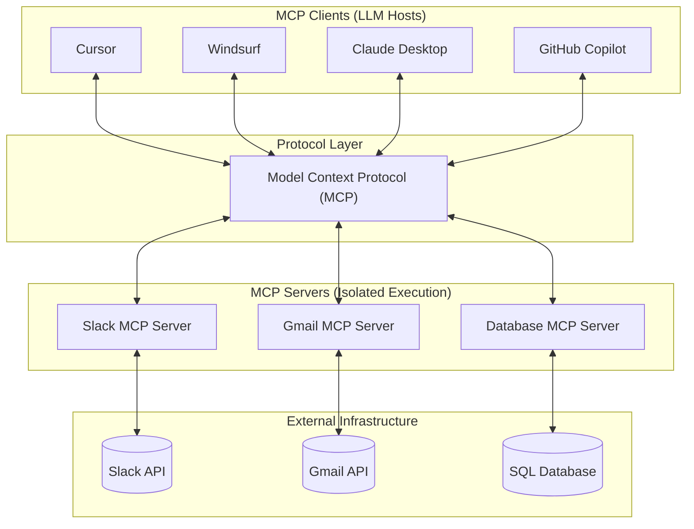

# Model Context Protocol (MCP) Architecture & Concepts

## Metadata

- **Topic:** Model Context Protocol (MCP) Architecture & Integration
    
      
    
- **Difficulty:** Intermediate
    
      
    
- **Tags:** #MCP #SystemDesign #AI-Agents #LLM-Tools #Architecture #Integration
    
      
    
- **Source:** Raw Video Transcript
    
      
    
- **Date:** 2026-08-08
    
      
    

## Executive Summary

- **Core Problem:** Connecting AI agents to external tools/APIs requires custom $N \times M$ integrations across every combination of agent framework and external service.
    
      
    
- **The MCP Solution:** Implements a standardized abstraction layer between client applications (LLM hosts) and server applications (tool/data providers).
    
      
    
- **Integration Scaling:** Reduces implementation complexity from $O(N \times M)$ custom client-server connections to $O(N + M)$ standard protocol implementations.
    
      
    
- **Server-Side Isolation:** Encapsulates API interactions, custom logic, and permission boundaries (e.g., scoping tool access to prevent destructive operations like email deletion).
    
      
    
- **Write-Once Paradigm:** A single MCP server implementation enables seamless interoperability across any compliant AI client (Cursor, Windsurf, Claude, Lovable, Bolt, GitHub Copilot).
    
      
    
- **Ecosystem Flywheel:** Standardized specs create network effects; rapid adoption drives a library of reusable community-developed MCP servers.
    
      
    

## Main Concepts & Theory

### The Integration Problem: $N \times M$ Bottleneck

Without a standardized protocol, connecting AI agents to external services (Slack, Gmail, Databases) requires custom wrapper code for each tool. If multiple AI environments need access to these tools, every single tool must be re-implemented for every single environment.

  

```
Without MCP (N × M Complexity):

  [ Cursor ]    ---> (Custom Slack Tool)    ---> [ Slack API ]
  [ Windsurf ]  ---> (Custom Gmail Tool)    ---> [ Gmail API ]
  [ Claude ]    ---> (Custom DB Tool)       ---> [ Database ]
```

> [!warning] Bottleneck
> 
> Writing custom tool implementations for every framework (LangChain, LlamaIndex, native client SDKs) leads to redundant development overhead, hard-to-maintain codebases, and inconsistent safety constraints across applications.
> 
>   

### The CS Principle: Abstraction Layer

MCP solves the integration sprawl by applying a fundamental computer science principle: **adding an abstraction layer**.

  

By standardizing how clients request context/tools and how servers expose context/tools, the system transitions from custom point-to-point integrations to a unified architecture.

  

```
With MCP (N + M Complexity):

  [ Cursor ]   ---\                     /---> [ Slack MCP Server ]   ---> [ Slack API ]
  [ Windsurf ] ----+---> [ MCP Spec ] --+---> [ Gmail MCP Server ]   ---> [ Gmail API ]
  [ Claude ]   ---/                     \---> [ Database MCP Server] ---> [ Database ]
```

### Protocol Comparison

|**Dimension**|**Custom Integration Approach**|**MCP Standardized Approach**|
|---|---|---|
|**Architecture**|Direct SDK wrapping inside agent code|Client-Server protocol boundary|
|**Scaling Complexity**|$O(N \times M)$ integrations|$O(N + M)$ integrations|
|**Reusability**|Tied to a specific agent host / framework|Host-agnostic; runnable across any MCP client|
|**Permission Scoping**|Handled per application implementation|Encapsulated within the isolated MCP server|
|**Maintenance Overhead**|High (updating APIs requires touching every client)|Low (updating the server fixes access for all clients)|

## Important Definitions

|**Term**|**Definition**|**Why It Matters**|
|---|---|---|
|**MCP (Model Context Protocol)**|An open, standardized protocol that dictates how AI clients communicate with context and tool providers.|Eliminates custom integrations by providing a universal interface for LLMs to access tools and data sources.|
|**MCP Client**|An AI application or host (e.g., Cursor, Claude Desktop, Windsurf) that initiates connections to MCP servers to fetch context or execute tools.|Allows users to switch or upgrade AI clients without rewriting underlying custom integrations.|
|**MCP Server**|A lightweight server executable or service exposing capabilities (tools, prompts, resources) via the MCP specification.|Encapsulated code handling local execution, authentication, and API calls to underlying services.|
|**Tool Scoping**|Restricting the specific API endpoints or permissions exposed by an MCP server to an AI client.|Enforces safety parameters (e.g., exposing read/send operations while strictly omitting delete endpoints).|

## Visual Diagrams

### System Architecture & Interoperability

Code snippet



## Common Pitfalls & Best Practices

> [!danger] Mistakes to Avoid
> 
>   
> 
> - **Hardcoding Tool Logic in Agent Hosts:** Building tool logic directly into an agent's application code creates tight coupling and breaks reusability across other clients.
>     
>       
>     
> - **Over-Exposing API Capabilities:** Exposing raw, unrestricted API access (such as `DELETE` endpoints for email or raw SQL execution) directly to LLM agents without a guardrail layer.
>     
>       
>     
> - **Ignoring the Protocol Boundary:** Treating MCP as a simple function-calling library rather than an isolated client-server interaction model.
>     
>       
>     

> [!tip] Best Practices
> 
>   
> 
> - **Scope Granular Tools:** Implement specific action tools inside your MCP server rather than broad, omnipotent endpoints.
>     
>       
>     
> - **Build Server-First:** Write integrations as standalone MCP servers from day one so they can be immediately consumed across tools like Cursor, Claude, and custom workflows.
>     
>       
>     
> - **Isolate Credentials:** Store API keys and authentication tokens inside the MCP server environment, avoiding exposure to the client application or LLM context window.
>     
>       
>     

## Active Recall & Interview Prep

### Key Q&A Flashcards

Q: What primary problem does the Model Context Protocol (MCP) address?

A: It resolves the $N \times M$ integration problem by providing a standardized interface between AI clients and tool/data providers.

  

Q: How does MCP reduce engineering overhead when adding new tools to AI agents?

A: Developers build an MCP server once; any AI host supporting the protocol can immediately consume its tools and context without custom code.

  

Q: How does MCP improve tool execution security?

A: Tool execution and logic are encapsulated on the MCP server side, enabling developers to enforce strict permission boundaries (e.g., exposing read/write while blocking destructive actions).

  

Q: Name three AI clients that support or integrate with MCP servers.

A: Cursor, Windsurf, and Claude Desktop (as well as Lovable, Bolt, and GitHub Copilot).

  

Q: What computer science design pattern is fundamental to MCP's architecture?

A: Indirection/Abstraction Layer ("All problems in computer science can be solved by another level of indirection").

  

### Practical Practice Scenario / Interview Question

**Scenario:** You are designing an AI agent system for an enterprise engineering team. The team uses Cursor, Claude Desktop, and an internal custom AI chat interface. They need these agents to safely interact with a production PostgreSQL database to fetch analytics, but under no circumstances should the models be able to drop tables or mutate production data.

  

**Solution/Approach:**

  

1. **Develop an MCP Server:** Create a standalone PostgreSQL MCP Server.
    
      
    
2. **Implement Safe Tools:** Expose predefined, read-only tools (e.g., `execute_read_query`, `get_table_schema`) within the server code. Exclude write/delete capabilities entirely.
    
      
    
3. **Connect Clients:** Configure Cursor, Claude Desktop, and the internal app as MCP Clients targeting the same single MCP Server.
    
      
    
4. **Result:** All clients gain identical access to safe analytics tools via a single, centralized codebase without duplicating security rules across three different platforms.
    
      
    

## One-Page Cheat Sheet

- **Core Problem:** Manual $O(N \times M)$ custom integration loop for every AI client + tool pair.
    
      
    
- **Core Solution:** Abstraction layer converting integrations to an $O(N + M)$ architecture.
    
      
    
- **MCP Client:** The LLM application consuming context and issuing tool execution requests (e.g., Cursor, Claude).
    
      
    
- **MCP Server:** The host/process exposing structured capabilities, tools, and resources to clients.
    
      
    
- **Write Once, Run Anywhere:** Develop an MCP server once; run it across all compatible AI environments.
    
      
    
- **Security & Scoping:** Isolate raw API credentials and prune dangerous capabilities (e.g., strip `DELETE` operations) inside the server logic.
    
      
    
- **Network Effect:** High adoption creates a standardized ecosystem flywheel of open-source MCP tools.
    
      
    
- **Interoperability:** Decouples AI applications from the specific tools they interact with.


# Model Context Protocol (MCP) Foundations & Tool Calling Mechanisms

## Metadata

- **Topic:** Evolution of LLM Function Calling to Model Context Protocol (MCP)
    
      
    
- **Difficulty:** Intermediate
    
      
    
- **Tags:** #MCP #LLM #ToolCalling #SystemPrompt #ReAct #FunctionCalling #AI-Architecture
    
      
    
- **Source:** Raw Video Transcript
    
      
    
- **Date:** 2026-08-08
    
      
    

## Executive Summary

- **LLM Core Nature:** Large Language Models are purely statistical token predictors; they cannot natively execute actions, call APIs, or access live data without external software wrapping.
    
      
    
- **Tool Calling Abstraction:** Tools (e.g., Web Search, Python execution) are implemented at the application layer by software engineers, not inside the LLM weights.
    
      
    
- **Prompt Engineering Foundation:** Function calling relies on structured system prompts (e.g., ReAct patterns) that steer models to emit parseable string payloads instead of standard conversation output.
    
      
    
- **Execution Loop:** The hosting application intercepts model-generated tool calls, executes the corresponding code, feeds the execution output back into the prompt context, and triggers a follow-up completion.
    
      
    
- **Nondeterministic Nature:** Tool generation relies on token probability, making function invocation probabilistic rather than deterministic.
    
      
    
- **MCP Integration:** MCP decouples function-calling logic from vendor-specific host code, allowing tool definitions to run seamlessly across platforms like Claude Desktop, Cursor, and ChatGPT.
    
      
    

## Main Concepts & Theory

### What LLMs Actually Do vs. App-Layer Capabilities

LLMs generate text/tokens probabilistically based on training data. Advanced behaviors—such as making HTTP requests, running database queries, or compiling code—depend entirely on application wrappers written by software engineers.

  

```
       +-------------------------------------------------------+
       |                  Application Layer                    |
       |  (e.g., ChatGPT Desktop / Web App, Cursor, Claude)    |
       |                                                       |
       |   +-------------------+       +-------------------+   |
       |   |   System Prompt   |       |  External Tools   |   |
       |   |    Management     |       | (Python, Search)  |   |
       |   +---------+---------+       +---------+---------+   |
       +-------------|---------------------------|-------------+
                     |                           |
                     v                           v
          +--------------------+       +-------------------+
          |  LLM Engine (Base) |       | External APIs /   |
          | Token Predictor    |       | Code Execution    |
          +--------------------+       +-------------------+
```

### The Tool Calling Loop (ReAct / Function Calling)

When a user submits a query requiring external data (e.g., "What is the stock price of NVIDIA?"):

  

1. **System Prompt Injection:** The application appends tool definitions and execution rules to the LLM context window.
    
      
    
2. **Token Generation (Tool Call):** The model predicts a string payload formatted as a function signature (e.g., `get_stock_price(symbol="NVDA")`) instead of guessing the answer.
    
      
    
3. **Application Interception & Parsing:** The host application parses the predicted string to extract the target function and arguments.
    
      
    
4. **Execution:** The application invokes the corresponding external code (API, database client, search engine).
    
      
    
5. **Context Injection & Resubmission:** The application appends the execution output to the prompt context and sends a second request to the LLM.
    
      
    
6. **Final Output:** The model uses the returned context to form a natural-language answer.
    
      
    

```
  User Query: "What is the stock price of NVIDIA?"
       |
       v
+--------------+      Outputs Token String      +---------------------+
|  LLM Engine  |  --------------------------->  | Application Parser  |
+--------------+   `get_stock_price("NVDA")`    +----------+----------+
       ^                                                   |
       |                                                   v
       |                                        +---------------------+
       |                                        | External Tool / API |
       |                                        +----------+----------+
       |                                                   |
       +---------------------------------------------------+
             App injects API output into LLM context
```

### Comparison of Execution Strategies

|**Dimension**|**Native Token Generation**|**Traditional App Function Calling**|**MCP-Based Tool Access**|
|---|---|---|---|
|**Data Source**|Static weights (training cut-off)|Live external APIs / Custom scripts|Standardized MCP Servers|
|**Execution Host**|None (pure probability text generation)|Tightly coupled inside the host app|Isolated MCP Server (runs locally/remotely)|
|**Portability**|N/A|Hardcoded to one client/framework|Broadly compatible across supported AI clients|
|**Reliability**|Prone to hallucinations for live data|High (if the model generates valid call syntax)|High (standardized schemas & tools)|

## Important Definitions

|**Term**|**Definition**|**Why It Matters**|
|---|---|---|
|**Token Predictor**|The foundational mechanism of LLMs that selects the next most probable text token given a prompt sequence.|Highlights that LLMs do not "know" facts or directly interact with hardware; they strictly output text strings.|
|**Tool Calling**|An application-level workflow where an LLM is prompted to output structured function signatures instead of unstructured text.|Enables language models to trigger real-world side effects and fetch live external context.|
|**ReAct Prompting**|A prompt design pattern combining **Reasoning** ("Thought") and **Acting** ("Action / Action Input") steps.|Serves as a foundational mechanism for structured, multi-step agent reasoning and tool invocation.|
|**Application Layer**|The host software envelope (e.g., ChatGPT web interface, Cursor IDE) that manages prompts, model calls, and local code execution.|Handles the actual execution of tools that the LLM requests via generated token sequences.|

## Visual Diagrams

### Tool Calling Sequence Flow

Code snippet

```
sequenceDiagram
    autonumber
    actor User
    participant App as Application Layer (Host)
    participant LLM as LLM (Token Generator)
    participant Tool as External Tool / API

    User->>App: "What is the weather right now in Tokyo?"
    App->>LLM: Pass System Prompt (Tool Definitions) + User Query
    Note over LLM: Model predicts tokens for function call<br/>instead of guessing answer
    LLM-->>App: Return function call string: `get_weather(city="Tokyo")`
    App->>App: Parse string & extract function name + arguments
    App->>Tool: Execute `get_weather("Tokyo")`
    Tool-->>App: Return data: `{"temp": "25C", "condition": "Clear"}`
    App->>LLM: Resubmit conversation + Tool execution result
    LLM-->>App: Generate natural language summary using tool result
    App-->>User: "The current weather in Tokyo is 25°C and clear."
```

## Common Pitfalls & Best Practices

> [!danger] Mistakes to Avoid
> 
>   
> 
> - **Assuming LLMs Execute Code Directly:** Believing the LLM runs Python or accesses APIs directly inside its neural network weights.
>     
>       
>     
> - **Ignoring Parsing Vulnerabilities:** Failing to handle malformed, truncated, or invalid JSON/strings emitted during function-calling attempts.
>     
>       
>     
> - **Relying on Determinism:** Treating function calling as a guaranteed execution path; token prediction remains inherently statistical and can fail.
>     
>       
>     

> [!tip] Best Practices
> 
>   
> 
> - **Enforce Rigid Output Schemas:** Use strictly defined system prompts (or structured outputs like JSON mode) to increase functional call parsing accuracy.
>     
>       
>     
> - **Implement Robust Application Parsers:** Wrap tool execution in defensive `try/except` blocks to handle malformed arguments emitted by the LLM.
>     
>       
>     
> - **Expose Tools via Standard Interfaces (MCP):** Decouple tool logic into MCP servers so the same function declarations work across multiple host applications (Cursor, Claude Desktop, ChatGPT).
>     
>       
>     

## Active Recall & Interview Prep

### Key Q&A Flashcards

Q: Are LLMs natively capable of executing Python scripts or searching the web?

A: No. LLMs are purely statistical token generators; all web searching and code execution occur in the application layer hosting the LLM.

  

Q: How does an LLM signal to an application that it wants to execute a tool?

A: It predicts a specific string token sequence (e.g., a structured JSON or function signature like `get_weather(city="Tokyo")`) as dictated by its system prompt.

  

Q: What happens after the host application detects a tool call string in the LLM output?

A: The app parses the function name and arguments, executes the external tool, appends the result to the conversation context, and invokes the LLM again.

  

Q: What prompt framework pioneered the structured "Thought / Action / Observation" loop for function calling?

A: The ReAct (Reason + Act) prompting framework.

  

Q: Why is tool calling in LLMs considered probabilistic?

A: Because function signature generation relies on next-token probability prediction, which can occasionally produce hallucinated or malformed calls.

  

### Practical Practice Scenario / Interview Question

**Scenario:** You are building a production AI assistant designed to execute SQL queries on a company database. Sometimes the model outputs invalid SQL or calls non-existent tools. How should your application layer handle this to prevent system crashes?

  

**Solution/Approach:**

  

1. **System Prompt Guardrails:** Provide strict schema definitions in the system prompt (or use native JSON/Structured Output constraints).
    
      
    
2. **App-Layer Parsing & Validation:** Intercept the LLM output before execution. Use a parser to confirm the function name and validate arguments against a rigid type schema.
    
      
    
3. **Error Feedback Loop:** If validation or SQL execution fails, catch the error inside the application layer and send the error message back to the LLM as a tool result so it can self-correct and regenerate a valid call.
    
      
    

## One-Page Cheat Sheet

- **Core Premise:** LLMs are strictly text/token generators—not action engines.
    
      
    
- **App Layer Responsibility:** Engineers write application wrappers to parse outputs and trigger external side effects.
    
      
    
- **Tool Invocation Syntax:** Driven by system prompts that force models to emit structured text signatures (e.g., `get_weather(city="Tokyo")`).
    
      
    
- **The ReAct Pattern:** Alternates between **Reasoning** (LLM text prediction) and **Acting** (App tool execution).
    
      
    
- **Two-Step Generation Loop:**
    
      
    1. User prompt $\rightarrow$ LLM outputs tool call.
        
          
        
    2. App executes tool $\rightarrow$ App feeds output back to LLM $\rightarrow$ LLM outputs final response.
        
          
        
- **Statistical Constraint:** Function calling is probabilistic; token prediction can occasionally miss arguments or format improperly.
    
      
    
- **The Role of MCP:** Standardizes tool declaration and execution across applications, making tools reusable across ChatGPT, Cursor, Claude Desktop, and custom agents.

# Model Context Protocol (MCP) Primitive Interfaces, Server Deployment & Ecosystem Architecture

## Metadata

- **Topic:** MCP Core Primitives, Deployment Topologies & Ecosystem Roadmap
    
      
    
- **Difficulty:** Intermediate / Advanced
    
      
    
- **Tags:** #MCP #ModelContextProtocol #Tools #Resources #Prompts #Sampling #Security #SystemDesign
    
      
    
- **Source:** Eden's MCP & AI Agents Course
    
      
    
- **Date:** 2026-08-08
    
      
    

## Executive Summary

- **Primary Interfaces:** MCP servers expose functionality via three core primitives: **Tools** (model-controlled executable functions), **Resources** (application-controlled static/dynamic context), and **Prompts** (user-controlled interaction templates).
    
      
    
- **Advanced Functionality (Sampling):** Servers can reverse-request LLM completions back through the host client, unlocking nested agentic loops.
    
      
    
- **Composability:** Applications can act simultaneously as both MCP Clients and MCP Servers, enabling multi-layered, specialized agent networks.
    
      
    
- **Build vs. Adopt Paradigm:** Developers should leverage vendor-maintained (e.g., Stripe, Cloudflare) and community servers rather than re-implementing third-party integrations.
    
      
    
- **Transport Modes:** Supports local execution (`stdio`), remote execution (`SSE`, SSH), and containerized isolation (Docker).
    
      
    
- **Security & Future Standards:** Ecosystem evolution includes official server verification (mitigating supply-chain attacks), OAuth 2.0 authentication, `.well-known` agent endpoints, and centralized server registries.
    
      
    

## Main Concepts & Theory

### The Three MCP Server Interfaces

MCP servers federate external tool and context access by exposing three standardized interfaces:

  

```
                          +-----------------------------------+
                          |            MCP SERVER             |
                          +-----------------------------------+
                                    /       |       \
                                   /        |        \
                                  v         v         v
                          +-----------+ +-----------+ +-----------+
                          |   TOOLS   | | RESOURCES | |  PROMPTS  |
                          +-----------+ +-----------+ +-----------+
                          | Model-    | | Application-| User-     |
                          | Controlled| | Controlled| | Controlled|
                          | Executables| | Data/Context| | Templates |
                          +-----------+ +-----------+ +-----------+
```

1. **Tools (Model-Controlled Functions):** Executable functions that the LLM autonomously decides to call based on conversation context (e.g., `get_weather`, `execute_query`). Can perform side effects, API reads, or DB writes.
    
      
    
2. **Resources (Application-Controlled Data):** Contextual data attached by the host application to illuminate the prompt context. Can be **static** (PDFs, log files) or **dynamic** (live database schemas, runtime telemetry).
    
      
    
3. **Prompts (User-Controlled Templates):** Parameterized, predefined prompt templates triggered by the user to standardize complex LLM workflows.
    
      
    

### Sampling: Reverse Protocol Calls

**Sampling** allows an MCP Server to request an LLM completion _from_ the host client. Instead of relying solely on the client to invoke the server, the server can pass a prompt back to the host and ask the host's LLM to generate tokens.

  

```
Host Client (e.g., Cursor)                  MCP Server
   |                                            |
   | --- 1. Call Tool (`process_data`) -------->|
   |                                            | (Needs LLM reasoning)
   | <--- 2. Request Sampling (Prompt Payload) -|
   |                                            |
   | (Runs completion through Host LLM)         |
   | --- 3. Return Completion Result ---------->|
   |                                            |
   | <--- 4. Return Final Tool Execution -------|
```

> [!warning] Security Implications
> 
> Sampling gives servers indirect access to the host client's LLM budget and reasoning engine. This necessitates strict security guardrails, rate-limiting, and explicit user consent prompts before handling sampling requests.
> 
>   

### Server Interface Matrix

|**Interface**|**Control Plane**|**Primary Purpose**|**Example Use Case**|
|---|---|---|---|
|**Tools**|**Model**|Perform actions, query live APIs, execute code|`send_slack_message`, `query_db`|
|**Resources**|**Application**|Provide raw context, files, or state data|Reading `schema.json`, fetching log files|
|**Prompts**|**User**|Standardize multi-step prompt templates|`/refactor_code`, `/analyze_logs`|
|**Sampling**|**Server**|Server requests host LLM completion|In-server validation or sub-reasoning|

## Important Definitions

|**Term**|**Definition**|**Why It Matters**|
|---|---|---|
|**Tools**|Executable functions exposed by an MCP server for autonomous invocation by the LLM.|Allows LLMs to perform real-world actions and read/write data in external systems.|
|**Resources**|Read-only file- or data-like entities exposed by an MCP server to supply background context.|Enables structured file or data injection without formatting context as tool calls.|
|**Prompts**|Pre-engineered prompt templates exposed by the server for user invocation inside client interfaces.|Streamlines repeated user workflows and enforces organizational prompting standards.|
|**Sampling**|An MCP protocol feature allowing an MCP server to request LLM generations back from the host application.|Enables nested reasoning, agentic sub-loops, and server-side model calls.|
|**Composability**|The design pattern where an application acts as both an MCP Client and an MCP Server.|Enables multi-agent hierarchies where top-level agents delegate to specialized downstream agents.|
|**Supply Chain Attack**|A security threat where malicious actors upload fake/unverified MCP servers to steal credentials or compromise hosts.|Highlights the necessity for official server signatures, code audits, and central verification registries.|

## Visual Diagrams

### Ecosystem Architecture & Future Security Infrastructure

Code snippet

```
flowchart TD
    subgraph Clients ["MCP Clients / Host Applications"]
        C1["Cursor IDE"]
        C2["Claude Desktop"]
        C3["Custom Agent / Graph"]
    end

    subgraph Security_Registry ["Ecosystem & Security Protocols"]
        REG["Central MCP Registry API"]
        AUTH["OAuth 2.0 / Auth Layer"]
        WELL["Website .well-known/mcp.json"]
    end

    subgraph Servers ["MCP Servers"]
        OFF["Official Verified Server (e.g., Stripe)"]
        COM["Community Open-Source Server"]
        DOCK["Containerized Server (Docker)"]
    end

    C1 <--> AUTH
    C2 <--> REG
    C3 <--> WELL

    AUTH <--> OFF
    REG <--> COM
    WELL <--> DOCK
```

## System Architecture & Trade-offs

### Deployment Topologies

```
1. Local Process (Stdio):
   [ MCP Client ] === stdio pipe (stdin/stdout) ===> [ Local MCP Server ]

2. Remote Network Service (SSE):
   [ MCP Client ] === HTTP / Server-Sent Events ===> [ Remote MCP Server ]

3. Containerized Isolation (Docker):
   [ MCP Client ] === Container IPC / Network =====> [ Dockerized MCP Server ]
```

### Deployment Strategy Trade-offs

|**Deployment Mode**|**Transport**|**Security Profile**|**Scalability**|**Primary Use Case**|
|---|---|---|---|---|
|**Local Subprocess**|`stdio`|High (runs in user space)|Low (tied to host machine)|Local developer tools, file-system access|
|**Remote HTTP**|`SSE` / WebSockets|Requires OAuth 2.0 / Auth tokens|High (deployable to cloud/K8s)|Enterprise APIs, centralized data stores|
|**Containerized**|Docker / IPC|Very High (isolated file system)|Medium (depends on runtime environment)|Executing untrusted code or isolated scripts|

## Common Pitfalls & Best Practices

> [!danger] Mistakes to Avoid
> 
>   
> 
> - **Reinventing the Wheel:** Building custom MCP servers for third-party APIs (e.g., Stripe, Cloudflare) when verified vendor implementations already exist.
>     
>       
>     
> - **Ignoring Supply-Chain Risks:** Installing unverified third-party MCP servers from open repositories without auditing source code for credential exfiltration.
>     
>       
>     
> - **Confusing Resources with Tools:** Using a heavy `Tool` invocation to simply read static context, rather than exposing it cleanly as a `Resource`.
>     
>       
>     

> [!tip] Best Practices
> 
>   
> 
> - **Adopt Official Integrations:** Prioritize vendor-maintained MCP packages over unofficial community forks to guarantee long-term maintenance and security.
>     
>       
>     
> - **Enforce OAuth 2.0 Standards:** For remote MCP servers, secure endpoints using industry-standard tokens and session identifiers.
>     
>       
>     
> - **Isolate Runtime Environments:** Run community or experimental MCP servers inside Docker containers or sandboxed processes.
>     
>       
>     

## Active Recall & Interview Prep

### Key Q&A Flashcards

Q: What are the three primary interfaces exposed by an MCP server?

A: Tools (model-controlled functions), Resources (application-controlled context data), and Prompts (user-controlled prompt templates).

  

Q: How do Resources differ from Tools in MCP?

A: Tools are executable functions invoked by the LLM to perform actions, while Resources are data/file primitives attached to supply static or dynamic context.

  

Q: What is "Sampling" in the context of MCP?

A: Sampling is an advanced protocol feature where an MCP server requests an LLM completion back from the host client.

  

Q: What is the primary security risk associated with unverified community MCP servers?

A: Supply-chain attacks where malicious code exfiltrates environment secrets, credentials, or executes unauthorized local commands.

  

Q: How can an application achieve multi-agent composability using MCP?

A: By acting simultaneously as an MCP Client (consuming downstream servers) and an MCP Server (exposing consolidated capabilities upstream).

  

### Practical Practice Scenario / Interview Question

**Scenario:** An enterprise security team wants to give its developer agents access to sensitive production logs and infrastructure management scripts. They are concerned about data exfiltration and unauthorized script execution. How should you architect the MCP deployment to satisfy these security constraints?

  

**Solution/Approach:**

  

1. **Container Isolation:** Package the infrastructure MCP Server inside an isolated Docker container or sandboxed environment.
    
      
    
2. **Interface Separation:** Expose production logs as read-only **Resources** (preventing state alteration) and expose management scripts as strictly scoped **Tools**.
    
      
    
3. **Authentication Layer:** Put the server behind a remote HTTP endpoint utilizing **OAuth 2.0** and short-lived session tokens for access validation.
    
      
    
4. **Official/Audited Codebase:** Audit server code to ensure no unvalidated **Sampling** requests or unauthorized external network calls are present.
    
      
    

## One-Page Cheat Sheet

- **3 Primary Primitives:**
    
      
    - **Tools:** Model-driven actions/functions (`get_forecast`, `write_db`).
        
          
        
    - **Resources:** Application-driven data/files (static logs, dynamic JSON schemas).
        
          
        
    - **Prompts:** User-driven templates (`/refactor`, `/generate_tests`).
        
          
        
- **Sampling Primitive:** Allows servers to request LLM generations back from the client.
    
      
    
- **Composability:** Dual Client/Server role enables hierarchical, specialized multi-agent architectures.
    
      
    
- **Deployment Modes:** Local (`stdio`), Remote (`SSE`), or Isolated (`Docker`).
    
      
    
- **Rule of Thumb:** Never build custom integrations for major SaaS platforms (Stripe, Cloudflare)—use official vendor-maintained MCP servers.
    
      
    
- **Ecosystem Roadmap:** Central Registries, Official Server Verification signatures, OAuth 2.0 authentication, and `.well-known/mcp.json` web endpoints.


