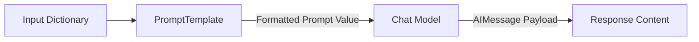
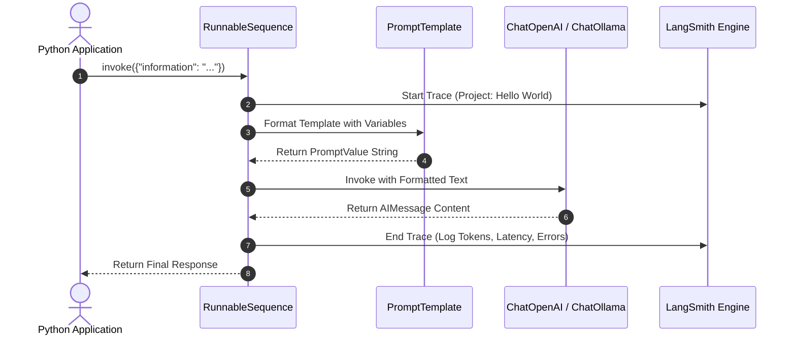

# LangChain 1.0+ & LangSmith: Hello World & Model Swapping

---

## Metadata

* **Topic:** LangChain Project Setup, Prompt Templates, LCEL, Model Interchangeability (OpenAI vs. Ollama/Gemma 3), and LangSmith Tracing
* **Difficulty:** Beginner–Intermediate
* **Tags:** #LangChain #LangSmith #Ollama #Gemma3 #GPT5 #LCEL #PromptEngineering #Python #AI Engineering
* **Source:** Eden Marco — LangChain Course (Hello World & Environment Setup Sections)
* **Date:** 2026-08-05

---

# Executive Summary

* **LangChain Core Purpose:** Acts as an open-source abstraction framework that simplifies building LLM applications (Agents, RAG) by unifying interfaces across vendors.


* **Decoupled Architecture:** Modern LangChain separates model providers into dedicated integration packages (e.g., `langchain-openai`, `langchain-ollama`) so developers only install necessary dependencies.


* **Environment Bootstrapping:** Standard project setup utilizes fast Rust-based package management (`uv`) alongside `.env` variables to prevent security leaks.


* **Prompt Templates:** Enforce runtime validation and structured formatting, providing safety against injection attacks and enabling full observability within chains.


* **LangChain Expression Language (LCEL):** Connects components sequentially using the pipe operator (`|`), routing prompt outputs directly into chat model inputs as a unified `Runnable`.


* **Seamless Model Swapping:** LangChain enables switching between commercial models (e.g., GPT-5) and local open-weights models (e.g., Gemma 3 via Ollama) by changing a single line of code.


* **Local LLMs Trade-off:** Local models via Ollama offer rapid execution, zero cost, and privacy, but lighter parameters (e.g., 270M) exhibit lower instruction-following capability compared to Tier-1 cloud models.


* **LangSmith Tracing:** Delivers out-of-the-box observability for execution workflows, showing sequence steps, token counts, latency, and message schemas without altering core business logic.


---

# Main Notes

## Environment Bootstrap & Package Decoupling

Setting up a LangChain application requires isolating credentials and installing provider-specific libraries.

> [!warning]
> **API Key Security:** Never commit `.env` files or API keys to public source control like GitHub. Malicious actors scan repositories to exploit leaked credentials. Always add `.env` and `.venv/` to `.gitignore`.
> 
> 

### Package Installation Flow (`uv`)

```bash
# Bootstrap clean project
uv init
# Add core and provider packages
uv add langchain langchain-openai python-dotenv black isort
# Add local provider support
uv add langchain-ollama

```

(Source:)

LangChain decoupled provider packages to prevent bloat. Independent maintenance allows vendors to update models without requiring monolithic framework releases.

---

## Prompt Templates vs. Native String Formatting

While standard Python f-strings embed variables immediately, LangChain's `PromptTemplate` provides programmatic advantages:

* **Runtime Enforcement:** Validates required keys before making network requests, avoiding broken prompts.


* **Observability:** Tracks prompt rendering steps within LangSmith execution graphs.


* **Security:** Provides structured boundary isolation that helps mitigate prompt injection vulnerabilities.


```python
from langchain_core.prompts import PromptTemplate

summary_template = """
Given the information {information} about a person, 
I want you to create a short summary and two interesting facts about them.
"""

prompt_template = PromptTemplate(
    template=summary_template,
    input_variables=["information"]
)

```

(Source:)

---

## LCEL Execution Pipeline

The LangChain Expression Language (LCEL) composes objects using the pipe (`|`) operator, creating a combined `RunnableSequence`.



When calling `chain.invoke({"information": data})`:

1. The input dictionary passes into `PromptTemplate.invoke()`.


2. The `PromptTemplate` returns a formatted `PromptValue`.


3. The pipe operator routes the `PromptValue` into `ChatModel.invoke()`.


4. The model sends the API payload and returns an `AIMessage`.


---

## Model Swapping: OpenAI vs. Local Ollama

Because all chat model objects inherit from a unified base interface, swapping the underlying LLM requires updating only the client initialization.

```python
# Cloud Model (OpenAI GPT-5)
from langchain_openai import ChatOpenAI
llm = ChatOpenAI(temperature=0, model="gpt-5")

# Local Open-Weights Model (Gemma 3 via Ollama)
from langchain_ollama import ChatOllama
llm = ChatOllama(temperature=0, model="gemma3:270m")

```

(Source:)

### Trade-offs: Cloud vs. Local Open-Weights

> [!note]
> **Performance vs. Quality:** Small local models (e.g., 270M parameters) run extremely fast on personal hardware. However, larger frontier models (e.g., GPT-5) offer significantly higher reasoning accuracy and strict instruction adherence.
> 
> 

---

## Observability & Tracing via LangSmith

Integrating telemetry requires configuring specific environment variables:

```env
LANGCHAIN_TRACING_V2=true
LANGCHAIN_API_KEY=lsv2_pt_...
LANGCHAIN_PROJECT=Hello World
# Required if operating outside the US:
# LANGCHAIN_ENDPOINT="https://eu.api.smith.langchain.com"

```

(Source:)

LangSmith automatically captures:

* **Latency metrics:** Total execution time and Time-To-First-Token (TTFT).


* **Token Usage:** Input and output token counts per invocation.


* **Execution Graph:** Granular step breakdowns (Prompt formatting -> LLM invocation).


---

# Important Definitions

| Term | Definition | Why It Matters |
| --- | --- | --- |
| **LangChain** | An open-source framework offering unified abstractions to build LLM-powered applications.

 | Eliminates vendor lock-in and simplifies complex pipelines.

 |
| **LCEL** | LangChain Expression Language; a declarative syntax for chaining runnables using the pipe operator.

 | Simplifies composition, async support, and automatic telemetry integration.

 |
| **ChatOllama** | LangChain's integration wrapper for running open-weights models locally via the Ollama CLI.

 | Enables free, offline, privacy-compliant local LLM execution.

 |
| **AIMessage** | A structured message wrapper containing model-generated outputs and metadata.

 | Standardizes output formats across different model providers.

 |
| **LangSmith** | A platform dedicated to debugging, testing, and tracing LLM application chains.

 | Provides visibility into internal token usage, latency, and step failures.

 |

---

# Mental Models

* **Model Swapping** → **Universal Outlet Adapters**: LangChain provides a uniform plug interface; changing from OpenAI to Ollama is as simple as swapping the appliance plugged into the wall without rewiring the house.


* **LCEL Pipeline** → **Assembly Line**: Raw materials (variables) drop into station 1 (Prompt Template), pass down the conveyor belt (`|`) into station 2 (LLM), and output a finished product (`AIMessage`).


---

# Visual Diagrams



(Source:)

---

# Code Examples

### Complete "Hello World" Pipeline with Dynamic Model Selection

```python
import os
from dotenv import load_dotenv
from langchain_core.prompts import PromptTemplate
from langchain_openai import ChatOpenAI
from langchain_ollama import ChatOllama

# 1. Load Environment Variables (.env)
load_dotenv()

# 2. Define Context and Prompt Structure
information = """
Elon Reeve Musk is a businessman and investor. He is the founder, CEO, and chief engineer of SpaceX; 
angel investor, CEO, and product architect of Tesla, Inc.; owner and CTO of X Corp.; founder of the Boring Company 
and xAI; co-founder of Neuralink and OpenAI; and president of the Musk Foundation.
"""

summary_template = """
Given the information {information} about a person, 
I want you to create a short summary and two interesting facts about them.
"""

prompt_template = PromptTemplate(
    template=summary_template, 
    input_variables=["information"]
)

# 3. Model Choice Flag (Toggle between Cloud and Local)
USE_LOCAL_MODEL = False

if USE_LOCAL_MODEL:
    # Uses local Ollama instance running Gemma 3
    llm = ChatOllama(temperature=0, model="gemma3:270m")
else:
    # Uses OpenAI API
    llm = ChatOpenAI(temperature=0, model="gpt-5")

# 4. Construct Chain using LCEL Syntax
chain = prompt_template | llm

# 5. Execute Chain
if __name__ == "__main__":
    response = chain.invoke({"information": information})
    
    # response is an AIMessage object
    print("--- RAW RESPONSE METADATA ---")
    print(f"Model Provider Info: {response.response_metadata}")
    print("\n--- CONTENT ---")
    print(response.content)

```

(Source:)

---

# Step-by-Step Flow

## Setting Up and Running Traced Executions

1. **Bootstrap Project**: Initialize `uv`, install dependencies, and create a `.env` file containing API credentials (`OPENAI_API_KEY`, `LANGCHAIN_API_KEY`).


2. **Enable LangSmith**: Add `LANGCHAIN_TRACING_V2=true` and `LANGCHAIN_PROJECT=Hello World` to `.env`.


3. **Configure Model**: Instantiate `ChatOpenAI` or install Ollama locally, pull `gemma3:270m`, and instantiate `ChatOllama`.


4. **Construct Pipeline**: Define a `PromptTemplate` and pipe (`|`) it into the LLM object.


5. **Invoke Chain**: Call `chain.invoke({"information": ...})`.


6. **Inspect Telemetry**: Open the LangSmith dashboard, navigate to the `Hello World` project, and review total tokens, TTFT, latency, and intermediate payloads.


---

# Examples

### Response Metadata Comparison

#### OpenAI Execution Metadata:

```python
{
    'token_usage': {'completion_tokens': 64, 'prompt_tokens': 82, 'total_tokens': 146}, 
    'model_name': 'gpt-5', 
    'finish_reason': 'stop'
}

```

(Source:)

#### ChatOllama Local Execution Metadata:

```python
{
    'model': 'gemma3:270m',
    'created_at': '2026-08-05T19:05:38Z',
    'done': True,
    'total_duration': 420000000
}

```

(Source:)

---

# Real World Applications

* **Local Offline Prototyping:** Developers can build full applications using Ollama offline to save costs before deploying to cloud infrastructure.


* **Enterprise Telemetry:** Operations teams monitor live user production chains through LangSmith to detect latency spikes, rate limits, and model hallucination trends.


* **Multi-Provider Fallbacks:** Applications can automatically route non-sensitive data to public LLMs and sensitive corporate data to self-hosted Ollama instances.


---

# Interview Questions

### Beginner

**Q: What happens if an environment variable key name like `OPENAI_API_KEY` is misspelled in your `.env` file?**

> **A:** LangChain automatically looks for exact environment variable string keys during client instantiation. If misspelled, the SDK fails to locate credentials and raises an authentication or missing API key exception.
> 
> 

### Intermediate

**Q: Why does setting `LANGCHAIN_TRACING_V2=true` automatically trace code without modifying the primary Python invocation logic?**

> **A:** LangChain's core `Runnable` base classes contain global event callbacks. When tracing environment flags are set to true, background listener hooks register execution lifecycle events (start, end, error) and send telemetry payloads to the configured endpoint asynchronously.
> 
> 

### Advanced

**Q: Why might a small open-weights model fail when executing complex LangChain LCEL structures compared to a Tier-1 commercial model?**

> **A:** Smaller models (e.g., 270M parameters) have reduced context capacity and weaker instruction-following abilities. While they run quickly, they may ignore structured prompt templates or produce output formats that fail to parse into downstream components.
> 
> 

---

# Common Mistakes

* **Hardcoding Secrets**:
* *Mistake*: Placing API keys directly inside Python source code.


* *Fix*: Always load variables using `python-dotenv` from an uncommitted `.env` file.


* **Omitting the European LangSmith Endpoint**:
* *Mistake*: Users residing outside the US omitting `LANGCHAIN_ENDPOINT` when using non-US LangSmith tenants.


* *Fix*: Define `LANGCHAIN_ENDPOINT="[https://eu.api.smith.langchain.com](https://eu.api.smith.langchain.com)"` in `.env` to prevent authentication failures.


---

# Memory Tricks

### **L.I.N.K.** for Setup Verification

* **L** – **Load**: Call `load_dotenv()` at entry point.


* **I** – **Instantiate**: Create provider-specific models (`ChatOpenAI`, `ChatOllama`).


* **N** – **Name**: Verify `.env` variable names match exact framework expectations.


* **K** – **Key**: Confirm API keys are valid and funded.


---

# Comparison Tables

| Feature | OpenAI (`ChatOpenAI`) | Local Ollama (`ChatOllama`) |
| --- | --- | --- |
| **Execution Location** | Cloud API (OpenAI Servers)

 | Local Machine Infrastructure

 |
| **Cost** | Pay-per-token API consumption

 | Free (utilizes local GPU/CPU)

 |
| **Setup Complexity** | API Key generation

 | Requires CLI binary & local model downloads

 |
| **Instruction Adherence** | High (Tier-1 reasoning capabilities)

 | Variable (dependent on parameter size)

 |
| **Privacy** | Data processed externally

 | Complete local data privacy

 |

---

# Revision Sheet (One Page)

* **Framework Function:** LangChain abstracts LLM operations using modular components (`PromptTemplate`, `ChatModel`, `Runnable`).


* **Provider Instantiation:**
* OpenAI: `ChatOpenAI(model="gpt-5", temperature=0)`.


* Ollama: `ChatOllama(model="gemma3:270m", temperature=0)`.


* **LCEL Syntax:** `chain = prompt | llm`.


* **Execution Call:** `chain.invoke({"input_key": "value"})`.


* **Output Structure:** Returns an `AIMessage` containing a `.content` string payload and execution `.response_metadata`.


* **Tracing Triggers:** `LANGCHAIN_TRACING_V2=true`, `LANGCHAIN_API_KEY`, `LANGCHAIN_PROJECT`.


---

# Flashcards

Q: What component does LangChain use to construct prompts dynamically at runtime?
A: `PromptTemplate`.

Q: Which Python package manager is highlighted for fast, Rust-based environment setup?
A: `uv`.

Q: What method is called on a runnable chain to process an input payload?
A: `.invoke()`.

Q: What parameter controls the deterministic versus creative nature of model responses?
A: `temperature` (values close to 0 produce deterministic results; higher values produce creative output).

Q: What data type does `ChatModel.invoke()` return?
A: An `AIMessage` object.

---

# Practice Questions

### Easy

1. Write the Python import statements required to use `PromptTemplate` and `ChatOpenAI`.
> **Answer:**
> `from langchain_core.prompts import PromptTemplate`
> 
> 
> `from langchain_openai import ChatOpenAI`
> 


### Medium

2. Modify an LCEL chain `chain = prompt | llm` so that the execution output prints only the text response rather than the full message wrapper.
> **Answer:**
> `response = chain.invoke(...)`
> 
> 
> `print(response.content)`
> 


### Hard

3. Explain why omitting quotation marks around `true` in `LANGCHAIN_TRACING_V2=true` within a `.env` file works in Python environment parsers.
> **Answer:** `.env` files parse values as raw string text; `python-dotenv` reads the raw literal `true`, which LangChain evaluates as a truthy string flag internally.
> 
> 


---

# Key Takeaways

1. LangChain decouples LLM provider integrations into distinct sub-packages.


2. `PromptTemplate` provides type validation and structured input protection.


3. LCEL connects components into unified execution runnables via the pipe (`|`) operator.


4. Changing models requires modifying only the `ChatModel` client initialization line.


5. Local models via Ollama eliminate API costs and improve privacy.


6. Smaller local parameters may exhibit lower compliance with complex instruction templates.


7. LangSmith telemetry requires zero changes to core application logic.


8. `.env` files must be managed securely to prevent API credential leaks.


9. Non-US LangSmith users must specify region-specific API endpoints.


10. Model outputs return structured `AIMessage` wrappers holding data and response metadata.