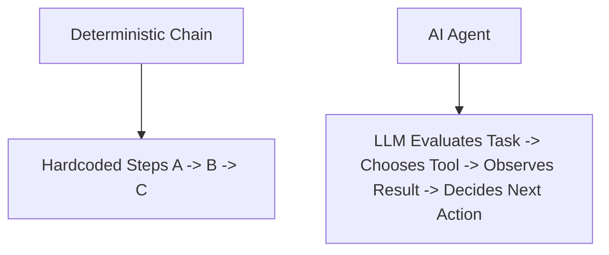
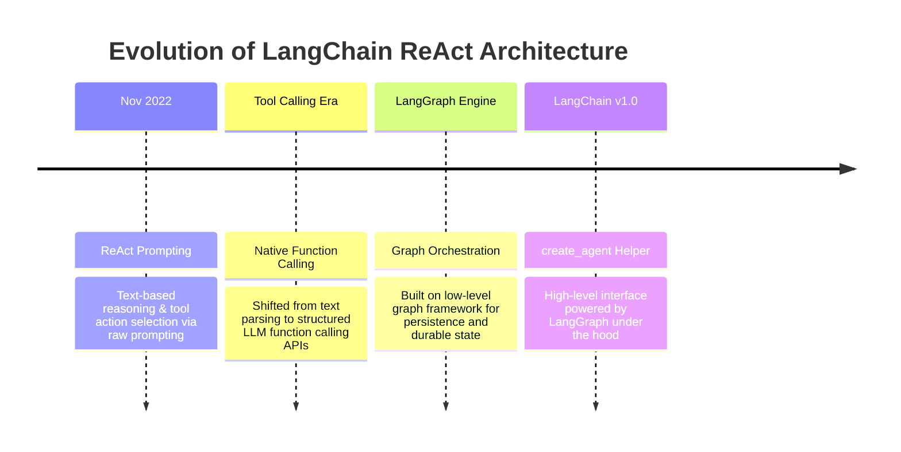
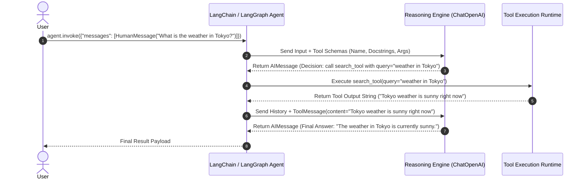
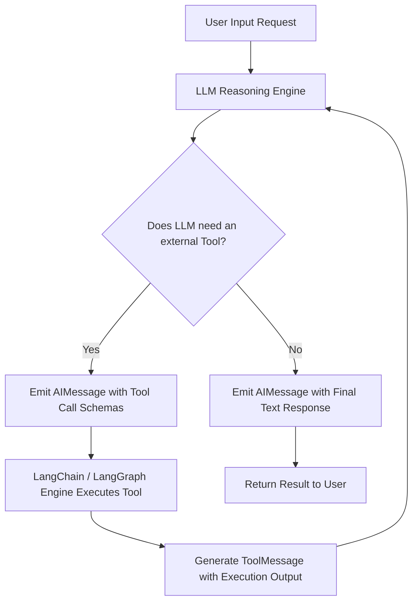

# Building AI Agents with LangChain, LangGraph, and Tavily

---

## Metadata

* **Topic:** AI Agents, ReAct Architecture, Tool Calling, Tavily Search Integration, and LangGraph Runtime
* **Difficulty:** Intermediate
* **Tags:** #LangChain #LangGraph #AIAgents #ReAct #Tavily #ToolCalling #Python
* **Source:** LangChain Course Transcripts (Sections on Agent Fundamentals & ReAct Search Agent)
* **Date:** 2026-08-05

---

# Executive Summary

* **Agent Definition:** An AI Agent is a software system that uses an LLM as a reasoning engine to dynamically determine control flow and execute actions/tools, unlike chains where sequences are hardcoded.


* **ReAct Paradigm:** Combines reasoning (Chain-of-Thought prompting) with acting (tool execution) in an iterative decision-making loop.


* **Four Generations of ReAct:** ReAct evolved from pure text prompting (Nov 2022) to structured tool-calling agents, to LangGraph low-level graph orchestration, and finally to LangChain v1.0's high-level `create_agent` interface.


* **LangGraph Under the Hood:** LangChain v1.0's `create_agent` uses LangGraph underneath to provide durable execution, persistence, and state control.


* **Tool Abstraction:** Tools are regular Python functions decorated with `@tool`. Type hints and detailed docstrings serve as descriptions for the LLM's function-calling mechanism.


* **Message Lifecycle:** Agent invocation runs in a four-step message loop: `HumanMessage` (input) $\rightarrow$ `AIMessage` (tool call decision) $\rightarrow$ `ToolMessage` (tool result) $\rightarrow$ `AIMessage` (final answer synthesis).


* **Tavily Integration:** Tavily provides search, crawling, mapping, and extraction APIs designed specifically for AI agents, featuring a 1,000 free requests/month tier.


* **Web Grounding:** Equipping LLMs with live search tools provides real-time information, cited URLs, and source verification, building user trust and preventing static training data limitations.


* **Observability with LangSmith:** LangSmith displays agent runs under the `LangGraph` title, tracking messages, token costs, latency, and tool-calling arguments.


---

# Main Notes

## What is an AI Agent?

An AI Agent is a software architecture that leverages a Large Language Model (LLM) as its central reasoning engine. Rather than following a rigid script, the agent dynamically decides which steps to take and which external tools to call to fulfill a task.



> [!important]
> **Chain vs. Agent:** In a chain, the developer defines the exact control flow. In an agent, the LLM determines the control flow dynamically based on inputs and intermediate tool outputs.
> 
> 

## Evolution of ReAct Agents

The Reasoning and Acting (ReAct) paradigm was introduced to combine Chain-of-Thought reasoning with practical execution. It has progressed through four major iterations in the LangChain ecosystem:



(Source:)

1. **ReAct Prompting (Nov 2022):** Relying purely on structured text prompts instructing the LLM to write "Thought:", "Action:", and "Observation:" blocks.


2. **Tool Calling Agents:** Transitioning to native LLM function calling, making tool selection more reliable than string parsing.


3. **LangGraph ReAct Agents:** Rebuilding the agent loop on a low-level state-graph engine to allow persistence, time-travel, and fine-grained production control.


4. **Modern `create_agent` (LangChain v1.0):** Exposing a high-level API powered by the LangGraph engine underneath.


---

## Tools and Function Calling Mechanics

Tools give LLMs external capabilities such as database access, API integration, or web search.

```python
from langchain_core.tools import tool

@tool
def search_tool(query: str) -> str:
    """
    Searches the internet for real-time information.
    
    Args:
        query: The search query string.
    Returns:
        The search results as a string.
    """
    return "Tokyo weather is sunny right now."

```

(Source:)

> [!warning]
> **Docstring & Type Hint Criticality:** The LLM does not inspect the Python function body; it reads the function name, type hints, and docstrings. Vague docstrings make it difficult for the LLM to choose the correct tool or supply proper arguments.
> 
> 

### Behind the Scenes: The Tool Calling Loop

When an agent invokes a tool, the framework executes a multi-stage message cycle:



(Source:)

1. **`HumanMessage`**: Contains the user query.


2. **`AIMessage` (Tool Call Decision)**: Contains no final text; instead, it specifies the tool name, arguments, and a unique tool call ID generated by the LLM.


3. **`ToolMessage`**: Captures the string result returned after LangChain executes the local Python code.


4. **`AIMessage` (Final Answer)**: The LLM receives the full message history (including the `ToolMessage`), determines no further tools are needed, and synthesizes a final text answer.


---

## Tavily Search Integration

Large Language Models are static in time and lack live internet access by default. Tavily is an AI-native search engine built specifically for agentic search, extraction, and crawling.

* **Package Requirement:** `langchain-tavily` and `tavily-python`.


* **Environment Variable:** `TAVILY_API_KEY`.


* **Free Tier:** 1,000 free API requests per month.


> [!tip]
> Grounding LLM responses in Tavily search results provides URL citations that allow users to verify generated content, mitigating hallucinations and building trust.
> 
> 

---

# Important Definitions

| Term | Definition | Why It Matters |
| --- | --- | --- |
| **AI Agent** | A system that uses an LLM as a reasoning engine to dynamically pick tools and determine execution flow.

 | Allows automation of complex tasks that require dynamic decision-making.

 |
| **ReAct** | "Reasoning and Acting"; a framework combining Chain-of-Thought thinking with action execution.

 | Serves as the foundational paradigm for autonomous agentic workflows.

 |
| **`@tool` Decorator** | A LangChain decorator that converts a standard Python function into an agent-compatible tool.

 | Formats function metadata and schemas into JSON specs required for LLM function calling.

 |
| **Function Calling** | An LLM capability where the model returns a structured JSON payload detailing which function to invoke.

 | Replaces fragile text-based parsing with reliable, structured tool calls.

 |
| **`ToolMessage`** | A specialized LangChain message object that holds the execution results of a tool call.

 | Feeds tool execution results back to the LLM so it can synthesize a final response.

 |
| **Tavily** | An AI-native search engine providing APIs tailored for LLM agents.

 | Equips agents with real-time web access and grounded source citations.

 |
| **`create_agent`** | A high-level LangChain v1.0 factory function powered by LangGraph.

 | Simplifies agent creation while retaining production-grade state persistence.

 |

---

# Mental Models

* **AI Agent vs. Chain** → **Manager vs. Assembly Line Worker**: A chain is an assembly line worker following a fixed set of steps. An AI agent is a manager who analyzes a situation, chooses which specialist (tool) to delegate work to, reviews their output, and decides the next step.


* **Tool Docstrings** → **Job Descriptions**: The LLM reads the function docstring as a job description. If the description is vague, the LLM will not know when to assign work to that tool.


* **`ToolMessage`** → **Subordinate Status Report**: After a tool completes its task, it hands a status report (`ToolMessage`) back to the LLM manager so it can make an informed decision on how to respond.


---

# Visual Diagrams



(Source:)

---

# Code Examples

### Constructing a Search Agent with `create_agent` and Tavily

```python
import os
from dotenv import load_dotenv
from langchain_core.messages import HumanMessage
from langchain_core.tools import tool
from langchain_openai import ChatOpenAI
from langchain import create_agent  # LangChain v1.0 Agent Factory

# 1. Load environment variables (.env containing OPENAI_API_KEY, TAVILY_API_KEY, LANGCHAIN_API_KEY)
load_dotenv()

# 2. Define a custom tool with explicit type hints and docstrings
@tool
def search_web(query: str) -> str:
    """
    Searches the web for up-to-date real-time information.
    
    Args:
        query: The search string query.
    Returns:
        A string summarizing the web search results.
    """
    # Simulated search execution response
    print(f"\n[Tool Execution] Searching for: {query}")
    return "Tokyo weather is currently sunny with a temperature of 22°C."

# 3. Initialize the reasoning engine LLM
llm = ChatOpenAI(model="gpt-5", temperature=0)

# 4. Group tools into a list
tools = [search_web]

# 5. Create the Agent using the high-level factory function
agent = create_agent(
    model=llm,
    tools=tools
)

# 6. Invoke the agent with a structured input dictionary containing messages
if __name__ == "__main__":
    query = "What is the weather in Tokyo?"
    
    # Invoking the agent runnable
    response = agent.invoke({
        "messages": [HumanMessage(content=query)]
    })

    print("\n--- Message Execution History ---")
    for msg in response["messages"]:
        print(f"[{msg.__class__.__name__}]: {msg.content}")

```

(Source:)

#### Code Explanation:

* **Lines 10–22**: Defines a custom tool using `@tool`. The docstring provides the LLM with the context required for function calling.


* **Line 25**: Initializes `ChatOpenAI` as the core reasoning engine.


* **Lines 31–34**: Uses `create_agent` to construct the agent workflow powered by LangGraph under the hood.


* **Lines 38–42**: Executes the agent using `agent.invoke({"messages": [...]})`.


---

# Step-by-Step Flow

## Setting Up and Running a ReAct Search Agent

1. **Environment Setup**:
* Initialize the Python environment using `uv init`.


* Install packages: `uv add langchain langchain-openai langchain-tavily python-tavily python-dotenv`.


2. **API Credential Configuration**:
* Create a `.env` file and set `OPENAI_API_KEY`, `TAVILY_API_KEY`, `LANGCHAIN_TRACING_V2=true`, and `LANGCHAIN_PROJECT="Search Agent"`.


3. **Tool Definition**:
* Write a Python function with explicit docstrings and type hints.


* Decorate the function with `@tool`.


4. **Agent Initialization**:
* Instantiate `ChatOpenAI`.


* Pass the LLM instance and tools list into `create_agent(model=llm, tools=tools)`.


5. **Execution & Trace Verification**:
* Invoke the agent via `agent.invoke({"messages": [HumanMessage(content="...")]})`.


* Open LangSmith to review the step-by-step execution trace generated under the `LangGraph` title.


---

# Examples

### Agent Trace Execution Breakdown (Tokyo Weather Example)

When asking: *"What is the weather in Tokyo?"*

1. **Step 1 (`HumanMessage`)**: User submits the input text `"What is the weather in Tokyo?"`.


2. **Step 2 (`AIMessage` - Tool Call Request)**: The LLM evaluates the available tools, sees `search_web`, and returns a tool call payload with `name="search_web"` and `args={'query': 'weather in Tokyo'}`.


3. **Step 3 (`ToolMessage`)**: LangChain executes `search_web` locally and returns the string `"Tokyo weather is sunny right now"`.


4. **Step 4 (`AIMessage` - Final Answer)**: The LLM receives the `ToolMessage`, synthesizes the result, and outputs: `"The weather in Tokyo is currently sunny."`.


---

# Real World Applications

* **Live Market & Job Research Agents:** Querying online resources to aggregate real-time listings, news, or stock updates.


* **Enterprise Generative UI:** Fetching dynamic data alongside source URLs, enabling front-end apps to render interactive UI cards with citations.


* **Automated Support & Escalation:** Evaluating user requests, querying internal databases via tools, and deciding whether to issue refunds or route issues to human agents.


---

# Interview Questions

### Beginner

**Q: What is the fundamental difference between a LangChain chain and a LangChain agent?**

> **A:** In a chain, the execution steps are hardcoded by the developer. In an agent, the LLM acts as a reasoning engine that dynamically determines which actions to take and which tools to call.
> 
> 

### Intermediate

**Q: Why are docstrings and type hints critical when defining a LangChain `@tool`?**

> **A:** LangChain converts the function's name, type hints, and docstring into a JSON schema passed to the LLM. The model relies on these descriptions to decide whether to invoke the tool and how to structure arguments.
> 
> 

### Advanced

**Q: How does LangChain v1.0's `create_agent` function execute tool calling under the hood?**

> **A:** `create_agent` builds a state graph using the LangGraph engine. It manages an iterative loop: sending messages to the LLM, parsing tool call responses into execution nodes, returning results as `ToolMessage` instances, and looping until the LLM returns a final answer without tool calls.
> 
> 

---

# Common Mistakes

* **Vague Tool Descriptions**:
* *Mistake*: Writing generic docstrings like `def search(q): return results`.


* *Fix*: Provide detailed descriptions explaining what the tool does, what arguments it requires, and what it returns.


* **Incorrect Input Schema to `agent.invoke**`:
* *Mistake*: Passing a raw string or list directly to `agent.invoke("query")`.


* *Fix*: Always pass a dictionary containing a `"messages"` key mapped to a list of message objects: `agent.invoke({"messages": [HumanMessage(...)]})`.


* **Misnaming Tavily Environment Variables**:
* *Mistake*: Setting `TAVILY_KEY` or `TAVILY_SEARCH_KEY` in `.env`.


* *Fix*: Ensure the environment variable is named `TAVILY_API_KEY` so the integration package automatically locates credentials.


---

# Memory Tricks

### The **R-E-A-C-T** Agent Loop

* **R** – **Reason**: LLM evaluates the conversation history.


* **E** – **Evaluate**: Decides if a tool invocation is necessary.


* **A** – **Act**: Executes the tool with generated arguments.


* **C** – **Collect**: Captures the execution result in a `ToolMessage`.


* **T** – **Transmit**: Sends results back to the LLM to formulate a response.


---

# Comparison Tables

| Feature | Chains | AI Agents |
| --- | --- | --- |
| **Control Flow** | Hardcoded by developer

 | Dynamically decided by LLM

 |
| **Tool Usage** | Fixed step execution

 | Conditional tool execution

 |
| **Flexibility** | Predictable, static workflows

 | Dynamic problem solving

 |
| **Underlying Engine** | LCEL Runnable Sequences

 | LangGraph State Graph

 |

---

# Revision Sheet (One Page)

* **Core Concept:** An agent uses an LLM as a reasoning engine to dynamically pick tools and determine control flow.


* **ReAct Paradigm:** Reasoning + Acting in an iterative loop.


* **Key Imports:** `from langchain import create_agent`, `from langchain_core.tools import tool`, `from langchain_core.messages import HumanMessage`.


* **Tool Setup:** `@tool` decorator + explicit docstrings + type hints.


* **Invocation Format:** `agent.invoke({"messages": [HumanMessage(content="...")]})`.


* **Message Sequence:** `HumanMessage` $\rightarrow$ `AIMessage` (Tool Call) $\rightarrow$ `ToolMessage` (Result) $\rightarrow$ `AIMessage` (Answer).


* **Engine:** LangChain v1.0's `create_agent` runs on top of LangGraph.


* **Web Search Provider:** Tavily (`langchain-tavily`, key: `TAVILY_API_KEY`).


---

# Flashcards

Q: What is an AI Agent?
A: A software system that uses an LLM as a reasoning engine to dynamically decide which actions to take and which tools to call.

Q: How does an agent differ from a chain?
A: In chains, execution steps are hardcoded by the developer; in agents, control flow is determined dynamically by the LLM.

Q: What does ReAct stand for?
A: Reasoning and Acting.

Q: What four generations of ReAct agents exist in LangChain's evolution?
A: 1. Text Prompting (Nov 2022), 2. Tool Calling Agents, 3. LangGraph ReAct Agents, 4. LangChain v1.0 `create_agent`.

Q: What low-level engine powers `create_agent` in LangChain v1.0?
A: LangGraph.

Q: What decorator converts a Python function into a LangChain tool?
A: `@tool`.

Q: Why are docstrings important on `@tool` decorated functions?
A: The LLM reads the docstring as a tool description to decide when and how to invoke the tool.

Q: What message type is generated when a tool finishes executing?
A: `ToolMessage`.

Q: What four message types appear in a standard single-tool agent invocation loop?
A: `HumanMessage`, `AIMessage` (tool call request), `ToolMessage` (execution result), and `AIMessage` (final output).

Q: What service is commonly used as a search engine provider for AI agents?
A: Tavily.

Q: What environment variable must be set for Tavily integration?
A: `TAVILY_API_KEY`.

Q: How many free requests per month are provided in Tavily's free tier?
A: 1,000 requests per month.

Q: What parameter structure is required when calling `agent.invoke`?
A: A dictionary containing a `"messages"` key mapped to a list of messages (e.g., `{"messages": [HumanMessage(...)]}`).

Q: Why are LLMs unable to answer real-time questions without tools?
A: LLMs are static, trained on historical data, and lack live access to the internet.

Q: What platform traces LangGraph agent executions?
A: LangSmith.

Q: What is "grounding" in LLM applications?
A: Anchoring model responses to verifiable search results and source URLs to prevent hallucinations.

Q: What function creates modern agents in LangChain v1.0?
A: `create_agent`.

Q: Can an agent invoke multiple tools in a single task?
A: Yes, agents run an iterative loop and can execute tools sequentially until they have enough information to form an answer.

Q: What package provides Tavily integrations for LangChain?
A: `langchain-tavily`.

Q: What role does `ChatOpenAI` serve inside an agent?
A: It acts as the central reasoning engine that decides which actions to take.

---

# Practice Questions

### Easy

1. Write a Python function called `get_time` and apply the correct LangChain decorator to convert it into a tool.
> **Answer:**
> ```python
> from langchain_core.tools import tool
> 
> @tool
> def get_time() -> str:
>     """Returns the current current system time."""
>     import datetime
>     return str(datetime.datetime.now())
> ```[cite: 11]
> 
> ```
> 
> 


### Medium

2. Describe the exact message sequence that occurs when an agent uses a search tool to answer a user's prompt.
> **Answer:**
> 1. `HumanMessage`: User's initial question.
> 
> 
> 2. `AIMessage`: LLM decision requesting a tool call with generated arguments.
> 
> 
> 3. `ToolMessage`: Execution output returned by the tool.
> 
> 
> 4. `AIMessage`: Final answer synthesized by the LLM using the tool output.
> 
> 
> 
> 


### Hard

3. Explain why transitioning from pure text ReAct prompting to LangGraph-backed agents improves production reliability.
> **Answer:** Text ReAct prompting relied on parsing raw text strings, which was prone to formatting errors. Native function calling provides structured JSON outputs. LangGraph adds durable execution, state persistence, fault tolerance, and clear node-based control flow.
> 
> 


---

# Additional Knowledge

## Background Knowledge (Added)

* **Generative UI Concept:** Modern search platforms (e.g., ChatGPT Web Search) use tool execution metadata to render interactive frontend components, such as domain icons, link preview cards, and groundings, directly alongside generated text.


---

# Key Takeaways

1. An AI Agent uses an LLM as a dynamic reasoning engine to select actions and call tools.


2. Chains execute hardcoded steps; Agents dynamically determine control flow.


3. ReAct combines Reasoning (Chain-of-Thought) and Acting (Tool Execution).


4. ReAct evolved through four stages: Text Prompting $\rightarrow$ Tool Calling $\rightarrow$ LangGraph $\rightarrow$ `create_agent`.


5. LangChain v1.0's `create_agent` helper is powered by LangGraph under the hood.


6. `@tool` converts Python functions into tool schemas using function names, type hints, and docstrings.


7. Clear docstrings are essential for the LLM to accurately choose and invoke tools.


8. Agent execution follows a 4-step message cycle: `HumanMessage` $\rightarrow$ `AIMessage` (Tool Call) $\rightarrow$ `ToolMessage` $\rightarrow$ `AIMessage` (Final Answer).


9. Tavily provides an AI-native search engine designed specifically for agentic workflows.


10. Tavily requires `langchain-tavily`, `tavily-python`, and the `TAVILY_API_KEY` environment variable.


11. Grounding LLM answers with real-time web search provides URL citations that build user trust.


12. LangSmith traces agent runs under the `LangGraph` title, detailing execution steps, token usage, and latency.