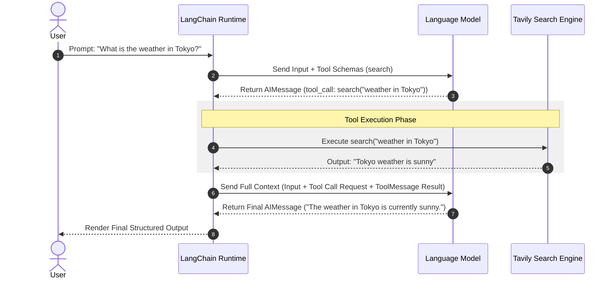

# LangChain Structured Output & Tool Calling Architecture

## Metadata

- **Topic:** LangChain Structured Output, Tool Strategies, and Agent Runtime Execution
    
- **Difficulty:** Intermediate
    
- **Tags:** #langchain #pydantic #structured-output #tool-calling #ai-agents #python
    
- **Source:** Expert Lecture Series on Agentic AI Engineering
    
- **Date:** 2026-08-05
    

## Executive Summary

- **Structured Output Goal:** Replaces unstructured raw text with validated, programmatically parseable, and serializable schemas (e.g., Pydantic, JSON Schema, Dataclass, TypedDict).
    
- **Dual Implementation Strategies:** LangChain processes structured outputs via either native **Provider Strategy** or **Tool Strategy** fallback.
    
- **Provider Strategy Default:** LangChain defaults to the model provider’s native schema-enforcement API when available, shifting accuracy and formatting guarantees directly to the vendor.
    
- **Tool Strategy Workaround:** For models lacking native structured output APIs, LangChain wraps the target schema into a single virtual tool call and forces the model to select it.
    
- **LangGraph Foundation:** Under the hood, LangChain agent runtimes execute as state graphs managing input parsing, tool dispatching, state updates, and terminal reasoning passes.
    
- **Schema Validation via Pydantic:** Pydantic `BaseModel` and `Field` provide strong type validation, default factory patterns, and dynamic schema descriptions that guide LLM field population.
    
- **Custom vs. Native Vendor Tools:** Replacing custom SDK-wrapped tools with official integrations (e.g., `langchain_tavily`) improves tool invocation accuracy by providing optimized descriptions and specialized parameters.
    
- **Multi-Tool Parallel Execution:** Advanced models can plan and emit multiple parallel tool calls within a single generation step to optimize data aggregation.
    

## Main Concepts & Theory

### 1. Structured Output Architecture

Raw-text responses from LLMs present parsing challenges when downstreaming data to client applications, user interfaces, or databases. Structured output guarantees predictable output formats.

```text
                 ┌──────────────────────────────────────────────┐
                 │          LangChain Agent Core                │
                 └──────────────────────┬───────────────────────┘
                                        │
                         Does model support Native Schema?
                                 /             \
                           YES  /               \  NO
                               /                 \
     ┌────────────────────────────┐           ┌────────────────────────────┐
     │     Provider Strategy      │           │       Tool Strategy        │
     ├────────────────────────────┤           ├────────────────────────────┤
     │ Native LLM Structured      │           │ LangChain creates a single │
     │ Output API (e.g., OpenAI)  │           │ artificial Tool from schema│
     │ - Vendor guarantees format │           │ - Forced Tool Choice       │
     └────────────────────────────┘           └────────────────────────────┘
```

#### Strategy Comparison Matrix

|**Feature**|**Provider Strategy**|**Tool Strategy**|
|---|---|---|
|**Primary Mechanism**|Vendor-native API structured output flags|Artificial single-tool binding with forced choice|
|**Default Choice**|Primary default used by LangChain whenever supported|Fallback used when model lacks native support|
|**Supported Formats**|Pydantic, Dataclass, TypedDict, JSON Schema|Pydantic, Dataclass, TypedDict, JSON Schema|
|**Responsibility**|Shifting validation completely to the model vendor|Handled by LangChain runtime via tool parameter schemas|

### 2. Agent Runtime Loop & Message Lifecycle

An agentic execution loop relies on a three-phase state machine:

1. **Reasoning Step:** The user query and available tool definitions are sent to the LLM. The model returns an `AIMessage` containing a `tool_calls` payload instead of final text.
    
2. **Execution Step:** The agent runtime parses the `tool_calls` request, dispatches execution to the specified function/API, and captures the raw output.
    
3. **Synthesis Step:** The tool output is wrapped into a `ToolMessage` and appended to the history. The full context (`HumanMessage` $\rightarrow$ `AIMessage` with tool call $\rightarrow$ `ToolMessage`) is sent back to the LLM to yield the final `AIMessage` response.
    

## Important Definitions

|**Term**|**Definition**|**Why It Matters**|
|---|---|---|
|**Pydantic `BaseModel`**|Python base class used to construct strongly typed data validation models.|Forms the underlying schema definition passed to LLMs for response parsing and validation.|
|**`Field`**|Pydantic utility for attaching metadata, default values, and descriptions to attributes.|Metadata strings act as direct system prompts that instruct the LLM on field intent.|
|**`response_format`**|Argument in LangChain agent initialization defining the target data structure.|Configures the runtime to intercept raw output and parse it into structured objects.|
|**`ToolMessage`**|Message type in LangChain representing the structured result of an executed tool.|Grounding context sent back to the LLM so it can answer based on tool outputs.|
|**`default_factory`**|A Pydantic parameter that invokes a callable (e.g., `list`) to generate dynamic default values.|Prevents mutable default bugs across model instantiation calls.|

## Code & Implementations

### Nested Pydantic Schema Definition

Defining nested validation models with structural field descriptions for LLM guidance:

Python

```python
from typing import List
from pydantic import BaseModel, Field

class Source(BaseModel):
    """Schema for a specific source referenced by the agent."""
    
    url: str = Field(
        description="The exact HTTP/HTTPS URL of the source used for grounding."
    )

class AgentResponse(BaseModel):
    """Structured response object emitted by the agent."""
    
    answer: str = Field(
        description="The comprehensive answer to the user query."
    )
    sources: List[Source] = Field(
        default_factory=list,
        description="List of grounding sources used to build the answer."
    )
```

### Agent Instantiation with Structured Response

Configuring `create_agent` (or equivalent agent runtimes) to enforce output schemas using built-in vs. vendor integrations:

Python

```
from langchain_community.adapters.openai import ChatOpenAI
from langchain_tavily import TavilySearch
from langchain.agents import create_agent # Or relevant LangGraph agent creator

# 1. Initialize tools using official vendor wrappers for optimal parameter exposure
tavily_tool = TavilySearch()

# 2. Instantiate LLM
llm = ChatOpenAI(model="gpt-5", temperature=0)

# 3. Create Agent with explicit response structure
agent = create_agent(
    model=llm,
    tools=[tavily_tool],
    response_format=AgentResponse # Enforces return shape into structured_response
)

# 4. Execution
result = agent.invoke({"messages": [("user", "Find 3 AI Engineer jobs on LinkedIn in Bay Area.")]})

# Access structured data directly
structured_data: AgentResponse = result["structured_response"]
print(f"Answer: {structured_data.answer}")
for source in structured_data.sources:
    print(f"Source URL: {source.url}")
```

## Visual Diagrams

### Agent Execution Sequence Diagram

Code snippet



## System Architecture & Trade-offs

### Custom SDK Implementations vs. Native Integration Packages

```text
Custom SDK Wrapper (Developer Managed)
[ Your Code ] ──> [ Manual Schema Parsing ] ──> [ Basic SDK Call ] ──> Hardcoded Output

Vendor Integration Package (e.g., langchain_tavily)
[ Native Tool ] ──> [ Rich Parameter Schemas ] ──> [ Domain Filtering ] ──> High Precision
```

#### Trade-off Matrix

|**Dimension**|**Custom Tools (Manual Wrappers)**|**Native Integration Packages (langchain_tavily)**|
|---|---|---|
|**Control**|Full control over internal code execution.|Dependent on third-party maintainers.|
|**Schema Optimization**|Standardized descriptions written by app engineers.|Highly optimized schemas with hidden parameters exposed (`include_domains`, `search_depth`).|
|**Maintenance**|Developer must manually update code on SDK updates.|Automatically maintained by tool vendor teams.|
|**LLM Tool Call Accuracy**|Basic to Moderate.|High (LLMs leverage advanced arguments provided out-of-the-box).|

## Common Pitfalls & Best Practices

### Mistakes to Avoid

> [!warning] **Mutable Default Arguments** Avoid assigning static empty lists to Pydantic attributes (`sources: List[Source] = []`). Always use `Field(default_factory=list)` to avoid state leakage across instantiated objects.

> [!warning] **Vague Field Descriptions** Omitting the `description` parameter inside Pydantic `Field(...)` calls deprives the LLM of field context, increasing the likelihood of hallucinated or incorrectly formatted values.

> [!warning] **Over-wrapping External Tools** Writing custom tool functions manually around third-party APIs instead of importing vendor-optimized integration packages (like `langchain_tavily`) leads to suboptimal tool selections.

### Best Practices

> [!tip] **Nested Model Validation** Break complex schemas down into smaller, modular `BaseModel` classes (e.g., nesting `Source` inside `AgentResponse`) for better maintenance and readability.

> [!tip] **Leverage Trace Monitoring** Use observability platforms like LangSmith / Blacksmith to inspect raw `AIMessage` tool call requests, verify function call arguments, and validate structured output steps.

## Active Recall & Interview Prep

### Key Q&A Flashcards

**Q: What are the two primary implementation strategies for structured output in LangChain?** **A:** The **Provider Strategy** (which uses the model vendor's native schema APIs) and the **Tool Strategy** (which binds a single tool matching the desired schema and forces its selection).

**Q: Which strategy does LangChain choose by default?** **A:** LangChain defaults to the **Provider Strategy** whenever the underlying LLM natively supports structured responses.

**Q: How does the Tool Strategy force structured output execution?** **A:** It wraps the user-provided schema into a single virtual tool definition and sets tool choice configuration to force the LLM to call that specific tool.

**Q: What is the primary purpose of the Pydantic `Field` class when building LLM schemas?** **A:** It provides structural metadata and descriptions that act as contextual instructions guiding the LLM on what content to generate for each field.

**Q: What message type is created in LangChain when a tool finishes execution?** **A:** A `ToolMessage`, which encapsulates the tool execution output back into the message history for the LLM to inspect.

**Q: Why are official vendor packages like `langchain_tavily` preferred over custom-wrapped tool functions?** **A:** Vendor packages provide richer tool descriptions and expose specialized arguments (e.g., `include_domains`, `search_depth`) that improve agent grounding.

**Q: How does `default_factory=list` protect Pydantic models?** **A:** It safely constructs a clean, isolated list instance for every model initialization, avoiding shared mutable state bugs across model calls.

**Q: Can LLMs execute multiple tool calls within a single reasoning step?** **A:** Yes, modern models (e.g., GPT-4o, GPT-5) support parallel function calling, emitting multiple tool call objects in a single response pass.

### Practical Practice Scenario

**Scenario:** You need to construct an agent that extracts structured corporate financial metrics from financial news articles. The response must return the company name, an array of key financial metrics (metric name, numeric value, unit), and the source article URL.

**Solution/Approach:**

Python

```python
from typing import List
from pydantic import BaseModel, Field

class Metric(BaseModel):
    name: str = Field(description="Name of the financial metric, e.g., 'Revenue' or 'Net Income'.")
    value: float = Field(description="Numeric value of the metric.")
    unit: str = Field(description="Currency or unit of measure, e.g., 'USD', 'EUR', or 'Percentage'.")

class FinancialReport(BaseModel):
    company_name: str = Field(description="Name of the reported enterprise.")
    metrics: List[Metric] = Field(default_factory=list, description="List of reported financial metrics.")
    source_url: str = Field(description="URL of the news source.")

# Bind schema to the agent configuration
# agent = create_agent(model=llm, tools=tools, response_format=FinancialReport)
```

## One-Page Cheat Sheet

- **Structured Output Goal:** Convert unstructured LLM output into validated data types (Pydantic, JSON Schema, Dataclasses).
    
- **Provider Strategy:** LangChain default; relies on LLM vendor native structured APIs.
    
- **Tool Strategy:** Fallback method; wraps schema as a single forced tool call.
    
- **LangChain Routing:** Provider Strategy $\rightarrow$ Tool Strategy fallback.
    
- **`response_format` Parameter:** Pass schema model directly to agent instantiation.
    
- **Pydantic `BaseModel`:** Enforces runtime parsing, typing, and object validation.
    
- **Pydantic `Field(description=...)`:** Critical prompt interface telling the LLM what to put in each field.
    
- **Pydantic `default_factory=list`:** Prevents shared mutable list references across class instances.
    
- **Agent Flow:** `HumanMessage` $\rightarrow$ `AIMessage` (tool choice) $\rightarrow$ `ToolMessage` (execution result) $\rightarrow$ Final `AIMessage`.
    
- **`ToolMessage`:** Holds output payload from executed tool functions.
    
- **Vendor Integrations:** Prefer official packages (e.g., `langchain_tavily`) over manual SDK wrappers.
    
- **Parallel Tooling:** Modern models can request parallel tool calls in one step.
    
- **Observability:** Inspect intermediate execution using trace visualization tools like LangSmith.