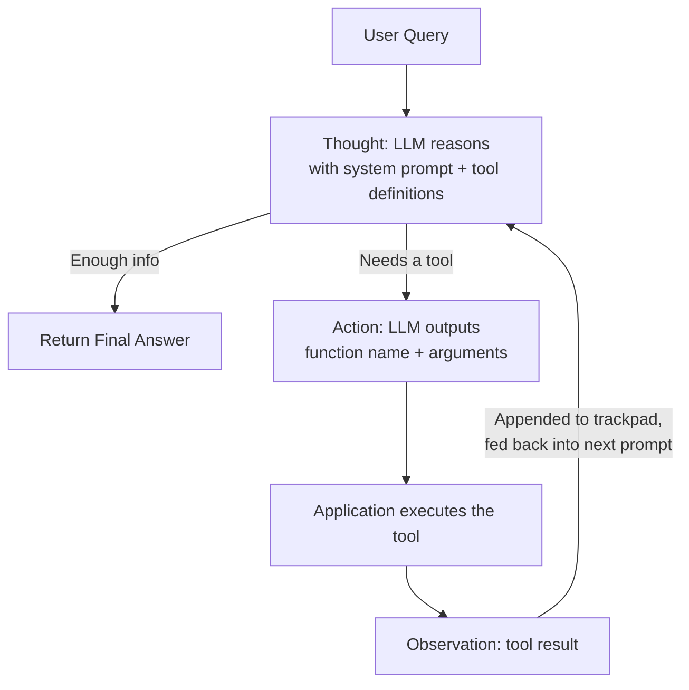
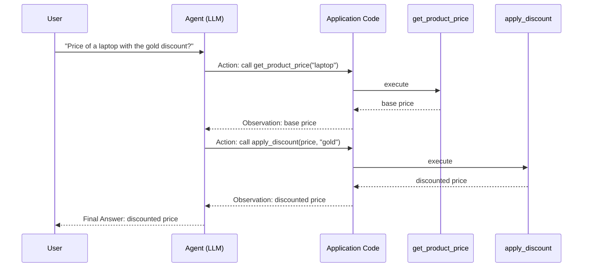

# Agents Under The Hood: The ReAct Loop & E-Commerce Agent Setup

## Metadata

- **Topic:** AI Agent Architecture — Peeling Back LangChain Abstractions (Layer 0 → Raw Implementation)
- **Difficulty:** Intermediate / Advanced
- **Tags:** #langchain #langgraph #ai-agents #react-loop #function-calling #ollama #agentic-ai
- **Source:** LangChain — Agentic AI Engineering with LangChain & LangGraph (Udemy, Eden Marco) — Lessons 23–26
- **Date:** 2026-08-08

---

## Executive Summary

- This section's goal: strip away the `create_agent` LangChain abstraction and rebuild an AI agent from scratch, layer by layer, to fully understand what's happening "under the hood."
- **Layer 0** (already covered): `create_agent(model, tools=[...])` — LangChain handles everything invisibly.
- **Layer 1** (this section, part A): Implement the **agent loop** manually using LangChain _primitives_ (`tool`, `bind_tools`, chat models, `ToolMessage`) — still leveraging native function calling.
- **Layer 2** (later): Implement the same loop **without any framework** — writing raw JSON schemas for function calling yourself.
- **Layer 3** (deepest layer): Implement an agent with **no function calling at all** — using the original **ReAct prompting** technique (text parsing, regex, scratchpad) as agents were first built in 2022–2023.
- The **ReAct algorithm** (Reasoning + Acting) — from the 2023 Princeton/Google paper _"ReAct: Synergizing Reasoning and Acting in Language Models"_ — is the foundational loop powering modern agents like Claude Code, Gemini CLI, Codex, and Devin.
- Core loop: **Thought → Action → Observation**, repeated in a `while` loop until the LLM decides it has enough information to return a final answer.
- The practical project for this section: a **lean e-commerce agent** with two tools — `get_product_price` and `get_discount_by_tier` (bronze/silver/gold) — built without the `create_agent` abstraction.
- Local environment uses **Ollama** running **Qwen3** (open-weights, function-calling capable) so the internals of tool calling can be inspected without depending on a closed API; OpenAI is used interchangeably later.
- **LangSmith** tracing is enabled from the start so every agent run/trace can be inspected step by step.

---

## Main Concepts & Theory

### 1. The Layered Approach to Understanding Agents

> [!tip] Mental Model Think of `create_agent` as a black box wrapped in several layers of abstraction. Each "layer" in this course strips one layer away, trading convenience for understanding, until you reach the bare metal (raw prompting, no function calling).

|Layer|What's Used|What You Learn|
|---|---|---|
|Layer 0|`create_agent(model, tools)` (full LangChain abstraction)|How to _use_ an agent, but not how it works|
|Layer 1|LangChain primitives: `tool`, `bind_tools`, chat models, `ToolMessage` — manual `while` loop|How the agent loop and function calling are orchestrated|
|Layer 2|Raw Python — no LangChain, hand-written JSON schemas for function calling|What LangChain actually saves you from writing; why a unified interface across model vendors matters|
|Layer 3|No function calling — raw ReAct text prompting, regex parsing, manual scratchpad|How agents worked before native function calling existed; the true origin of the "agent loop"|

- Reasoning for going this deep: production systems benefit from being **model-agnostic**. If a new/better model is released, an abstraction layer means minimal code changes are needed to switch.

### 2. The ReAct Loop (Agent Loop) — High-Level Architecture

- Also called: **agent loop**, **ReAct loop**, **ReAct algorithm** — used interchangeably.
- Origin: paper _"ReAct: Synergizing Reasoning and Acting in Language Models"_ (Princeton University + Google Research, 2023). This paper laid the foundation for essentially all modern autonomous agents.
- The loop sits **between** a user query and a final answer:

__User Query → [ Agent Loop: Thought → Action → Observation ]_ → Final Answer_*

#### Step-by-step mechanics

1. **Thought** (reasoning step)
    
    - A prompt is sent to the LLM containing:
        - A **system message** with general agent instructions.
        - **Tool definitions** — everything the LLM is allowed to call, i.e. the tools "in its disposal."
    - The LLM decides one of two things:
        - Call a tool (**Action**), or
        - Return a final answer directly (only if it already has enough information — represented as a _dotted line_ shortcut straight to the output).
    - This decision-making relies on the **function calling** capability of modern LLMs.
2. **Action**
    
    - The LLM's output is a **string specifying which function to call and with which arguments** — the LLM does _not_ execute anything itself.
    - The **application code** (not the LLM) is responsible for actually running the tool.
3. **Observation**
    
    - The result returned by the executed tool.
    - This result is fed **back into the next LLM prompt**, along with the full conversation history so far.
4. **Trackpad / Scratchpad**
    
    - The accumulated history of thoughts, actions, and observations across iterations.
    - Each new LLM call receives the _entire_ trackpad, so the agent has full context of what's already been tried and learned.
5. **Loop termination**
    
    - The `while` loop keeps running, prompting the LLM again with the updated trackpad, until the LLM decides it has sufficient information and returns a final answer instead of another tool call.

#### Worked Example: "What is the price of a laptop with the gold discount?"

|Iteration|Thought (LLM decision)|Action (executed by app)|Observation|
|---|---|---|---|
|1|Need product price → call `get_product_price`|`get_product_price("laptop")`|Base price of laptop|
|2|Have price, now need discount → call `apply_discount`|`apply_discount(price, tier="gold")`|Final discounted price|
|3|Has full trackpad (query + both observations) → enough info|_(no tool call)_|Returns final answer to user|

> [!important] Key Insight The LLM never "does" anything — it only **reasons and outputs instructions**. All actual execution (API calls, computations, DB lookups) happens in your application code. The LLM is a decision-maker sitting inside a loop that your code controls.

### 3. E-Commerce Agent — What We're Building

- **Domain:** an online store selling hardware — headphones, keyboards, laptops — with tiered promotions.
- **Discount tiers:** Bronze / Silver / Gold, each mapping to a different discount percentage (example given: Bronze = 15%).
- **Goal:** given a natural-language user query, the agent should return the final price of an item after applying the correct discount tier.
- **Tools required (exactly 2):**
    1. Get the **price** of an item (e.g., laptop).
    2. Get the **discount amount** for a given tier (bronze/silver/gold) and apply it.
- Layer-0 equivalent (for comparison — **not** what's being implemented in this section):
    
    ```python
    agent = create_agent(model=llm, tools=[get_product_price, get_discount_by_tier])
    ```
    
- Instead, this section builds the **lean, framework-light version** of the same agent to expose the internal mechanics.

### 4. Environment & Tooling Setup

- **Package/environment manager:** `uv` (fast Python package manager) — replaces manually managing venvs/pip.
- **Model host:** **Ollama**, for running open-weights models locally (no API key required, fully on-device).
- **Chosen local model:** **Qwen3** — specifically the **1.7B parameter** variant (~1.4 GB).
    - Chosen because it's lightweight _and_ supports function calling.
    - The smaller 0.6B variant was tried first but performed poorly on function calling.
    - Any model/vendor works as long as it **supports function calling** (OpenAI, Anthropic, Gemini, etc. are all viable alternatives).
- **Secondary model:** OpenAI (added later in the section) to demonstrate switching vendors with minimal code change — this is the payoff of using LangChain's unified interface.
- **Tracing/observability:** **LangSmith** — enabled via environment variables so every agent run can be inspected step-by-step (thoughts, actions, observations) in the LangSmith UI.

---

## Important Definitions

|Term|Definition|Why It Matters|
|---|---|---|
|**Agent Loop / ReAct Loop**|The repeating `Thought → Action → Observation` cycle an agent runs until it can answer the user|This _is_ the agent — everything else (frameworks, tools) supports this loop|
|**Thought**|The LLM reasoning step: deciding which tool to call, or whether to answer directly|Where the "intelligence"/decision-making of the agent lives|
|**Action**|The LLM's output specifying a function name + arguments to execute|Bridges LLM reasoning to real code execution|
|**Observation**|The result returned by executing a tool, fed back into the next prompt|Gives the agent updated context to reason over|
|**Trackpad (Scratchpad)**|Full accumulated history of thoughts/actions/observations sent with every new LLM call|Enables multi-step reasoning without external memory systems|
|**Function Calling**|LLM capability to output structured requests to invoke a specific function/tool with arguments|The mechanism that makes the Thought→Action step reliable/parseable|
|**create_agent**|LangChain's high-level abstraction that wires model + tools into a working agent automatically|The "Layer 0" black box this section deliberately avoids to teach internals|
|**LangSmith**|LangChain's tracing/observability platform|Lets you visually inspect each loop iteration of an agent run|
|**Ollama**|Local runtime for serving open-weights LLMs on your own machine|Enables running/inspecting function calling without depending on a hosted API|

---

## Code & Implementations

### Git Setup (checkout starting branch)

```bash
git checkout -b project/agents-under-the-hood <commit-hash>
```

- Branch: `project/agents-under-the-hood`
- Starting state contains only a `.gitignore` file (the "hello start" commit).

### Project Initialization with `uv`

```bash
uv init
```

- Delete the auto-generated `main.py` (not needed).

### Installing Dependencies

```bash
uv add langchain langchain-ollama langchain-openai python-dotenv black isort
```

|Package|Purpose|
|---|---|
|`langchain`|Core LangChain primitives (tools, messages, etc.)|
|`langchain-ollama`|Integration to run local Ollama models through LangChain|
|`langchain-openai`|Integration for switching to OpenAI models later in the section|
|`python-dotenv`|Load environment variables from `.env`|
|`black`|Code formatter|
|`isort`|Import sorter|

- Running this updates `pyproject.toml` (dependency list) and generates `uv.lock` (pinned exact versions).

### Environment Variables (`.env`)

```bash
OPENAI_API_KEY=<your-openai-key>
LANGSMITH_API_KEY=<your-langsmith-key>
LANGSMITH_PROJECT="ReAct Under The Hood"
LANGSMITH_TRACING=true
```

> [!warning] No Ollama API Key Needed Ollama runs entirely locally, so no API key is required for it — only for hosted vendors like OpenAI and for LangSmith tracing.

### Downloading & Running a Local Model via Ollama

```bash
# List locally available models
ollama list

# Download (pull) the Qwen3 1.7B model
ollama pull qwen3:1.7b

# Run it interactively in the CLI to sanity-check it
ollama run qwen3:1.7b
# type messages, e.g. "Hi", "How are you doing?"
# exit the CLI chat with:
/bye

# Start the Ollama server so your Python app can consume the model over HTTP
ollama serve
```

### Committing the Setup

```bash
git add .
git commit -m "Env setup"
git push
```

---

## Visual Diagrams

### ReAct Agent Loop



### E-Commerce Agent Example Trace



---

## System Architecture & Trade-offs

### Architecture Flow (this section's build path)

```
create_agent() [Layer 0 - full abstraction]
        ↓ peel
Manual while-loop + LangChain primitives (tool, bind_tools, ToolMessage) [Layer 1]
        ↓ peel
Manual while-loop + hand-written JSON schemas, no framework [Layer 2]
        ↓ peel
Raw ReAct text-prompting agent: regex parsing + manual scratchpad, no function calling [Layer 3]
```

### Trade-offs by Layer

|Layer|Pros|Cons|
|---|---|---|
|Layer 0 (`create_agent`)|Fastest to build; least code|Opaque — no insight into failures, hard to debug edge cases|
|Layer 1 (LangChain primitives)|Full control over the loop; still get vendor-agnostic tool/message abstractions|More boilerplate than Layer 0|
|Layer 2 (raw, no framework)|Deepest understanding of function calling mechanics; total control|Reinventing JSON schema generation and validation per model vendor; harder to switch models|
|Layer 3 (raw ReAct prompting)|Works even without native function-calling support; historical/foundational understanding|Fragile (regex parsing of free text), no structured guarantees, largely superseded by native function calling today|

> [!important] Why This Matters for Production A unified interface (like LangChain's) that lets you swap models with minimal changes is valuable in production because model landscape shifts fast — being locked into one vendor's raw function-calling format is a maintenance risk.

---

## Common Pitfalls & Best Practices

> [!warning] Mistakes to Avoid
> 
> - Choosing a model that doesn't reliably support **function calling** — the whole agent loop mechanism depends on it (the smaller Qwen 0.6B model reportedly performed poorly here).
> - Forgetting to run `ollama serve` before trying to consume the model from your Python application — the local model won't be reachable otherwise.
> - Committing real API keys to git — always use `.env` + `.gitignore`.
> - Assuming the LLM "executes" tools — it only **outputs instructions**; your application code must actually run them.

> [!tip] Best Practices
> 
> - Enable tracing (LangSmith or equivalent) from the very start of agent development — it makes debugging multi-step loops dramatically easier.
> - Design agent code so the model/vendor is swappable (don't hard-code vendor-specific request formats where avoidable).
> - Build understanding bottom-up: implement the loop manually at least once before relying on high-level abstractions like `create_agent`.
> - Keep tool responsibilities narrow and composable (e.g., one tool for price lookup, a separate tool for discount application) rather than one monolithic tool.

---

## Active Recall & Interview Prep

### Key Q&A Flashcards

**Q: What are the two other common names for the "agent loop"?** A: The ReAct loop / ReAct algorithm.

**Q: What paper introduced the ReAct technique, and who published it?** A: "ReAct: Synergizing Reasoning and Acting in Language Models" (2023), a joint paper from Princeton University and Google Research.

**Q: What are the three core steps in one iteration of the ReAct loop?** A: Thought → Action → Observation.

**Q: What determines whether the agent loop continues or terminates?** A: It continues (as a `while` loop) until the LLM's "Thought" step decides it has enough information and returns a final answer instead of another tool call.

**Q: What does the LLM actually output during the "Action" step — does it run the code?** A: It outputs a string specifying which function to call and with what arguments. It does not execute code; the application executes the tool.

**Q: What is a "trackpad" (aka scratchpad) in the context of agent loops?** A: The accumulated conversation history — all prior thoughts, actions, and observations — sent back to the LLM on each new iteration so it has full context.

**Q: What LLM capability enables the agent to reliably decide which tool to call?** A: Function calling.

**Q: In the e-commerce agent example, what two tools does the agent need?** A: A tool to get an item's price, and a tool to get/apply the discount for a given tier (bronze/silver/gold).

**Q: What is "Layer 0" in this course's teaching progression?** A: Using LangChain's `create_agent(model, tools)` abstraction directly, without understanding internals.

**Q: What distinguishes Layer 1 from Layer 2 in this course?** A: Layer 1 implements the agent loop manually but still uses LangChain primitives (tool, bind_tools, ToolMessage, chat models). Layer 2 implements the same loop with zero framework — hand-written JSON schemas.

**Q: What distinguishes Layer 3 from Layers 1–2?** A: Layer 3 doesn't use native function calling at all — it uses raw ReAct text prompting parsed via regex, replicating how agents worked before function calling existed.

**Q: Why use Ollama + Qwen3 for this section instead of only a hosted API?** A: To run an open-weights, function-calling-capable model locally, at no API cost, while inspecting internals — though any vendor supporting function calling would work.

**Q: Why was Qwen3 0.6B rejected in favor of the 1.7B variant?** A: The 0.6B model didn't perform function calling reliably; 1.7B was a better balance of capability vs. storage/resource footprint.

**Q: What tool is used in this course for agent run tracing/observability?** A: LangSmith.

**Q: What command starts the Ollama server so a Python app can consume a local model?** A: `ollama serve`

### Practical Practice Scenario

**Scenario:** You're asked in an interview to explain how a coding agent like Claude Code decides to run a shell command versus just replying with an answer.

**Solution/Approach:**

1. Explain the agent loop: the model receives a system prompt describing itself plus definitions of all available tools (e.g., a "run_bash" tool).
2. On each turn, the model performs a "Thought" — using function calling, it either emits a tool call (Action) or emits a direct text answer.
3. If a tool call is emitted, the _application_ (the agent harness, not the model) executes it and captures the result (Observation).
4. That observation is appended to the accumulated conversation ("trackpad") and sent back to the model for the next Thought.
5. This repeats in a loop until the model determines no more tool calls are needed and returns a final response to the user.

---

## One-Page Cheat Sheet

- Agent loop = ReAct loop = ReAct algorithm (Thought → Action → Observation, looped)
- Origin: ReAct paper, Princeton + Google, 2023
- Thought = LLM reasoning step (system prompt + tool defs → decide tool call or final answer)
- Action = LLM outputs function name + args (does NOT execute)
- Observation = result of tool execution, fed back into next prompt
- Trackpad/Scratchpad = full running history sent each iteration
- Loop terminates when LLM has enough info → returns final answer
- Function calling = LLM capability enabling structured Thought→Action
- Layer 0 = `create_agent(model, tools)` (black box)
- Layer 1 = manual loop + LangChain primitives (tool, bind_tools, ToolMessage)
- Layer 2 = manual loop + raw JSON schemas, no framework
- Layer 3 = raw ReAct text prompting, regex parsing, no function calling
- E-commerce agent = 2 tools: get_product_price, get_discount_by_tier (bronze/silver/gold)
- Local model: Ollama + Qwen3 1.7B (function-calling capable, ~1.4GB)
- `ollama pull <model>` → `ollama run <model>` → `ollama serve`
- Env vars: OPENAI_API_KEY, LANGSMITH_API_KEY, LANGSMITH_PROJECT, LANGSMITH_TRACING
- `uv init` / `uv add <pkgs>` → generates pyproject.toml + uv.lock
- LangSmith = tracing/observability for inspecting agent runs step by step