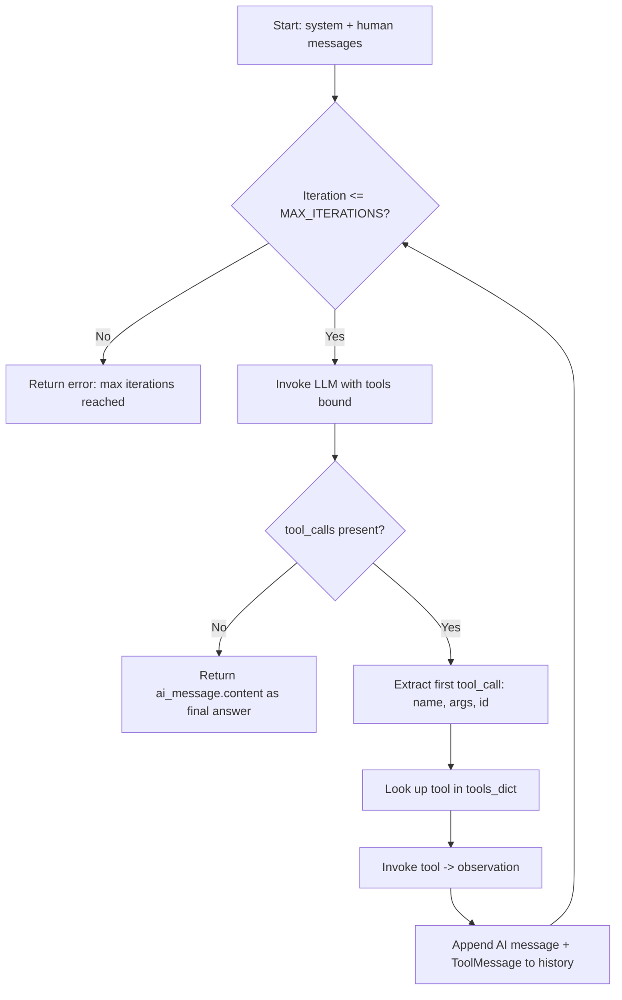

# ReAct Agent Loop with LangChain Tool Calling

## Metadata

- Topic: Building a ReAct-style AI agent loop manually using LangChain tool calling (before moving to raw SDK calls)
- Difficulty: Intermediate
- Tags: #langchain #agents #react-loop #tool-calling #llm
- Source: LangChain – Agentic AI Engineering course, Section 5 "[Layer 1] The ReAct Loop", Lessons 28 "Writing Tools", 29 "Tool Binding and Defensive Prompting", 30 "Understanding the ReAct Agent Loop in LangChain", 31 "Model Switch"
- Date: 2026-08-08

## Executive Summary

- The goal of this section is to implement the ReAct (Reason → Act → Observe) agent loop **manually**, using LangChain's building blocks (`tool`, chat models, message types), before later peeling back the abstraction entirely and doing it raw with the Ollama SDK.
- Two custom tools are defined with the `@tool` decorator: `get_product_price` and `apply_discount`, each with docstrings and type hints — both are sent to the LLM as part of function-calling metadata.
- `init_chat_model` lets you swap LLM providers/models by changing a single string (e.g. `ollama:qwen3:1.7b` → `openai:gpt-5`), as long as the provider's LangChain integration package (e.g. `langchain-openai`, `langchain-ollama`) is installed.
- `bind_tools()` attaches tool schemas to the model so it can return tool-call decisions — this only works with models that support function calling.
- The agent loop: send messages → LLM "thinks" → if it returns tool_calls, execute the tool and append the result back into message history → repeat until the LLM returns a final answer with no tool calls (or `MAX_ITERATIONS` is hit).
- Defensive prompting (strict system-message rules) is used to stop a smaller open-weight model (Qwen3 1.7B) from hallucinating prices or doing math itself instead of calling tools.
- `traceable` from `langsmith` is used to wrap the agent function so the whole run appears as one nested trace in LangSmith (tokens, latency, cost).
- **Key lesson from the Model Switch video**: being able to swap models by changing a string is convenient, but not sufficient for production — a newer/"smarter" model isn't automatically better for your specific agent; you must benchmark/evaluate before switching.

## Main Concepts & Theory

### The ReAct Loop (Reason → Act → Observe)

The loop iterates from 1 to `MAX_ITERATIONS`:

1. Send the current message history to the LLM.
2. LLM "thinks" (reasoning) and returns an AI message that either:
    - contains `tool_calls` (it wants to execute a tool), or
    - contains only `content` (it has the final answer, no tool needed).
3. If there are tool calls → extract the tool name, arguments, and tool call ID → look up and invoke the actual Python function → capture the result as an **observation**.
4. Append both the AI's tool-call message and the tool result (as a `ToolMessage`) back into the message history, so the LLM "remembers" what it already did.
5. Repeat until the LLM returns no tool calls (final answer) or iterations are exhausted.

> [!tip] Mental model Each iteration = one reasoning step. The message history is the agent's memory — every tool call and its result gets appended so the next LLM call has full context of what already happened.

### Tool Definition Pattern

- Tools are plain Python functions decorated with `@tool` from LangChain.
- The **docstring** and **type hints** are not just documentation — they get parsed and sent to the LLM as the function-calling schema (name, description, arguments, return type), formatted per-provider automatically.
- This gives one unified interface across providers instead of hand-writing provider-specific JSON schemas.

### Model Initialization & Provider Abstraction

- `init_chat_model(model_string)` initializes a chat model from a string like `"ollama:qwen3:1.7b"` or `"openai:gpt-5"`.
- Some model name prefixes auto-map to a provider (e.g. GPT/o1/o3 → OpenAI, DeepSeek → DeepSeek, Claude → Anthropic/Bedrock).
- Requirement: the relevant LangChain integration package must be installed (e.g. `langchain-openai`, `langchain-ollama`).
- Switching providers/models is then just a one-line string change — no code changes needed elsewhere, because `bind_tools`, message types (`HumanMessage`/`SystemMessage`/`ToolMessage`), etc. work identically across providers.

### Tool Binding

- `model.bind_tools(tools_list)` attaches the tool list/schema to the model so every request also carries tool descriptions.
- Only works with models/providers that support function calling.
- Because the interface is uniform, switching from Ollama to OpenAI or Anthropic requires no code change to the binding logic — just the model string.

### Defensive Prompting

Used to reduce hallucination risk, especially with smaller open-weight models (Qwen3 1.7B) that reason less reliably than top-tier function-calling models. Rules added to the system prompt:

- Never guess or assume a product price — always call `get_product_price`.
- Only call `apply_discount` **after** receiving a real price from `get_product_price`; never pass a made-up number.
- Never calculate discounts using its own math — always use the `apply_discount` tool.
- If the user doesn't specify a discount tier, ask them — don't assume one.

> [!warning] Mistakes to Avoid Smaller/open-weight models are more prone to hallucinating numeric values (like prices) and doing arithmetic themselves instead of invoking the correct tool. Defensive system-prompt rules mitigate this but add prompt length/complexity.

### LangSmith Tracing

- `@traceable` (from `langsmith`) wraps the agent function so the entire run is nested under one trace (e.g. named "LangChain Agent Loop").
- Because the `@tool` decorator auto-traces tool executions too, each tool call shows up nested inside the parent trace automatically.
- Traces surface: latency, token usage, cost, and the full input/output at each LLM call and tool call — useful for debugging and later evaluation work.

### Model Switching — Convenience vs. Production Readiness

- Swapping `ollama:qwen3` → `openai:gpt-5` (or later `gpt-5.2`) is literally a one-string change thanks to LangChain's abstraction layer.
- However: a model being labeled "state of the art" at time of use does **not** guarantee it performs well for your specific agent/use case. In the video, switching to a newer model (GPT-5.2) produced a worse/insufficient result (the agent asked a clarifying question it shouldn't have needed to) compared to GPT-5.
- **Conclusion**: before switching models in a production agent, first benchmark/evaluate candidate models against your actual use case — don't assume "newer = better." Evaluations are covered later in the course.

## Important Definitions

|Term|Definition|Why It Matters|
|---|---|---|
|ReAct loop|Reason → Act → Observe cycle: LLM reasons, optionally calls a tool, observes the result, repeats|Core control-flow pattern behind most tool-using agents, including LangChain's built-in `create_agent`|
|Observation|The result returned by executing a tool call|Fed back into the LLM's message history so it can reason using real data instead of guessing|
|`tool_calls`|Field on an AI message indicating which tool(s), if any, the LLM wants to invoke, with arguments|Empty `tool_calls` signals the LLM believes it has the final answer|
|`bind_tools()`|LangChain method that attaches tool schemas to a chat model so it can emit tool-call decisions|Required for function calling; only supported by models/providers with function-calling support|
|`init_chat_model`|Convenience function to initialize any supported chat model from a provider:model string|Enables one-line model/provider switching without changing surrounding code|
|Defensive prompting|Explicit system-prompt rules constraining what the LLM may/may not do (e.g. never guess a price)|Reduces hallucination, especially with smaller/open-weight models|
|`@traceable`|LangSmith decorator that nests all operations inside a function under one trace|Enables cost/latency/token visibility across an entire agent run|

## Code & Implementations

### Imports and Setup (Lesson 28)

```python
from dotenv import load_dotenv
load_dotenv()

from langchain.chat_models import init_chat_model
from langchain_core.tools import tool
from langchain_core.messages import HumanMessage, SystemMessage, ToolMessage

MAX_ITERATIONS = 10
model = "ollama:qwen3:1.7b"
```

- `load_dotenv()` loads environment variables (e.g. API keys) from a `.env` file.
- `MAX_ITERATIONS = 10` is a heuristic ceiling to prevent infinite agent loops; any number above 2 would work for this example.

### Defining Tools (Lesson 28)

```python
@tool
def get_product_price(product: str) -> float:
    """Get the price of a product from the catalog."""
    print(f"Executing get_product_price with product={product}")
    prices = {
        "laptop": 1299,
        "headphones": 199,
        "keyboard": 89,
    }
    return prices.get(product, 0)


@tool
def apply_discount(price: float, discount: str) -> float:
    """Apply a discount tier to a price and return the final price.
    Available tiers are bronze, silver and gold."""
    print(f"Executing apply_discount with price={price}, discount={discount}")
    discount_percentages = {
        "bronze": 5,
        "silver": 12,
        "gold": 23,
    }
    pct = discount_percentages[discount]
    return round(price * (1 - pct / 100), 2)
```

> [!tip] Best Practices Write clear docstrings and full type hints on every `@tool`-decorated function — they're parsed directly into the function-calling schema sent to the LLM.

### Agent Function Skeleton with LangSmith Tracing (Lesson 28)

```python
from langsmith import traceable

@traceable(name="LangChain Agent Loop")
def run_agent(question: str):
    ...

if __name__ == "__main__":
    print("Hello LangChain agent (.bind_tools)!")
    print()
    result = run_agent("What is the price for a laptop after applying the gold discount?")
```

### Tool Registry, Model Init, and Tool Binding (Lesson 29)

```python
tools = [get_product_price, apply_discount]
tools_dict = {t.name: t for t in tools}

llm = init_chat_model("ollama:qwen3:1.7b")
# To use OpenAI instead: init_chat_model("openai:gpt-5")

llm_with_tools = llm.bind_tools(tools)
```

- `tools_dict` maps tool name (as returned by the LLM in `tool_calls`) → actual Python tool object, so it can be invoked by name.

### System Prompt with Defensive Rules (Lesson 29)

```python
messages = [
    SystemMessage(content="""You are a helpful shopping assistant.
You have access to a product catalog tool and a discount tool.

Rules:
- Never guess or assume any product price.
- You must call the get_product_price tool to get the real price.
- Only call apply_discount after receiving the price from get_product_price.
  Do not pass a made-up number.
- Never calculate discounts yourself using math; always use the apply_discount tool.
- If the user does not specify a discount tier, ask them which tier — do not assume one.
"""),
    HumanMessage(content=question),
]
```

### Full Agent Loop Implementation (Lesson 30)

```python
def run_agent(question: str):
    messages = [
        SystemMessage(content="..."),  # system prompt from above
        HumanMessage(content=question),
    ]

    for iteration in range(1, MAX_ITERATIONS + 1):
        print(f"Iteration {iteration}")

        # THOUGHT step
        ai_message = llm_with_tools.invoke(messages)

        tool_calls = ai_message.tool_calls

        if not tool_calls:
            print("Final answer:")
            print(ai_message.content)
            return ai_message.content

        # Defensive: only handle the first tool call for simplicity
        # (LLMs can return multiple tool calls at once)
        tool_call = tool_calls[0]
        tool_name = tool_call["name"]
        tool_args = tool_call["args"]
        tool_call_id = tool_call["id"]

        print(f"Selected tool: {tool_name} with args: {tool_args}")

        selected_tool = tools_dict.get(tool_name)
        if not selected_tool:
            raise ValueError(f"Tool {tool_name} not found")

        # ACT step
        observation = selected_tool.invoke(tool_args)
        print(f"Observation: {observation}")

        # Feed the AI's tool call + the tool result back into history
        messages.append(ai_message)
        messages.append(
            ToolMessage(content=str(observation), tool_call_id=tool_call_id)
        )

    print("Error: max iterations reached")
    return None
```

### Model Switching (Lesson 31)

```python
# Original (Ollama):
llm = init_chat_model("ollama:qwen3:1.7b")

# Switch to OpenAI — only the string changes:
llm = init_chat_model("openai:gpt-5")
```

- Requires `langchain-openai` (or the relevant provider package) to already be installed in the virtual environment.
- No other code changes needed — `bind_tools`, message types, and the agent loop all remain identical.

## Visual Diagrams



## System Architecture & Trade-offs

**Architecture Flow:** `User question → SystemMessage + HumanMessage → LLM (with tools bound) → tool_call decision → tool execution → observation appended as ToolMessage → LLM re-invoked with updated history → ... → final answer (no tool_calls)`

**Trade-offs:**

- **Pros of LangChain abstraction**: unified message types and `bind_tools`/`init_chat_model` interface across providers; automatic tool tracing via `@tool`; very low code-change cost to swap models.
- **Cons / limits**: `bind_tools` and function calling only work with models/providers that support it; convenience of switching models can mask real performance differences between models on your specific task — swapping without benchmarking risks silent quality regressions in production.
- **Scaling/bottleneck note**: `MAX_ITERATIONS` is a safety valve against infinite loops but is a blunt heuristic (arbitrarily set to 10) — no dynamic cost/quality-based stopping criteria are used here.

## Common Pitfalls & Best Practices

> [!warning] Mistakes to Avoid
> 
> - Assuming a newer or more "state-of-the-art" model will automatically perform better for your agent — always benchmark on your actual use case first.
> - Letting an LLM guess numeric values (like prices) or do its own math instead of forcing tool use via defensive prompting — especially risky with smaller open-weight models.
> - Forgetting to append **both** the AI's tool-call message and the tool's result (`ToolMessage`) back into history — without this the agent loses memory of what it already did.
> - Not setting a `MAX_ITERATIONS` cap, risking an agent that loops indefinitely if it never stops requesting tool calls.

> [!tip] Best Practices
> 
> - Write full docstrings and type hints for every tool — they become the function-calling schema sent to the model.
> - Use a tool name → tool object dictionary for O(1) lookup when executing the LLM's chosen tool.
> - Wrap the whole agent function with `@traceable` so LangSmith gives you one consolidated trace per run (tokens, latency, cost).
> - Include the `tool_call_id` when constructing `ToolMessage`s — it links the tool result back to the exact tool call for tracing and correctness.
> - Only access the first tool call for simplicity in early examples, but be aware LLMs can return multiple tool calls in one response — production code should handle that case.

## Active Recall & Interview Prep

### Key Q&A Flashcards

Q: What are the three core steps of the ReAct loop implemented in this course? A: Reason (LLM decides what to do) → Act (execute the chosen tool) → Observe (feed the tool's result back into the LLM's context).

Q: How does the agent loop know when to stop iterating with a final answer? A: When the LLM's response contains no `tool_calls` (only `content`), signaling it believes it has the final answer.

Q: What LangChain function lets you switch LLM providers/models by only changing a string? A: `init_chat_model`.

Q: What must be installed for `init_chat_model` to work with a given provider? A: That provider's LangChain integration package (e.g. `langchain-openai`, `langchain-ollama`).

Q: What does `bind_tools()` do, and what's its main requirement? A: It attaches tool schemas to a chat model so the model can return tool-call decisions; it requires the underlying model/provider to support function calling.

Q: Why are docstrings and type hints on `@tool`-decorated functions important? A: They're parsed and sent to the LLM as the tool's function-calling schema (name, description, args, return type) — the LLM relies on this to decide when/how to call the tool.

Q: What is "defensive prompting" and why was it used here? A: Adding strict rules to the system prompt (e.g. never guess a price, always use the tool) to reduce hallucination risk, particularly needed because the example used a smaller open-weight model (Qwen3 1.7B).

Q: What two pieces of information get appended to message history after a tool executes? A: The AI message containing the tool call decision, and a `ToolMessage` containing the tool's result (observation), tagged with the tool_call_id.

Q: What's the purpose of `MAX_ITERATIONS` in the agent loop? A: A safety cap to stop the loop from running indefinitely if the LLM never stops requesting tool calls.

Q: What does `@traceable` from `langsmith` do? A: Wraps a function so all operations inside it are nested under a single trace in LangSmith, capturing latency, token usage, and cost for the entire run.

Q: In the Model Switch lesson, what happened when switching from GPT-5 to GPT-5.2? A: The newer model produced a worse result — the agent asked an unnecessary clarifying question — demonstrating that a "state-of-the-art" label doesn't guarantee better performance on a specific use case.

Q: What is the key lesson from the Model Switch video about production model swaps? A: Before switching models in production, benchmark/evaluate the candidate model against your specific use case rather than assuming a newer model is automatically better.

Q: Why does the code only process the first tool call even though `tool_calls` is a list? A: For simplicity in this example — LLMs can return multiple tool calls at once, but handling only the first keeps the example more digestible (production code should handle the full list).

Q: What does an empty return value from `get_product_price` (i.e. 0) indicate? A: The requested product wasn't found in the price dictionary/catalog.

### Practical Practice Scenario

Scenario/Question: You want to add a third tool, `check_stock(product: str) -> bool`, to this agent so it can verify inventory before quoting a discounted price. What changes are needed?

Solution/Approach:

1. Define the tool with `@tool`, a clear docstring, and type hints (e.g. `"""Check whether a product is currently in stock."""`).
2. Add it to the `tools` list so it's included in `tools_dict` and passed to `bind_tools`.
3. Update the system prompt's defensive rules to instruct the LLM when to call `check_stock` relative to `get_product_price`/`apply_discount` (e.g. "Always check stock before quoting a discounted price").
4. No changes needed to the loop logic itself — `tools_dict` lookup and the ToolMessage-append pattern already generalize to any number of tools.

## One-Page Cheat Sheet

- ReAct loop: Reason → Act → Observe, repeat until no `tool_calls`
- `@tool` decorator → docstring + type hints become function-calling schema
- `init_chat_model("provider:model")` → one-string model/provider switch
- Requires provider's LangChain package installed (e.g. `langchain-openai`)
- `bind_tools(tools_list)` → only works with function-calling-capable models
- `tools_dict = {t.name: t for t in tools}` → name→function lookup
- Loop: `llm_with_tools.invoke(messages)` → check `ai_message.tool_calls`
- No tool_calls → final answer; return `ai_message.content`
- Tool call present → extract `name`, `args`, `id` → invoke tool → get observation
- Append AI message + `ToolMessage(content, tool_call_id)` to history each iteration
- `MAX_ITERATIONS` heuristic cap (here: 10) prevents infinite loops
- Defensive prompting reduces hallucination in smaller/open-weight models
- `@traceable` (langsmith) → nests entire run under one trace
- Model-switch convenience ≠ production readiness — benchmark before swapping
- Newer/SOTA model ≠ guaranteed better for your specific agent/use case