# Model Context Protocol (MCP): Core Architecture & Fundamentals

---

## Metadata

Topic: Model Context Protocol (MCP) Architectural Overview

Difficulty: Beginner to Intermediate

Tags: #mcp #llm #ai-architecture #context #tool-calling #system-design

Source: Video Transcript — MCP Fundamentals

Date: 2026-08-04

---

# Executive Summary

* **Definition**: Model Context Protocol (MCP) is an open standard that connects Large Language Models (LLMs) to external data sources, applications, and tools.
* **Core Problem**: LLMs are isolated from dynamic, real-world context and limited strictly to their static training data.
* **Solution**: MCP standardizes how context, resources, and execution tools are exposed to AI models.
* **The 3 Pillars**:
1. **Model**: The LLM / AI system requiring context.
2. **Context**: Relevant external data, state, or prompts.
3. **Protocol**: A universal, standardized set of communication rules (analogous to HTTP or spoken language).


* **Decoupling**: Eliminates custom, N×M point-to-point integrations between every model and every database/API.
* **Client-Server Model**: Functions on a architecture where Hosts/Clients route LLM intents to specialized MCP Servers.
* **Key Mechanisms**: Provides standard abstractions for **Tools** (actions), **Resources** (data reading), and **Prompts** (structured templates).

---

# Main Notes

## The Core Need: Why MCP Exists

LLMs operate under a fundamental limitation: **context isolation**. Once training finishes, an LLM possesses static knowledge up to its cutoff date.

To provide accurate, coherent, and domain-specific responses, LLMs need a structured mechanism to fetch live, external knowledge.

```
       ┌────────────────────────────────────────────────────────┐
       │                       LLM Core                         │
       └───────────────────────────┬────────────────────────────┘
                                   │ Requires Context
               ┌───────────────────┼───────────────────┐
               ▼                   ▼                   ▼
       ┌──────────────┐    ┌──────────────┐    ┌──────────────┐
       │    Tools     │    │  Resources   │    │ Applications │
       │ (Executions) │    │ (Read Data)  │    │ (State/APIs) │
       └──────────────┘    └──────────────┘    └──────────────┘

```

Historically, connecting models to external systems required writing custom integration code (tool calling wrappers, custom API callers) for every specific model and data source pair. MCP replaces this fragmented ecosystem with a single standard.

---

## Deconstructing "Model Context Protocol"

The name explicitly defines its design philosophy:

| Term         | Definition                                                     | Role in System                                                                  |
| ------------ | -------------------------------------------------------------- | ------------------------------------------------------------------------------- |
| **Model**    | Large Language Models (LLMs) & AI inference systems            | The decision-making center that processes context and generates output.         |
| **Context**  | Relevant external data, enterprise information, state, & tools | The material provided to the LLM to yield accurate, timely answers.             |
| **Protocol** | Standardized set of rules and message formats                  | The contract enabling seamless communication between models and data providers. |

---

## The Protocol Analogy

Think of MCP like **human language** or **HTTP**:

* Without a shared language, two people must invent a new communication method for every conversation.
* With a standardized language (e.g., English), anyone can share ideas instantly.
* Similarly, MCP acts as the **HTTP for AI context**, standardizing how AI systems read files, query databases, and trigger workflow actions.

---

# Important Definitions

| Term | Definition | Why It Matters |
| --- | --- | --- |
| **Model Context Protocol (MCP)** | An open specification for standardizing how applications provide context to LLMs. | Eliminates custom glue code and enables universal interoperability between LLMs and data sources. |
| **MCP Host / Client** | An application (like Claude Desktop, VS Code, or an agent framework) that contains the LLM and initiates requests to MCP servers. | Acts as the interface orchestrating communication between the user, the model, and external tools. |
| **MCP Server** | A lightweight service exposing capabilities (Tools, Resources, Prompts) via the MCP standard. | Isolates data access and execution logic from the LLM host. |
| **Tool** | An executable function exposed by an MCP Server that allows an LLM to take actions. | Enables LLMs to perform side-effects (e.g., executing code, sending emails, updating records). |
| **Resource** | Read-only data points (files, API responses, database records) made available to the LLM. | Provides passive context to the model without side-effects. |
| **Prompt Template** | Pre-configured prompt structures provided by MCP Servers. | Standardizes interaction workflows and complex multi-step user prompts. |

---

# Mental Models

| Concept                    | Analogy                   | Description                                                                                                                                                          |
| -------------------------- | ------------------------- | -------------------------------------------------------------------------------------------------------------------------------------------------------------------- |
| **Model Context Protocol** | **USB-C Standard**        | Instead of requiring custom charging ports/adapters for every device, USB-C provides one standard connection for power and data. MCP is the universal port for LLMs. |
| **MCP Host / Client**      | **Web Browser**           | The browser doesn't host all websites locally; it uses a protocol (HTTP) to query external servers and render content.                                               |
| **MCP Server**             | **Database / API Driver** | Provides a structured interface so applications don't need to know how the underlying hardware or engine executes the query.                                         |

---

# Visual Diagrams

### MCP System Topology

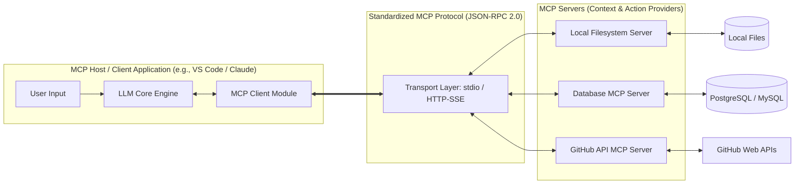

---

### Request-Response Sequence Flow

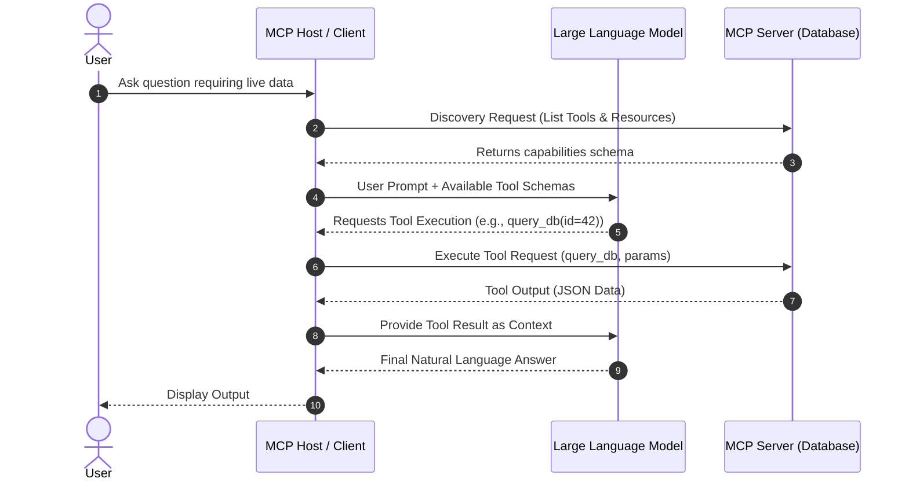

---

# Code Examples

The following example demonstrates building a minimal Python MCP Server that exposes both a **Resource** (read-only file context) and a **Tool** (execution capability).

```python
import asyncio
from mcp.server import Server
from mcp.server.stdio import stdio_server
from mcp.types import Tool, TextContent, Resource, ReadResourceResult

# Initialize the MCP Server instance
app = Server("system-info-server")

# Expose a Read-Only Resource
@app.list_resources()
async def list_resources():
    return [
        Resource(
            uri="file:///logs/system.log",
            name="System Health Log",
            mimeType="text/plain"
        )
    ]

@app.read_resource()
async def read_resource(uri: str) -> str:
    if uri == "file:///logs/system.log":
        # In a real app, read from actual system log source
        return "2026-08-04 11:00:00 [INFO] System operating at optimal capacity."
    raise ValueError(f"Resource not found: {uri}")

# Expose an Executable Tool
@app.list_tools()
async def list_tools():
    return [
        Tool(
            name="fetch_user_status",
            description="Fetches current status of a user by user_id",
            inputSchema={
                "type": "object",
                "properties": {
                    "user_id": {"type": "string", "description": "The target User ID"}
                },
                "required": ["user_id"]
            }
        )
    ]

@app.call_tool()
async def call_tool(name: str, arguments: dict):
    if name == "fetch_user_status":
        user_id = arguments.get("user_id")
        # Perform action / fetch context
        result_text = f"User {user_id} is ACTIVE."
        return [TextContent(type="text", text=result_text)]
    raise ValueError(f"Unknown tool: {name}")

async def main():
    # Run the server using Standard I/O transport
    async with stdio_server() as streams:
        await app.run(
            streams[0],
            streams[1],
            app.create_initialization_options()
        )

if __name__ == "__main__":
    asyncio.run(main())

```

### Explanation of Key Lines:

* `Server("system-info-server")`: Instantiates the server context that exposes tools/resources.
* `@app.list_tools()`: Registers available functions with JSON Schema input specs so the LLM knows how to call them correctly.
* `@app.call_tool()`: Handlers that map LLM intent execution requests to underlying python methods.
* `stdio_server()`: Connects the server to standard input/output for local parent-process communication.

---

# Step-by-Step Flow

### End-to-End Execution Flow of an MCP Session

```
1. Client Handshake
   └── Host connects to MCP Server (via stdio or HTTP/SSE) and exchanges capability flags.

2. Discovery Phase
   └── Host requests `tools/list` and `resources/list` to understand server capabilities.

3. Context Formatting
   └── Host injects available tool definitions into the LLM system prompt.

4. Model Invocation
   └── User submits query -> LLM decides an external tool execution is required.

5. Tool Execution Dispatch
   └── Host receives tool execution payload from LLM and relays it via JSON-RPC to MCP Server.

6. Response & Context Injection
   └── Server executes logic, returns data to Host, which appends it into the LLM's active message context.

7. Final Generation
   └── LLM synthesizes original prompt + retrieved context to produce the answer.

```

---

# Real World Applications

MCP is utilized across modern software ecosystems to give AI systems structured real-time access:

* **IDE / Developer Tools**: Connecting models directly to local repository ASTs, git history, and runtime debug logs.
* **Enterprise Search & RAG**: Querying corporate knowledge bases (Confluence, Notion, Slack) dynamically without manual embeddings sync.
* **Database Management**: Allowing LLMs to safely query schemas, run read-only SQL, or generate migrations against live DBs.
* **DevOps Orchestration**: Connecting agents directly to Kubernetes clusters, AWS APIs, or CI/CD pipelines to monitor and debug deployments.

---

# Interview Questions

### Beginner

> **Q: What is the primary purpose of the Model Context Protocol (MCP)?**
> **A:** MCP provides a open standard for connecting LLMs to external data sources, applications, and tools. It removes the need to write custom integration code for every model-data source pair.

> **Q: What are the three core primitives exposed by an MCP Server?**
> **A:**
> 1. **Tools**: Functions the LLM can execute (actions with side-effects).
> 2. **Resources**: Read-only data sources (files, API payloads, DB records).
> 3. **Prompts**: Pre-defined prompt templates to structure user interactions.
> 
> 

---

### Intermediate

> **Q: How does MCP solve the $N \times M$ integration problem in AI applications?**
> **A:** Without MCP, $N$ AI models/clients require custom integrations for $M$ data sources, resulting in $N \times M$ unique connectors. MCP provides a unified interface, reducing the complexity to $N + M$ (each model and data source only implements the MCP standard once).

> **Q: What are the primary transport mechanisms supported by MCP?**
> **A:**
> * **Standard I/O (`stdio`)**: Used for local process communication (e.g., Desktop app starting local tool binaries).
> * **HTTP with Server-Sent Events (SSE)**: Used for remote, network-based server communication.
> 
> 

---

### Advanced

> **Q: How does MCP maintain security and user consent during tool execution?**
> **A:** The MCP Host sits between the LLM and the MCP Server as an explicit gateway. The LLM cannot execute tools directly; it can only request execution. The MCP Host intercepts tool requests and can prompt the user for manual approval before forwarding the JSON-RPC execution command to the server.

---

# Common Mistakes

> [!warning]
> **Confusing MCP with RAG (Retrieval-Augmented Generation)**
> * *Mistake*: Thinking MCP is an alternative retrieval algorithm or vector database.
> * *Correction*: MCP is a **communication protocol**, not a retrieval algorithm. RAG systems can be *exposed through* an MCP Server as a Resource or Tool.
> 
> 

> [!warning]
> **Allowing Unbounded Side-Effects in Tools**
> * *Mistake*: Exposing destructive tools (e.g., `DROP DATABASE`, `delete_file`) without safety wrappers or user confirmations.
> * *Correction*: Design MCP servers with clear read/write separation. Use **Resources** for safe, read-only context retrieval, and enforce approval policies on **Tools**.
> 
> 

---

# Memory Tricks

## **MCP** Architecture Mnemonic: **R.A.P.**

* **R**esources $\rightarrow$ **Read-Only Data** (Files, DBs)
* **A**ctions $\rightarrow$ **Tools** (Execute side effects)
* **P**rompts $\rightarrow$ **Pre-defined Templates** (Structured inputs)

---

# Comparison Tables

| Feature | Custom Tool Calling Protocols | Model Context Protocol (MCP) |
| --- | --- | --- |
| **Standardization** | Proprietary per model vendor | Vendor-agnostic open specification |
| **Interoperability** | Low (code written for OpenAI doesn't run on Claude/Ollama easily) | High (Write an MCP server once, use across any supported host) |
| **Transport Layer** | Ad-hoc (Custom REST endpoints, inline code) | Standardized (`stdio`, HTTP + SSE) |
| **Primitives** | Usually function/tool calling only | Tools, Read-only Resources, and Prompt Templates |
| **Architecture** | Direct API binding | Decoupled Client-Server model |

---

# Revision Sheet (One Page)

```
================================================================================
                           MCP REVISION CHEAT SHEET
================================================================================

1. CORE DEFINITION
   • MCP = Open protocol standardizing LLM <-> External Context communication.

2. THE TRIAD
   • MODEL    : The AI mind (LLM) needing context.
   • CONTEXT  : Real-time, external knowledge (Data/State/APIs).
   • PROTOCOL : Unified rules enabling communication.

3. PRIMITIVES
   • TOOLS     : Executable actions (e.g., execute_sql(), send_email()).
   • RESOURCES : Read-only data payloads (e.g., system logs, file streams).
   • PROMPTS   : Pre-built conversation templates.

4. ARCHITECTURE & TRANSPORTS
   • Host/Client <--- JSON-RPC 2.0 ---> Server
   • stdio     : Local desktop processes.
   • HTTP-SSE  : Remote web infrastructure.

5. ADVANTAGES
   • Eliminates N x M integration overhead.
   • Decouples model providers from underlying enterprise software stack.
   • Enables explicit user-in-the-loop security boundaries.
================================================================================

```

---

# Flashcards

Q: What does MCP stand for?

A: Model Context Protocol.

Q: Why are LLMs inherently dependent on external protocols like MCP?

A: Because LLMs are isolated from live knowledge once trained and require structured ways to access current context and tools.

Q: What is an MCP Host?

A: The client-side application (e.g., VS Code, Claude Desktop) that hosts the LLM and manages connections to MCP servers.

Q: What is an MCP Server?

A: A program that exposes data resources, executable tools, and prompt templates adhering to the MCP specification.

Q: How does a Tool differ from a Resource in MCP?

A: Tools perform active executions (with side-effects), whereas Resources are read-only data streams.

Q: What protocol format is used under the hood for MCP message exchange?

A: JSON-RPC 2.0.

Q: What are the two primary transport implementations in MCP?

A: Standard Input/Output (`stdio`) for local processes and HTTP with Server-Sent Events (SSE) for remote servers.

Q: What problem does standardizing context protocols solve for AI developers?

A: It avoids writing custom integration wrappers for every distinct combination of model vendor and API data source.

---

# Practice Questions

### Easy

1. Identify whether fetching a system log file should be exposed as an MCP **Resource** or an MCP **Tool**.
* *Answer*: Resource (it is a read-only context retrieval operation).


### Medium

2. Describe the sequence of events when an LLM decides to run a tool exposed by an MCP Server.
* *Answer*: The LLM returns a structured tool call response to the Host. The Host intercepts this request, validates schema/user consent, transmits a JSON-RPC request to the MCP Server, receives the tool execution output, and passes it back to the LLM to complete its response.


### Hard

3. Explain how the Client-Server separation in MCP aids in secure enterprise system design.
* *Answer*: It isolates direct system credentials inside the MCP Server process boundary. The LLM host never directly touches database credentials or API keys; it only issues schema-validated execution requests over standard transports (`stdio`/`SSE`), allowing administrators to apply fine-grained permissioning and user-confirmation checks at the host layer.


---

# Programming & System Design Specifications

## Project & Architecture Overview

### Typical MCP System Topology

```
┌────────────────────────────────────────────────────────┐
│                      MCP Client                        │
│             (e.g., Claude Desktop, Cursor)             │
└───────────────────────────┬────────────────────────────┘
                            │
               JSON-RPC 2.0 │ Transports (stdio / SSE)
                            │
            ┌───────────────┼───────────────┐
            ▼               ▼               ▼
     ┌─────────────┐ ┌─────────────┐ ┌─────────────┐
     │ Postgres    │ │ Github      │ │ Slack       │
     │ MCP Server  │ │ MCP Server  │ │ MCP Server  │
     └──────┬──────┘ └──────┬──────┘ └──────┬──────┘
            │               │               │
            ▼               ▼               ▼
      [(PostgresDB)]   [GitHub API]    [Slack API]

```

### Folder Structure (Standard Python MCP Server)

```text
mcp-custom-server/
├── README.md
├── pyproject.toml
├── requirements.txt
└── src/
    └── mcp_server/
        ├── __init__.py
        ├── __main__.py
        ├── server.py
        ├── tools/
        │   ├── __init__.py
        │   └── system_tools.py
        └── resources/
            ├── __init__.py
            └── log_resources.py

```

### Best Practices

> [!tip]
> **Design Principles for MCP Implementations**
> 1. **Keep Servers Granular**: Build small, single-responsibility MCP servers (e.g., an isolated GitHub server, a Postgres server) rather than monolithic servers.
> 2. **Explicit Schemas**: Always write detailed field descriptions in tool schemas. The LLM relies directly on parameter descriptions to construct valid calls.
> 3. **Idempotency**: Strive to make tools idempotent whenever possible to prevent unexpected side-effects if an LLM retries a tool call.
> 
> 

---

## Background Knowledge (Added)

> [!note]
> **Understanding JSON-RPC 2.0**
> MCP relies internally on **JSON-RPC 2.0**, a stateless, light-weight Remote Procedure Call protocol.
> A typical tool execution message sent over stdin/stdout looks like this:
> ```json
> {
>   "jsonrpc": "2.0",
>   "method": "tools/call",
>   "params": {
>     "name": "fetch_user_status",
>     "arguments": { "user_id": "usr_12345" }
>   },
>   "id": 1
> }
> 
> ```
> 
> 

---

# Key Takeaways

1. LLMs are constrained by their static training data and require external context to answer live or domain-specific questions.
2. Tools, resources, and applications provide the gateway for LLMs to observe and interact with the world.
3. Model Context Protocol (MCP) standardizes communication between models and external applications.
4. "Model" represents the central LLM engine; "Context" represents external knowledge/state; "Protocol" defines standard rules.
5. MCP replaces non-standard point-to-point glue code with a clean client-server interface.
6. Communication is categorized into Resources (data retrieval), Tools (action execution), and Prompts (workflow templates).
7. MCP Hosts mediate between the user, the model, and the external server to preserve security boundaries.
8. Transports include `stdio` for local process IPC and `HTTP + SSE` for distributed remote architectures.
9. MCP simplifies the integration ecosystem from an $N \times M$ matrix down to an $N + M$ standard architecture.
10. The protocol empowers AI systems to safely perform real-world workflows while maintaining user-in-the-loop control.


----


# Fundamental Digital Communication & Client-Server Architecture

## Metadata

Topic: Client-Server Architecture, Networking Protocols, and System Interoperability

Difficulty: Beginner to Intermediate

Tags: #networking #client-server #protocols #http #ftp #mcp #system-design #architecture

Source: Video Transcript — Digital Communication & Protocol Foundations

Date: 2026-08-04

# Executive Summary

- **Foundational Analogy**: Digital networks rely on the **Client-Server Model**—a request-response paradigm mirroring a restaurant where patrons (clients) order from a structured menu provided by the kitchen (server).
    
- **The Server**: A specialized physical machine or process that hosts resources, data, or functionalities (e.g., Web, Database, Email servers) and listens for incoming requests.
    
- **The Client**: Any device, program, or user interface (e.g., browser, mobile app, AI host) that initiates requests for data or execution.
    
- **Network Protocols**: Protocols are standardized "rules of engagement" specifying message formatting, timing, sequence, and error handling. Without protocols, data exchanges collapse into uninterpretable binary noise ("gibberish").
    
- **Established Standards**: Traditional protocols like **HTTP** (web content) and **FTP** (files) define how machines communicate across the internet.
    
- **Relevance to MCP**: The Model Context Protocol (**MCP**) adapts this exact client-server networking paradigm to AI context retrieval—transforming LLM context fetching into a structured, protocol-driven transaction.
    

# Main Notes

## The Client-Server Architecture

Modern digital communication relies on the separation of concerns between consumers of data (**Clients**) and providers of data or execution (**Servers**).

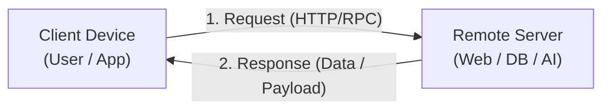

1. **Client**: Initiates communication by formulating a request according to an agreed-upon protocol.
    
2. **Network/Internet**: Acts as the routing medium to deliver packets between client and server endpoints.
    
3. **Server**: Operates in a continuous listening state, processes incoming requests, executes necessary computations, and returns a structured response.
    
4. **Lifecycle**: Connections open $\rightarrow$ Requests dispatch $\rightarrow$ Processing completes $\rightarrow$ Responses return $\rightarrow$ Connection closes/persists according to protocol rules.
    

## Protocols: The Digital "Rules of Engagement"

A **protocol** is a mutually agreed-upon set of rules governing machine-to-machine communication.

### Key Aspects Governed by Protocols:

- **Message Format**: Header structure, encoding, payload schemas (e.g., JSON, XML, Binary).
    
- **Message Sequence**: The exact handshakes and ordering required to complete a transaction.
    
- **Timing & State**: Timeout thresholds, retry logic, and connection state management.
    
- **Error Handling**: Standardized error codes and exception reporting (e.g., HTTP `404 Not Found` or `500 Server Error`).
    

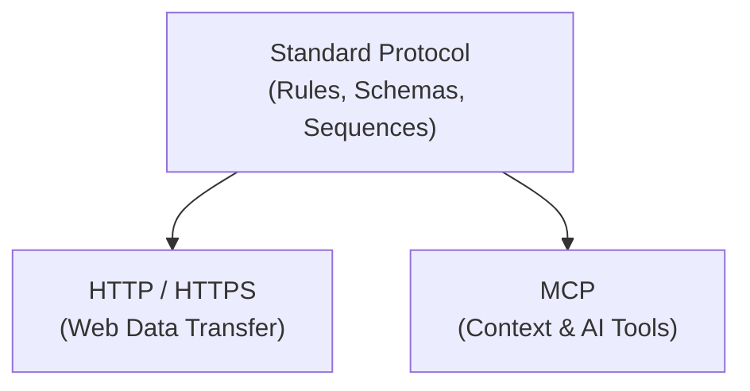

## Parallels: Traditional Web Protocols vs. MCP

The Model Context Protocol (MCP) does not reinvent digital networking; it applies proven client-server architecture directly to Artificial Intelligence systems.

|**Layer / Aspect**|**Traditional Web Communication**|**Model Context Protocol (MCP)**|
|---|---|---|
|**Client Role**|Web Browser / Mobile App|AI Host Application (e.g., VS Code, Claude Desktop)|
|**Server Role**|Web Server / REST API / Database Server|MCP Server (e.g., GitHub Connector, Local DB Server)|
|**Protocol Purpose**|Transfer Web Content (HTML, JSON, Images)|Expose Prompts, Resources, and Executable Tools|
|**Standard Protocol**|HTTP / HTTPS / FTP|MCP over JSON-RPC 2.0|
|**Underlying Goal**|Interoperable human-to-machine data delivery|Interoperable LLM-to-system context integration|

# Important Definitions

|**Term**|**Definition**|**Why It Matters**|
|---|---|---|
|**Server**|A physical or virtual computing system dedicated to providing data, resources, or services to external entities.|Centralizes data storage and business logic for distributed applications.|
|**Client**|A software application or hardware device that requests data or services from a server.|Acts as the interface through which users or local engines interact with remote networks.|
|**Protocol**|A standardized system of rules that governs data transmission between computers.|Ensures distinct, heterogeneous systems can communicate without custom hardware or ad-hoc wrappers.|
|**HTTP (Hypertext Transfer Protocol)**|An application-layer protocol for transmitting hypermedia documents across the web.|Powers the global World Wide Web and serves as the architectural template for modern API standards.|
|**Request-Response Cycle**|The fundamental pattern where a client sends a query and waits for a server's computed output.|Establishes predictable control flow and state management across networks.|

# Mental Models

|**Concept**|**Analogy**|**Description**|
|---|---|---|
|**Server**|**Restaurant Kitchen**|Possesses resources (ingredients/recipes) and waits for orders to process and deliver back to patrons.|
|**Client**|**Restaurant Patron**|Looks at available menu options, formulates a specific request, and waits for the order to be served.|
|**Protocol**|**Restaurant Menu & Etiquette**|The agreed-upon language and rules (e.g., "order by item number", "pay at the counter") that prevent chaos between patrons and kitchen staff.|

# Visual Diagrams

### Client-Server Network Routing Flow

Code snippet

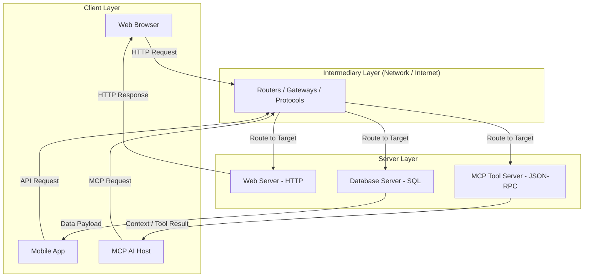

### Request-Response Sequence with Error Handling

Code snippet

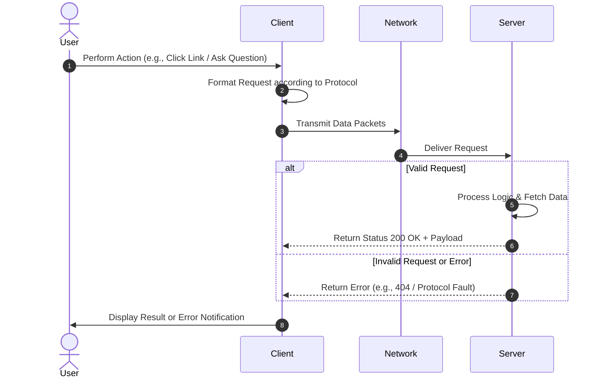

# Code Examples

The following example illustrates a minimal Client-Server implementation using Python's native socket interface to demonstrate low-level request-response networking under a custom protocol.

### Server Implementation (`server.py`)

Python

```python
import socket

def start_server(host='127.0.0.1', port=65432):
    # Create a TCP/IP socket
    with socket.socket(socket.AF_INET, socket.SOCK_STREAM) as server_socket:
        server_socket.bind((host, port))
        server_socket.listen()
        print(f"[SERVER] Listening on {host}:{port}...")

        while True:
            # Block and wait for incoming client connections
            conn, addr = server_socket.accept()
            with conn:
                print(f"[SERVER] Connected by client at {addr}")
                data = conn.recv(1024) # Receive up to 1024 bytes
                if not data:
                    break

                request_message = data.decode('utf-8')
                print(f"[SERVER] Received request: {request_message}")

                # Process request according to simple protocol rules
                if request_message == "GET_TIME":
                    response = "PROTOCOL_OK: 2026-08-04 11:00:00 UTC"
                else:
                    response = "PROTOCOL_ERROR: Unknown Command"

                # Send response back to client
                conn.sendall(response.encode('utf-8'))

if __name__ == "__main__":
    start_server()
```

### Client Implementation (`client.py`)

Python

```mermaid
import socket

def send_request(command="GET_TIME", host='127.0.0.1', port=65432):
    # Create a TCP/IP socket
    with socket.socket(socket.AF_INET, socket.SOCK_STREAM) as client_socket:
        client_socket.connect((host, port))
        
        print(f"[CLIENT] Sending command: {command}")
        client_socket.sendall(command.encode('utf-8'))

        # Wait for server response
        response = client_socket.recv(1024)
        print(f"[CLIENT] Server Response: {response.decode('utf-8')}")

if __name__ == "__main__":
    send_request("GET_TIME")
```

### Explanation of Key Lines:

- `socket.socket(...)`: Initializes the low-level transport layer interface (TCP/IP).
    
- `server_socket.bind(...)` & `listen()`: Configures the process as a listening server endpoint.
    
- `conn.recv(1024)`: Reads raw byte stream delivered over the network.
    
- `data.decode('utf-8')`: Parses bytes into text according to string encoding rules (protocol step).
    

# Step-by-Step Flow

### Standard Networking Lifecycle

```
1. Server Initialization
   └── Server process binds to a network port and enters a listening loop.

2. Client Request Dispatch
   └── Client opens a connection and transmits structured message packets over the network.

3. Intermediate Routing
   └── Routers and gateways direct packets to the target IP address and port.

4. Server Processing
   └── Server parses request headers, verifies protocol compliance, and executes logic.

5. Response Transmission
   └── Server formats payload and status codes, transmitting data back to client.

6. Connection Termination
   └── Connection closes or transitions to persistent keep-alive state based on protocol rules.
```

# Real World Applications

The Client-Server model underpins almost all modern software infrastructure:

- **Web Browsing**: Browsers (Clients) fetching HTML/CSS/JS from web servers via **HTTP/HTTPS**.
    
- **Database Systems**: Application servers (Clients) executing queries against database management systems like PostgreSQL or MySQL via proprietary wire protocols.
    
- **Model Context Protocol (MCP)**: AI Applications (Clients) querying local or remote MCP servers for tools and database access via **JSON-RPC 2.0**.
    
- **Cloud Storage**: Desktop apps syncing local state with S3/GCS servers via **REST APIs**.
    

# Interview Questions

### Beginner

> **Q: What is the primary difference between a Client and a Server?**
> 
> **A:** A Client is an active component that requests services, resources, or data; a Server is a reactive component that listens for, processes, and responds to incoming client requests.

> **Q: What happens if two computers try to communicate without a shared protocol?**
> 
> **A:** Communication fails because neither machine can decode the byte stream, handle error states, or determine message boundaries, resulting in uninterpretable data ("gibberish").

### Intermediate

> **Q: Why is error handling an essential feature of network protocols?**
> 
> **A:** Networks are unreliable by nature. Protocols define standard error codes (e.g., HTTP `404`, `500`) so clients can gracefully handle network drops, missing resources, or server errors instead of crashing.

> **Q: How does MCP leverage the classical Client-Server architecture?**
> 
> **A:** MCP isolates the LLM host (Client) from external data connectors (Servers). The Host sends standard JSON-RPC execution requests, and the Server processes them against external infrastructure, returning structured outputs.

### Advanced

> **Q: How do protocol definitions impact scalability in distributed systems?**
> 
> **A:** Well-defined, stateless protocols (like HTTP or JSON-RPC over MCP) allow systems to scale horizontally. Load balancers can route requests to any available server instance because the protocol standardizes payload structure independently of specific server implementations.

# Common Mistakes

> [!warning]
> 
> **Assuming Servers Must Be Remote Cloud Machines**
> 
> - _Mistake_: Thinking a server always resides in a distant data center.
>     
> - _Correction_: A server is a software role. An MCP server or database server often runs locally on `localhost` via process streams (`stdio`) on the user's local laptop.
>     

> [!warning]
> 
> **Confusing Transport Protocols with Application Protocols**
> 
> - _Mistake_: Treating TCP/IP and HTTP as the same layer.
>     
> - _Correction_: TCP/IP is a **transport protocol** (delivers raw bytes reliably), while HTTP/MCP are **application protocols** (define what those bytes mean).
>     

# Memory Tricks

## Protocol Core Functions: **F.A.S.T.**

- **F**ormat $\rightarrow$ Structural payload rules
    
- **A**cknowledgement $\rightarrow$ Status codes and responses
    
- **S**equence $\rightarrow$ Handshake and order of operations
    
- **T**iming $\rightarrow$ Timeout boundaries and retries
    

# Comparison Tables

|**Feature**|**Low-Level Transport (e.g., TCP)**|**High-Level Application Protocol (e.g., HTTP / MCP)**|
|---|---|---|
|**Layer**|Transport Layer (Layer 4)|Application Layer (Layer 7)|
|**Responsibility**|Packet delivery, ordering, and retry logic|Meaningful domain commands, schema validation, and context payloads|
|**Data Format**|Raw binary packets|JSON, Text, HTML, or structured RPC payloads|
|**Example**|TCP, UDP|HTTP, FTP, MCP (JSON-RPC)|

# Revision Sheet (One Page)

```
================================================================================
                    CLIENT-SERVER & NETWORKING CHEAT SHEET
================================================================================

1. CLIENT-SERVER MODEL
   • CLIENT : Requesting entity (Browser, Mobile App, LLM Host).
   • SERVER : Listening/Serving entity (Web, Database, MCP Server).
   • FLOW   : Client Request  ---> Network ---> Server Processing ---> Response

2. NETWORKING PROTOCOLS
   • DEFINITION : Agreed-upon rules governing communication formats and timing.
   • PURPOSE    : Prevents data stream corruption and enables multi-vendor compatibility.
   • CORE COMPONENTS: Message format, sequence, timing, error handling.

3. COMMON PROTOCOLS
   • HTTP : Hypertext Transfer Protocol (Web content).
   • FTP  : File Transfer Protocol (Bulk file transfer).
   • MCP  : Model Context Protocol (AI Context, Resources, and Tool Calling).

4. KEY TAKEAWAY FOR MCP
   • MCP adapts classical client-server network separation to AI development, 
     making LLMs the Client and contextual APIs/tools the Servers.
================================================================================
```

# Flashcards

Q: What is a server in digital communication?

A: A system or process that provides resources, data, or capabilities to other requesting entities over a network.

Q: What is a client?

A: An application or device that initiates requests to a server for resources or execution.

Q: What is a network protocol?

A: A standardized set of rules and formats that machines use to communicate accurately across a network.

Q: What analogy best describes the client-server relationship?

A: A restaurant patron (client) ordering food from a kitchen (server) using a standardized menu (protocol).

Q: Name two standard application-layer protocols mentioned in the transcript.

A: HTTP (Hypertext Transfer Protocol) and FTP (File Transfer Protocol).

Q: Why are protocols required for computer networking?

A: Without protocols, computers receive raw unformatted data streams ("gibberish") that cannot be decoded or processed.

Q: How does a server know what action a client wants performed?

A: By parsing the structured headers and payload body defined by the underlying communication protocol.

Q: Is an MCP Server required to run on a remote cloud network?

A: No, MCP servers can run locally on the same machine via Standard I/O (`stdio`) or remotely over HTTP/SSE.

# Practice Questions

### Easy

1. Identify the Client and Server in a setup where VS Code requests file contents from a local git repository via an MCP plugin.
    
    - _Answer_: VS Code is the **Client**; the MCP Git plugin/process is the **Server**.
        

### Medium

2. What are the four core elements defined by a communication protocol?
    
    - _Answer_: Format, timing, sequence, and error handling.
        

### Hard

3. Compare how an error is communicated in HTTP versus how an error might be communicated in a custom low-level TCP socket program without a protocol.
    
    - _Answer_: HTTP uses standardized status codes (e.g., `404 Not Found`, `500 Internal Server Error`) that any standard browser can parse. A raw TCP socket without an application protocol will either drop the connection silently or send arbitrary bytes that the client cannot interpret as an error state without pre-written custom parsing logic.
        

# Key Takeaways

1. The client-server model is the foundational architecture powering modern digital networking and the internet.
    
2. Servers host data, resources, and execution logic, operating in a listening state.
    
3. Clients initiate transactions by dispatching requests over a network medium.
    
4. Protocols are the essential "rules of engagement" that define message formats, sequencing, timing, and error behavior.
    
5. Without protocols, data transfers collapse into uninterpretable binary noise.
    
6. HTTP and FTP are established protocols designed for web content and file systems.
    
7. Model Context Protocol (MCP) applies classical client-server protocol design specifically to AI context integration.
    
8. The client-server separation enables modularity, allowing clients and servers to scale and evolve independently.
    
9. Servers can run locally on `localhost` or remotely across distributed global networks.
    
10. Standardized protocols eliminate custom, proprietary integration logic across heterogeneous computing environments.


# Model Context Protocol (MCP): The Universal Adapter & Complexity Reduction

---

## Metadata

Topic: MCP Universal Standardization, $M \times N$ to $M + N$ Complexity Reduction, Server Reusability

Difficulty: Beginner to Intermediate

Tags: #mcp #llm #software-architecture #complexity-reduction #system-design #standards

Source: Video Transcript — MCP Fundamentals

Date: 2026-08-04

---

# Executive Summary

* **Universal Adapter Concept**: MCP acts as the **"USB-C for AI"**, establishing a single universal standard that connects any AI client to any external system.
* **The $M \times N$ Integration Nightmare**: Without MCP, $M$ AI models/applications connecting to $N$ services require custom, brittle, point-to-point glue code totaling $M \times N$ unique connectors.
* **The $M + N$ Architectural Solution**: MCP simplifies integration complexity to $M + N$ additive connectors by standardizing how tools and context are exposed.
* **Standardized Development**: Replaces fragmented application stacks (custom prompt/tool-calling logic per app) with decoupled, domain-specific **MCP Servers**.
* **Server Reusability**: A single MCP Server (e.g., Google Drive, Postgres, CRM) can be written once and concurrently reused across multiple distinct AI assistants and autonomous agents.

---

# Main Notes

## The Universal Adapter Analogy ("USB-C for AI")

Before USB-C, every mobile hardware vendor used proprietary, single-purpose charging and data cables. Connecting a laptop to monitors, external hard drives, or power required a messy collection of custom dongles and adapters.

```text
    LEGACY HARDWARE CONNECTIONS                     USB-C UNIVERSAL STANDARD
┌──────────┐      ┌──────────────┐             ┌──────────┐      ┌──────────────┐
│  Laptop  │ ───► │ HDMI Adapter │             │  Laptop  │ ───► │ USB-C Cable  │ ───► Monitor
└──────────┘      └──────────────┘             └──────────┘      └──────────────┘
                  ┌──────────────┐                                                ───► Hard Drive
                  │ VGA Adapter  │                                                
                  └──────────────┘                                                ───► Power Unit

```

**MCP applies this exact principle to AI software infrastructure:**

* **The "Port"**: A standardized protocol interface based on JSON-RPC 2.0.
* **The "Device"**: Any AI Application, IDE, or Assistant (MCP Host/Client).
* **The "Peripheral"**: Any Database, API, CRM, or File System (MCP Server).

---

## Architectural Shift: Fragmented vs. Standardized AI Development

### Legacy Fragmented Architecture ($M \times N$)

When building bespoke AI applications, developers were forced to implement hardcoded, proprietary tool-calling routines, authentication wrappers, and context parsers for every individual application.

```text
┌────────────────┐     Custom Integration A     ┌─────────────────┐
│ AI Application │ ───────────────────────────► │ Email API       │
└────────────────┘                              └─────────────────┘
┌────────────────┐     Custom Integration B     ┌─────────────────┐
│ AI Agent B     │ ───────────────────────────► │ Local Database  │
└────────────────┘                              └─────────────────┘
┌────────────────┐     Custom Integration C     ┌─────────────────┐
│ AI Assistant C │ ───────────────────────────► │ Cloud Drive     │
└────────────────┘                              └─────────────────┘

```

> [!warning]
> **Consequences of Fragmented Integration:**
> * **Brittle Code**: One API schema change breaks multiple downstream application wrappers.
> * **High Maintenance**: Engineering effort scales exponentially as new models or data services are added.
> * **No Reusability**: A tool integration written for Application A cannot easily be used by Application B without refactoring.
> 
> 

---

### Standardized MCP Architecture ($M + N$)

Under MCP, applications communicate with modular, single-purpose **MCP Servers** through a standard protocol layer.

```text
                                MCP PROTOCOL LAYER
┌──────────────────┐               (JSON-RPC 2.0)               ┌──────────────────────────┐
│  AI Assistant    │ ──────┐                            ┌─────► │ DataStore MCP Server     │
└──────────────────┘       │    ┌──────────────────┐    │       └──────────────────────────┘
┌──────────────────┐       ├───►│                  │────┤       ┌──────────────────────────┐
│  AI Agent        │ ─────┼───►│  MCP Interface   │────┼─────► │ CRM MCP Server           │
└──────────────────┘       │    │   Specification  │    │       └──────────────────────────┘
┌──────────────────┐       │    └──────────────────┘    │       ┌──────────────────────────┐
│  IDE Assistant   │ ──────┘                            └─────► │ Version Control Server   │
└──────────────────┘                                            └──────────────────────────┘

```

---

## Mathematical Reduction of Complexity

The core mathematical rationale for adopting MCP lies in transforming **multiplicative integration scaling** into **additive integration scaling**.

```text
     BEFORE MCP (Multiplicative)                     AFTER MCP (Additive)
      
          M AI Models                                     M AI Models
               │                                               │
        ┌──────┴──────┐                                 ┌──────┴──────┐
        │     ×       │                                 │      +      │
        └──────┬──────┘                                 └──────┬──────┘
               │                                               │
          N Services                                      N Services
               │                                               │
      M × N Custom Adapters                            M + N MCP Connectors

```

### Comparative Breakdown:

| Scenario | Models ($M$) | Services ($N$) | Legacy Custom Adapters ($M \times N$) | MCP Connectors Needed ($M + N$) | Complexity Reduction |
| --- | --- | --- | --- | --- | --- |
| **Small Agent Setup** | 3 | 3 | $3 \times 3 = \mathbf{9}$ | $3 + 3 = \mathbf{6}$ | **33.3% decrease** |
| **Mid-Size System** | 5 | 3 | $5 \times 3 = \mathbf{15}$ | $5 + 3 = \mathbf{8}$ | **46.7% decrease** |
| **Enterprise Fleet** | 10 | 20 | $10 \times 20 = \mathbf{200}$ | $10 + 20 = \mathbf{30}$ | **85.0% decrease** |

---

# Important Definitions

| Term | Definition | Why It Matters |
| --- | --- | --- |
| **$M \times N$ Integration Problem** | The exponential scaling of custom connectors required when $M$ AI front-ends connect to $N$ external systems without standard protocols. | Primary cause of technical debt, brittle code, and maintenance overhead in early generative AI applications. |
| **$M + N$ Scaling** | Linear integration scaling achieved when both models and services implement a shared interface standard. | Reduces engineering overhead exponentially as model architectures and enterprise tools proliferate. |
| **Universal Adapter** | A software pattern providing a unified protocol interface that allows dissimilar entities to connect without custom code. | Enables "build once, run anywhere" capabilities across heterogeneous AI host applications. |
| **MCP Server Reusability** | The structural property allowing a single deployed MCP Server to concurrently serve context to multiple distinct AI Hosts. | Prevents code duplication and centralizes security/access logic for business data sources. |

---

# Mental Models

| Concept | Analogy | Description |
| --- | --- | --- |
| **MCP Standard** | **USB-C Port Standard** | One port handles monitors, power, and data drives without needing dedicated hardware dongles for each device combination. |
| **$M \times N$ vs $M + N$** | **Language Translation** | Without a lingua franca, 10 people speaking 10 different languages need 90 custom translators. With a shared language (English), each person only needs to learn 1 standard. |
| **MCP Server Reusability** | **Shared Cloud Printer** | Instead of running a custom cables to every PC in an office, every computer connects over the network to one shared printer protocol. |

---

# Visual Diagrams

### Multiplicative ($M \times N$) Complexity Mesh

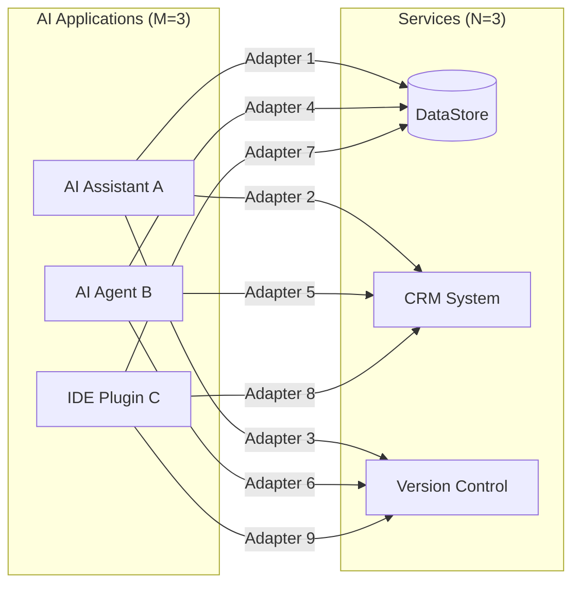

---

### Additive ($M + N$) MCP Architecture

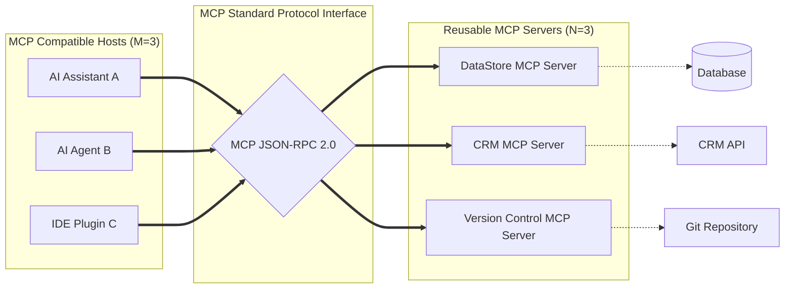

---

# Code Examples

The snippet below shows how a single, reusable **Google Drive MCP Server** can be implemented once using Python FastMCP, and then used universally by any MCP-compliant client (VS Code, Claude Desktop, or Custom Agents).

```python
from mcp.server.fastmcp import FastMCP

# Instantiate reusable FastMCP Server
mcp = FastMCP("Google Drive Universal Server")

@mcp.resource("gdrive://files/{file_id}")
def read_drive_file(file_id: str) -> str:
    """Reads content from a Google Drive file by ID."""
    # Read operation isolated in this single server component
    return f"Contents of Google Drive File ID: {file_id}"

@mcp.tool()
def search_drive(query: str) -> list[str]:
    """Search Google Drive files matching the search query."""
    # Search logic executed safely on behalf of ANY connected client
    return [
        f"gdrive://files/doc_101 (Matches '{query}')",
        f"gdrive://files/doc_102 (Matches '{query}')"
    ]

if __name__ == "__main__":
    # Runs standard I/O server ready to plug into ANY MCP host application
    mcp.run()

```

### Key Highlights:

* **Host Agnostic**: Does not contain any client-specific code (no OpenAI, Anthropic, or LangChain dependencies).
* **Write Once, Expose Everywhere**: Exposes `search_drive` as an executable tool and `gdrive://` as a readable resource primitive.

---

# Step-by-Step Flow

### Transitioning from Fragmented Code to Standardized MCP

```
1. Identify Data/Tool Capabilities
   └── Determine external resources needed (e.g., File System, DB queries, API calls).

2. Encapsulate Capability into an MCP Server
   └── Wrap data/tool logic inside a dedicated MCP server exposing Tools and Resources.

3. Expose Server over Standard Transport
   └── Run server over Standard I/O (local) or HTTP-SSE/Streamable HTTP (remote).

4. Configure AI Clients (Hosts)
   └── Register the server's path/URL in MCP Host settings (e.g., cursor.json, claude_desktop_config.json).

5. Automatic Capability Discovery
   └── Hosts automatically perform handshake, discovering tools without custom client code.

6. Concurrent Reusability
   └── Connect additional AI applications to the existing MCP server without rewriting code.

```

---

# Real World Applications

The universal adapter model allows modern engineering teams to scale AI adoption efficiently:

* **Cross-Tool Developer Workflows**: Connecting VS Code, Cursor IDE, and terminal agents to a single local Git or JIRA MCP server simultaneously.
* **Enterprise CRM Access**: Allowing both sales-support chatbots and automated reporting workflows to share a central Salesforce/HubSpot MCP Server safely.
* **Unified Knowledge Retrieval**: Giving multiple distinct AI models safe, read-only access to corporate Google Drive or Notion repositories via an MCP Resource wrapper.

---

# Interview Questions

### Beginner

> **Q: Why is MCP referred to as the "USB-C for AI"?**
> **A:** Because USB-C provides a standard physical hardware interface for diverse electronics, whereas MCP provides a universal protocol standard connecting diverse AI models to external tools and data sources.

> **Q: What is the main drawback of building custom connectors for every AI app?**
> **A:** Custom connectors result in brittle code, lack of reusability, high maintenance, and an exponential scaling of integration complexity ($M \times N$).

---

### Intermediate

> **Q: Show mathematically how MCP reduces integration complexity for 5 AI models and 4 database services.**
> **A:**
> * **Without MCP ($M \times N$)**: $5 \times 4 = \mathbf{20}$ custom connectors.
> * **With MCP ($M + N$)**: $5 + 4 = \mathbf{9}$ standardized MCP connections.
> * **Reduction**: Saves writing and maintaining 11 custom integration layers.
> 
> 

> **Q: What does "server reusability" mean in the context of MCP architecture?**
> **A:** It means an MCP Server written for a specific data source (e.g., Google Drive) can be reused concurrently by any MCP-compliant AI assistant or autonomous agent without modifying the server's code.

---

### Advanced

> **Q: How does MCP decoupling impact security and maintenance in enterprise deployments?**
> **A:** Decoupling isolates data access logic inside the MCP Server. Security rules, credential management, and rate limiting are applied centrally at the server level. When downstream APIs update, only the MCP Server requires an update; connected AI clients remain untouched because the MCP interface specification remains constant.

---

# Common Mistakes

> [!warning]
> **Writing Model-Specific Code inside an MCP Server**
> * *Mistake*: Hardcoding LLM prompt logic or model SDKs (like OpenAI or Anthropic SDKs) directly inside an MCP Server.
> * *Correction*: MCP Servers should remain completely model-agnostic. They should only expose raw data capabilities (Tools/Resources) and allow the AI Host application to manage LLM interactions.
> 
> 

> [!warning]
> **Creating Duplicate MCP Servers per Application**
> * *Mistake*: Building `AppA-GoogleDrive-Server` and `AppB-GoogleDrive-Server`.
> * *Correction*: Build **one** generic `GoogleDrive-MCP-Server` and connect both App A and App B to it.
> 
> 

---

# Memory Tricks

## Formula Comparison: **M-N vs M+N**

* **M $\times$ N** $\rightarrow$ **M**ultiplication = **M**essy & **M**ulti-adapter nightmare.
* **M $+$ N** $\rightarrow$ **A**ddition = **A**dapter **A**rchitecture & **A**utomated reusability.

---

# Comparison Tables

| Aspect | Custom Integration ($M \times N$) | MCP Integration ($M + N$) |
| --- | --- | --- |
| **Complexity Scaling** | Multiplicative ($M \times N$) | Additive ($M + N$) |
| **Code Structure** | Tight coupling between Model & API | Decoupled Host-Server architecture |
| **Reusability** | Near Zero (Bespoke code per app) | High (Shared across all MCP hosts) |
| **API Change Impact** | Breaks all $M$ custom integration wrappers | Requires updating only $1$ MCP Server |
| **Maintenance Cost** | High and scales exponentially | Low and scales linearly |

---

# Revision Sheet (One Page)

```text
================================================================================
                    MCP UNIVERSAL ADAPTER CHEAT SHEET
================================================================================

1. THE ANALOGY
   • MCP = "USB-C for AI" (Universal standard port for all tools & models).

2. INTEGRATION MATH
   • LEGACY (M x N) : 5 Models x 3 Services = 15 Custom Connectors.
   • MCP    (M + N) : 5 Models + 3 Services = 8 Standard Connectors.

3. KEY BENEFITS
   • DECOUPLING : Isolates tool/data logic from AI model logic.
   • REUSE      : One MCP Server serves multiple AI applications.
   • STABILITY  : Eliminates brittle, one-off integration glue code.

4. ARCHITECTURAL PATTERN
   [AI Client] ─── (JSON-RPC 2.0) ───► [MCP Server] ───► [Target Service]
================================================================================

```

---

# Flashcards

Q: What physical device concept is used as an analogy for MCP?

A: A USB-C universal adapter.

Q: What does $M \times N$ complexity represent in AI development?

A: The exponential number of custom connectors needed when $M$ models connect to $N$ external services without a standard protocol.

Q: How does MCP alter the math of connecting AI applications to services?

A: It transforms multiplicative complexity ($M \times N$) into linear additive complexity ($M + N$).

Q: What is the main benefit of MCP Server reusability?

A: A single server component can be built once and connected to multiple AI host applications without code modification.

Q: Why are custom API wrappers considered "brittle"?

A: Because any change in the external API's schema breaks every application that hardcoded a custom client wrapper for it.

Q: Can an MCP Server connect to both an AI Assistant and an AI Agent at the same time?

A: Yes, as long as both host applications are MCP-compliant clients.

Q: Does an MCP Server contain model-specific SDK code?

A: No, MCP servers are model-agnostic wrappers around data and tools.

---

# Practice Questions

### Easy

1. True or False: If you have 4 AI models and 5 database services, MCP requires 20 custom connectors.
* *Answer*: False. Without MCP it requires 20 ($4 \times 5$). With MCP it requires 9 ($4 + 5$).


### Medium

2. Explain why fragmented AI development leads to maintenance bottlenecks in enterprise engineering teams.
* *Answer*: In fragmented setups, every team writes bespoke tool wrappers. When an underlying tool API updates or a team switches LLM providers, every custom integration must be rewritten manually. MCP isolates the tool logic so updates only happen in one place.


### Hard

3. Architect an enterprise scenario showing how 3 distinct departments (Sales, Engineering, HR) use MCP to share data access safely.
* *Answer*: Each department deploys a single MCP Server wrapping its core domain tools (Salesforce Server, GitHub Server, Workday Server). Individual department AI agents act as MCP Clients. Whenever an agent needs cross-department context, it issues an MCP RPC request to the corresponding domain server, enforcing permissions cleanly without hardcoding cross-database credentials into agent prompts.


---

# Key Takeaways

1. MCP acts as the "USB-C for AI," providing a universal adapter interface for models and data.
2. Legacy AI development forces custom point-to-point integrations for every model/tool pair.
3. Point-to-point integration complexity scales multiplicatively ($M \times N$).
4. MCP reduces integration scaling to additive complexity ($M + N$).
5. Standardizing tool interfaces eliminates brittle, single-use glue code.
6. MCP Servers encapsulate domain capabilities (databases, CRMs, version control) independently of LLM implementations.
7. MCP Servers are inherently reusable across different AI host applications and agents.
8. Centralizing data connectors into MCP Servers simplifies enterprise maintenance and security management.
9. Adopting MCP allows developers to build tool connectors once and deploy them everywhere.
10. The protocol decouples AI reasoning front-ends from backend software systems.


# Problems Solved by Model Context Protocol (MCP) for LLMs

---

## Metadata

Topic: Core LLM Limitations & MCP Solutions

Difficulty: Beginner to Intermediate

Tags: #mcp #llm-limitations #knowledge-cutoff #hallucinations #isolated-intelligence #glue-code

Source: Video Transcript — MCP Problems & Solutions

Date: 2026-08-04

---

# Executive Summary

* **Static Knowledge Cutoffs**: Pre-trained LLMs are frozen in time; MCP bypasses knowledge cutoffs by dynamically injecting real-time context and external data streams at runtime.
* **Hallucination Mitigation**: Without grounded data, LLMs guess statistically plausible facts; MCP provides direct access to ground-truth database records and APIs, drastically reducing factual hallucinations.
* **Breaking Isolated Intelligence**: Pure LLMs are passive text processors unable to execute real-world actions; MCP transforms them into active problem solvers capable of querying databases, sending emails, and calling external APIs.
* **Elimination of Custom Glue Code**: Developers no longer write brittle, error-prone, per-application integration wrappers; a single MCP client interfaces universally with all compliant MCP servers.

---

# Main Notes

## The 4 Core LLM Problems Solved by MCP

Large Language Models (LLMs) are exceptionally proficient at pattern recognition and natural language synthesis, but they suffer from four fundamental architectural limitations when deployed in production systems. MCP resolves each limitation through standardized context and execution protocols.

```text
┌────────────────────────────────────────────────────────────────────────────────────────┐
│                                FOUR CORE LLM PROBLEMS                                  │
├─────────────────────────┬─────────────────────────┬───────────────────┬────────────────┤
│    Knowledge Cutoff     │     Hallucinations      │ Isolated Intel.   │ Custom Glue    │
│  (Frozen Training Data) │   (Plausible Guessing)  │  (Text Generator) │  (Brittle Code)│
└───────────┬─────────────┴────────────┬────────────┴─────────┬─────────┴───────┬────────┘
            │                          │                      │                 │
            ▼                          ▼                      ▼                 ▼
┌────────────────────────────────────────────────────────────────────────────────────────┐
│                              MCP PROTOCOL SOLUTION LAYER                               │
├─────────────────────────┬─────────────────────────┬───────────────────┬────────────────┤
│ Live Context Injection  │ Ground-Truth Data Sync  │ Real-World Tools  │ Unified Spec   │
└─────────────────────────┴─────────────────────────┴───────────────────┴────────────────┘

```

---

## 1. Bypassing Knowledge Cutoffs

* **The Problem**: Training an LLM is computationally expensive and static. Once training concludes, the model's knowledge cutoff is permanently frozen. The model cannot know today's stock prices, recent commit logs, or live calendar events.
* **The MCP Solution**: MCP dynamically injects live context, file resources, and API responses directly into the LLM's active reasoning context window during inference.

---

## 2. Eliminating Factual Hallucinations

* **The Problem**: LLMs generate text by predicting statistically probable tokens rather than querying a database. When forced to answer questions about specific private records or real-time data, they invent plausible-sounding but completely false facts (hallucinations).
* **The MCP Solution**: By supplying real-time, verifiable context retrieved from external systems, MCP grounds the model in explicit truth. Instead of guessing from training weights, the LLM reads ground-truth data exposed via MCP Resources.

---

## 3. Unlocking "Isolated Intelligence" (From Passive Text to Active Problem Solver)

* **The Problem**: Standalone LLMs operate as isolated text processors. They can write an email or generate SQL, but they cannot natively send that email or execute that query against a production database.
* **The MCP Solution**: MCP acts as a standardized bridge between reasoning models and system execution. By exposing **Tools**, MCP allows LLMs to trigger side effects in the real world—querying databases, invoking API hooks, updating CRMs, and performing workflow automation.

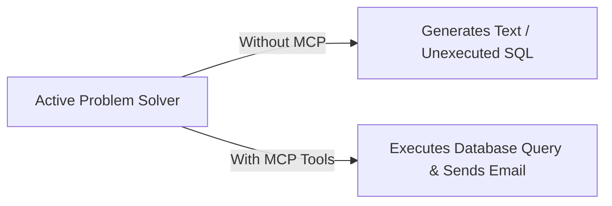

---

## 4. Eliminating Custom "Glue Code" & Integration Overhead

* **The Problem**: Prior to MCP, developers had to write bespoke custom code, API wrappers, and ad-hoc error handling logic for every tool an LLM needed to access. Writing custom glue code for every application is brittle, highly error-prone, and unsustainable at scale.
* **The MCP Solution**: MCP defines a single, unified protocol specification. A single MCP Client inside an AI host application can interface with any compliance-certified MCP Server without writing custom integration wrappers.

---

# Important Definitions

| Term | Definition | Why It Matters |
| --- | --- | --- |
| **Knowledge Cutoff** | The fixed date beyond which an LLM has no awareness of real-world events or data updates. | Primary reason why standalone LLMs cannot answer real-time operational questions without external grounding. |
| **Hallucination** | A phenomenon where an LLM generates confident but factually incorrect or ungrounded statements. | Major blocker for enterprise adoption; mitigated by providing ground-truth context via protocol layers. |
| **Isolated Intelligence** | The state of an LLM being restricted strictly to text generation without digital agency or system access. | Solved by exposing standardized tools that turn text predictions into executable real-world actions. |
| **Glue Code** | Custom, single-purpose integration code written to connect distinct software components. | Represents massive technical debt; eliminated by standardizing transport and application protocols. |

---

# Mental Models

| Problem | Analogy | MCP Transformation |
| --- | --- | --- |
| **Knowledge Cutoff** | **An Exam Student with Frozen Textbooks** | Giving the student a live web connection to check current records during the test. |
| **Hallucination** | **An Unprepared Candidate Guessing Answers** | Providing an open-book reference manual (ground-truth data) so guessing is unnecessary. |
| **Isolated Intelligence** | **A Smart Person Trapped in a Soundproof Room** | Giving them a telephone and terminal keyboard to issue commands to the outside world. |
| **Custom Glue Code** | **Building Custom Adapters for Every Appliance** | Installing standard universal electrical wall outlets throughout the house. |

---

# Visual Diagrams

### LLM Transformation via MCP Bridge

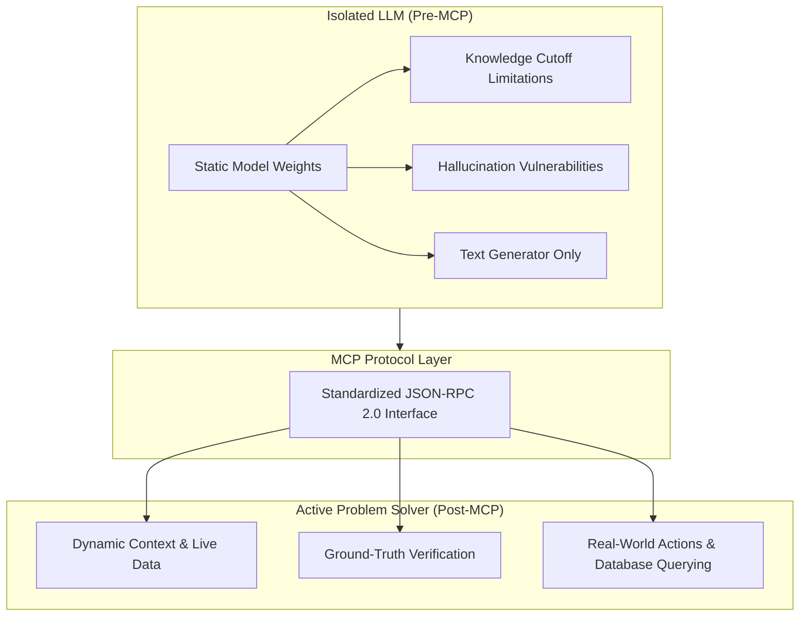

---

### Glue Code vs. MCP Standardization Sequence

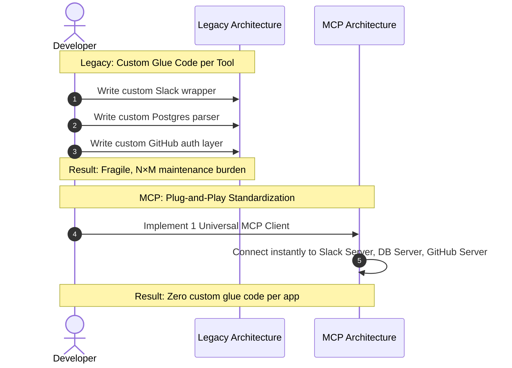

---

# Code Examples

The following python example demonstrates how an MCP Server returns ground-truth context to combat knowledge cutoffs and hallucinations without writing custom client wrappers.

```python
from mcp.server.fastmcp import FastMCP
import datetime

# Create a FastMCP Server
mcp = FastMCP("GroundTruthServer")

# Resource solving Knowledge Cutoff (fetches live system state)
@mcp.resource("system://live_status")
def get_live_status() -> str:
    """Returns real-time system status, overriding static model limitations."""
    current_time = datetime.datetime.now(datetime.timezone.utc).isoformat()
    return f"Live Server Status at {current_time}: ALL SYSTEMS OPERATIONAL (Load: 12%)"

# Tool solving Isolated Intelligence (executes database action)
@mcp.tool()
def execute_database_query(query: str) -> str:
    """Safely executes a read-only SQL query against ground-truth database."""
    # In production, query a real database instance
    if "SELECT count(*) FROM users" in query:
        return "Ground Truth Result: 1,420,500 active users"
    return "Ground Truth Result: Query executed successfully."

if __name__ == "__main__":
    mcp.run()

```

### Explanation:

* `@mcp.resource(...)`: Eliminates knowledge cutoff by serving real-time data directly to the LLM.
* `@mcp.tool(...)`: Eliminates isolated intelligence by giving the LLM execution capabilities over external database systems.

---

# Step-by-Step Flow

### How MCP Converts a Problem-Prone Prompt into an Actionable Solution

```text
1. User Query Entry
   └── User asks: "How many users signed up today and what is our current server load?"

2. Problem Interception (Cutoff & Hallucination Avoidance)
   └── Host recognizes LLM cannot answer from static weights without guessing.

3. MCP Tool & Resource Discovery
   └── MCP Client requests available tools (`execute_database_query`) and resources (`system://live_status`).

4. Ground-Truth Context Fetching
   └── Client executes resource read and passes live system status directly into context.

5. Tool Call Execution
   └── LLM generates `execute_database_query("SELECT count(*) FROM users WHERE signup_date = TODAY")`.
   └── MCP Server executes query and returns exact integer result.

6. Grounded Response Generation
   └── LLM synthesizes ground-truth data into a factual response with 0% hallucination.

```

---

# Real World Applications

The problems solved by MCP unlock crucial enterprise use cases:

* **Live Technical Support**: Support bots fetch current service status and user account flags instead of guessing based on outdated training data.
* **Automated DevOps & SRE**: Agents inspect live Kubernetes logs, run diagnostic tools, and trigger rollback workflows safely.
* **Financial Analytics**: Stock and trading assistants fetch live market feeds and execute trade validations without risk of knowledge cutoff errors.

---

# Interview Questions

### Beginner

> **Q: What are the primary limitations of LLMs that MCP directly addresses?**
> **A:** Static knowledge cutoffs, factual hallucinations due to lack of grounded data, isolated intelligence (inability to perform actions), and high integration overhead (custom glue code).

> **Q: How does MCP prevent an LLM from hallucinating?**
> **A:** By providing a standardized mechanism to fetch live, verifiable ground-truth data from external resources and databases at runtime, eliminating the need for the model to guess.

---

### Intermediate

> **Q: How does MCP transform an LLM from a "passive text processor" into an "active problem solver"?**
> **A:** By exposing **Tools** via a standard protocol, allowing the model to safely execute actions in external systems (like sending emails, running SQL, or interacting with cloud APIs) rather than merely generating text descriptions of those actions.

> **Q: Why was custom "glue code" problematic in pre-MCP AI development?**
> **A:** Custom glue code was unstandardized, brittle, prone to error, and non-reusable. Developers had to rewrite custom integration logic for every new tool and model combination ($N \times M$ complexity).

---

### Advanced

> **Q: In terms of system reliability, how does runtime context injection via MCP differ from retraining or fine-tuning an LLM?**
> **A:** Retraining or fine-tuning updates static model parameters, which is computationally expensive, time-consuming, and still results in a static knowledge cutoff point. MCP runtime context injection provides immediate, deterministic, and cost-effective access to dynamic real-time data without altering model weights.

---

# Common Mistakes

> [!warning]
> **Relying on Fine-Tuning to Fix Knowledge Cutoffs**
> * *Mistake*: Attempting to retrain or fine-tune an LLM daily to keep its knowledge up to date.
> * *Correction*: Use MCP context injection. Fine-tuning is for style/behavior adaptation; MCP is for real-time context and facts.
> 
> 

> [!warning]
> **Assuming MCP Makes Hallucinations 100% Impossible**
> * *Mistake*: Assuming an LLM will never hallucinate if connected to an MCP server.
> * *Correction*: MCP provides the ground-truth data, but prompt design and tool schema clarity are still required to ensure the LLM interprets the context accurately.
> 
> 

---

# Memory Tricks

## The 4 Problems Solved: **K.H.I.G.**

* **K**nowledge Cutoffs $\rightarrow$ Solved via Live Resources
* **H**allucinations $\rightarrow$ Solved via Ground-Truth Data
* **I**solated Intelligence $\rightarrow$ Solved via Executable Tools
* **G**lue Code Overhead $\rightarrow$ Solved via Universal Standardization

---

# Comparison Tables

| Problem Area | Standalone LLM (Without MCP) | Integrated LLM (With MCP) |
| --- | --- | --- |
| **Knowledge Boundary** | Fixed to training cutoff date | Dynamic real-time data access |
| **Factuality & Data Source** | Statistical token guessing (prone to hallucinations) | Grounded in verifiable external data resources |
| **Execution Capacity** | Passive text generator | Active problem solver executing real actions |
| **Developer Overhead** | Endless custom integration glue code | Build once, reuse standard MCP servers everywhere |

---

# Revision Sheet (One Page)

```text
================================================================================
                    PROBLEMS SOLVED BY MCP CHEAT SHEET
================================================================================

1. KNOWLEDGE CUTOFF
   • Problem : Static training data freezes model knowledge.
   • Solution: MCP Resources inject real-time context during inference.

2. HALLUCINATIONS
   • Problem : Models guess plausible facts when data is missing.
   • Solution: MCP grounds responses in verifiable external database records.

3. ISOLATED INTELLIGENCE
   • Problem : LLMs generate text but cannot act on external systems.
   • Solution: MCP Tools allow LLMs to run queries, APIs, and automated actions.

4. CUSTOM GLUE CODE
   • Problem : Custom integration wrappers per tool lead to brittle code.
   • Solution: Single unified protocol standardizing client-server interaction.
================================================================================

```

---

# Flashcards

Q: What is a knowledge cutoff in LLMs?

A: The point in time where an LLM's training data ends, rendering it unaware of subsequent events.

Q: How does MCP solve the knowledge cutoff problem?

A: By dynamically injecting live external resources and context directly into the prompt context at runtime.

Q: Why do LLMs hallucinate when asked about private enterprise data?

A: Because they lack direct access to the data and guess based on statistical token probabilities.

Q: How does MCP mitigate hallucinations?

A: It provides access to ground-truth data sources, giving models explicit facts to rely on instead of guessing.

Q: What is meant by "isolated intelligence"?

A: The limitation where an LLM can process and generate text but cannot interact with external systems or run actions.

Q: How does MCP transform passive text generators into active problem solvers?

A: By providing standardized Tools that allow models to invoke APIs, query databases, and trigger workflows.

Q: What developer pain point does MCP eliminate?

A: The need to write custom, error-prone integration glue code for every tool and application combination.

---

# Practice Questions

### Easy

1. True or False: MCP eliminates knowledge cutoffs by constantly retraining the core LLM parameters.
* *Answer*: False. MCP bypasses cutoffs by injecting dynamic runtime context without changing model weights.


### Medium

2. Explain why custom integration glue code becomes error-prone as an application grows.
* *Answer*: As the number of tools and models increases, custom glue code scales exponentially ($N \times M$), making codebases fragile, hard to maintain, and highly susceptible to API schema breaking changes.


### Hard

3. Describe a scenario where an LLM uses both an MCP Resource and an MCP Tool to solve a complex user query cleanly without hallucinating.
* *Answer*: A user asks: "Check if server `prod-01` is overloaded and restart it if CPU exceeds 90%." The LLM first reads the `server://prod-01/metrics` **Resource** to fetch live CPU load (eliminating cutoff/hallucination). Seeing a 95% load, it then executes the `restart_server(instance_id="prod-01")` **Tool** to take active real-world action (eliminating isolated intelligence).


---

# Key Takeaways

1. LLMs are constrained by static training data knowledge cutoffs.
2. Lacking external context causes LLMs to hallucinate plausible facts.
3. Standalone LLMs suffer from isolated intelligence, acting only as text processors.
4. Pre-MCP integration required writing custom, fragile glue code for every tool.
5. MCP provides runtime context injection to bypass knowledge cutoffs completely.
6. MCP grounds model outputs in verifiable external data to minimize hallucinations.
7. MCP Tools enable LLMs to invoke APIs, run queries, and trigger workflows.
8. MCP converts passive text engines into active problem-solving AI agents.
9. MCP standardizes client-server interactions into a single unified protocol.
10. Adopting MCP drastically reduces engineering maintenance and integration costs.

# Model Context Protocol (MCP): Key Advantages & Security Architecture

## Metadata

Topic: Core Advantages of MCP, AI Agent Enablement, Security Architecture, & Stakeholder Impact

Difficulty: Beginner to Intermediate

Tags: #mcp #ai-agents #security #personlization #domain-knowledge #developer-experience #enterprise-architecture

Source: Video Transcript — MCP Advantages & Security Overview

Date: 2026-08-04

# Executive Summary

- **Autonomous AI Agent Enablement**: MCP provides the standardized discovery and execution "phone book" that allows AI agents to discover, invoke, and chain external tools autonomously to achieve complex goals.
    
- **Granular Personalization with Privacy**: Enables LLMs to safely query user-specific context (schedules, preference profiles, local files) without embedding raw private credentials directly into static model prompts.
    
- **Specialized Domain Knowledge**: Connects general-purpose foundational models to niche enterprise knowledge bases, legal databases, or specialized APIs to deliver expert-level, grounded insights.
    
- **Enhanced Protocol Security**: Built on a robust security layer featuring mandatory protocol-level policy enforcement, OAuth 2.1 integration, and explicit **Human-in-the-Loop (HITL)** consent prompts before executing actions or accessing resources.
    
- **Multi-Stakeholder Benefits**:
    
    - **Tool/API Developers**: Build an MCP server once and make it universally accessible across all compliant AI clients.
        
    - **End Users**: Access vastly expanded capabilities through a single unified chat or agent interface.
        
    - **Enterprises**: Achieve a clean separation of concerns, isolating core AI orchestration from domain-specific microservices and data connectors.
        

# Main Notes

## The Architectural Advantages of MCP

Model Context Protocol (MCP) elevates LLMs from simple prompt-response text engines into secure, contextual, and action-oriented AI systems.

Plaintext

```
┌────────────────────────────────────────────────────────────────────────────────────────┐
│                                 MCP VALUE ADVANTAGES                                   │
├───────────────────┬───────────────────┬───────────────────┬────────────────────────────┤
│   Agentic AI      │   Contextual      │  Domain-Specific  │   Protocol-Enforced        │
│   Enablement      │  Personalization  │     Grounding     │    Security & Privacy      │
└─────────┬─────────┴─────────┬─────────┴─────────┬─────────┴─────────────┬──────────────┘
          │                   │                   │                       │
          ▼                   ▼                   ▼                       ▼
┌────────────────────────────────────────────────────────────────────────────────────────┐
│                              STAKEHOLDER ECOSYSTEM IMPACT                              │
├──────────────────────────────┬───────────────────────────┬─────────────────────────────┤
│     Tool / API Developers    │     End Users / Clients   │     Enterprise Operations   │
│  "Build Once, Expose All"    │  Unified Capability Stack │    Separation of Concerns    │
└──────────────────────────────┴───────────────────────────┴─────────────────────────────┘
```

## 1. Enabling Autonomous AI Agents

AI Agents are autonomous systems built on LLMs that pursue multi-step goals. While a traditional LLM generates text, an AI Agent requires:

1. **Capability Discovery**: Understanding what tools exist in its environment.
    
2. **Action Execution**: Invoking APIs, running code, or updating databases safely.
    

MCP serves as the **universal discovery and execution interface** ("phone book") for agents. It enables agents to inspect external tools dynamically at runtime, select the correct payload schemas, and carry out execution loops.

## 2. Personalization Without Data Exposure

MCP allows models to fetch user-specific state (e.g., local emails, user settings, personalized glossaries) at runtime.

- **Without MCP**: Developers hardcoded private user data directly into system prompts or custom API wrappers, risking token window overflow and accidental data leakage.
    
- **With MCP**: User context is fetched on-demand via **MCP Resources** or scoped **Tools** governed by user identity tokens, delivering tailored results while keeping sensitive data isolated.
    

## 3. Grounding in Specialized Knowledge

Base LLMs offer broad general knowledge but lack deep, real-time familiarity with specialized domains (e.g., medical guidelines, proprietary codebase ASTs, legal precedence).

By connecting an LLM to domain-specific MCP Servers, the model can query specialized knowledge graphs, vector databases, and enterprise search indices on the fly, delivering expert-level precision without requiring full model fine-tuning.

## 4. Enhanced Security Architecture & Human-in-the-Loop (HITL)

Security in MCP is enforced at the protocol boundary rather than left as an afterthought inside prompt text.

```
┌─────────────┐       1. Request Tool Call (JSON-RPC)       ┌──────────────┐
│  LLM Core   │ ──────────────────────────────────────────► │  MCP Host    │
└─────────────┘                                             └──────┬───────┘
                                                                   │
                                                                   ▼
                                                          ┌────────────────┐
                                                          │   Security /   │
                                                          │ HITL Gatekeeper│
                                                          └────────┬───────┘
                                                                   │
                                                   2. Prompt User  │ 3. User Approves
                                                   "Allow action?" │    Explicitly
                                                                   ▼
┌─────────────┐       4. Forward Executable Payload         ┌──────────────┐
│ MCP Server  │ ◄────────────────────────────────────────── │  MCP Client  │
└─────────────┘                                             └──────────────┘
```

> [!important]
> 
> **Key Security Controls:**
> 
> - **Explicit User Consent**: The MCP Host intercepts every tool execution request and displays an approval dialogue to the user before passing the payload to the server.
>     
> - **OAuth 2.1 Authorization**: Modern remote MCP servers mandate strict OAuth token binding and PKCE (Proof Key for Code Exchange) flows.
>     
> - **Stateless Protocol Core**: Eliminates legacy session-hijacking risks by using stateless request-response architectures over `stdio` or HTTP.
>     

## Stakeholder Impact Matrix

|**Stakeholder**|**Legacy Approach (Pre-MCP)**|**MCP Advantage**|
|---|---|---|
|**Tool / API Developers**|Must write separate SDK wrappers for OpenAI, LangChain, LlamaIndex, Claude, etc.|**Build Once, Adopt Everywhere**: Write 1 MCP server that works across all AI hosts.|
|**End Users**|Switching AI tools meant losing access to connected plugins and personal data integrations.|**Unified Tool Ecosystem**: A single assistant can securely interact with all connected desktop and cloud tools.|
|**Enterprise / Systems**|Monolithic, tightly-coupled AI codebases with embedded database credentials.|**Separation of Concerns**: AI orchestration lives in the Host; business data rules live in isolated MCP servers.|

# Important Definitions

|**Term**|**Definition**|**Why It Matters**|
|---|---|---|
|**Human-in-the-Loop (HITL)**|A security policy requiring explicit human approval before an automated tool action takes effect.|Prevents rogue AI agent actions (e.g., deleting files, sending unauthorized emails).|
|**OAuth 2.1 Integration**|The standardized authorization framework used by remote MCP servers to verify user identity and token scopes.|Ensures AI hosts access third-party SaaS APIs using tenant-isolated access tokens.|
|**Separation of Concerns**|A system design principle dividing a program into distinct sections, each addressing a separate responsibility.|Allows enterprise security teams to audit MCP Server data access independently of the AI prompt logic.|
|**Dynamic Discovery**|The ability of an MCP Client to query `tools/list` or `resources/list` at runtime to discover new capabilities.|Allows AI agents to dynamically adapt to new tools added to an ecosystem without code deployment.|

# Mental Models

|**Concept**|**Analogy**|**Description**|
|---|---|---|
|**Agent Tool Discovery**|**An Agent's Phone Book**|MCP provides the phone book where an agent looks up specialized external numbers (tools) and understands how to call them.|
|**Human-in-the-Loop (HITL)**|**Bank Transaction OTP (One-Time Password)**|Even if a payment request is formatted correctly, execution halts until the user approves the prompt popup.|
|**Separation of Concerns**|**App Store vs. Operating System**|The OS (MCP Host) provides security permissions and UI, while individual apps (MCP Servers) isolate their own internal backend logic.|

# Visual Diagrams

### Multi-Stakeholder MCP Ecosystem Flow

Code snippet

```
flowchart TD
    subgraph Devs ["Tool & API Developers"]
        D1[Write Single MCP Server]
    end

    subgraph Core ["MCP Standard Protocol"]
        P1[Stateless JSON-RPC Specification]
        P2[OAuth 2.1 & HITL Gateways]
    end

    subgraph Hosts ["AI Applications / Clients"]
        H1[Claude Desktop]
        H2[VS Code / Cursor]
        H3[Custom Enterprise Agents]
    end

    subgraph Enterprise ["Enterprise Infrastructure"]
        E1[(Secure Postgres DB)]
        E2[Internal HR API]
        E3[GitHub Organization]
    end

    D1 -->|Publishes| P1
    P1 <--> P2
    P2 <--> Hosts

    P1 <-->|Exposes Resources & Tools| Enterprise
```

### Human-in-the-Loop (HITL) Consent Sequence

Code snippet

```
sequenceDiagram
    autonumber
    actor User
    participant Host as MCP Host (Client)
    participant LLM as Model Engine
    participant Server as Remote MCP Server

    User->>Host: "Delete user account usr_99"
    Host->>LLM: Process Prompt + Tool Schema
    LLM-->>Host: Requests Tool Execution: delete_account(id="usr_99")
    
    Note over Host, User: SECURITY INTERCEPTION (HITL)
    Host->>User: Dialogue Box: "Allow MCP Server to execute delete_account(usr_99)?"
    
    alt User Denies
        User-->>Host: Click "Deny"
        Host-->>LLM: Return Tool Error: "Execution canceled by user"
        LLM-->>User: "I canceled the account deletion."
    else User Approves
        User-->>Host: Click "Approve"
        Host->>Server: JSON-RPC Call: delete_account(usr_99)
        Server-->>Host: Response: "Account usr_99 deleted successfully"
        Host->>LLM: Provide Execution Result
        LLM-->>User: "Account usr_99 has been permanently deleted."
    end
```

# Code Examples

The following Python snippet demonstrates an MCP Server enforcing **role-based authorization checks** and explicit **tool annotations** to ensure secure enterprise tool execution.

Python

```
from mcp.server.fastmcp import FastMCP, Context
import logging

# Initialize an enterprise-ready FastMCP server
mcp = FastMCP("SecureEnterpriseServer")

@mcp.tool()
async def update_employee_salary(
    employee_id: str, 
    new_salary: float, 
    ctx: Context
) -> str:
    """Updates employee salary in HR database.
    
    Requires elevated admin authorization scope.
    """
    # 1. Retrieve request metadata and client credentials
    client_id = ctx.request_context.meta.get("client_id") if ctx.request_context.meta else "anonymous"
    is_admin = ctx.request_context.meta.get("is_admin", False) if ctx.request_context.meta else False

    logging.info(f"Execution request by client: {client_id} for Employee: {employee_id}")

    # 2. Protocol-level authorization guard
    if not is_admin:
        # Enforce security at the server boundary
        raise PermissionError("SECURITY VIOLATION: Admin scope required to modify salary records.")

    # 3. Perform sensitive action safely
    # In production: execute SQL against isolated DB
    return f"SUCCESS: Salary for {employee_id} updated to ${new_salary:,.2f} by Admin ({client_id})."

if __name__ == "__main__":
    mcp.run()
```

### Key Highlights:

- `ctx.request_context.meta`: Validates request-level metadata and tenant permissions before touching underlying databases.
    
- `PermissionError`: Hard stop preventing unauthorized tool execution, ensuring security even if the LLM was tricked by prompt injection.
    

# Step-by-Step Flow

### Complete Lifecycle of a Personalization & Action Request

```
1. User Query Received
   └── User requests: "Summarize my unread emails from today and archive them."

2. Discovery & Resource Retrieval
   └── Client queries Mail MCP Server for unread email resources (`mail://inbox/unread`).

3. Personalization Synthesis
   └── LLM reads unread email context and generates a concise natural language summary.

4. Action Proposal
   └── LLM generates request to call tool: `archive_emails(email_ids=[101, 102, 103])`.

5. Protocol Security Gatekeeping (HITL)
   └── Host intercepts call and displays popup: "Mail Server wants to archive 3 emails. Approve?"

6. Verified Tool Dispatch
   └── User clicks "Approve" -> Host issues JSON-RPC command over transport -> Server executes archive action.
```

# Real World Applications

- **Agentic Software Engineering**: Autonomous agents (like Cursor or Devin) discovering workspace tools via MCP to edit files, execute unit tests, and create GitHub pull requests safely.
    
- **Enterprise HR & Payroll Automation**: Secure bots querying employee records via read-only MCP resources while restricting salary updates behind OAuth-gated MCP tools.
    
- **Healthcare & Legal Assistance**: Connecting base LLMs to HIPAA-compliant medical databases or legal libraries via isolated MCP servers to provide grounded, expert-level consultation without data leakage.
    

# Interview Questions

### Beginner

> **Q: How does MCP support the growth of autonomous AI Agents?**
> 
> **A:** MCP provides a standardized runtime discovery mechanism and protocol for tool execution. Agents can query MCP servers to dynamically discover available capabilities and invoke them to pursue complex goals.

> **Q: What is Human-in-the-Loop (HITL) security in MCP hosts?**
> 
> **A:** A security gate where the MCP host intercepts tool call requests generated by the LLM and requires explicit user consent via a UI prompt before sending the request to the server.

### Intermediate

> **Q: How does MCP improve enterprise separation of concerns compared to traditional AI integrations?**
> 
> **A:** It decouples the AI orchestrator (Host) from data access logic (Server). Enterprise security teams can manage database credentials, permissions, and OAuth rules centrally inside the MCP Server without altering AI prompt logic.

> **Q: Why is "Build Once, Adopt Everywhere" beneficial for tool developers?**
> 
> **A:** Developers only write a single MCP-compliant server for their service, and it immediately becomes usable across all supporting AI clients (e.g., Claude Desktop, VS Code, ChatGPT, custom agents) without per-app custom code.

### Advanced

> **Q: How does MCP defend against prompt injection attacks attempting unauthorized data modifications?**
> 
> **A:** Even if an attacker tricks the LLM via prompt injection into requesting a destructive tool call (e.g., `delete_database()`), the host application intercepts the request and forces an explicit user approval prompt, or the server rejects the request due to missing OAuth metadata scopes.

# Common Mistakes

> [!warning]
> 
> **Disabling User Consent Prompts in Production**
> 
> - _Mistake_: Automatically approving all tool executions to create a "seamless" user experience.
>     
> - _Correction_: Retain mandatory HITL approval prompts for tools that modify state or execute external actions to prevent prompt injection abuse.
>     

> [!warning]
> 
> **Hardcoding Sensitive Credentials inside MCP Client Prompts**
> 
> - _Mistake_: Passing raw API keys or user passwords directly inside prompt strings.
>     
> - _Correction_: Use standard OAuth 2.1 token flows managed securely at the transport and server level.
>     

# Memory Tricks

## The Stakeholder Value Mnemonic: **A.P.E.S.**

- **A**gents Enabled $\rightarrow$ Dynamic tool discovery
    
- **P**ersonalized Context $\rightarrow$ Safe user profile integration
    
- **E**nterprise Security $\rightarrow$ HITL consent + OAuth 2.1 + Separation of concerns
    
- **S**pecialized Knowledge $\rightarrow$ Niche domain grounding
    

# Comparison Tables

|**Feature**|**Pre-MCP Custom Plugins**|**Standardized MCP Architecture**|
|---|---|---|
|**Agent Enablement**|Complex, framework-specific tool bindings|Universal runtime dynamic tool discovery|
|**Security Boundaries**|Varies by app; often hardcoded credentials|Protocol-enforced HITL, OAuth 2.1, and scope validation|
|**Developer Portability**|Rewrite wrappers for every new AI framework|Single MCP server works across all compliant clients|
|**System Architecture**|Tightly coupled monoliths|Clean separation of concerns (Host vs. Server)|

# Revision Sheet (One Page)

Plaintext

```
================================================================================
                    MCP ADVANTAGES & SECURITY CHEAT SHEET
================================================================================

1. CORE VALUE PROPOSITIONS
   • AI AGENTS     : Provides dynamic "phone book" for tool discovery & execution.
   • PERSONALIZATION: Injects safe user-specific context on demand.
   • SPECIALIZATION : Grounds LLMs in expert domain knowledge bases.

2. SECURITY ARCHITECTURE
   • HUMAN-IN-THE-LOOP (HITL): Explicit user consent prompts before action execution.
   • OAUTH 2.1             : Modern token authorization & PKCE verification.
   • SEPARATION OF CONCERNS: Keeps credentials & data rules isolated in server.

3. STAKEHOLDER WINS
   • DEVELOPERS : Write 1 server -> Deploy across all AI clients.
   • END USERS  : Vastly expanded capabilities in a single interface.
   • ENTERPRISE : Modular, audited, and secure data access.
================================================================================
```

# Flashcards

Q: How does MCP aid in building autonomous AI Agents?

A: By providing a standardized protocol for runtime capability discovery and structured tool execution.

Q: How does MCP enable personalization while preserving security?

A: It fetches user-specific context dynamically via resources/tools governed by user permissions, avoiding exposure of raw keys in prompts.

Q: What is the purpose of Human-in-the-Loop (HITL) consent in MCP?

A: To intercept tool calls and ensure a human user explicitly authorizes sensitive actions before execution.

Q: What is the main benefit of MCP for tool developers?

A: "Build once, adopt everywhere"—a single MCP server works across all compliant AI client hosts.

Q: How does MCP enforce separation of concerns in enterprise software?

A: It separates AI orchestration (in the Host) from core business logic, credentials, and data access rules (isolated in the Server).

Q: Why are specialized domain knowledge bases easily integrated via MCP?

A: Because MCP Servers can wrap specialized APIs, vector databases, or search engines and expose them as standard Resources or Tools.

# Practice Questions

### Easy

1. True or False: An MCP Host executes tool calls automatically without providing UI popups or approval mechanisms for sensitive actions.
    
    - _Answer_: False. MCP hosts enforce Human-in-the-Loop consent prompts for security.
        

### Medium

2. Describe how MCP's "Build Once, Adopt Everywhere" philosophy saves engineering hours for SaaS companies.
    
    - _Answer_: Instead of building custom integrations for Claude, ChatGPT, Cursor, and custom agent frameworks, a SaaS company builds one MCP server. Every MCP-compliant client can instantly connect to that server without additional connector code.
        

### Hard

3. Explain how MCP's security model mitigates the impact of a prompt injection attack aimed at executing unauthorized database deletions.
    
    - _Answer_: If an injection attack tricks the LLM into generating a `delete_records()` tool call, the request hits the MCP Host boundary. The Host intercepts the payload and requests explicit user approval (HITL). Unless the human user explicitly confirms the deletion, the tool call is blocked and never reaches the MCP Server.
        

# Key Takeaways

1. MCP is foundational to the agentic AI evolution, acting as a dynamic runtime discovery interface.
    
2. Safe personalization is achieved by querying user-scoped resources at runtime rather than embedding credentials in prompts.
    
3. Specialized domain knowledge can be connected to general models to produce expert-level outputs.
    
4. Security is enforced at the protocol layer using mandatory Human-in-the-Loop (HITL) user approvals.
    
5. OAuth 2.1 integration ensures enterprise-grade user authentication and scope isolation.
    
6. Developers build an MCP server once and get instant compatibility across the entire AI client ecosystem.
    
7. End users gain access to expansive external capabilities directly within their preferred AI interfaces.
    
8. Enterprise architectures benefit from a clear separation of concerns between AI hosts and backend microservices.
    
9. Protocol-level authorization guards prevent prompt injection attacks from performing unauthorized data modifications.
    
10. MCP transforms fragmented tool ecosystems into a unified, secure, and infinitely scalable AI application platform.

# Model Context Protocol (MCP): Practical Questions, Architecture Comparison & Primitives

## Metadata

Topic: Authorship, Direct API vs. MCP Servers, MCP vs. Native Tool Use, and Protocol Primitives

Difficulty: Intermediate

Tags: #mcp #api-design #tool-calling #mcp-primitives #mcp-server-authorship #software-architecture

Source: Video Transcript — Common Questions on MCP Servers

Date: 2026-08-04

# Executive Summary

- **Universal Authorship**: Anyone can create an MCP Server—individual developers, software engineering teams, or enterprise departments—to encapsulate internal APIs, databases, or workflows.
    
- **MCP Server vs. Direct API Calling**: Direct API calls require writing custom request formatters, credential handlers, and response parsers per client. An MCP server wraps services into a standardized JSON-RPC 2.0 interface complete with self-describing schemas.
    
- **MCP Server vs. Simple Tool Use**: Native tool calling is limited to model-decided execution of single functions. MCP extends beyond functions by offering **Three Control Planes**:
    
    1. **Tools**: Model-controlled execution functions.
        
    2. **Resources**: Application-controlled read-only data streams.
        
    3. **Prompts**: User-controlled workflow and message templates.
        
- **Decoupled Architecture**: MCP abstracts service logic away from the AI host application, making servers completely reusable across any compliant MCP client.
    

# Main Notes

## Who Authors MCP Servers?

There are no gateway barriers to building MCP Servers. Because MCP is an open specification hosted under the Linux Foundation, server development falls into three primary buckets:

Plaintext

```
                               MCP SERVER AUTHORSHIP
┌─────────────────────────┐ ┌─────────────────────────┐ ┌─────────────────────────┐
│  Individual Developers  │ │  Enterprise Departments │ │   SaaS Vendors & APIs   │
│ (Custom local scripts & │ │  (Internal HR, DBs, &   │ │  (Official GitHub,      │
│  personal workflows)    │ │   legacy system wrappers)│ │   Slack, Postgres, etc.)│
└─────────────────────────┘ └─────────────────────────┘ └─────────────────────────┘
```

## MCP Server vs. Calling Service APIs Directly

A common point of confusion is asking why an MCP server is needed if an API already exists.

- **Direct API Call**: Requires hardcoding client-side logic to handle endpoints, payload structures, headers, authentication tokens, and custom error mapping.
    
- **MCP Server**: Acts as an intelligent standard wrapper around an API. It provides self-describing JSON schemas, resource endpoints, and prompt templates, eliminating custom glue code on the host client.
    

Plaintext

```
    DIRECT SERVICE API CALL                         MCP SERVER WRAPPER
┌───────────┐  Custom Wrapper  ┌───────┐     ┌───────────┐  JSON-RPC Standard ┌────────────┐
│ AI Client │ ───────────────► │  API  │     │ AI Client │ ─────────────────► │ MCP Server │ ──► API
└───────────┘ (Needs glue code)└───────┘     └───────────┘  (Zero custom code)└────────────┘
```

## MCP Servers vs. Standalone "Tool Calling"

While MCP utilizes tool calling under the hood, an MCP Server provides a complete contextual integration system consisting of **3 distinct protocol primitives**:

```text
                                  MCP PRIMITIVES
                   ┌──────────────────────────────────────────┐
                   │           MCP Server Capability          │
                   └────────────────────┬─────────────────────┘
                                        │
         ┌──────────────────────────────┼──────────────────────────────┐
         ▼                              ▼                              ▼
┌──────────────────┐           ┌──────────────────┐           ┌──────────────────┐
│     TOOLS        │           │    RESOURCES     │           │     PROMPTS      │
│ Model-Controlled │           │ Application-Ctrl │           │ User-Controlled  │
│ Executions & APIs│           │ Read-Only Context│           │ Workflow Packets │
└──────────────────┘           └──────────────────┘           └──────────────────┘
```

1. **Tools (Model-Controlled)**: Executable functions with input JSON schemas that the LLM decides to call at runtime.
    
2. **Resources (Application-Controlled)**: Contextual data payloads (files, logs, DB records) pulled into context directly by the host application.
    
3. **Prompts (User-Controlled)**: Pre-configured, reusable workflow templates triggered explicitly by user actions (e.g., slash commands).
    

# Important Definitions

|**Term**|**Definition**|**Why It Matters**|
|---|---|---|
|**Tool Schema**|A formal JSON Schema definition specifying a tool's name, description, and required parameters.|Informs the LLM exactly how to format arguments when calling an external function.|
|**Control Planes**|The structural distinction governing _who_ triggers an MCP capability (Model, User, or Application).|Differentiates MCP from simple tool calling by providing structured patterns for all interaction types.|
|**Resource Template**|A URI pattern exposed by an MCP Server allowing parameterized context reading (e.g., `db://users/{id}`).|Allows LLMs or hosts to dynamically address specific data records in a standardized format.|
|**Prompt Template**|Server-side packaged prompt logic containing parameterized instruction templates.|Standardizes complex multi-step workflows across different users and frontend clients.|

# Mental Models

|**Comparison**|**Analogy**|**Description**|
|---|---|---|
|**Direct API vs. MCP Server**|**Raw Electrical Wires vs. Wall Socket**|Connecting directly to an API is like hardwiring appliance cables into raw electrical leads. An MCP Server is like a standard wall socket—plug any compliant device in and it works instantly.|
|**Tool Primitive**|**A Car's Steering Wheel / Pedals**|Controlled by the driver (Model) during runtime based on live decision-making.|
|**Resource Primitive**|**The Dashboard Instruments**|Provided automatically by the vehicle (Application) to supply ambient context without modifying state.|
|**Prompt Primitive**|**Cruise Control Button**|Explicitly pressed by the human passenger (User) to initiate a pre-defined automated routine.|

# Visual Diagrams

### Direct API vs. MCP Protocol Architecture

Code snippet

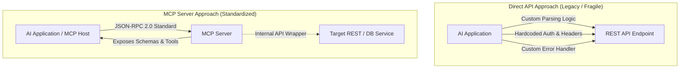

### The Three Control Planes of MCP Primitives

Code snippet

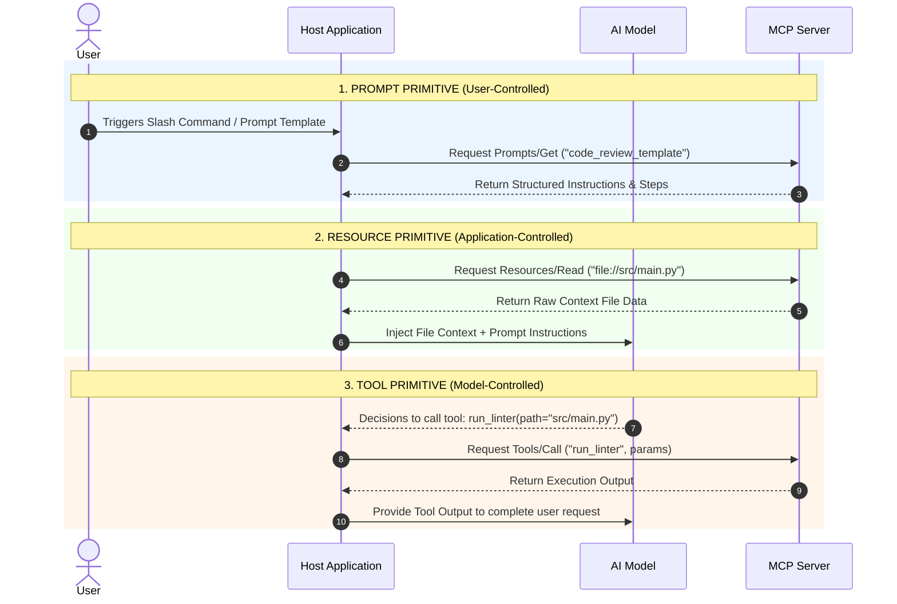

# Code Examples

The snippet below demonstrates a complete FastMCP Server exposing **all three primitives**: a **Resource**, a **Prompt Template**, and an executable **Tool**.

Python

```python
from mcp.server.fastmcp import FastMCP

# Initialize the MCP Server
mcp = FastMCP("FullPrimitiveServer")

# 1. RESOURCE PRIMITIVE (Application-Controlled Read-Only Data)
@mcp.resource("config://app/settings")
def get_app_settings() -> str:
    """Provides application configuration context to the host."""
    return '{"environment": "production", "debug": false, "version": "2.4.0"}'

# 2. PROMPT PRIMITIVE (User-Controlled Workflow Template)
@mcp.prompt("generate_bug_report")
def bug_report_prompt(component: str, error_log: str) -> str:
    """Pre-built template to format a bug report consistently."""
    return f"""
    Please analyze the following error in component '{component}':
    
    LOG DETAILS:
    {error_log}
    
    Provide:
    1. Root Cause Analysis
    2. Suggested Fix
    3. Regression Prevention Plan
    """

# 3. TOOL PRIMITIVE (Model-Controlled Executable Function)
@mcp.tool()
def restart_service(service_name: str) -> str:
    """Executes a system restart for a specific microservice."""
    # Action execution logic
    return f"SUCCESS: Service '{service_name}' restarted successfully."

if __name__ == "__main__":
    mcp.run()
```

# Step-by-Step Flow

### Choosing the Right MCP Primitive During Server Design

Plaintext

```
1. Identify Capabilities to Expose
   └── Determine what data, templates, or operations need to be shared with the AI.

2. Is it a Read-Only Context Source?
   ├── YES ──► Implement as an MCP RESOURCE (e.g., system logs, file streams, DB schemas).
   └── NO  ──► Proceed to step 3.

3. Is it a Pre-Packaged User Workflow / Template?
   ├── YES ──► Implement as an MCP PROMPT (e.g., standard code review rules, report formats).
   └── NO  ──► Proceed to step 4.

4. Is it an Action / Function with Side-Effects or Inputs?
   └── YES ──► Implement as an MCP TOOL (e.g., run_query(), send_email(), create_issue()).
```

# Real World Applications

- **Developer Workflows**: MCP Servers exposing git branch state as a **Resource**, pre-built PR templates as a **Prompt**, and `git commit/push` functions as a **Tool**.
    
- **Enterprise Customer Support**: Customer profile data exposed via **Resources**, troubleshooting guides exposed via **Prompts**, and refund/ticket creation functions exposed as **Tools**.
    

# Interview Questions

### Beginner

> **Q: Who is allowed to build and publish an MCP Server?**
> 
> **A:** Anyone. Individual developers, engineering teams, departments, or corporate vendors can build MCP Servers to wrap up access to their internal tools, databases, or APIs.

> **Q: What are the three core primitives exposed by an MCP Server?**
> 
> **A:** Tools (model-controlled execution), Resources (application-controlled read-only data), and Prompts (user-controlled templates).

### Intermediate

> **Q: How does an MCP Server differ from calling a REST API directly from an AI client?**
> 
> **A:** Direct REST API calls require custom parsing, authentication, and endpoint logic hardcoded on the client side. An MCP server wraps those endpoints into a standardized, self-describing protocol interface (JSON-RPC 2.0) that any MCP host can discover and use without custom integration code.

> **Q: Why is an MCP Server considered "more than just tool calling"?**
> 
> **A:** Native tool calling only exposes functions for an LLM to run. An MCP Server also provides read-only ambient context (**Resources**) and structured user-triggered templates (**Prompts**), forming a complete 3-primitive contextual interface.

### Advanced

> **Q: Explain the control-plane taxonomy among Tools, Resources, and Prompts in MCP.**
> 
> **A:**
> 
> - **Tools are model-controlled**: The LLM's reasoning engine decides when and how to call them.
>     
> - **Resources are application-controlled**: The MCP Host app injects them automatically based on application state.
>     
> - **Prompts are user-controlled**: The human explicitly triggers them to initiate structured workflows.
>     

# Common Mistakes

> [!warning]
> 
> **Wrapping Everything strictly as a "Tool"**
> 
> - _Mistake_: Exposing passive text files or system logs as tools (e.g., `get_log_file()`).
>     
> - _Correction_: Use **Resources** for read-only data streams. This saves token overhead and allows the host application to control context injection cleanly.
>     

> [!warning]
> 
> **Re-implementing Custom API Clients inside the AI Host App**
> 
> - _Mistake_: Writing custom API integrations inside your custom agent frontend instead of isolating them inside an MCP server.
>     
> - _Correction_: Build an independent MCP server that wraps the API. This keeps your agent host code clean and makes the server reusable across other clients.
>     

# Memory Tricks

## The 3 Primitives & Control Planes: **T.R.P.**

- **T**ools $\rightarrow$ **M**odel Decides (Functions & Actions)
    
- **R**esources $\rightarrow$ **A**pplication Decides (Data & Context)
    
- **P**rompts $\rightarrow$ **U**ser Decides (Workflow Templates)
    

# Comparison Tables

|**Feature**|**Direct API Call**|**Basic Tool Calling**|**Full MCP Server**|
|---|---|---|---|
|**Protocol Standard**|Ad-hoc REST / GraphQL|Vendor-specific JSON Schema|Open JSON-RPC 2.0 Standard|
|**Context Primitives**|Raw payloads only|Functions only|Tools, Resources, and Prompts|
|**Client Overhead**|High (Custom code per endpoint)|Medium (Custom bindings per tool)|Zero (Standardized dynamic discovery)|
|**Control Planes**|Programmatic only|Model-controlled only|Model, User, and App controlled|
|**Reusability**|Application-specific|Framework-specific|Universal across all MCP hosts|

# Revision Sheet (One Page)

Plaintext

```text
================================================================================
                       MCP FAQ & PRIMITIVES CHEAT SHEET
================================================================================

1. AUTHORSHIP
   • Who builds MCP Servers? Anyone! (Developers, Teams, Enterprises, Vendors).

2. MCP SERVER vs. DIRECT API
   • Direct API : Requires client-side glue code, custom auth, and custom parsers.
   • MCP Server : Wraps API in standard JSON-RPC interface with auto-schemas.

3. THE THREE MCP PRIMITIVES
   • TOOLS     : Functions executed by the LLM (Model-Controlled).
   • RESOURCES : Read-only data fetched by the Host App (Application-Controlled).
   • PROMPTS   : Pre-built templates triggered by the Human (User-Controlled).

4. ARCHITECTURAL BENEFIT
   • Decouples AI models from backend services, making integrations 100% reusable.
================================================================================
```

# Flashcards

Q: Who can build an MCP Server?

A: Anyone, including individual developers, enterprise departments, and third-party SaaS vendors.

Q: Why shouldn't an AI app call an API directly instead of using an MCP server?

A: Direct API calls require custom glue code for every application. An MCP server standardizes interactions via JSON-RPC 2.0.

Q: What are the three core primitives provided by an MCP Server?

A: Tools, Resources, and Prompts.

Q: Which entity controls the execution of an MCP Tool?

A: The Large Language Model (Model-Controlled).

Q: Which entity controls the loading of an MCP Resource?

A: The Host Application (Application-Controlled).

Q: Which entity controls the triggering of an MCP Prompt Template?

A: The Human User (User-Controlled).

Q: What metadata is included inside an MCP Tool schema?

A: Name, description, and input parameters formatted as a JSON Schema.

# Practice Questions

### Easy

1. True or False: An MCP server can only contain function tools and cannot expose read-only files.
    
    - _Answer_: False. MCP servers can expose read-only files using the **Resource** primitive.
        

### Medium

2. Describe a scenario where an engineer should use an MCP Prompt instead of an MCP Tool.
    
    - _Answer_: When creating a standardized, multi-step workflow (like a weekly bug triage format) that a human user needs to trigger explicitly with a single click or slash command.
        

### Hard

3. Explain how the combination of Tools, Resources, and Prompts inside a single MCP Server provides a complete system integration layer for enterprise applications.
    
    - _Answer_: Prompts give users predefined entry points for common workflows. Resources allow the host application to feed real-time ambient enterprise state (e.g., DB schemas, logs) into the context window automatically. Tools give the model the ability to execute precise side-effects and API operations when required. Together, they cover all three control planes (User, Application, Model) without custom glue code.
        

# Key Takeaways

1. Anyone can author an MCP Server to expose internal tools or services.
    
2. MCP Servers wrap existing APIs to remove custom integration glue code.
    
3. MCP extends beyond function calling by offering Tools, Resources, and Prompts.
    
4. Tools are model-controlled executable functions.
    
5. Resources are application-controlled read-only context streams.
    
6. Prompts are user-controlled workflow templates.
    
7. The three primitives correspond to three distinct control planes (Model, App, User).
    
8. JSON Schemas inside tool definitions guide LLMs to execute calls accurately.
    
9. Abstracting service logic into MCP servers makes connectors universally reusable.
    
10. Using the correct primitive (Tool vs. Resource vs. Prompt) optimizes token consumption and system reliability.

# Model Context Protocol (MCP): System Architecture & Core Layers

---

## Metadata

Topic: Technical Architecture of MCP (Host Applications, MCP Client, Server Core, Transports, & Security)

Difficulty: Intermediate

Tags: #mcp #mcp-architecture #mcp-client #stdio #http-sse #json-rpc #system-design

Source: Video Transcript — MCP Architecture Overview

Date: 2026-08-04

---

# Executive Summary

* **Three-Tier Architecture**: MCP operates across three distinct structural layers: **Host Application** (e.g., Claude Desktop, VS Code), **MCP Client** (protocol manager inside the host), and **MCP Server** (capability provider).
* **1-to-1 Client-Server Coupling**: An MCP Client inside the host maintains a dedicated connection to each individual MCP Server instance.
* **Server Core Components**:
1. **Protocol Handler**: Manages state, message parsing, capability negotiations, and JSON-RPC routing.
2. **Transport Layer**: Abducts underlying IPC or network streams (`stdio`, `Streamable HTTP`, or legacy `SSE`).
3. **Capability Engine**: Implements logic for exposing **Tools**, **Resources**, and **Prompts**.
4. **Security Layer**: Enforces authentication, tenant isolation, request validation, and OAuth boundaries.


---

# Main Notes

## The Architectural Topology

The Model Context Protocol divides runtime operations between the **Host Workspace** (Client side) and the **Service Environment** (Server side).

```
┌────────────────────────────────────────────────────────┐
│                   HOST APPLICATION                     │
│           (e.g., Claude Desktop, VS Code)              │
│                                                        │
│   ┌────────────────────────────────────────────────┐   │
│   │                 LLM Core Engine                │   │
│   └───────────────────────┬────────────────────────┘   │
│                           │ Prompt & Tool Intent       │
│   ┌───────────────────────▼────────────────────────┐   │
│   │                   MCP CLIENT                   │   │
│   └───────────────────────┬────────────────────────┘   │
└───────────────────────────┼────────────────────────────┘
                            │
               PROTOCOL BOUNDARY (JSON-RPC 2.0)
             Transport: stdio / Streamable HTTP
                            │
┌───────────────────────────▼────────────────────────────┐
│                       MCP SERVER                       │
│  ┌──────────────────────────────────────────────────┐  │
│  │                Protocol Handler                  │  │
│  └────────────────────────┬─────────────────────────┘  │
│  ┌────────────────────────▼─────────────────────────┐  │
│  │                 Transport Layer                  │  │
│  └────────────────────────┬─────────────────────────┘  │
│  ┌────────────────────────▼─────────────────────────┐  │
│  │    Capability Engine (Tools, Resources, Prompts)  │  │
│  └────────────────────────┬─────────────────────────┘  │
│  ┌────────────────────────▼─────────────────────────┐  │
│  │                 Security Layer                   │  │
│  └──────────────────────────────────────────────────┘  │
└────────────────────────────────────────────────────────┘

```

---

## 1. The Host Application & MCP Client Component

The **Host Application** is the user-facing AI system (IDE plugin, desktop assistant, or agent framework). It holds the LLM core and orchestration logic.

* **Role of the MCP Client**: The client module lives *inside* the Host application. It translates the LLM's high-level intent into standardized JSON-RPC protocol requests.
* **Connection Topology**: The client opens a dedicated **1-to-1 connection** to each registered MCP server. If a host connects to 3 servers (e.g., Git, Postgres, Slack), the client manages 3 parallel transport streams.

---

## 2. Server Core Architecture (Internal Breakdown)

The **MCP Server** isolates backend system logic from the host application. Its internal architecture consists of four distinct sub-systems:

```
                          MCP SERVER INTERACTION FLOW
┌──────────────────┐      1. JSON-RPC Stream      ┌──────────────────┐
│  Transport Layer │ ───────────────────────────► │ Protocol Handler │
└──────────────────┘                              └────────┬─────────┘
                                                           │ 2. Validated Request
                                                           ▼
┌──────────────────┐      3. Approved Context     ┌──────────────────┐
│ Capability Engine│ ◄─────────────────────────── │  Security Layer  │
│(Tools/Resources) │                              └──────────────────┘
└──────────────────┘

```

### A. Protocol Handler

* Manages protocol handshakes and capability negotiations.
* Routes JSON-RPC messages (Requests, Responses, Notifications) to internal handlers.
* Decodes incoming parameter schemas and formats outgoing JSON payloads.

### B. Transport Layer

* Manages the raw physical or virtual communication channel between host and server.
* **`stdio` (Standard I/O)**: Local child-process IPC via `stdin`/`stdout`. Zero network overhead, maximum local performance.
* **`Streamable HTTP` / `HTTP+SSE**`: Distributed network transport using HTTP POST requests combined with Server-Sent Events (SSE) for streaming responses.

### C. Capability Engine

* Houses the actual implementation logic for the server's declared capabilities:
* **Resource Provider**: Fetches ambient data (file streams, DB records, system telemetry).
* **Tool Execution Engine**: Runs functions, writes database rows, or calls external cloud APIs.
* **Prompt Manager**: Serves pre-packaged workflow templates to the client.


### D. Security Layer

* Enforces **Authentication & Authorization**: Validates incoming client API tokens, OAuth scopes, or local process identity.
* **Request Validation**: Sanitizes parameters against declared JSON schemas to prevent injection or malformed payload execution.
* **Data Protection & Isolation**: Isolates local system commands and restricts tool capabilities strictly to declared scopes.

---

# Important Definitions

| Term | Definition | Why It Matters |
| --- | --- | --- |
| **Host Application** | The container process (e.g., VS Code, Claude Desktop) that manages the user interface and LLM inference engine. | Acts as the primary orchestrator that delegates contextual tasks to MCP servers. |
| **MCP Client** | The specific internal library within a host application responsible for maintaining protocol communication with an MCP server. | Isolates raw protocol framing, JSON-RPC parsing, and stream management away from the core UI/LLM logic. |
| **Protocol Handler** | The core server component that decodes JSON-RPC messages and performs capability negotiation during handshake. | Ensures client and server agree on supported features before executing commands. |
| **Transport Layer** | The abstraction layer handling lower-level byte streaming over standard input/output (`stdio`) or network sockets (`HTTP/SSE`). | Allows the same MCP server code to run locally on a developer machine or remotely in cloud infrastructure. |

---

# Mental Models

| Component | Analogy | Description |
| --- | --- | --- |
| **Host Application** | **Operating System** | Manages the main user interface, display, and global execution environment. |
| **MCP Client** | **USB Device Driver** | Lives inside the OS to translate generic system requests into device-specific wire commands. |
| **MCP Server** | **External USB Peripheral (e.g., Camera / Printer)** | An isolated hardware unit running its own internal controller (Server Core) to perform specialized actions. |
| **Transport Layer** | **USB Cable vs. Wi-Fi Connection** | `stdio` is the direct USB cable plugged into the laptop; HTTP/SSE is the wireless connection over the network. |

---

# Visual Diagrams

### Detailed MCP Server Core Architecture

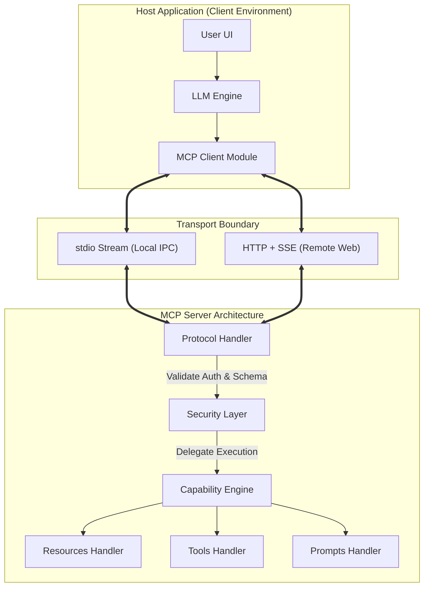

---

# Code Examples

The following Python snippet shows how an MCP Server SDK internally configures the **Protocol Handler**, **Capability Engine**, and **Transport Layer**.

```python
from mcp.server.fastmcp import FastMCP
import sys

# 1. Initialize Server Core & Capability Engine
mcp = FastMCP("ArchitectureDemoServer")

# CAPABILITY ENGINE: Expose a Tool
@mcp.tool()
def fetch_system_metrics(metric_type: str) -> str:
    """Capability Engine: Executes tool logic to fetch metrics."""
    # SECURITY LAYER: Input validation
    valid_metrics = ["cpu", "memory", "disk"]
    if metric_type.lower() not in valid_metrics:
        raise ValueError(f"Unauthorized or invalid metric request: {metric_type}")
    
    return f"Metric [{metric_type.upper()}]: 42% Utilization"

# 2. Configure Transport Layer and Start Protocol Handler
def main():
    # Demonstrating stdio transport configuration
    # The server reads from sys.stdin and writes JSON-RPC payloads to sys.stdout
    print("Starting MCP Server with stdio transport...", file=sys.stderr)
    
    # Run loop manages Protocol Handler handshakes & Transport streaming
    mcp.run(transport="stdio")

if __name__ == "__main__":
    main()

```

### Explanation of Key Lines:

* `FastMCP(...)`: Initializes the server protocol handler and capability registers.
* `@mcp.tool()`: Registers a capability in the capability engine.
* `valid_metrics` Check: Demonstrates in-memory security layer parameter validation before execution.
* `mcp.run(transport="stdio")`: Binds the protocol handler to OS `stdio` streams for low-latency inter-process communication.

---

# Step-by-Step Flow

### Initialization & Request Pipeline Across Layers

```text
1. Server Process Spawn
   └── Host Application launches the MCP Server as a subprocess (stdio) or connects via URL (HTTP).

2. Handshake Phase
   └── MCP Client sends `initialize` JSON-RPC request to the Server's Protocol Handler.
   └── Server Protocol Handler responds with its capability matrix (supported Tools/Resources).

3. Security & Schema Boundary Check
   └── Client receives schemas and registers them with the LLM prompt context.

4. Execution Dispatch
   └── User prompt triggers LLM tool selection -> Client constructs `tools/call` payload.

5. Server Processing Pipeline
   ├── Transport Layer delivers raw JSON-RPC bytes to Protocol Handler.
   ├── Protocol Handler parses payload and routes to Security Layer.
   ├── Security Layer validates parameters and tenant permissions.
   └── Capability Engine executes underlying function and returns output stream.

6. Response Assembly
   └── Client receives JSON-RPC result and appends context back into active LLM conversation window.

```

---

# Real World Applications

* **Desktop IDEs (Cursor / VS Code)**: The IDE acts as the Host Application, instantiating local `stdio` MCP client connections to local Git, Postgres, and Docker MCP servers running directly on the developer's laptop.
* **Enterprise Cloud Gateways**: An AI Agent in AWS/GCP acts as a Host connecting via remote `Streamable HTTP` to secure enterprise MCP servers hosted behind corporate load balancers and OAuth gateways.

---

# Interview Questions

### Beginner

> **Q: What is the relationship between a Host Application and an MCP Client?**
> **A:** The Host Application is the top-level software program (e.g., Claude Desktop, VS Code), while the MCP Client is the specific internal communication module inside the host that manages JSON-RPC traffic with MCP servers.

> **Q: What are the two primary transport mechanisms supported by MCP?**
> **A:** `stdio` (Standard Input/Output for local subprocesses) and `Streamable HTTP` / `HTTP+SSE` (for remote network connections).

---

### Intermediate

> **Q: What are the main responsibilities of the Protocol Handler inside an MCP Server?**
> **A:** Managing connection handshakes, performing capability negotiations with clients, decoding JSON-RPC 2.0 message framing, and routing requests to appropriate tool or resource handlers.

> **Q: Why is the Security Layer placed before the Capability Engine in the server architecture?**
> **A:** To ensure that authentication, authorization, and parameter validation occur *before* any executable code, API call, or database query is triggered in the capability engine.

---

### Advanced

> **Q: How does the choice of Transport Layer impact performance and deployment architecture?**
> **A:** `stdio` operates as an OS subprocess with near-zero latency and no network configuration, making it ideal for secure, single-user local integrations. `Streamable HTTP` introduces minimal network latency but allows multi-client remote deployments, horizontal cloud scaling, and enterprise OAuth gateway integration.

---

# Common Mistakes

> [!warning]
> **Bypassing the Security Layer for Quick Prototyping**
> * *Mistake*: Writing tool functions that execute raw shell commands directly from LLM arguments without input sanitization inside the Security Layer.
> * *Correction*: Always validate tool parameters against explicit strict schemas to prevent command injection vulnerabilities.
> 
> 

> [!warning]
> **Writing Debug Log Messages to `stdout` in `stdio` Transports**
> * *Mistake*: Using standard `print()` statements in a Python MCP Server using `stdio` transport.
> * *Correction*: `stdout` is strictly reserved for JSON-RPC protocol frames. Standard print statements corrupt the protocol stream. All debug logs **must** be directed to `stderr` or a logging file.
> 
> 

---

# Memory Tricks

## Server Core Subsystems Mnemonic: **P.T.C.S.**

* **P**rotocol Handler $\rightarrow$ **P**arses JSON-RPC messages
* **T**ransport Layer $\rightarrow$ **T**ransmits byte streams (`stdio`/`HTTP`)
* **C**apability Engine $\rightarrow$ **C**omputes tools, resources, and prompts
* **S**ecurity Layer $\rightarrow$ **S**anitizes and secures requests

---

# Comparison Tables

| Server Subsystem | Primary Responsibility | Key Inputs / Outputs |
| --- | --- | --- |
| **Protocol Handler** | Message parsing & capability routing | Raw JSON-RPC strings $\leftrightarrow$ Structured Python objects |
| **Transport Layer** | Stream connection management | OS process pipes (`stdio`) or Socket HTTP streams |
| **Capability Engine** | Business logic execution | Parameter dictionaries $\rightarrow$ Text/JSON resource outputs |
| **Security Layer** | Auth, validation, & access control | Raw client payload $\rightarrow$ Authorized/Sanitized request |

---

# Revision Sheet (One Page)

```text
================================================================================
                    MCP ARCHITECTURE & LAYERS CHEAT SHEET
================================================================================

1. TOPOLOGY LAYERS
   • HOST APPLICATION : Top-level AI app containing LLM (VS Code, Claude).
   • MCP CLIENT       : Protocol manager inside Host maintaining 1-to-1 connections.
   • MCP SERVER       : Isolated service exposing tools and data capabilities.

2. SERVER CORE SUBSYSTEMS
   • PROTOCOL HANDLER : Handshakes, capability negotiation, JSON-RPC parsing.
   • TRANSPORT LAYER  : stdio (Local IPC) or Streamable HTTP/SSE (Remote network).
   • CAPABILITY ENGINE: Implements Tools, Resources, and Prompt templates.
   • SECURITY LAYER   : Authentication, OAuth 2.1, schema validation, HITL controls.

3. GOLDEN RULE FOR `stdio` TRANSPORTS
   • STDOUT = Strictly reserved for JSON-RPC messages.
   • STDERR = Reserved for logs and debugging. NEVER print() to stdout!
================================================================================

```

---

# Flashcards

Q: What is the role of an MCP Client?

A: To manage 1-to-1 protocol connections and JSON-RPC message exchanges between the Host Application and an MCP Server.

Q: Where does the MCP Client component physically reside?

A: Inside the Host Application (e.g., Claude Desktop or VS Code).

Q: Name the four core subsystems of an MCP Server architecture.

A: Protocol Handler, Transport Layer, Capability Engine, and Security Layer.

Q: Why must logging in a `stdio` MCP Server be written to `stderr` instead of `stdout`?

A: Because `stdout` is strictly reserved for structured JSON-RPC protocol frames; non-JSON text on `stdout` breaks the parser.

Q: What is the primary advantage of the `stdio` transport layer?

A: Near-zero latency inter-process communication on local machines with no network overhead.

Q: What layer of the MCP Server validates incoming tool arguments against declared JSON schemas?

A: The Security Layer (working alongside the Protocol Handler).

---

# Practice Questions

### Easy

1. True or False: An MCP Client can connect to multiple MCP Servers over a single shared transport pipe.
* *Answer*: False. Each MCP Client connection to a server maintains its own dedicated 1-to-1 transport channel.


### Medium

2. Explain what happens if an unhandled error occurs inside the Capability Engine during a tool execution.
* *Answer*: The Protocol Handler catches the exception, formats it into a standardized JSON-RPC error response object, and sends it back across the Transport Layer to the MCP Client without crashing the server process.


### Hard

3. Architect an enterprise MCP deployment where a local IDE Host connects securely to an internal production database located behind a cloud firewall.
* *Answer*: The IDE Host uses an internal MCP Client configured with a `Streamable HTTP` transport layer. The client authenticates through an OAuth 2.1 gateway. The incoming request hits the remote MCP Server's Protocol Handler, passes through the Security Layer (verifying admin tenant permissions), and dispatches the SQL query via the Capability Engine before returning anonymized results over an encrypted SSE connection.


---

# Key Takeaways

1. MCP architecture is structured into Host Applications, MCP Clients, and MCP Servers.
2. The MCP Client lives inside the host app and manages 1-to-1 server connections.
3. The Server Core consists of Protocol Handler, Transport Layer, Capability Engine, and Security Layer.
4. Protocol Handlers manage capability negotiation and JSON-RPC message routing.
5. `stdio` transport provides high-speed local process communication via standard OS pipes.
6. `Streamable HTTP` / `SSE` transports enable remote, enterprise cloud deployments.
7. The Capability Engine implements Tools, Resources, and Prompt templates.
8. The Security Layer validates parameters and enforces authorization rules before execution.
9. In `stdio` mode, `stdout` is reserved strictly for protocol traffic; logs belong on `stderr`.
10. Layered architectural separation ensures MCP servers remain secure, portable, and easily testable.


# Model Context Protocol (MCP): Client-Server Interactions & Capabilities

## Metadata

Topic: Bidirectional Client-Server Flow, Server Capabilities (Tools, Resources, Prompts)

Difficulty: Beginner to Intermediate

Tags: #mcp #mcp-client #mcp-server #mcp-primitives #tools #resources #prompts #bidirectional-communication

Source: Video Transcript — MCP Client-Server Interactions

Date: 2026-08-04

# Executive Summary

- **Bidirectional 1-to-1 Communication**: MCP Clients inside the Host application maintain a strict, bidirectional **1-to-1 connection** with dedicated MCP Servers over a chosen transport pipe (`stdio` or `HTTP/SSE`).
    
- **Host vs. Protocol Boundary**: The Host Application (e.g., Claude Desktop, VS Code) houses the LLM and orchestrates the internal MCP Client. The protocol boundary strictly separates Host processes from isolated MCP Servers.
    
- **Context as Core Currency**: MCP's sole objective is providing rich context to the LLM to eliminate hallucinations and grounding errors.
    
- **The 3 Core Server Capabilities**:
    
    1. **Tools**: Executable functions (e.g., run SQL queries, update records) invoked by the client on behalf of the LLM.
        
    2. **Resources**: Passive, read-only data streams (e.g., `.txt` directive files, database records, API payloads) exposed by the server.
        
    3. **Prompts**: Pre-defined template structures (e.g., Q&A templates, transcript summaries) used to construct standardized interactions.
        

# Main Notes

## Bidirectional Client-Server Flow

In MCP, the Host Application acts as the overall container. Inside the host lives an **MCP Client**. For every external service connected, a dedicated MCP Client instance manages a **1-to-1 bidirectional communication channel** with a specific **MCP Server**.

Plaintext

```
┌─────────────────────────────────────────────────────────┐
│                    HOST APPLICATION                     │
│               (Claude Desktop / Cursor)                 │
│                                                         │
│  ┌──────────────────┐             ┌──────────────────┐  │
│  │   LLM Engine     │             │    MCP Client    │  │
│  └────────┬─────────┘             └────────┬─────────┘  │
└───────────┼────────────────────────────────┼────────────┘
            │ Request Context                │
            ▼                                │
   ┌─────────────────┐                       │
   │ Prompts & Tools │                       │
   └─────────────────┘                       │
                                             │ Bidirectional JSON-RPC 2.0
                                             │ (stdio / HTTP-SSE Transport)
                                             ▼
                                    ┌──────────────────┐
                                    │    MCP Server    │
                                    │ (Postgres/Git)   │
                                    └──────────────────┘
```

> [!important]
> 
> **Boundary Correction:** The Host Application **contains** the MCP Client. It **does not** encompass the MCP Protocol or the MCP Server. The server runs as an independent external process or remote endpoint.

## What the MCP Client Does vs. What the MCP Server Exposes

Communication between client and server is an exchange of intents, queries, and capability executions.

Plaintext

```
                     CLIENT-SERVER CAPABILITY EXCHANGE
┌──────────────────────┐                           ┌──────────────────────┐
│      MCP CLIENT      │                           │      MCP SERVER      │
├──────────────────────┤                           ├──────────────────────┤
│ • Invokes Tools      │ ─── 1. Call Tool ───────► │ • Exposes Tools      │
│ • Queries Resources  │ ─── 2. Read Resource ───► │ • Exposes Resources  │
│ • Fetches Prompts    │ ─── 3. Get Prompt ────► │ • Exposes Prompts    │
│ • Interpolates Context│ ◄── 4. Return Output ──── │ • Formats Schemas    │
└──────────────────────┘                           └──────────────────────┘
```

### 1. Client Responsibilities:

- Executes tool schema calls based on LLM decisions.
    
- Requests ambient resource paths to feed live file or database data into prompt windows.
    
- Fetches user-triggered prompt templates and interpolates arguments before passing them to the core LLM.
    

### 2. Server Responsibilities (The 3 Core Primitives):

- **Tools**: Executable functions providing write/search operations (e.g., updating a DB row, searching a vector database).
    
- **Resources**: Chiefly **read-only** content streams (e.g., local configuration `.txt` files, documentation, raw API responses).
    
- **Prompt Templates**: Pre-configured templates (e.g., document Q&A prompts, chat transcript summarizers, structured JSON formatters).
    

# Important Definitions

|**Term**|**Definition**|**Why It Matters**|
|---|---|---|
|**Bidirectional Communication**|A network stream where both client and server can send requests, notifications, and responses independently over JSON-RPC 2.0.|Allows servers to send logging progress or sampling requests back to the host client during long-running tasks.|
|**Context**|Information, raw data, or directives injected into an LLM's working window to ground its outputs.|Serves as the primary "currency" needed for high-accuracy AI reasoning.|
|**Read-Only Resource**|A static or dynamic data endpoint exposed by an MCP Server that provides data without causing side-effects.|Protects enterprise infrastructure by separating safe data reading from actionable tool executions.|

# Mental Models

|**Concept**|**Analogy**|**Description**|
|---|---|---|
|**MCP Client vs. MCP Server**|**Web Browser vs. Web Server**|The Browser (Client) asks for pages and triggers API endpoints; the Web Server provides static HTML (Resources) and API actions (Tools).|
|**Tools Primitive**|**A Swiss Army Knife**|Active instruments used to cut, turn, or alter external hardware/data state.|
|**Resources Primitive**|**A Reference Book**|Passive material read to gain knowledge without altering the text on the page.|
|**Prompts Primitive**|**A Tax Form / Questionnaire**|A pre-formatted structure with fill-in-the-blank fields to ensure complete, standardized user input.|

# Visual Diagrams

### Detailed Interaction & Capability Flow

Code snippet

```
sequenceDiagram
    autonumber
    actor User
    participant Host as Host Application (Client)
    participant LLM as LLM Engine
    participant Server as MCP Server

    rect rgb(240, 245, 255)
    Note over Host, Server: Discovery Phase
    Host->>Server: Request tools/list, resources/list, prompts/list
    Server-->>Host: Return capability schemas
    end

    rect rgb(245, 255, 240)
    Note over User, Server: Context Fetching (Resources)
    User->>Host: "Summarize project notes in config.txt"
    Host->>Server: Request resources/read (uri="file://config.txt")
    Server-->>Host: Return contents of config.txt
    Host->>LLM: Inject File Contents + User Prompt
    end

    rect rgb(255, 245, 240)
    Note over Host, Server: Tool Execution (Tools)
    LLM-->>Host: Decisions to call tool: update_db(status="complete")
    Host->>Server: Request tools/call ("update_db", params)
    Server-->>Host: Execution Result ("Record 101 updated")
    Host->>LLM: Return execution confirmation
    LLM-->>User: "Task completed and status updated in DB."
    end
```

# Code Examples

The following Python code demonstrates an MCP Server exposing all three primitives—a **Tool**, a **Resource**, and a **Prompt Template**—using FastMCP.

Python

```
from mcp.server.fastmcp import FastMCP

# Initialize MCP Server
mcp = FastMCP("ContextDemoServer")

# 1. RESOURCE PRIMITIVE (Read-only data context)
@mcp.resource("file:///docs/directives.txt")
def get_directives() -> str:
    """Exposes a read-only directive file containing rules for the LLM."""
    return "RULE 1: Always format database outputs as markdown tables.\nRULE 2: Be concise."

# 2. PROMPT TEMPLATE PRIMITIVE (Pre-configured interaction structure)
@mcp.prompt("summarize_transcript")
def transcript_summary_prompt(transcript_text: str) -> str:
    """Pre-defined template for summarizing user chat/video transcripts."""
    return f"""
    You are an expert technical note-taker.
    Please summarize the following transcript into key executive points:
    
    TRANSCRIPT:
    {transcript_text}
    """

# 3. TOOL PRIMITIVE (Executable function)
@mcp.tool()
def update_database_record(record_id: int, new_status: str) -> str:
    """Executes a database update operation (Tool with side effects)."""
    # Perform actual DB execution logic here
    return f"SUCCESS: Record {record_id} status updated to '{new_status}'."

if __name__ == "__main__":
    mcp.run()
```

# Step-by-Step Flow

### End-to-End Context Enrichment & Tool Invocation Flow

Plaintext

```
1. Handshake & Capability Registration
   └── MCP Client connects to MCP Server, exchanging JSON-RPC schemas for Tools, Resources, and Prompts.

2. User Workflow Initiation
   └── User triggers a Prompt Template (e.g., `summarize_transcript`).

3. Ambient Context Injection (Resources)
   └── Client automatically reads specified Resource URIs (e.g., `file:///docs/directives.txt`) to ground the session.

4. Prompt Assembly & Inference
   └── Client merges user input + prompt template + resource context and passes payload to LLM.

5. Tool Call Determination
   └── LLM identifies that a database update is required and issues a structured tool request payload.

6. Bidirectional Execution & Response
   └── Client dispatches tool call via JSON-RPC -> Server executes write operation -> Returns output -> LLM synthesizes final user answer.
```

# Real World Applications

- **Customer Support Chatbots**: Loading user history and contract terms via **Resources**, using a standard resolution **Prompt**, and issuing refunds via an authorized payment **Tool**.
    
- **AI Video / Meeting Summarizer**: Fetching automated video transcript text via **Resources**, injecting a meeting summary **Prompt**, and posting summary tasks directly into Jira via a project management **Tool**.
    

# Interview Questions

### Beginner

> **Q: What is the main architectural relationship between an MCP Host, an MCP Client, and an MCP Server?**
> 
> **A:** The Host application is the top-level container (e.g., Claude Desktop). It holds the internal MCP Client, which manages a 1-to-1 bidirectional communication link with an external MCP Server.

> **Q: What are the three core primitives provided by an MCP Server?**
> 
> **A:** Tools (executable functions), Resources (read-only data streams), and Prompts (pre-defined templates).

### Intermediate

> **Q: How do Resources differ from Tools in terms of system safety and execution?**
> 
> **A:** Resources are passive, read-only data endpoints (like reading a `.txt` file or viewing DB records) that do not cause state changes. Tools are active executable functions that perform operations, search queries, or database updates with side effects.

> **Q: Why is bidirectional communication important in the MCP protocol?**
> 
> **A:** Because it allows two-way interaction over JSON-RPC 2.0. The client can send requests to run tools, while the server can send progress updates, logging streams, or sampling requests back to the client.

### Advanced

> **Q: Walk through how an MCP Host interpolates a Prompt Template with a Resource before sending it to the core LLM.**
> 
> **A:** The Host fetches a structured prompt template from the server via `prompts/get`. It then reads required data streams via `resources/read` (e.g., system instructions or transcript files). The Host interpolates the resource data into the prompt template variables locally before passing the finalized system/user prompt array to the LLM context window.

# Common Mistakes

> [!warning]
> 
> **Including the MCP Server inside the Host Application Boundary**
> 
> - _Mistake_: Thinking the Host Application packages the MCP Server internally.
>     
> - _Correction_: The Host Application contains the **MCP Client**. The MCP Server runs as an isolated subprocess or remote network service outside the host process boundary.
>     

> [!warning]
> 
> **Using Tools for Purely Static Data Fetching**
> 
> - _Mistake_: Creating a tool named `get_help_txt()` to read a static text file.
>     
> - _Correction_: Static or ambient text files should be exposed as **Resources** using URIs (e.g., `file:///docs/help.txt`) rather than tools.
>     

# Memory Tricks

## The Server Capabilities Triad: **P.R.T.**

- **P**rompts $\rightarrow$ **P**re-defined interaction templates
    
- **R**esources $\rightarrow$ **R**ead-only context data
    
- **T**ools $\rightarrow$ **T**riggered executable functions
    

# Comparison Tables

|**Feature**|**Tools Primitive**|**Resources Primitive**|**Prompts Primitive**|
|---|---|---|---|
|**Primary Purpose**|Execute functions and actions|Expose read-only data & files|Provide pre-built message templates|
|**Side Effects?**|Yes (Can update DBs/APIs)|No (Strictly read-only)|No (Template generation only)|
|**Invoked By**|LLM via Client request|Host Application / User|Human User / Host Application|
|**Example Use Case**|`update_user_status()`|`file:///directives.txt`|`summarize_transcript`|

# Revision Sheet (One Page)

Plaintext

```
================================================================================
                MCP CLIENT-SERVER & PRIMITIVES CHEAT SHEET
================================================================================

1. ARCHITECTURAL BOUNDARY
   • HOST APPLICATION : Contains the LLM Engine & MCP Client.
   • MCP CLIENT       : Maintains 1-to-1 bidirectional channel with MCP Server.
   • MCP SERVER       : Isolated service exposing Tools, Resources, & Prompts.

2. THE 3 SERVER PRIMITIVES
   • TOOLS     : Executable functions (search, update database, run code).
   • RESOURCES : Passive read-only data (txt files, config files, DB rows).
   • PROMPTS   : Pre-defined prompt templates (Doc Q&A, transcript summary).

3. CORE OBJECTIVE
   • CONTEXT is the main currency. MCP provides a standardized framework to fetch
     and inject data formats into LLMs to eliminate hallucinations.
================================================================================
```

# Flashcards

Q: Where does the MCP Client reside in an MCP architecture?

A: Inside the Host Application (e.g., Claude Desktop, VS Code).

Q: What is the nature of the connection between an MCP Client and an MCP Server?

A: A 1-to-1 bidirectional connection over JSON-RPC 2.0.

Q: Which MCP primitive should be used to expose a read-only text file containing business directives?

A: The Resources primitive.

Q: Which MCP primitive should be used to update a record in a PostgreSQL database?

A: The Tools primitive.

Q: What is an MCP Prompt Template?

A: A predefined structure for AI interactions (such as document Q&A or transcript summarization).

Q: Why is context considered the main currency in LLM application design?

A: Because LLMs require relevant external context to generate accurate, grounded results and avoid factual hallucinations.

# Practice Questions

### Easy

1. True or False: The Host Application encompasses the MCP Protocol and the MCP Server inside its own process boundary.
    
    - _Answer_: False. The Host Application only houses the MCP Client. The MCP Server runs externally as an isolated process or service.
        

### Medium

2. Describe how an AI agent uses both a Resource and a Tool to answer a user's support ticket.
    
    - _Answer_: The agent reads the support policy via a read-only **Resource** (`file:///policies/returns.txt`) to verify eligibility, then executes a refund **Tool** (`process_refund(ticket_id=123)`) to modify the database state.
        

### Hard

3. Explain why separating context gathering into distinct primitives (Tools, Resources, Prompts) improves security and performance over generic function calling.
    
    - _Answer_: It establishes clear permission boundaries. Resources can be safely read automatically by the host application without triggering destructive side-effects. Tools—which execute code or alter database state—can be routed through Human-in-the-Loop (HITL) approval popups. Prompts standardize workflow inputs, reducing prompt injection risks and token consumption.
        

# Key Takeaways

1. The Host Application houses the internal MCP Client.
    
2. MCP Clients maintain dedicated 1-to-1 bidirectional connections with MCP Servers.
    
3. Communication between Client and Server is bidirectional over JSON-RPC 2.0.
    
4. Context is the primary currency for grounding LLM outputs.
    
5. MCP Servers expose three core primitives: Tools, Resources, and Prompts.
    
6. Tools represent executable functions with side-effects (e.g., database updates).
    
7. Resources represent read-only context data streams (e.g., text directives, files, API outputs).
    
8. Prompts represent pre-configured interaction templates (e.g., transcript summarizers, doc Q&A).
    
9. Separating primitives allows hosts to apply fine-grained security and HITL approval controls.
    
10. MCP standardizes context retrieval to eliminate custom glue code across AI applications.

# Model Context Protocol (MCP): Full Stack Architecture & Transport Layer Deep Dive

## Metadata

Topic: Full MCP Stack (Application, Protocol, Transport, Network) & Transport Layer Mechanics

Difficulty: Intermediate

Tags: #mcp #mcp-stack #mcp-transports #stdio #streamable-http #json-rpc #system-design

Source: Video Transcript — MCP Stack & Transports

Date: 2026-08-04

# Executive Summary

- **The 4-Layer MCP Stack**:
    
    1. **Application Layer**: Host applications (Claude Desktop, Cursor, VS Code) housing the AI client.
        
    2. **Protocol Layer**: Standardized MCP specification (JSON-RPC 2.0 framing, schemas, capabilities).
        
    3. **Transport Layer**: The delivery mechanism managing byte streaming, framing, and process/network channels.
        
    4. **Network / Infrastructure Layer**: Physical pipes, OS IPC channels, sub-processes, or remote cloud connections.
        
- **Transport Protocol Independence**: MCP message payloads (JSON-RPC 2.0) are completely decoupled from how they are delivered. A tool request payload remains identical whether sent over OS standard streams (`stdio`) or network sockets (`Streamable HTTP`).
    
- **Primary Standard Transports**:
    
    - **`stdio` (Standard Input/Output)**: High-speed, local subprocess IPC using system `stdin`/`stdout` streams.
        
    - **`Streamable HTTP`**: Modern, stateless-by-default HTTP POST endpoint with optional Server-Sent Events (SSE) for distributed cloud deployments.
        
- **Core Tradeoffs**: Local transports prioritize speed, zero latency, and zero network configuration; remote transports prioritize horizontal scaling, multi-client access, and enterprise OAuth gateway integration.
    

# Main Notes

## The 4-Layer MCP Architecture Stack

To understand how MCP messages travel from an AI model's intent to an executed backend tool, we break down the architecture into four distinct layers.

Plaintext

```
┌────────────────────────────────────────────────────────────────────────────────────────┐
│ 1. APPLICATION LAYER                                                                   │
│    Hosts & AI Clients (e.g., Claude Desktop, VS Code, Cursor, Autonomous Agents)       │
├────────────────────────────────────────────────────────────────────────────────────────┤
│ 2. PROTOCOL LAYER                                                                      │
│    JSON-RPC 2.0 Specification (Tools, Resources, Prompts, Capability Handshakes)       │
├────────────────────────────────────────────────────────────────────────────────────────┤
│ 3. TRANSPORT LAYER                                                                     │
│    Delivery System & Message Framing (stdio, Streamable HTTP / SSE)                    │
├────────────────────────────────────────────────────────────────────────────────────────┤
│ 4. NETWORK / INFRASTRUCTURE LAYER                                                      │
│    Underlying Hardware & OS IPC Pipes (Process stdin/stdout, Sockets, Localhost, TCP/IP) │
└────────────────────────────────────────────────────────────────────────────────────────┘
```

## The Mail System Analogy for MCP Transports

|**Real-World Postal System**|**MCP Transport System equivalent**|**Technical Description**|
|---|---|---|
|**Letter / Package Content**|**MCP Protocol Data**|The actual context payload, tool call parameters, or resource contents.|
|**Envelope & Addressing**|**JSON-RPC 2.0 Structure**|Standardized JSON wrapper (`id`, `method`, `params`, `_meta`).|
|**Delivery Service / Courier**|**MCP Transport**|The delivery mechanism (`stdio` runner or HTTP client).|
|**Roads, Track, & Freight**|**Infrastructure Layer**|OS IPC subprocess pipes, localhost ports, or fiber-optic network cables.|

## Key Transport Concepts & Independence

The transport layer acts as the neutral "courier" for MCP messages. Its behavior is governed by several core architectural principles:

Plaintext

```
               INDEPENDENCE OF PROTOCOL & TRANSPORT
┌────────────────────────────────┐
│   JSON-RPC Protocol Payload    │  (Identical payload structure)
└───────────────┬────────────────┘
                │
        ┌───────┴───────┐
        ▼               ▼
┌──────────────┐ ┌──────────────┐
│ stdio Stream │ │ HTTP POST    │  (Transport choice alters latency,
│ (Local IPC)  │ │ (Remote Net) │   scaling, and connection scope)
└──────────────┘ └──────────────┘
```

1. **Protocol-Transport Decoupling**: Transport mechanisms are completely independent of MCP message contents. Changing transports requires zero modifications to underlying tool logic or schemas.
    
2. **Payload Identifications**: The same JSON-RPC payload can be transmitted locally over OS process pipes or remotely over HTTPS POST endpoints.
    
3. **Performance & Feature Tradeoffs**:
    
    - **`stdio`**: Near-zero latency, direct OS execution, local process isolation.
        
    - **`Streamable HTTP`**: Stateless request handling, load balancer routing (`Mcp-Method` headers), and cloud scalability.
        
4. **Security Enforcement**: The transport layer enforces primary connection security—Origin validation, IP binding (`127.0.0.1`), process sandboxing, and OAuth 2.1 token transmission.
    

## Local vs. Remote Transports: Tradeoffs Matrix

|**Feature / Metric**|**Local Transport (stdio)**|**Remote Transport (Streamable HTTP)**|
|---|---|---|
|**Execution Model**|Client launches server as a local subprocess|Server runs as an independent web service|
|**Communication Channel**|OS standard pipes (`stdin` / `stdout`)|HTTP POST endpoints with optional SSE streaming|
|**Speed / Latency**|Ultra-fast (Memory/IPC speed, zero network lag)|Network-dependent latency (HTTP round-trips)|
|**Setup Complexity**|Minimal (Local process command in config)|Moderate to High (Requires domain, SSL, OAuth)|
|**Multi-Client Access**|Single client binding (1-to-1 process coupling)|Multi-client support (Handles many users/apps)|
|**Stateless Scaling**|Process bound (N/A)|Highly scalable on standard HTTP load balancers|

# Important Definitions

|**Term**|**Definition**|**Why It Matters**|
|---|---|---|
|**MCP Transport**|The specific communication mechanism handling serialization, framing, and delivery of MCP messages.|Enables the same MCP server code to run as a local desktop tool or a cloud-hosted API.|
|**`stdio` Transport**|A transport mechanism where the host client launches the MCP server as a subprocess, reading/writing via `stdin` and `stdout`.|Standard default for local IDE and desktop integrations due to zero network overhead.|
|**Streamable HTTP Transport**|A network transport mechanism utilizing HTTP POST requests (and optional SSE) for transmitting MCP messages.|Allows servers to operate statelessly behind enterprise load balancers and gateways.|
|**JSON-RPC 2.0 Framing**|The standardized JSON message schema containing `jsonrpc`, `method`, `params`, and `id` keys.|Guarantees deterministic parsing across heterogeneous programming languages.|

# Mental Models

|**Concept**|**Analogy**|**Description**|
|---|---|---|
|**`stdio` Transport**|**Walkie-Talkie (Direct Wire)**|Direct communication between two people in the same room connected by a physical wire. Extremely fast, private, and simple.|
|**Streamable HTTP Transport**|**Global Postal / Logistics Network**|Packages are dispatched via standardized trucks/planes through routing hubs (load balancers) across distances.|
|**Protocol vs. Transport**|**Letter Text vs. Courier Mode**|The message written inside a letter remains identical whether delivered by foot, bicycle, or cargo airplane.|

# Visual Diagrams

### The Full MCP Architectural Stack

Code snippet

```
flowchart TD
    subgraph Layer1 ["1. Application Layer (Host App)"]
        A[Claude Desktop / VS Code / Agent Framework]
    end

    subgraph Layer2 ["2. Protocol Layer (MCP Spec)"]
        B[JSON-RPC 2.0 Engine]
        B1[Tools Schema]
        B2[Resources URIs]
        B3[Prompts Templates]
    end

    subgraph Layer3 ["3. Transport Layer (Delivery Mechanisms)"]
        C1["stdio Transport (Local Subprocess)"]
        C2["Streamable HTTP Transport (Remote Web)"]
    end

    subgraph Layer4 ["4. Network / Infrastructure Layer (Physical/OS)"]
        D1["OS Process Pipes (stdin/stdout)"]
        D2["TCP/IP Sockets / HTTP Load Balancers"]
    end

    A --> B
    B --> B1 & B2 & B3
    B --> C1 & C2
    C1 --> D1
    C2 --> D2
```

### Transport Communication Decision Matrix

Code snippet

```
flowchart TD
    Start[Design MCP Server Deployment] --> Q1{Is the server running locally on the user's machine?}
    
    Q1 -- YES --> SelectStdio["Use stdio Transport<br>(Fast, simple subprocess execution)"]
    Q1 -- NO --> SelectHTTP["Use Streamable HTTP Transport<br>(Remote web service with POST/SSE)"]

    SelectStdio --> StdioImpl["Pipe stdin / stdout<br>Log errors to stderr"]
    SelectHTTP --> HTTPImpl["Expose HTTP POST Endpoint<br>Add Mcp-Method headers & Origin validation"]
```

# Code Examples

The snippet below demonstrates a python server implementation using `FastMCP` that can easily switch between **`stdio`** transport and **`Streamable HTTP`** transport without changing the core tool logic.

Python

```
from mcp.server.fastmcp import FastMCP
import sys
import os

# Initialize Server (Protocol Layer)
mcp = FastMCP("TransportDemoServer")

# CORE TOOL LOGIC (Decoupled from Transport)
@mcp.tool()
def calculate_system_uptime(server_id: str) -> str:
    """Returns uptime metrics for a targeted server instance."""
    return f"Server [{server_id}] Uptime: 99.98% over past 30 days."

if __name__ == "__main__":
    # Select Transport based on Environment Variable
    transport_type = os.getenv("MCP_TRANSPORT", "stdio").lower()

    if transport_type == "stdio":
        # LOCAL TRANSPORT: Subprocess stdio streaming
        # Note: Debug logs MUST go to stderr to avoid corrupting stdout JSON-RPC!
        print("[INFO] Launching server using stdio transport...", file=sys.stderr)
        mcp.run(transport="stdio")

    elif transport_type == "http":
        # REMOTE TRANSPORT: Streamable HTTP service
        print("[INFO] Launching server using Streamable HTTP transport on port 8000...")
        mcp.run(transport="http", host="127.0.0.1", port=8000)
```

### Key Highlights:

- `calculate_system_uptime`: Core business logic is 100% transport-agnostic.
    
- `transport="stdio"`: Reads/writes directly to standard OS process streams.
    
- `file=sys.stderr`: Ensures logging never interferes with `stdout` JSON-RPC framing.
    
- `transport="http"`: Spins up an HTTP server ready for remote POST requests.
    

# Step-by-Step Flow

### Lifecycle of an MCP Request Through the Full Stack

Plaintext

```
1. User Intent (Application Layer)
   └── User in VS Code asks: "Check uptime for server prod-01."

2. Protocol Packaging (Protocol Layer)
   └── MCP Client constructs JSON-RPC request:
       {"jsonrpc": "2.0", "method": "tools/call", "params": {"name": "calculate_system_uptime", "arguments": {"server_id": "prod-01"}}, "id": 1}

3. Transport Framing (Transport Layer)
   ├── Option A (stdio): Wraps payload in newline-delimited string.
   └── Option B (HTTP): Formats HTTP POST payload with `Mcp-Method: tools/call` headers.

4. Physical Transmission (Infrastructure Layer)
   ├── Option A: Writes bytes to child process `stdin` pipe.
   └── Option B: Transmits TCP packets across HTTP network socket.

5. Server Execution & Unwrapping
   └── Server Transport receives bytes -> Protocol Handler parses JSON-RPC -> Capability Engine executes function.

6. Response Return Pipeline
   └── Result returns backward through Infrastructure -> Transport -> Protocol -> Host UI displays answer.
```

# Real World Applications

- **Local IDE Assistant (Cursor / VS Code)**: Uses `stdio` transport to instantly connect desktop models to local file systems, local databases, and git binaries without network setup.
    
- **Enterprise Multi-Tenant AI Platform**: Deploys an MCP server using `Streamable HTTP` transport in a Kubernetes cluster behind AWS Application Load Balancers, serving thousands of concurrent employee agent sessions statelessly.
    

# Interview Questions

### Beginner

> **Q: What are the four layers of the MCP architectural stack?**
> 
> **A:** Application Layer (Host/Client), Protocol Layer (JSON-RPC spec), Transport Layer (stdio/HTTP), and Infrastructure Layer (OS pipes/Network).

> **Q: Why does the transport mechanism not affect the underlying MCP tool code?**
> 
> **A:** Because MCP enforces strict protocol-transport decoupling. The JSON-RPC payload structure remains identical regardless of whether it is delivered via local `stdio` or remote HTTP.

### Intermediate

> **Q: Compare `stdio` and `Streamable HTTP` transports in terms of deployment environment.**
> 
> **A:** `stdio` is used for local subprocesses running on the same machine as the host application (zero network setup, ultra-low latency). `Streamable HTTP` is used for remote, web-hosted servers accessible across networks with support for multiple client connections and load balancing.

> **Q: What critical logging rule must be followed when building a `stdio` MCP Server?**
> 
> **A:** All logging output **must** be written to `stderr`. Writing plain text logs to `stdout` breaks the JSON-RPC parser because `stdout` is strictly reserved for protocol frames.

### Advanced

> **Q: How does modern Streamable HTTP support stateless horizontal scaling in enterprise deployments?**
> 
> **A:** Streamable HTTP allows self-contained, stateless POST requests carrying protocol metadata in standardized headers (`Mcp-Method`, `Mcp-Name`, `MCP-Protocol-Version`). Load balancers and gateways can route requests to any available server instance without maintaining connection-scoped session IDs or sticky sessions.

# Common Mistakes

> [!warning]
> 
> **Corrupting `stdio` Transports with `print()` Statements**
> 
> - _Mistake_: Placing `print("Debug message")` in python tool functions running over `stdio`.
>     
> - _Correction_: Standard `print()` outputs to `stdout`, which corrupts the JSON-RPC stream. Redirect all logging to `stderr` using `sys.stderr.write()` or standard logging modules.
>     

> [!warning]
> 
> **Exposing Unprotected Remote HTTP MCP Endpoints**
> 
> - _Mistake_: Deploying a remote HTTP MCP server without Origin validation or OAuth authentication.
>     
> - _Correction_: Always validate the `Origin` header to prevent DNS rebinding attacks and implement OAuth 2.1 token verification on all incoming connections.
>     

# Memory Tricks

## The 4 Stack Layers Mnemonic: **A.P.T.N.**

- **A**pplication Layer $\rightarrow$ **A**I Hosts & Clients (VS Code, Claude)
    
- **P**rotocol Layer $\rightarrow$ **P**ayloads & JSON-RPC Specification
    
- **T**ransport Layer $\rightarrow$ **T**ransmissions (`stdio` / `HTTP`)
    
- **N**etwork Layer $\rightarrow$ **N**etwork Cables & OS Pipes
    

# Comparison Tables

|**Feature**|**stdio Transport**|**Streamable HTTP Transport**|
|---|---|---|
|**Primary Use Case**|Local desktop tools & IDE plugins|Remote cloud microservices & APIs|
|**I/O Mechanism**|OS Process `stdin` / `stdout` pipes|HTTP POST requests + optional SSE streams|
|**Scalability**|Single local user per subprocess|Horizontally scalable across server clusters|
|**Intermediary Routing**|N/A (Direct parent-child process pipe)|Routeable via standard HTTP headers (`Mcp-Method`)|
|**Authentication**|Inherited from OS user process permissions|Standard HTTP Headers / OAuth 2.1 Tokens|

# Revision Sheet (One Page)

Plaintext

```
================================================================================
                    MCP STACK & TRANSPORTS CHEAT SHEET
================================================================================

1. THE 4 STACK LAYERS
   • APPLICATION   : AI Hosts (Claude, Cursor, VS Code).
   • PROTOCOL      : JSON-RPC 2.0 (Tools, Resources, Prompts).
   • TRANSPORT     : Delivery mechanism (stdio, Streamable HTTP).
   • NETWORK / INFRA: Subprocess pipes, TCP/IP sockets, Localhost.

2. TRANSPORT INDEPENDENCE
   • Payload content is 100% decoupled from the transport method.
   • Tool code written once runs unchanged over stdio or Streamable HTTP.

3. TWO PRIMARY TRANSPORTS
   • stdio           : Local subprocess IPC via stdin/stdout. Ultra-low latency.
   • Streamable HTTP : Remote web endpoint using POST/SSE. Stateless & cloud-scalable.

4. GOLDEN RULE FOR `stdio`
   • stdout = RESERVED FOR JSON-RPC ONLY.
   • stderr = RESERVED FOR ALL LOGGING & DEBUGGING.
================================================================================
```

# Flashcards

Q: What are the four layers of the MCP stack?

A: Application Layer, Protocol Layer, Transport Layer, and Network/Infrastructure Layer.

Q: What is an MCP Transport?

A: The delivery system responsible for transmitting JSON-RPC protocol messages between a client and a server.

Q: What does "protocol-transport decoupling" mean in MCP?

A: The JSON-RPC message structure is completely independent of the transport channel used to send it.

Q: Which transport mechanism is recommended for local subprocess integrations?

A: `stdio` (Standard Input/Output).

Q: Which transport mechanism is recommended for distributed cloud deployments?

A: `Streamable HTTP`.

Q: Why must logging in `stdio` servers be directed strictly to `stderr`?

A: Because `stdout` is used exclusively for JSON-RPC messages; raw text on `stdout` breaks protocol parsing.

Q: How do load balancers route Streamable HTTP requests without inspecting the JSON body?

A: By reading standard metadata headers like `Mcp-Method` and `Mcp-Name`.

# Practice Questions

### Easy

1. True or False: Changing an MCP Server from `stdio` transport to `Streamable HTTP` requires rewriting all of your tool execution functions.
    
    - _Answer_: False. The protocol layer is decoupled from the transport layer, so tool logic remains identical.
        

### Medium

2. Describe the trade-offs between choosing `stdio` versus `Streamable HTTP` for a enterprise database tool.
    
    - _Answer_: `stdio` provides ultra-low latency and simple local process security, but can only serve a single local user. `Streamable HTTP` requires setting up network authentication and web servers, but allows multiple users and agents to access the database tool statelessly across the network.
        

### Hard

3. Explain how modern Streamable HTTP handles server-to-client notifications or multi-turn input requests without requiring permanent connection sessions.
    
    - _Answer_: Instead of relying on long-lived SSE streams or session cookies (`Mcp-Session-Id`), modern Streamable HTTP uses self-contained POST requests carrying `_meta` context and standardized HTTP headers. For multi-turn interactions, the server returns an `InputRequiredResult`, allowing the client to provide additional input in a subsequent HTTP POST request.
        

# Key Takeaways

1. The MCP stack consists of Application, Protocol, Transport, and Infrastructure layers.
    
2. The Transport layer acts as the delivery courier for JSON-RPC messages.
    
3. Protocol payloads are completely decoupled from transport delivery mechanisms.
    
4. `stdio` is the standard transport for high-speed local subprocess execution.
    
5. `Streamable HTTP` is the standard transport for remote, cloud-scalable deployments.
    
6. In `stdio` mode, `stdout` is reserved strictly for JSON-RPC messages.
    
7. All `stdio` debugging and logging output must be directed to `stderr`.
    
8. Streamable HTTP uses standardized headers (`Mcp-Method`) for clean load-balancer routing.
    
9. Local transports offer zero network latency; remote transports offer multi-client scalability.
    
10. Layered stack separation guarantees long-term maintainability and universal tool compatibility.


# The Three Primary MCP Transports: `stdio`, `HTTP+SSE`, & `Streamable HTTP`

## Metadata

Topic: Deep Dive into MCP Transport Protocols (`stdio`, `HTTP+SSE` Legacy, and `Streamable HTTP`)

Difficulty: Intermediate

Tags: #mcp #mcp-transports #stdio #sse #streamable-http #network-architecture #system-design

Source: Video Transcript — The Three Main MCP Transports

Date: 2026-08-04

# Executive Summary

- **The 3 Core Transports**:
    
    1. **Standard I/O (`stdio`)**: Local child process communication using standard input (`stdin`) and output (`stdout`).
        
    2. **Server-Sent Events (`HTTP+SSE`)**: The legacy HTTP streaming protocol using separate GET (streaming events) and POST (client messages) endpoints.
        
    3. **Streamable HTTP**: The modern industry standard that unifies POST and SSE streaming into a single, stateless, enterprise-ready HTTP endpoint.
        
- **`stdio` Architecture**: Subprocess model where the client writes JSON-RPC requests to the server’s `stdin`, receives responses on `stdout`, and captures debug logs via `stderr`.
    
- **Evolutionary Shift**: Modern MCP deployments favor **Streamable HTTP** over legacy `HTTP+SSE` because it eliminates long-lived connection state constraints, supports horizontal scaling, and operates cleanly behind corporate load balancers.
    
- **Transport Selection**: Use `stdio` for local, ultra-low-latency desktop integrations; use `Streamable HTTP` for distributed, multi-client cloud microservices.
    

# Main Notes

## Breakdown of the Three Transports

The Model Context Protocol abstracts transport mechanics away from application tool logic. However, choosing the right transport mechanism dictates performance, deployment topology, and security boundaries.

Plaintext

```
                               THE 3 MCP TRANSPORTS
                   ┌──────────────────────────────────────────┐
                   │          MCP Transport Layer             │
                   └────────────────────┬─────────────────────┘
                                        │
         ┌──────────────────────────────┼──────────────────────────────┐
         ▼                              ▼                              ▼
┌──────────────────┐           ┌──────────────────┐           ┌──────────────────┐
│     stdio        │           │   HTTP + SSE     │           │ Streamable HTTP  │
│ Local Subprocess │           │ Legacy Dual-Path │           │ Modern Unified   │
│ IPC (stdin/out)  │           │ GET/POST Endpt   │           │ Single Endpoint  │
└──────────────────┘           └──────────────────┘           └──────────────────┘
```

## 1. Standard Input/Output (`stdio`) Transport

### Mechanics:

The client launches the MCP server as a **local child process**.

- **Requests**: Client writes JSON-RPC strings to the server's standard input (`stdin`).
    
- **Responses**: Server writes JSON-RPC output to standard output (`stdout`).
    
- **Logging**: Server writes UTF-8 debug/informational logs to standard error (`stderr`).
    

Plaintext

```
┌────────────────────────────────────────────────────────────────────────┐
│                          stdio Subprocess Model                        │
│                                                                        │
│   ┌─────────────┐             JSON-RPC via stdin       ┌────────────┐  │
│   │             │ ───────────────────────────────────► │            │  │
│   │ MCP Client  │                                      │ MCP Server │  │
│   │ (Host App)  │ ◄─────────────────────────────────── │ (Process)  │  │
│   └──────┬──────┘     JSON-RPC via stdout              └─────┬──────┘  │
│          │                                                   │         │
│          │             Captured Logs via stderr              │         │
│          └───────────────────────────────────────────────────┘         │
└────────────────────────────────────────────────────────────────────────┘
```

### Ideal Use Cases:

- Local desktop tools (Claude Desktop, Cursor IDE, VS Code extensions).
    
- Command-line utilities, linters, local database inspectors, and local system automation scripts.
    
- Prototyping and local developer feedback loops.
    

> [!important]
> 
> **Key Security Property**: `stdio` requires no open network ports or firewall configurations. Execution is isolated strictly within the local OS process boundaries.

## 2. Server-Sent Events (`HTTP+SSE`) [Legacy]

### Mechanics:

Designed early in the MCP specification to support remote streaming over standard web protocols.

- **Server-to-Client Stream**: Client connects to a `/sse` or `/events` endpoint using an HTTP GET request to establish a long-lived Server-Sent Events stream.
    
- **Client-to-Server Messages**: Client sends JSON-RPC messages to a separate HTTP POST endpoint (e.g., `/message?sessionId=...`).
    

### Drawbacks & Deprecation:

- **Connection Overhead**: Requires maintaining persistent, highly available connections per client.
    
- **Dual Endpoint Complexity**: Requires configuring and managing two separate network endpoints (`GET` for events, `POST` for messages).
    
- **Load Balancer Unfriendly**: Difficult to scale statelessly behind modern API gateways and serverless infrastructure.
    

## 3. Streamable HTTP Transport (Modern Standard)

### Mechanics:

The updated, unified web transport protocol replacing legacy `HTTP+SSE`.

- **Single Endpoint**: Exposes one unified path (e.g., `[https://api.example.com/mcp](https://api.example.com/mcp)`) accepting HTTP POST requests.
    
- **Request Handling**: Client dispatches every JSON-RPC command as an independent HTTP POST request.
    
- **Adaptive Response**: Server answers with direct JSON-RPC responses or dynamically upgrades to a request-scoped SSE stream when sending chunked notifications or long-running tool updates.
    

Plaintext

```
┌────────────────────────────────────────────────────────────────────────┐
│                        Streamable HTTP Model                           │
│                                                                        │
│   ┌─────────────┐     1. HTTP POST (JSON-RPC Request)  ┌────────────┐  │
│   │             │ ───────────────────────────────────► │ Remote     │  │
│   │ MCP Client  │                                      │ MCP Server │  │
│   │ (Host App)  │ ◄─────────────────────────────────── │ (Cloud)    │  │
│   └─────────────┘     2. JSON Response OR Streamed SSE └────────────┘  │
└────────────────────────────────────────────────────────────────────────┘
```

### Ideal Use Cases:

- Centralized enterprise microservices and multi-tenant cloud tools.
    
- Public SaaS integrations (GitHub, Slack, JIRA MCP servers).
    
- Serverless environments (AWS Lambda, Google Cloud Run) requiring stateless request handling.
    

# Important Definitions

|**Term**|**Definition**|**Why It Matters**|
|---|---|---|
|**`stdio` Transport**|Inter-process communication mechanism using standard OS streams (`stdin`, `stdout`, `stderr`).|Delivers near-zero latency for local integrations without network exposure.|
|**Streamable HTTP**|Modern MCP transport unifying JSON-RPC HTTP POST requests with optional per-request SSE streaming.|Primary standard for all production remote MCP cloud servers.|
|**Server-Sent Events (SSE)**|W3C standard for unidirectional real-time event streaming from server to client over HTTP.|Used as a legacy transport or as a stream-upgrading mechanism within Streamable HTTP.|
|**Process Life-Cycle Coupling**|The dependency where an MCP server process is tied directly to the lifetime of the parent host application.|Characteristic of `stdio` where shutting down the client terminates the child server process.|

# Mental Models

|**Transport**|**Analogy**|**Description**|
|---|---|---|
|**`stdio`**|**In-Person Intercom Wire**|Two rooms in the same building connected by a direct copper wire. Ultra-fast, zero outside access, zero setup cost.|
|**Legacy `HTTP+SSE`**|**Phone Call + Text Messaging**|Keeping a phone line open to listen to the server while sending separate SMS text messages back to talk to it.|
|**Streamable HTTP**|**Modern Express Delivery**|Sending independent, tracked express packages to a single central drop-off center; packages can contain single items or streaming feeds.|

# Visual Diagrams

### Transport Evolution & Selection Matrix

Code snippet

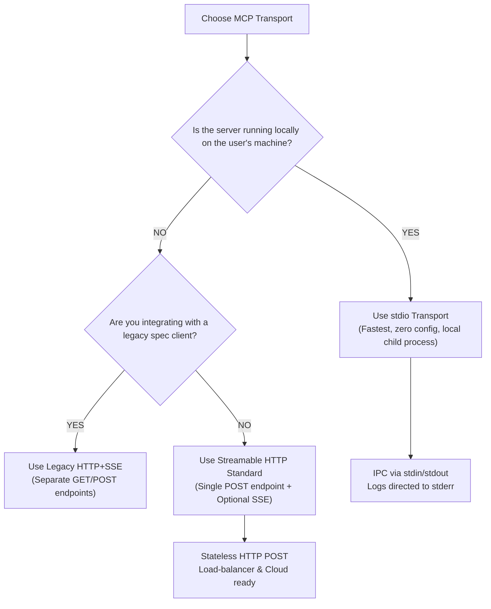

# Code Examples

The following Python script illustrates building a dual-transport FastMCP server that can run over local **`stdio`** or remote **`Streamable HTTP`** depending on environment runtime parameters.

Python

```
from mcp.server.fastmcp import FastMCP
import sys
import os

# Initialize FastMCP Server Core
mcp = FastMCP("MultiTransportDemo")

# Expose an Executable Tool
@mcp.tool()
def query_inventory(item_id: str) -> str:
    """Queries inventory count for a given product ID."""
    return f"Inventory for Item [{item_id}]: 1,250 units in stock."

if __name__ == "__main__":
    # Select transport from environment variable
    chosen_transport = os.getenv("MCP_TRANSPORT", "stdio").lower()

    if chosen_transport == "stdio":
        # 1. STDIO TRANSPORT
        # All debug logging MUST be directed to stderr
        print("[STDIO] Launching server subprocess via stdin/stdout...", file=sys.stderr)
        mcp.run(transport="stdio")

    elif chosen_transport in ["http", "streamable_http"]:
        # 2. STREAMABLE HTTP TRANSPORT
        # Launches standalone HTTP web server accepting POST requests
        print("[HTTP] Launching Streamable HTTP server on http://127.0.0.1:8000/mcp")
        mcp.run(
            transport="http",
            host="127.0.0.1",
            port=8000,
            path="/mcp"
        )
```

### Key Highlights:

- `mcp.run(transport="stdio")`: Listens to `stdin` and outputs JSON-RPC to `stdout`.
    
- `print(..., file=sys.stderr)`: Protects `stdout` from plain text corruption.
    
- `mcp.run(transport="http", ...)`: Binds a single Streamable HTTP endpoint for remote JSON-RPC traffic.
    

# Step-by-Step Flow

### Comparing Execution Steps: `stdio` vs. `Streamable HTTP`

Plaintext

```
================================================================================
                    STDIO EXECUTION LIFECYCLE (LOCAL)
================================================================================
1. Host launches server binary as a child process via OS subprocess pipe.
2. Host writes JSON-RPC byte string directly into server's STDIN.
3. Server Capability Engine executes function.
4. Server writes JSON-RPC result to STDOUT (logs sent to STDERR).
5. Child process terminates when parent Host application shuts down.

================================================================================
               STREAMABLE HTTP EXECUTION LIFECYCLE (REMOTE)
================================================================================
1. Remote server starts as a standalone web service on a target URL.
2. Host issues HTTP POST request carrying JSON-RPC payload to /mcp endpoint.
3. Load balancer routes request to an available server container instance.
4. Server executes tool logic and returns JSON-RPC response (or upgrades to SSE).
5. HTTP connection closes/returns to pool; server remains online for other clients.
```

# Real World Applications

- **Local Developer Tooling**: Cursor, VS Code, or Claude Desktop using `stdio` to execute local shell scripts, inspect local Git status, or read local workspace code.
    
- **Enterprise Multi-Tenant Systems**: Cloud-hosted GitHub, Slack, or database MCP servers running over `Streamable HTTP` behind OAuth gateways, serving hundreds of corporate developer agents simultaneously.
    

# Interview Questions

### Beginner

> **Q: What are the three primary transport mechanisms in MCP?**
> 
> **A:** Standard I/O (`stdio`), legacy Server-Sent Events (`HTTP+SSE`), and modern `Streamable HTTP`.

> **Q: Why is `stdio` inherently secure for local development?**
> 
> **A:** Because it communicates entirely through OS standard process pipes (`stdin`/`stdout`) without opening network ports or exposing endpoints to external networks.

### Intermediate

> **Q: Why has the MCP specification transitioned from legacy `HTTP+SSE` to `Streamable HTTP`?**
> 
> **A:** Legacy `HTTP+SSE` required maintaining open, stateful GET streaming connections alongside separate POST endpoints. `Streamable HTTP` unifies communication into a single HTTP endpoint, allowing stateless request processing, better load balancing, and easier integration with modern cloud infrastructure.

> **Q: What happens if a developer writes plain text logs using `print()` to `stdout` in a `stdio` server?**
> 
> **A:** The host application's JSON-RPC parser will fail because `stdout` is strictly reserved for valid JSON-RPC protocol frames. All logs **must** be written to `stderr`.

### Advanced

> **Q: Compare `stdio` and `Streamable HTTP` in terms of load balancing and process lifecycle.**
> 
> **A:** `stdio` couples the server process directly to the client's lifecycle (1-to-1 process mapping) and cannot be load-balanced across machines. `Streamable HTTP` operates as an independent web service capable of handling requests from multiple clients statelessly, allowing standard HTTP load balancers to route traffic horizontally across server clusters.

# Common Mistakes

> [!warning]
> 
> **Writing Log Output to `stdout` in `stdio` Mode**
> 
> - _Mistake_: Using standard `print()` statements in Python or `console.log()` in Node.js when running over `stdio`.
>     
> - _Correction_: Direct all logs explicitly to `stderr` (e.g., `sys.stderr.write()` or `console.error()`).
>     

> [!warning]
> 
> **Using Legacy `HTTP+SSE` for New Cloud Implementations**
> 
> - _Mistake_: Building new remote cloud MCP servers using separate `/sse` and `/message` endpoints.
>     
> - _Correction_: Target **Streamable HTTP** as a single endpoint accepting POST requests for modern deployments.
>     

# Memory Tricks

## The 3 Transports Comparison: **S.S.S.**

- **S**tdio $\rightarrow$ **S**ubprocess (Local, `stdin`/`stdout`, single client)
    
- **S**SE $\rightarrow$ **S**eparate Endpoints (Legacy, GET stream + POST endpoint)
    
- **S**treamable HTTP $\rightarrow$ **S**ingle Endpoint (Modern, cloud-ready, POST + optional streaming)
    

# Comparison Tables

|**Feature / Dimension**|**stdio**|**Legacy HTTP+SSE**|**Modern Streamable HTTP**|
|---|---|---|---|
|**Location**|Local Machine Only|Remote / Cloud|Remote / Cloud|
|**Endpoints Needed**|OS Pipes (`stdin`/`stdout`)|Two Endpoints (GET /events, POST /message)|Single Endpoint (Accepting POST requests)|
|**Client Ratio**|1-to-1 Subprocess Coupling|Multi-Client (Stateful connections)|Multi-Client (Stateless or Streamed)|
|**Latency**|Lowest (No network stack)|Higher (Network roundtrips)|Higher (Network roundtrips)|
|**Load Balancing**|Not Possible|Difficult (Requires sticky sessions)|Excellent (Standard HTTP load balancing)|
|**Status in Spec**|Current Standard (Local)|Deprecated / Legacy Support|Current Standard (Remote)|

# Revision Sheet (One Page)

Plaintext

```
================================================================================
                    THREE MAIN MCP TRANSPORTS CHEAT SHEET
================================================================================

1. STDIO (Local Subprocess)
   • Channel    : OS stdin / stdout pipes (stderr reserved for logs).
   • Advantages : Zero latency, no network config, inherently secure.
   • Ideal For  : Desktop apps, IDE extensions, local development, CLI scripts.

2. HTTP + SSE (Legacy Remote)
   • Channel    : GET /events (streaming) + POST /message (client commands).
   • Drawbacks  : Stateful, long-lived connection overhead, hard to load-balance.

3. STREAMABLE HTTP (Modern Remote Standard)
   • Channel    : Single unified HTTP endpoint accepting POST requests.
   • Advantages : Stateless-friendly, load-balancer ready, optional SSE upgrade.
   • Ideal For  : Cloud microservices, multi-tenant enterprise tools, public SaaS.
================================================================================
```

# Flashcards

Q: What are the three main transport protocols in MCP?

A: `stdio`, legacy `HTTP+SSE`, and modern `Streamable HTTP`.

Q: How does the `stdio` transport communicate between client and server?

A: Via local OS process streams: the client writes to `stdin`, the server responds on `stdout`, and logs go to `stderr`.

Q: Why must logging in `stdio` mode never be printed to `stdout`?

A: Because `stdout` is strictly reserved for valid JSON-RPC protocol frames; plain text breaks client parsing.

Q: What is the primary limitation of `stdio` transport?

A: It is restricted to local single-client subprocesses and cannot serve remote clients or be load-balanced.

Q: Why was legacy `HTTP+SSE` replaced by `Streamable HTTP` in modern MCP deployments?

A: `HTTP+SSE` required two separate endpoints and long-lived connection states, whereas `Streamable HTTP` unifies messaging into a single, scalable HTTP endpoint.

Q: Which transport should you select when building a multi-tenant enterprise MCP server in the cloud?

A: Streamable HTTP.

# Practice Questions

### Easy

1. True or False: `stdio` transport can be used to connect an IDE running on a laptop to an MCP server hosted on an external AWS server without additional proxy software.
    
    - _Answer_: False. `stdio` is restricted strictly to local processes running on the same machine. Remote access requires a network transport like Streamable HTTP.
        

### Medium

2. Explain the structural difference between legacy `HTTP+SSE` and modern `Streamable HTTP`.
    
    - _Answer_: Legacy `HTTP+SSE` required two separate endpoints (a GET endpoint for SSE streaming events and a POST endpoint for sending messages). Modern `Streamable HTTP` uses a single HTTP endpoint accepting POST requests for all JSON-RPC messages, optionally upgrading to an SSE stream on a per-request basis.
        

### Hard

3. Architect a hybrid enterprise setup where developers use both local tools and central corporate database tools simultaneously through MCP.
    
    - _Answer_: The developer's IDE (Host) instantiates a local `stdio` MCP client connection for local file linting and Git status. Simultaneously, the IDE configures a second MCP client using `Streamable HTTP` to connect over HTTPS to an enterprise API gateway. The gateway verifies the developer's OAuth 2.1 token and routes the request statelessly to a cloud-hosted Postgres MCP server.
        

# Key Takeaways

1. `stdio` is the standard for fast, secure, zero-config local subprocess communication.
    
2. In `stdio` mode, `stdout` is for JSON-RPC messages and `stderr` is for debug logs.
    
3. Legacy `HTTP+SSE` required separate GET/POST endpoints and long-lived connection state.
    
4. Streamable HTTP is the modern standard for remote, cloud-hosted MCP servers.
    
5. Streamable HTTP unifies communication into a single POST endpoint with optional per-request SSE upgrades.
    
6. `stdio` cannot be load-balanced across machines, while Streamable HTTP scales horizontally on cloud infrastructure.
    
7. `stdio` operates on a 1-to-1 parent-child process lifecycle.
    
8. Remote transports require explicit security guards (Origin validation, OAuth 2.1).
    
9. Tool and resource code remains transport-agnostic across both `stdio` and HTTP transports.
    
10. Select `stdio` for local developer tools; select `Streamable HTTP` for enterprise cloud services.